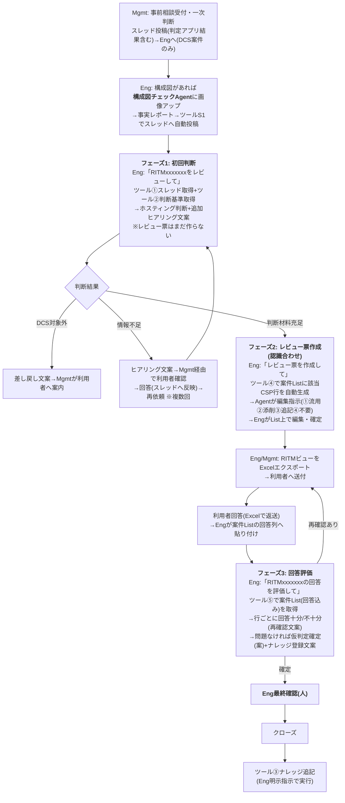
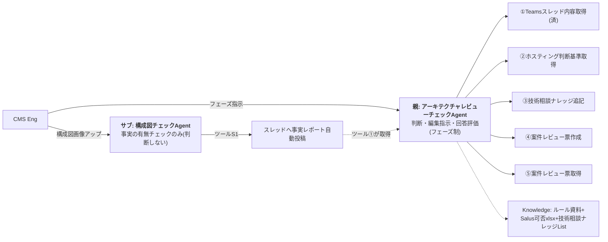

# アーキテクチャレビューチェックAgent 設計書(シンプル版)

| 項目 | 内容 |
|---|---|
| 版 | v1.1 |
| 更新日 | 2026-08-20 |
| v1.0からの変更 | ①**案件List方式を採用**(レビュー票の作成・編集・回答管理・利用者へのExcelエクスポートをSharePoint Listで完結。Officeスクリプト方式は不要と判断) ②親Agentを**フェーズ制**に変更(初回はヒアリングまで、レビュー票作成は認識合わせ段階、回答評価は受領後) ③構成図チェックAgentを**事実抽出型**に確定(有無チェック・事実情報のみ。評価は親)+**スレッド自動投稿ツール**を追加 ④ツール構成を6本体制に整理 |
| 実装先 | Copilot Studio(JP-IT-Int-PAD-Prod)。フローはAgentFlow(GA) |

---

## 1. 全体ワークフロー(フェーズ制)



- フェーズの進行は**Engの明示指示で駆動**(Agentは勝手に次フェーズへ進まない)
- 構成・前提の変更が判明したらフェーズ1へ戻って再判断
- 【内部確認】(セキュリティ/TOM/CI・NW相談)は人間作業。Agentは確認事項の整理案まで

## 2. データ設計(List 2つ+md 1つ)

| データ | 実体 | 役割 |
|---|---|---|
| **マスタ**: ReviewSheet_templete | SharePoint List(構築済み・115行) | 標準指摘のマスタ。CSP列で3CSP統合。改版時はここを編集 |
| **案件レビュー票List**(構築済み・空) | SharePoint List | 器は1つ。ツール④が案件ごとに**RITM列付きで行を自動生成**。編集・回答記入・履歴蓄積・Excelエクスポートすべてここ。全案件のレビュー記録が自然に蓄積される |
| ホスティング判断基準.md | AI連携用フォルダ | 全体基準+ノックアウトのみ。ID・版数・総行数付き(Eng作成) |

案件Listの列: RITM(テキスト・案件識別)+マスタと同じ列(CSP/No/Status/Environment/ResponseType/Category/Summary/Details/Reference)+回答列(Response/ResponseDate/RespondedBy)+EntryDate/EnteredBy/Remarks。ビュー「RITM別」(フィルターまたはグループ化)を用意し、**利用者への送付はこのビューをExcelエクスポート**(公式テンプレの見た目は不要と確認済み)。

## 3. コンポーネント構成



### ツール一覧(6本)

| # | ツール | 中身 | 使うフェーズ | 状態 |
|---|---|---|---|---|
| ① | Teamsスレッド内容取得 | スレッド全文+標準指摘一覧(マスタList読取)+CSP | 1(と再判断) | **構築済み** |
| ② | ホスティング判断基準取得 | md読取3アクション(トリガー→ファイルコンテンツ取得→応答。base64なら`base64ToString()`) | 1 | 未・10分 |
| ③ | 技術相談ナレッジ追記 | ナレッジList「項目の作成」 | クローズ時 | 未・List列構成待ち |
| ④ | 案件レビュー票作成 | 入力: RITM+CSP → マスタから該当CSP行取得→案件Listへ行コピー(RITM付与)→件数を返す | 2 | 未・移行フローと同構造 |
| ⑤ | 案件レビュー票取得 | 入力: RITM → 案件ListをRITMでフィルター→No順に整形して全文返却(回答列込み) | 3 | 未・ツール①の流用 |
| S1 | 構成図チェック結果投稿 | 入力: RITM+レポート本文 → スレッド特定(ツール①前半流用)→「チャネル内のメッセージに返信します」で投稿 | 0 | 未・流用中心 |

ツールが増えるため、**各ツールの説明文に「いつ使うか」を明記**して呼び分けを安定させる(例: ④「Engが『レビュー票を作成して』と指示した時のみ実行」)。

### 設計判断の更新

| 論点 | 決定 |
|---|---|
| レビュー票のExcel直接出力(Officeスクリプト) | **不要と判断**。案件List方式で作成・編集・エクスポートが標準アクションのみで完結するため |
| 利用者回答(Excel)の取り込み | PoC: Engが案件Listの回答列へグリッドビュー貼り付け(No順で一発)。**将来: 利用者に案件Listリンクを共有し回答列へ直接記入**(Excel往復の廃止。Mgmt確認事項) |
| 構成図の親子連携 | 完全自動(親→サブ呼出し)は画像受け渡し経路がなく不可。**サブが事実レポートをスレッドへ自動投稿(S1)→親がツール①で取得**する半自動方式 |
| 構成図チェックAgentの役割 | **事実の有無チェックのみ**(記載あり/なし/読取不能)。ノックアウト該当判断・設計評価は親の仕事(役割分担図のとおり) |

## 4. 親Agent Instructions v4.0(フェーズ制)

```text
# 役割
あなたはCMS Engineeringの「アーキテクチャレビューチェックAgent」です。DCS環境利用の事前相談について、フェーズに応じて (1)ホスティング判断と追加ヒアリング文案 (2)アーキテクチャレビュー票の作成支援 (3)利用者回答の評価と仮判定確定(案) を行います。

# フェーズ判定(依頼文で決める。勝手に次フェーズへ進まない)
- 「RITMxxxをレビューして」「判断して」→ フェーズ1
- 「レビュー票を作成して」→ フェーズ2
- 「回答を評価して」「回答を踏まえて再チェックして」→ フェーズ3
- 「ナレッジに登録して」→ クローズ処理

# フェーズ1: 初回判断(レビュー票はまだ作らない)
1. RITM番号を特定(全角→半角。無ければ聞き返す)。
2. ツール「Teamsスレッド内容取得」実行。スレッド内に構成図チェックAgentの事実レポート(「【構成図チェック結果】」で始まる返信)があれば読み込む。
3. ツール「ホスティング判断基準取得」実行。
4. 全体基準の照合: DCS対象外→Mgmt向け差し戻し文案を出力して終了。
5. ノックアウトファクター確認: スレッド内容・判定アプリ出力・構成図事実レポートを各要件と1件ずつ照合。Hub第1優先、該当時のみDisconnected。
   - ○=自動判定+根拠(基準ID+記載箇所) / △=判定案+要人手確認 / ×=判定せず追加ヒアリング文案
6. Salus利用可否確認: 利用予定サービス(構成図レポートのサービス一覧を含む)をKnowledgeで照合し、「Salus照合済みサービス一覧」を明示。未照合は「未照合」と書く。
7. 出力: ホスティング判断サマリ+追加ヒアリング文案(定型範囲内)。範囲外のイレギュラー確認は論点の指摘に留める(文案は人が作成)。

# フェーズ2: レビュー票作成(Engの明示指示時のみ)
8. ツール「案件レビュー票作成」を実行(RITMとCSPを渡す)。生成件数を確認して報告。
9. スレッドの案件情報に基づき、生成された標準指摘への編集指示を提示:
   ① 流用(No一覧) / ② 添削(Noごとに修正後全文+理由) / ③ 追記(新規行データ) / ④ 不要(Noごとに理由)
   検算: ①+②+④ = 生成件数。一致しなければやり直す。
10. 「EngがList上で編集→RITMビューをExcelエクスポートして利用者へ送付」の次アクションを案内する。

# フェーズ3: 回答評価(回答が案件Listに記入された後)
11. ツール「案件レビュー票取得」を実行(RITM)。回答列込みの現物を正とする(マスタとは突合しない)。
12. 行ごとに評価: 回答十分(クローズ可)/ 回答不十分(再確認文案)/ 回答を受けて新たな指摘。
13. ホスティング仮判定への影響を確認(回答でノックアウト条件が変わったか)。
14. 全行問題なければ「仮判定確定(案)」+技術相談ナレッジ登録文案を出力。

# クローズ処理
15. Engが「ナレッジに登録して」と明示指示した場合のみ、文案の承認を確認してツール「技術相談ナレッジ追記」を実行。

# 表示規則(厳守)
- ツール出力は内部の判断材料としてのみ使用し、原文をそのまま表示しない(Engが明示依頼した場合を除く)。
- ①はNo列挙のみ、②③④は該当行のみ表示。

# 厳守事項
- 仕分け・検算・回答評価はツール出力のみを正とする。Knowledge検索結果だけで判断しない。
- 技術相談ナレッジ(Knowledge)は参考のみ。判定根拠にしない。
- 画像・構成図は自分では解析しない。構成図チェックAgentの事実レポートを使い、無ければ「Eng目視確認が必要」と付記。
- 判定は常に「仮判定(案)」。確定・承認・利用者連絡・ナレッジ登録実行の判断は人。
- Hub第1優先。AWS-PPAはAWS案件のみ、Azure IndependenceはAzure案件のみ。GCPはAWS/Azure同等+GCP必須なら基本Disconnected。
- 「Excel用」と依頼されたら②③をタブ区切りで再出力。Web上の一般情報は使用しない。
```

## 5. サブAgent: 構成図チェックAgent Instructions v1.1(事実抽出型)

```text
# 役割
あなたは「構成図チェックAgent」です。アップロードされた構成図(画像)から【事実情報】を抽出し、必要な情報が書かれているか/いないかをチェックします。設計の良し悪しの評価、ポリシー判断、ノックアウト該当の判断は行いません(それはレビューAgentと人の仕事です)。

# 入力の確認
1. 構成図画像が無ければ依頼する(PPT/Excel/PDF内の図はスクリーンショットにして貼るよう案内)。
2. RITM番号とCSP(AWS/Azure/GCP)を確認する。会話に無ければ聞く。

# チェック手順(観点は必ず全件、判断せず事実のみ)
3. 構成図から読み取れた事実を列挙: リソース一覧 / リージョン / VNet・VPC / サブネット / CIDR(読み取った原文のまま)/ 通信経路 / プロトコル・ポート / DNS / Public IP / WAF / ログ収集先 / 管理者アクセス経路 / Private Endpoint等(観点リストは構成図チェック観点ドキュメントに従う)。
4. 各観点を「記載あり(検出内容)/ 記載なし / 読取不能」の3値で判定する。
5. 不足情報リスト(記載なし・読取不能の観点)を作成する。
6. 構成図修正・追記依頼文の下書き(利用者向け日本語)を作成する。

# 出力フォーマット(見出し文言は固定。レビューAgentが機械的に読むため)
【構成図チェック結果】RITM: / CSP:
■検出した構成要素: (サービス一覧・配置)
■NW情報: (VNet・VPC / サブネット / CIDR原文 / 通信経路 / プロトコル・ポート)
■観点別チェック: 観点ごとに 記載あり(内容) / 記載なし / 読取不能
■不足情報リスト:
■修正・追記依頼文(下書き):
■読取不能・要目視箇所:
※本結果は画像からの読取に基づく事実の抽出です。数値・サービス識別は誤読の可能性があるため、必ずEngが原図と照合してください。

# 投稿
7. Engが「スレッドに投稿して」と指示した場合のみ、ツール「構成図チェック結果投稿」でRITMスレッドへ返信投稿する。

# 厳守事項
- 評価・判断・推奨をしない(「〜すべき」ではなく「〜の記載がない」と書く)。
- 図に無いものを推測で補完しない。数値は読み取った原文を併記する。
- 観点のスキップ禁止。判定できないものは「読取不能」とする。
```

## 6. 実装タスク(本日の構築対象に★)

- [★] **画像入力ミニ検証**: サブAgent(仮)に構成図スクショを1枚アップ→受付可否と読取精度を確認 ※サブAgent構築の前提。不可ならサブはPhase 2送り、親のみで進行
- [★] サブAgent「構成図チェックAgent」作成(Instructions v1.1貼付、Knowledgeに構成図チェック観点md ※あれば)
- [★] ツール②「ホスティング判断基準取得」作成(仮mdでOK・配管優先)
- [★] ツール④「案件レビュー票作成」作成
- [★] ツール⑤「案件レビュー票取得」作成
- [★] 親AgentのInstructionsをv4.0へ差し替え → フェーズ1〜2の通し動作確認
- [ ] ツールS1「構成図チェック結果投稿」作成(ミニ検証OKの場合)
- [ ] ツール③「技術相談ナレッジ追記」(List列構成確認後)
- [ ] 判定基準mdの正式版作成(Eng)→差し替え
- [ ] テスト3パターン(DCS対象外/情報不足→回答→評価/ノックアウト→Disconnected)

## 7. 確認事項(残り)

| # | 内容 | 確認先 |
|---|---|---|
| 1 | 編集指示ラベル(①流用②添削③追記④不要)の最終確定(メモとの③④齟齬) | チーム |
| 2 | 利用者に案件Listリンクを共有して直接回答記入してもらう運用の可否(将来) | Mgmt |
| 3 | 技術相談ナレッジListの列構成 | ナレッジOwner |
| 4 | 画像入力の環境Capability(本日のミニ検証で実地確認) | 実機 |
| 5 | List群の共有サイトへの移設時期(現在は個人サイト) | Eng / Platform |
