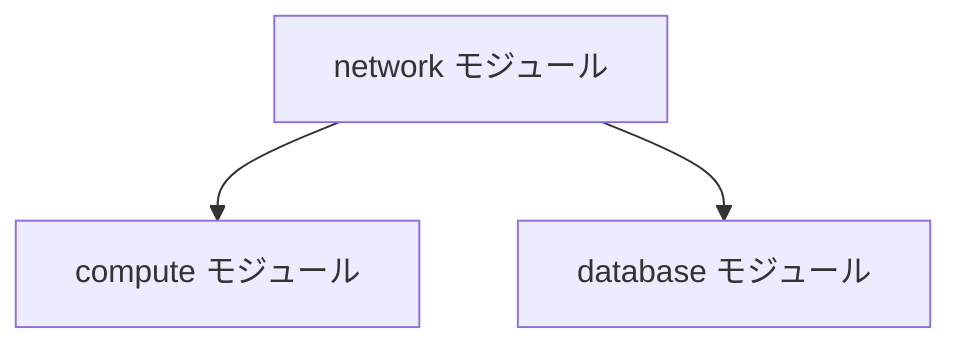

# Terraform コーディング規約

チーム全体でTerraformコードの品質・一貫性を保つための規約です。
新しい知見が得られた場合はチームで合意の上、随時更新すること。

---

## 1. フォーマット

### 1-1. インデント
- インデントは半角スペース2個とする
- VS Code の設定でエディタレベルで統一する

```json
// .vscode/settings.json
{
  "[terraform]": {
    "editor.tabSize": 2,
    "editor.insertSpaces": true
  }
}
```

### 1-2. terraform fmt の実行
- コミット前に必ず `terraform fmt` コマンドを実行する
- VS Code の `formatOnSave` を有効にすることで、ファイル保存時に自動フォーマットが適用され、コマンド実行の手間を省くことができる

```bash
# 手動実行の場合（カレントディレクトリを再帰的にフォーマット）
terraform fmt -recursive
```

---

## 2. 命名規則

### 2-1. リソースブロック名
Terraformのベストプラクティスに従い、特別な理由がない限りリソースブロック名には `this` を使用する。

```bash
#推奨
resource "aws_instance" "this" {
  ami           = var.ami_id
  instance_type = var.instance_type
}

#非推奨（理由がない限り固有名は避ける）
resource "aws_instance" "web_server" {
  ...
}
```

### 2-2. ブランチ名
ブランチ名は以下の形式に統一する。

**形式：** `feature-{バックログの課題キー}`

**例：**
```
feature-#01
```

---

## 3. コード記述ルール

### 3-1. count / for_each の位置
`count` または `for_each` を使用する場合は、リソースブロック内の1行目に記述し、直後に空行を1行挿入する。

```bash
#推奨
resource "aws_instance" "this" {
  for_each = var.instances

  ami           = each.value.ami_id
  instance_type = each.value.instance_type }

#非推奨（for_each が1行目にない）
resource "aws_instance" "this" {
  ami           = each.value.ami_id
  instance_type = each.value.instance_type
  for_each      = var.instances }
```

### 3-2. null vs 空文字
空値を表現する場合は `null` を使用し、空文字 `""` は避ける。

| 値 | 意味 |
|---|---|
| `null` | 設定が定義されていない（未設定） |
| `""` | 空文字列を代入している（意図的な空文字） |

```bash
#推奨：設定が不要な場合は null
variable "optional_tag" {
  type    = string
  default = null
}

#非推奨：意図が不明確になる
variable "optional_tag" {
  type    = string
  default = ""
}
```

---

## 4. コミット規約

### 4-1. コミットメッセージのプレフィックス
コミットメッセージには変更内容の概要を表すプレフィックスをつける。

| プレフィックス | 用途 | 例 |
|---|---|---|
| `feat:` | 新規追加 | `feat: OOリソースを新規追加` |
| `fix:` | バグ修正 | `fix: OOのバグを修正` |
| `modify:` | 仕様変更 | `modify: OOするように仕様変更` |
| `docs:` | ドキュメントのみの変更 | `docs: READMEを更新` |
| `refactor:` | リファクタリング | `refactor: OOモジュールを整理` |

**例：**
```
feat: computeモジュールにオートスケール設定を追加
fix: networkモジュールのサブネットCIDR重複を修正
modify: staging環境のインスタンスタイプをt3.smallに変更
```

---

## 5. ドキュメント自動生成

### 5-1. terraform-docs によるREADME.md自動生成
各モジュールの `README.md` は **terraform-docs** を使って自動生成する。
Module仕様書の **Input・Output・Requirements** 部分が自動で記載される。

```bash
# README.md の生成・更新
terraform-docs markdown table --output-file README.md --output-mode inject .
```

### 5-2. 構成図の作成方針

| 対象 | ツール |
|---|---|
| 子モジュール（ベースパターンテンプレート内で使用するモジュール） | Mermaid記法（簡易的に作成） |
| 親モジュール（ベースパターンテンプレート本体） | draw.io |

**Mermaid記法の例（子モジュール間の依存関係）：**


---

## 6. 関連ドキュメント

- [terraform-rules.md](./terraform-rules.md) - ディレクトリ構成・バージョン制約（共通）
- [terraform.md](./terraform.md) - モジュールの場所・呼び出しパターン
- [module-catalog.md](./module-catalog.md) - モジュール一覧
