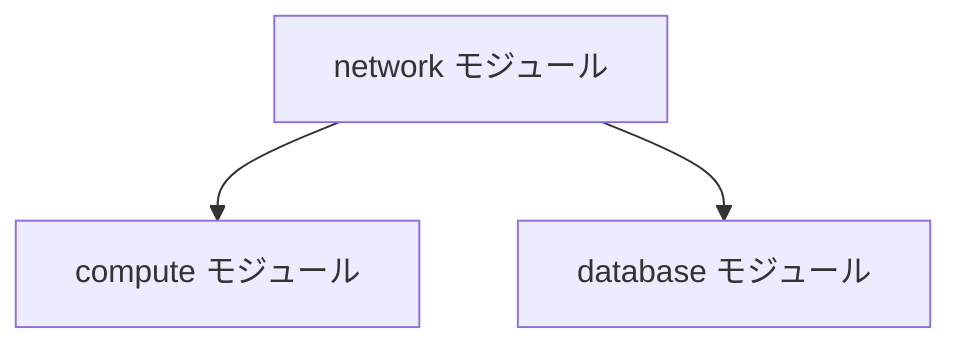

# Terraform コーディング規約

> チーム全体でTerraformコードの品質・一貫性を保つための規約です。  
> 新しい知見が得られた場合は随時追記してください。

---

## 1. フォーマット

### 1-1. インデント

- インデントは **半角スペース2個** とする
- VS Code の設定でエディタレベルで統一する

```json
// .vscode/settings.json
{
  "[terraform]": {
    "editor.tabSize": 2,
    "editor.insertSpaces": true
  }
}
```

### 1-2. terraform fmt の実行

- **コミット前に必ず `terraform fmt` コマンドを実行**する
- VS Code の `formatOnSave` を有効にすることで、ファイル保存時に自動フォーマットが適用され、コマンド実行の手間を省くことができる

```bash
# 手動実行の場合（カレントディレクトリを再帰的にフォーマット）
terraform fmt -recursive
```

> **参考：** [terraform.fmtコマンド完全ガイド：13の実践的活用法 | Dexall公式テックブログ](https://dexall.co.jp/articles/?p=1434)

### 1-3. Markdownの自動整形（formatOnSave）はオフにする

- `.md` ファイルの `formatOnSave` は **オフ** にすること
- terraform-docs で自動生成される部分のフォーマットが崩れ、毎回gitで差分が検出される原因となるため

```json
// .vscode/settings.json
{
  "[markdown]": {
    "editor.formatOnSave": false
  }
}
```

---

## 2. 命名規則

### 2-1. リソースブロック名

Terraformのベストプラクティスに従い、**特別な理由がない限りリソースブロック名には `this` を使用**する。

```hcl
# ✅ 推奨
resource "aws_instance" "this" {
  ami           = var.ami_id
  instance_type = var.instance_type
}

# ❌ 非推奨（理由がない限り固有名は避ける）
resource "aws_instance" "web_server" {
  ...
}
```

### 2-2. ブランチ名

ブランチ名は以下の形式に統一する。

```
feature-#バックログの課題キー
```

**例：**
```
feature-#ENG01-xxx
```

---

## 3. コード記述ルール

### 3-1. count / for_each の位置

`count` または `for_each` を使用する場合は、**リソースブロック内の1行目に記述し、直後に空行を1行挿入**する。

```hcl
# ✅ 推奨
resource "aws_instance" "this" {
  for_each = var.instances

  ami           = each.value.ami_id
  instance_type = each.value.instance_type
}

# ❌ 非推奨（for_each が1行目にない）
resource "aws_instance" "this" {
  ami           = each.value.ami_id
  instance_type = each.value.instance_type
  for_each      = var.instances
}
```

### 3-2. null vs 空文字

空値を表現する場合は **`null`** を使用し、空文字 `""` は避ける。

| 値 | 意味 |
|---|---|
| `null` | 設定が定義されていない（未設定） |
| `""` | 空文字列を代入している（意図的な空文字） |

```hcl
# ✅ 推奨：設定が不要な場合は null
variable "optional_tag" {
  type    = string
  default = null
}

# ❌ 非推奨：意図が不明確になる
variable "optional_tag" {
  type    = string
  default = ""
}
```

---

## 4. コミット規約

### 4-1. コミットメッセージのプレフィックス

コミットメッセージには変更内容の概要を表す**プレフィックス**をつける。

| プレフィックス | 用途 | 例 |
|---|---|---|
| `feat:` | 新規追加 | `feat: ○○リソースを新規追加` |
| `fix:` | バグ修正 | `fix: ○○のバグを修正` |
| `modify:` | 仕様変更 | `modify: ○○するように仕様変更` |
| `docs:` | ドキュメントのみの変更 | `docs: READMEを更新` |
| `refactor:` | リファクタリング | `refactor: ○○モジュールを整理` |

**例：**
```
feat: computeモジュールにオートスケール設定を追加
fix: networkモジュールのサブネットCIDR重複を修正
modify: staging環境のインスタンスタイプをt3.smallに変更
```

> **参考：** [僕が考える最強のコミットメッセージの書き方 #Git - Qiita](https://qiita.com/itosho/items/9565c6ad2ffc24c09364)

---

## 5. ドキュメント自動生成

### 5-1. terraform-docs によるREADME.md自動生成

各モジュールの `README.md` は **terraform-docs** を使って自動生成する。  
Module仕様書の **Input・Output・Requirements** 部分が自動で記載される。

```bash
# インストール（macOS）
brew install terraform-docs

# インストール（Windows）
choco install terraform-docs

# README.md の生成・更新
terraform-docs markdown table ./modules/compute > ./modules/compute/README.md
```

### 5-2. 構成図の作成方針

| 対象 | ツール |
|---|---|
| 子モジュール（ベースパターンテンプレート内で使用するモジュール）| Mermaid記法（簡易的に作成） |
| 親モジュール（ベースパターンテンプレート本体） | draw.io |

**Mermaid記法の例（子モジュール間の依存関係）：**



---

## 6. 関連ドキュメント

- [terraform-rules.md](./terraform-rules.md) – ディレクトリ構成・バージョン制約（共通）
- [terraform.md](./terraform.md) – モジュールの場所・呼び出しパターン
- [module-catalog.md](./module-catalog.md) – モジュール一覧
