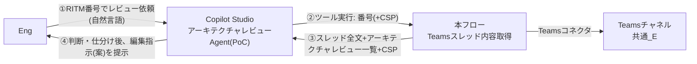
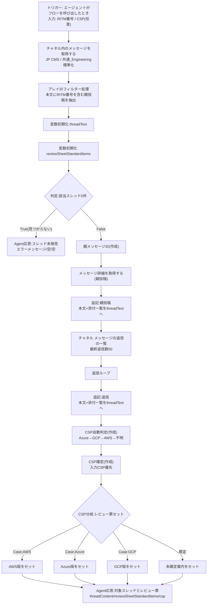

# Power Automateフロー設計書: Teamsスレッド内容取得

| 項目 | 内容 |
|---|---|
| フロー名 | Teamsスレッド内容取得 |
| 呼び出し元 | Copilot Studio Agent「**アーキテクチャレビューAgent(PoC)**」(Agent名は別物)。本フローはAgentが**最初に呼び出すツール**で、Copilot Studio上のツール名はフロー名と同じ「Teamsスレッド内容取得」となる |
| 版 | v1.1 |
| 更新日 | 2026-08-14 |
| v1.0からの変更 | ①**添付ファイル一覧の追記を実装**(親投稿・返信とも) ②アクション表示名を刷新(「:」区切り。改名済み) ③Agentとの呼び出し関係を明確化 ④レビュー票のExcel直接修正に関する方針をFAQへ追加 |
| 環境 | XXXXX |

---

## 1. 目的と位置づけ

事前相談を支援するAgentの**判断材料**を揃えるフロー。Engが Agent に「XXXXX をレビューして」と自然言語で依頼すると、**Agentはまず本フロー(ツール)を実行**して次の2つを取得し、その後の判断・仕分けはAgent側のロジック(Instructions+Knowledge)で行う。

1. **Teamsスレッド全文** — 指定番号の事前相談スレッド(親投稿+全返信+添付ファイル一覧)
2. **アーキテクチャレビュー票の標準指摘一覧** — 該当CSP(AWS/Azure/GCP)のテンプレに収録されている標準指摘のテキスト

Agentはこの2つを突き合わせ、「標準指摘のどれを採用/添削/対象外にするか+案件固有の新規指摘」というレビュー票への編集指示(案)を作成する。**レビュー票への反映・利用者への連携は従来どおり人(Eng/Mgmt)が行う。**

### 呼び出し関係

## 2. 入出力仕様

### 入力(トリガー: エージェントがフローを呼び出したとき)

| 名前 | 型 | 必須 | 説明 |
|---|---|---|---|
| RITM番号 | テキスト | 実質必須 | Rで始まる番号。例: R1234567 |
| CSP | テキスト | 任意 | AWS・Azure・GCPのいずれか。会話で明示された場合のみAgentが渡す。空なら本文から自動判定 |

### 出力(Agent応答 ×2箇所共通)

| 名前 | 説明 |
|---|---|
| threadContent | Teamsスレッドの全文(親投稿+返信+**添付ファイル一覧**)。0件時はエラーメッセージ |
| reviewSheetStandardItems | 該当CSPのアーキテクチャレビュー票 標準指摘一覧の全文。CSP未確定時は再実行の案内 |
| csp | 確定したCSP(AWS/Azure/GCP)。不明時は空 |

> **重要**: 出力は2つの応答アクションで**名前・説明文まで完全一致**が必須(不一致だと保存エラー ActionSchemaInvalid。構築時に実際に発生し解消済み)。

## 3. フロー図

## 4. 処理ステップ一覧

「式参照」列: ●=他アクションのfx式から名前で参照されているため**表示名を変更しないこと**(変更すると式が壊れる)。

| # | 表示名 | 式参照 | 役割 / 主な設定・式 |
|---|---|---|---|
| 1 | エージェントがフローを呼び出したとき | — | トリガー。入力: RITM番号 / CSP(§2) |
| 2 | チャネル内のメッセージを取得する | ● | チーム: JP CMS / チャネル: 共通_Engineering標準化。投稿数増加時は設定の「改ページ」オン |
| 3 | アレイのフィルター処理 | ● | From=手順2のvalue / 式 `item()?['body']?['content']` 「含む」 RITM番号 |
| 4 | 変数初期化 threadText | — | 文字列・空。スレッド全文の蓄積用。※変数初期化はフロー最上位のみ配置可 |
| 5 | 変数初期化 reviewSheetStandardItems | — | 文字列・空。標準指摘一覧の格納用 |
| 6 | 判定:該当スレッド0件 | — | 式 `length(body('アレイのフィルター処理'))` = `0` |
| 7 | Agent応答:スレッド未発見(True側) | — | threadContent=「指定RITMのスレッドが見つかりませんでした。…」/ 他2出力は空 |
| 8 | 親メッセージID(作成) | ● | 式 `first(body('アレイのフィルター処理'))?['id']` |
| 9 | メッセージ詳細を取得する | ● | メッセージ=手順8の出力 / 種類=チャネル / 親メッセージID欄=空 |
| 10 | 追記:親投稿 | — | `concat('【親投稿】', outputs('メッセージ詳細を取得する')?['body']?['createdDateTime'], ' ', outputs('メッセージ詳細を取得する')?['body']?['from']?['user']?['displayName'], decodeUriComponent('%0A'), outputs('メッセージ詳細を取得する')?['body']?['plainTextContent'], if(empty(outputs('メッセージ詳細を取得する')?['body']?['attachments']), '', concat(decodeUriComponent('%0A'), '【添付ファイル】', string(outputs('メッセージ詳細を取得する')?['body']?['attachments']))))` |
| 11 | チャネル メッセージの返信の一覧 | ● | メッセージID=手順8の出力 / 最終返信数=50(最新50件) |
| 12 | 返信ループ | — | 対象=手順11の返信一覧(value) |
| 13 | 追記:返信(ループ内) | — | `concat(decodeUriComponent('%0A%0A'), '【返信】', item()?['createdDateTime'], ' ', item()?['from']?['user']?['displayName'], decodeUriComponent('%0A'), item()?['body']?['content'], if(empty(item()?['attachments']), '', concat(decodeUriComponent('%0A'), '【添付ファイル】', string(item()?['attachments']))))` ※本文はHTMLのまま |
| 14 | CSP自動判定(作成) | ● | `if(contains(variables('threadText'),'Azure'),'Azure',if(contains(variables('threadText'),'GCP'),'GCP',if(contains(variables('threadText'),'AWS'),'AWS','不明')))` 判定順: Azure→GCP→AWS |
| 15 | CSP確定(作成) | ● | `if(empty(coalesce(triggerBody()?['text_1'],'')),outputs('CSP自動判定'),coalesce(triggerBody()?['text_1'],''))` ※text_1=入力CSPの内部名(結合テストで要検証) |
| 16 | CSP分岐:レビュー票セット(スイッチ) | — | On=「CSP確定」の出力。Case:AWS / Case:Azure / Case:GCP / 既定 |
| 17 | AWS / Azure / GCP(各Case内の文字列変数に追加) | — | reviewSheetStandardItemsへ該当CSPの標準指摘一覧テキストを追加。**現在は仮テキスト**(§7) |
| 18 | 未確定案内をセット(既定) | — | 「【アーキテクチャレビュー票一覧未適用】…CSPを指定して再実行…」 |
| 19 | Agent応答:対象スレッドとレビュー票 | — | threadContent=変数threadText / reviewSheetStandardItems=変数 / csp=「CSP確定」の出力 |

## 5. 主要な設計判断(FAQ)

### Q1. アーキテクチャレビュー票はどこから取得している? リンクも貼っていないが

**どこからも取得していない。** スイッチ内のアクションに、CSP別テンプレ(AWS v2.3 / Azure v2.6 / GCP v2.1)の「レビュー票」シートにある**標準指摘行をテキスト化して直接埋め込む**設計(現在は仮テキスト)。フローが返すのは完成したレビュー票ではなく、**Engが毎回テンプレから選んでいる「標準指摘の一覧(メニュー)」**である。

### Q2. なぜファイル参照やCopilot StudioのKnowledgeにしないのか

1. **全行漏れなく検討させるため**: Knowledge(RAG)は関連断片だけを検索して渡す方式のため、「標準指摘を1行ずつ全件仕分けする」用途では検索に掛からない行が検討されない漏れが起きる
2. **環境制約**: 本環境はSharePoint Listへの直接Input不可。ファイル読取はアクション・権限管理が増え複雑化する
3. **版の固定**: テンプレ改版時に意図的にテキストを貼り替える運用にすることで、評価に使った版が明確になる(テキスト先頭に版数を記載)

### Q3. 現行業務(人のフロー)との対応は

| 現行(人) | To-Be(本フロー+Agent) |
|---|---|
| Engがスレッドを読み案件情報を把握 | フローがスレッド全文をAgentへ渡す |
| Engがテンプレを開き標準指摘から選択・案件事情で添削 | フローが標準指摘一覧をAgentへ渡し、Agentが採用/添削/対象外/新規の**編集指示案**を作成 |
| Engがレビュー票を書き、スレッドで連携 | **変わらず人が実施**(Agent出力はあくまで案) |

### Q4. レビュー票のExcelをAIに直接修正させないのか(課題管理表の検討事項)

PoCは「**AIが編集指示を出力し、人がExcelを修正する**」方式(課題管理表でいう後者)で設計・構築済み。編集指示は ①採用No一覧/②添削(修正後全文)/③対象外(理由)/④新規追加行+検算 の形式で、「Excel用」と依頼すればタブ区切りで再出力され貼り付けで列に分かれる。
**AIによる直接修正(前者)はPhase 2候補**: テンプレのテーブル化+Excel Online「表に行を追加」で新規行追記は可能。既存セルの記載を消さずに追記するにはOfficeスクリプト併用が必要で難度が高いため、PoC評価後に判断する。「テンプレ自体を変えてAIに一から出力させる」案は、現行運用・版管理・人の確認容易性を崩すため非推奨。

### Q5. CSPはどう決まるのか

①Agentが渡した入力CSPがあれば最優先 → ②無ければスレッド本文の文字列から自動判定(Azure→GCP→AWSの順、いずれも無ければ「不明」) → ③不明時はレビュー票を付けず「CSPを指定して再実行」の案内を返し、AgentがEngへ確認して再実行する。

### Q6. 添付ファイルや画像は取れるのか

**ファイル添付は実装済み**: 親投稿・返信それぞれの末尾に、添付がある場合のみ `【添付ファイル】` としてファイル名とSharePoint URL(contentUrl)を含む情報を追記する(JSON形式のままだがAgentは名前とURLを読み取れる)。**本文に貼り付けた画像は仕様上取得不可**(Eng目視確認)。運用では「構成図はファイル添付/SPOリンクで投稿」を依頼する。構成図の自動読取(drawio/mermaid変換等)はPhase 2の検証テーマ。

## 6. 制約・既知の注意点

| 事項 | 内容 |
|---|---|
| 変数初期化の配置 | 条件・ループ内には置けない(フロー最上位のみ)。構築時にエラーで確認済み |
| 応答スキーマの一致 | 2つのAgent応答は出力名・説明文まで完全一致必須 |
| 表示名の変更 | §4で●の付くアクションはfx式から名前参照されているため改名禁止。役割説明はカードのメモ機能で補足 |
| 動的コンテンツの選択ミス | 配列系の項目を選ぶとFor eachが自動生成される。選ぶ際はグループ見出し(どのアクション由来か)を必ず確認。単一値はfx式で `outputs('アクション名')?[...]` 指定が確実 |
| 認証切れ | 保存時に AuthorizationFailed → ブラウザ再読込→再サインイン。直らなければ「接続を変更する」で同環境の接続を再作成 |
| 取得件数 | 投稿一覧は既定件数(不足時は改ページON)。返信は最新50件 |
| 返信本文の形式 | HTMLのまま連結(Agentは解釈可能。可読性が問題になれば「Htmlからテキスト」を挟む改善余地あり) |

## 7. 残タスクとテスト観点

- [ ] 表示名タイポ修正: 「**Agert**応答:スレッド未発見」「**Agert**応答:対象スレッドとレビュー票」→ **Agent**応答:〜(両者とも式参照なしのため改名安全)
- [ ] スイッチ内の仮テキスト3本を、正式な**標準指摘一覧テキスト**へ貼り替え(見出し形式: `【アーキテクチャレビュー票 標準指摘一覧】CSP: AWS / テンプレ版: v2.3 / 全NN行`)
- [ ] Copilot Studio接続後の結合テスト:
  - RITM1234567で親+返信2件+添付一覧がthreadContentに入るか
  - csp=AWSと判定され、AWS分のテキストが返るか
  - 「CSPはAzureです」指定の再実行で入力CSPが優先されるか(**text_1の検証**。切り替わらなければCSP確定の式の内部名を修正)
  - 存在しないRITMで「見つかりません」応答になるか

## 8. 運用・保守

- **テンプレ改版時**: 該当CSPのCase内テキストを再生成して貼り替え、先頭の版数表記を更新(本設計書§4の該当行も更新)
- **チャネル変更/追加時**: 手順2・9・11のチーム/チャネル選択を変更。IDが必要な場合はチャネル名「…」→「チャネルへのリンクを取得」(URL内 groupId=チームID、/channel/直後がチャネルID。%3A→「:」%40→「@」に置換)
- **Phase 2候補**: 標準指摘一覧のSharePoint List化(改版追随の容易化)、レビュー票xlsxへの自動転記(Q4)、構成図の自動読取検証(drawio/mermaid化)、返信本文のテキスト変換、チームID/チャネルIDのフロー冒頭一元化
