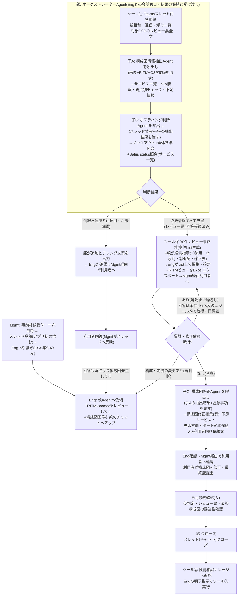
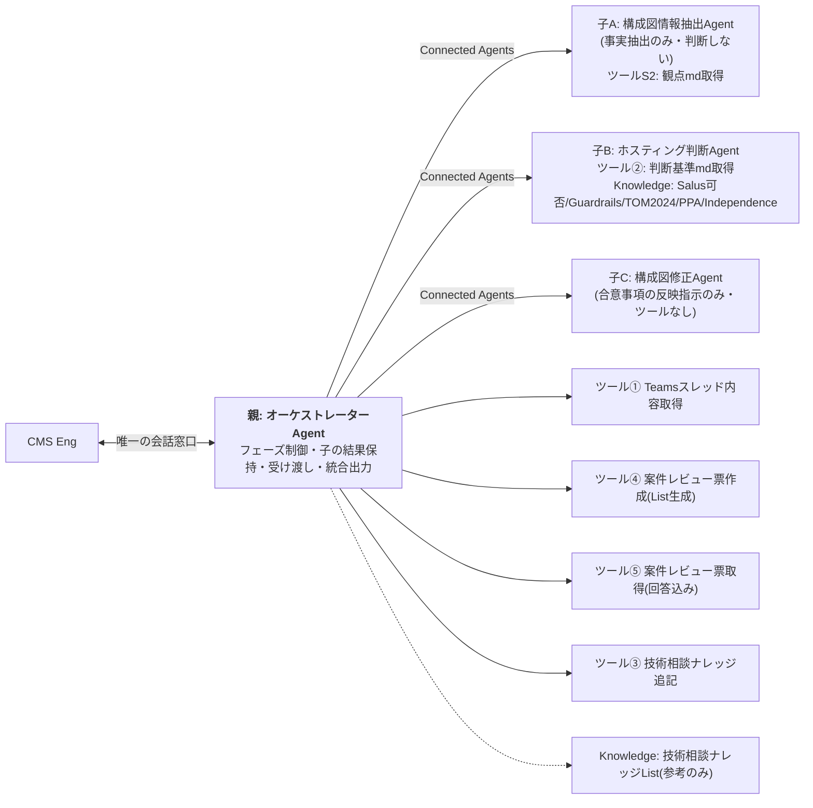

# アーキテクチャレビューAgent構成案 — Connected Agents構成版 全体ワークフロー

更新日: 2026-08-24 / オーケストレーター親Agent+子Agent3体(Connected Agents)。Agentによる Teams直接投稿は廃止(スレッドへの書き込みはすべて人が実施)

## 1. 全体ワークフロー

## 2. コンポーネント構成

### 役割分担

| コンポーネント | 役割 | 持ち物 |
|---|---|---|
| 親: オーケストレーターAgent | Engとの会話窓口。フェーズ制御(初回判断→レビュー票→回答評価→修正案→クローズ)、**子の出力を会話コンテキストに保持し、次の子への入力として要約せず渡す**、統合出力、ヒアリング文案 | ツール①③④⑤ |
| 子A: 構成図情報抽出Agent | 構成図画像から事実抽出(サービス一覧・NW情報・観点別チェック・不足情報)。CSP推定+根拠明示。判断しない | ツールS2(観点md) |
| 子B: ホスティング判断Agent | 全体基準+ノックアウト照合(○△×規則)、Salus status照合、環境仮判定+根拠 | ツール②(判断基準md)+Knowledge |
| 子C: 構成図修正Agent | 子Aの事実+合意事項→構成図修正指示(文案)。新たな設計判断はしない | なし |
| 人(Eng/Mgmt) | スレッドへの投稿・利用者連携・List編集・エクスポート送付・最終確認・クローズ | — |

### 旧構成からの変更点

| 項目 | 旧 | 新 |
|---|---|---|
| サブAgentの起動 | Engが別Agentと直接会話 | **親がConnected Agentsで自動呼出し**(Engの会話は親1本) |
| 子の結果の連携 | ツールS1でスレッドへ自動投稿→ツール①で取得 | **親の会話コンテキストで保持・受け渡し**(Agentによる Teams投稿は廃止) |
| ツールS1(スレッド投稿) | あり | **廃止**(スレッドへの反映が必要な場合は人がコピペ) |
| DCS対象外分岐 | あり | **削除**(Mgmt一次判断で除外済みの前提) |
| 構成図チェックAgent | 1体2モード | **抽出(子A)と修正(子C)を別Agentに分離**(役割単純化で精度・呼び分けが安定) |

## 3. 実装前の検証ポイント(Connected Agents前提のため必須)

| # | 検証内容 | 結果がNGの場合のフォールバック |
|---|---|---|
| 1 | **Connected Agentsが本環境で利用可能か**(プレビュー機能の可否・DLP) | 旧構成(Eng仲介+スレッド経由)へ戻す |
| 2 | **親チャットにアップした画像が子A呼出し時に渡るか**(最重要・未検証) | 画像が渡らない場合: 構成図抽出のみEngが子Aと直接会話(旧方式)、結果を親チャットへ貼る |
| 3 | 子の出力が長文(観点50件超)でも親へ完全に返るか(要約・切り捨ての有無) | 出力を分割返却/観点別チェックの詳細は子の会話に残しサマリのみ親へ |
| 4 | 親が子の結果を**要約せず**次の子へ渡せるか(伝言ゲーム劣化の確認) | 親Instructionsに「子の出力は原文のまま引用して渡す」を強制。劣化が残る場合は子Bへの入力を親が定型フォーマットで再構成 |
| 5 | 呼出しの多段化による応答時間(子A→子Bで数分になる可能性) | 許容範囲をEng評価で確認。遅すぎる場合は子Bの基準を「回答必須」項目に絞る |

※Connected Agentsはプレビュー段階の機能のため、上記1〜4を**最初の30分で検証してから**子Agentの本格構築に入ること(検証は空のダミー子Agentで可)。

## 4. 主な確認事項(更新)

| # | 内容 |
|---|---|
| 1 | Connected Agentsの環境可否・画像伝搬(§3の検証1・2) |
| 2 | Agentのスレッド投稿廃止に伴う運用: 子A抽出結果・子C修正案を利用者/スレッドへ届ける際の転記は誰が行うか(Eng想定) |
| 3 | 案件Listエクスポート送付・回答貼り付けの運用(従来どおり) |
| 4 | 編集指示ラベル(①流用②添削③追記④不要)の最終確定 |
