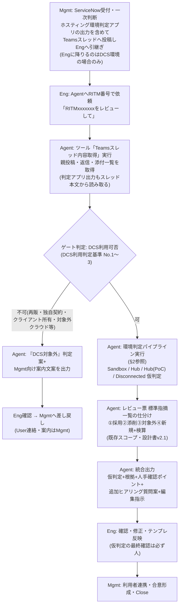
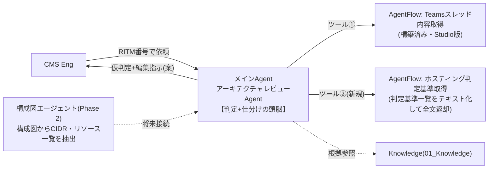

# アーキテクチャレビューAgent 全体構成 再整理案

| 項目 | 内容 |
|---|---|
| 版 | v1.0(ドラフト) |
| 作成日 | 2026-08-17 |
| 位置づけ | 設計書v2.1のスコープ(レビュー票編集指示)に、**ホスティング環境判定(Sandbox/Hub/Disconnected)** を追加した全体構成の再整理。「ホスティング判断基準一覧.xlsx」(全体基準/ノックアウト抵触有無/SSDLC(TOM2024)/DCS利用判定基準/HubとDisconnected判断基準)を判定仕様の一次資料とする |
| 実装先 | Copilot Studio(JP-IT-Int-PAD-Prod)。フローは**AgentFlow(GA)**で実装。Workflow(プレビュー)はPhase 2で評価 |

---

## 1. To-Be業務フロー(再整理版)



ポイント: **Agentの出力はすべて「仮判定(案)」**。判定基準一覧の「人手確認」フラグどおり、確定は人が行う。ホスティング環境判定アプリとの直接連携は**不要**(出力がスレッド投稿に含まれるため、スレッド取得だけで判断材料が揃う)。

## 2. ホスティング判定パイプライン(判定基準一覧.xlsxの実装マッピング)

判定は次の順で連鎖させる(前段のAI出力が次段のInput):

| 段 | 参照シート | 判定内容 | 結果 |
|---|---|---|---|
| Gate | DCS利用判定基準 No.1〜3 | 所有者=Deloitte? / 契約主体=Deloitte? / クラウド=Azure・AWS・GCP? | 1つでも不可→**DCS対象外(Mgmt差し戻し)** |
| S1 | 同 No.4 | 90日以内PoCか | Sandbox判定 / Sandbox対象外 |
| S2 | 同 No.5 | 社内NW接続要件有無 × No.4結果 | Sandbox / Hub(PoC) / Disconnected 仮判定(SandboxはデロイトNW接続NG) |
| S3 | 同 No.6〜8 | システム利用者 / クライアントからのアクセス / クライアント向け提供 × No.5結果 | 仮判定の確定方向(Sandboxは社内利用限定・クライアント提供不可・本番転用不可) |
| S4 | SSDLC(TOM2024) | 目的(PoC・デモ→Sandbox方向)/ 格納データ(個人・機密・極秘→Sandbox不可)/ 通信(外部接続→Sandbox不可) | 仮判定の整合チェック |
| S5 | ノックアウト抵触有無 + HubとDisconnected判断基準 | **Hub第1優先**。7カテゴリ(①NW要件 ②オートスケール ③GCP利用 ④CSPサービス ⑤構成 ⑥アセット特性 ⑦SLA要件)のいずれか該当時のみDisconnected許容 | Hub / Disconnected 仮判定 |

### AI代替可否フラグの実装規則(Instructionsに落とす)

| フラグ | Agentの振る舞い |
|---|---|
| ○(高) | 自動判定し、根拠(参照シート・行、スレッド内の記載箇所)を明示 |
| △(中) | 判定案は出すが、必ず「**要人手確認**」タグを付け、確認観点を1行添える |
| ×(低) | **判定しない**。代わりに「追加ヒアリングコメント文案」を生成(基準表のOutput定義どおり)。例: 外部NW接続の設計詳細、大容量通信の数値目標 |
| 判定不能 | 全段共通で「判断不可(情報不足)」とし、人へのエスカレーション+質問案を出す |

## 3. コンポーネント構成(サブエージェント含む)



### 実装形態の使い分け(重要な設計判断)

| 要素 | 実装 | 理由 |
|---|---|---|
| 判定ロジックの骨格(順序・ゲート・○△×規則・エスカレーション) | メインAgentの**Instructions** | 制御構造なので毎回必ず適用させる |
| 判定基準の詳細表(DCS利用判定No.1〜8/ノックアウト①〜⑦/SSDLC) | **ツール②で全文渡し**(フロー内蔵テキスト) | 「全行漏れなく連鎖評価」が必要なためRAG(Knowledge)不向き — 標準指摘一覧と同じ原則 |
| レビュー票 標準指摘一覧 | ツール①で全文渡し(既存設計どおり) | 同上 |
| ルール資料(下表) | **Knowledge** | 根拠を引く用途。全件走査は不要 |
| ホスティング環境判定アプリ | **連携しない** | 出力がMgmtのスレッド投稿に含まれるため、ツール①で取得済み |
| 構成図の解析 | **PoCでは実装しない**(Eng目視) | 画像入力不可の環境制約。判定基準のInput「構成図エージェント」はPhase 2の接続点として予約 |
| サブエージェント分割(判定Agent/仕分けAgent) | **PoCでは分割しない**(1 Agent内のモジュール=Instructionsのセクション分け) | Connected agentsは環境で未確認。まず1 Agentで品質を確認し、Instructionsが肥大して精度が落ちる場合にPhase 2で分割を評価 |

### Knowledgeの役割マップ(今回確定した使い方)

| 資料 | 用途 | 扱い |
|---|---|---|
| salus_cloudservices_review_status 1.xlsx | 利用予定サービスがDCS環境で利用可か(Accessedか)の照合 | 判定根拠に使用可 |
| Salus - Guardrails - v20260805.xlsx | Layer制限などガードレール適合確認 | 判定根拠に使用可 |
| TOM2024関連(ポリシー&スタンダード/Guideline) | SSDLC観点・ホスティング判定の根拠 | 判定根拠に使用可 |
| AWS-PPA-2026-Eligible-Use.md | **AWS特有の制限**(AWS案件のみ参照) | 判定根拠に使用可 |
| Microsoft Azure Independence Requirements.md | **Azureの商務要件**(Azure案件のみ参照) | 判定根拠に使用可 |
| (GCP) | 固有資料なし。**基本はAWS/Azureと同じ扱い**+ノックアウト③(GCP必須→基本Disconnected) | — |
| 技術相談ナレッジ.xlsx | 過去案件の**参考のみ** | **判定根拠にしない**。過去環境・案件特有事情による見かけ上の矛盾があり得ることをInstructionsに明記 |

## 4. Agent出力フォーマット(拡張案)

```text
## ホスティング判定サマリ
- RITM: / CSP:
- DCS利用可否(Gate): 可 / 不可(→Mgmt差し戻し案内文案) / 判断不可
- 環境仮判定: Sandbox / Hub / Hub(PoC) / Disconnected / 判断不可
- 判定経路: Gate→No.4→No.5→No.6-8→SSDLC→ノックアウト の各段の結果と根拠(参照シート・行)
- ノックアウト該当: なし / あり(カテゴリ番号と該当理由)
- 要人手確認(△項目): 一覧
- 追加ヒアリング(×項目・情報不足): 質問文案
- 構成図: Eng目視確認が必要(画像は解析対象外)

## レビュー票への編集指示(既存フォーマットどおり)
①採用 / ②添削 / ③対象外 / ④新規追加 + 検算

※本出力はすべてAgentの案。判定の確定・承認・利用者連絡は人(Eng/Mgmt)が行う。
```

## 5. 段階導入ロードマップ

| フェーズ | 内容 |
|---|---|
| PoC(現行) | ツール①+レビュー票仕分け(構築済み)。まず結合テスト完了・品質評価 |
| PoC拡張(本再整理の実装) | ツール②(判定基準取得フロー)追加、Instructionsに判定パイプライン+○△×規則を実装、Knowledge6ファイル整備、テスト3案件で「仮判定の正解率」を評価軸に追加 |
| Phase 2 | 構成図エージェント(画像解析ツールの承認後)/ Connected agentsによる判定・仕分けの分割 / Workflow(GA後)による自動起点+Human Review承認パイプライン / レビュー票xlsx自動転記 |

## 6. 実装タスク(PoC拡張)

- [ ] 判定基準一覧.xlsxの5シートを**判定基準テキスト**へ変換(ツール②内蔵用。標準指摘一覧と同じく先頭に版数・全行数を記載)
- [ ] AgentFlow「ホスティング判定基準取得」作成(入力なし/出力 hostingCriteria の静的テキスト返却。非同期応答オフ・発行)
- [ ] Instructions v3.0作成(役割拡張: ホスティング判定パイプライン+○△×規則+差し戻し文案+既存の仕分けロジック統合)
- [ ] Knowledgeへ salus_cloudservices_review_status / Salus-Guardrails / 技術相談ナレッジ を追加(未配置分)
- [ ] テストケース追加: DCS対象外(差し戻し)/ Sandbox該当 / Hubノックアウト→Disconnected の3パターン
- [ ] Excel内の未決コメントの解消(下記§7)

## 7. 判定基準一覧.xlsx側の未決事項(基準Owner確認)

シート内のコメントに残っている論点。Agent実装前に確定が望ましい:

1. CIDR判定(/24閾値)の行分割要否(オートスケール・コンテナ化・CSPサービス・アセット特性との重複整理)
2. 外部NW接続の「問題視するパターン」の具体化(アウトバウンドのみは問題なしで良いか)— △判定の確認観点に直結
3. CSPサービス起因のノックアウト対象にAWS以外(Azure/GCP)のサービスを追加するか、VDI等のClient OS利用・Simple AD等の独自ドメイン構築を含めるか
4. 関係資料リンクの整理(基準表内リンクの張り直し)

---

## 付録: Instructionsモジュール構成案(v3.0の骨格)

```text
# 役割(拡張): ホスティング環境判定+レビュー票編集指示
# 進め方
1. RITM特定 → ツール「Teamsスレッド内容取得」実行
2. ツール「ホスティング判定基準取得」実行
3. Gate判定(No.1〜3)→ 不可ならMgmt差し戻し文案を出力して終了
4. 環境判定パイプライン(No.4→5→6-8→SSDLC→ノックアウト)を基準テキストの行順に全件評価
   - AI代替可否: ○=自動判定+根拠 / △=判定案+要人手確認タグ / ×=判定せず追加ヒアリング文案
5. 標準指摘一覧の全行仕分け(①②③④+検算)※既存ロジック
6. 統合出力(§4フォーマット)
# 厳守事項(追加分)
- 判定は常に「仮判定」。確定・承認・利用者連絡は人が行う
- Hub第1優先。ノックアウト該当時のみDisconnected
- 技術相談ナレッジは参考のみ。判定根拠にしない(過去案件特有の事情がありうる)
- AWS-PPAはAWS案件のみ、Azure IndependenceはAzure案件のみ参照。GCPはAWS/Azure同等+ノックアウト③
- 判定不能は「判断不可(情報不足)」+質問案でエスカレーション
```
