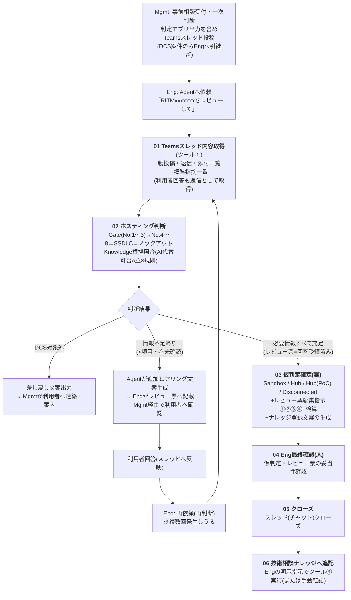
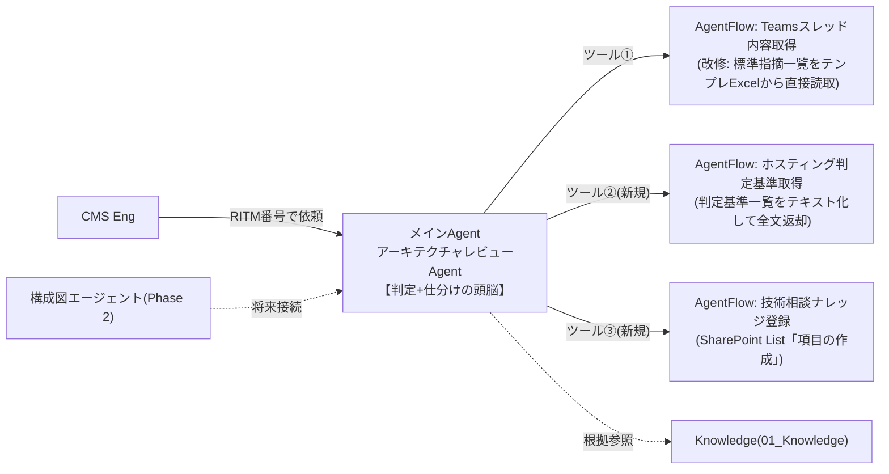

# アーキテクチャレビューAgent 全体構成 再整理案

| 項目 | 内容 |
|---|---|
| 版 | v1.1 |
| 更新日 | 2026-08-17 |
| v1.0からの変更 | ①**全体ワークフローを確定**(ヒアリングループ・Eng最終確認・クローズ・ナレッジ追記まで) ②標準指摘一覧の取得を**フロー内蔵テキスト→テンプレExcel直接読取**に変更(方法C) ③**技術相談ナレッジ**の方針確定(マスタ=SharePoint List維持、Agent追記用ツール追加、ナレッジ登録文案生成をPoC拡張へ前倒し) ④利用者回答の受領ルール、Forms化見送りの判断を追記 |
| 位置づけ | 設計書v2.1のスコープ(レビュー票編集指示)に**ホスティング環境判定(Sandbox/Hub/Disconnected)**を追加した全体構成。「ホスティング判断基準一覧.xlsx」を判定仕様の一次資料とする |
| 実装先 | Copilot Studio(JP-IT-Int-PAD-Prod)。フローは**AgentFlow(GA)**。Workflow(パブリックプレビュー)はPhase 2で評価 |

---

## 1. 全体ワークフロー(確定版)



### 責任分界

- Agentが働くのは01〜03(+ヒアリングループ)。**04以降は人のプロセス**
- 「仮判定確定」は全回答が揃った状態でのAgentの最終**案**。確定権限はEngの最終確認(04)
- ナレッジ追記(06)は、Engが内容確認のうえ「登録して」と**明示指示した場合のみ**ツール実行(Agentが勝手に書き込まない)

### 利用者回答の受領ルール(運用)

- 原則: 回答は**No.を引用したテキストでスレッドに返信**(例:「No.3: 該当なし。理由は〜」)→ ツール①がそのまま取得でき、再判断は再依頼するだけ
- レビュー票(Excel)に記入して返ってきた場合: Engが回答部分をスレッドへ転記(またはAgentへコピペで提示)
- 再判断は複数回発生しうる前提。スレッドが会話の唯一の蓄積場所になるため、**判断材料は必ずスレッドに集約**する

## 2. ホスティング判定パイプライン(判定基準一覧.xlsxの実装マッピング)

| 段 | 参照シート | 判定内容 | 結果 |
|---|---|---|---|
| Gate | DCS利用判定基準 No.1〜3 | 所有者=Deloitte? / 契約主体=Deloitte? / クラウド=Azure・AWS・GCP? | 1つでも不可→**DCS対象外(Mgmt差し戻し)** |
| S1 | 同 No.4 | 90日以内PoCか | Sandbox判定 / Sandbox対象外 |
| S2 | 同 No.5 | 社内NW接続要件有無 × No.4結果 | Sandbox / Hub(PoC) / Disconnected 仮判定(SandboxはデロイトNW接続NG) |
| S3 | 同 No.6〜8 | システム利用者 / クライアントアクセス / クライアント向け提供 × No.5結果 | 仮判定の確定方向(Sandboxは社内利用限定・クライアント提供不可・本番転用不可) |
| S4 | SSDLC(TOM2024) | 目的 / 格納データ(個人・機密・極秘→Sandbox不可)/ 通信 | 仮判定の整合チェック |
| S5 | ノックアウト抵触有無+HubとDisconnected判断基準 | **Hub第1優先**。7カテゴリ該当時のみDisconnected許容 | Hub / Disconnected 仮判定 |

### AI代替可否フラグの実装規則(Instructions)

| フラグ | Agentの振る舞い |
|---|---|
| ○(高) | 自動判定し、根拠(参照シート・行、スレッド内の記載箇所)を明示 |
| △(中) | 判定案+「**要人手確認**」タグ+確認観点1行 |
| ×(低) | **判定しない**。「追加ヒアリングコメント文案」を生成(→レビュー票経由で利用者確認) |
| 判定不能 | 「判断不可(情報不足)」+質問案でエスカレーション |

## 3. コンポーネント構成



### ツール一覧

| ツール | 実体 | 入出力 | 状態 |
|---|---|---|---|
| ① Teamsスレッド内容取得 | AgentFlow(構築済み・Studio版) | RITM番号(+CSP) → threadContent / reviewSheetStandardItems / csp | **改修**: スイッチ内蔵テキスト→テンプレ直接読取(§4) |
| ② ホスティング判定基準取得 | AgentFlow(新規) | 入力なし → hostingCriteria(判定基準全文テキスト) | 新規作成 |
| ③ 技術相談ナレッジ登録 | AgentFlow(新規) | タイトル(RITM)/相談概要/判定結果/根拠/特記事項 → 登録結果+リンク | 新規作成(Eng明示指示時のみ実行) |

### 実装形態の使い分け(設計判断)

| 要素 | 実装 | 理由 |
|---|---|---|
| 判定ロジックの骨格(順序・ゲート・○△×・エスカレーション) | メインAgentの**Instructions** | 制御構造。毎回必ず適用 |
| 判定基準の詳細表 | **ツール②で全文渡し** | 全行連鎖評価が必要でRAG不向き |
| レビュー票 標準指摘一覧 | **ツール①でテンプレExcelから動的取得**(§4) | 全文渡し原則+保守性(内蔵テキストは廃止) |
| ルール資料 | **Knowledge** | 根拠を引く用途 |
| ホスティング環境判定アプリ | **連携しない** | 出力がMgmtのスレッド投稿に含まれる(ツール①で取得済み) |
| 技術相談ナレッジ(マスタ) | **SharePoint Listのまま維持** | List書込はCloud Flow経由で可(環境制約と整合)。Excel化は同時編集・保守で劣化するため不採用 |
| 技術相談ナレッジ(Agent参照) | 暫定: 匿名化xlsxスナップショット(週1)→Knowledge / 本命: List直接検索フロー(Phase 2) | KnowledgeにListを直接接続できない制約の回避 |
| レビュー票テンプレのForms化 | **不採用** | 指摘リストは案件ごとに動的でFormsの静的設問と不整合。公式テンプレの版管理・承認記録の役割も崩れる |
| 構成図の解析 | PoCでは実装しない(Eng目視) | 画像入力不可の環境制約。Phase 2接続点として予約 |
| サブエージェント分割 | PoCでは分割しない(Instructionsモジュール) | Connected agents未確認。品質劣化時にPhase 2で評価 |

### Knowledgeの役割マップ

| 資料 | 用途 | 扱い |
|---|---|---|
| salus_cloudservices_review_status 1.xlsx | サービス単位のDCS利用可否(Accessed)照合 | 判定根拠に使用可 |
| Salus - Guardrails - v20260805.xlsx | Layer制限等ガードレール適合確認 | 判定根拠に使用可 |
| TOM2024関連 | SSDLC観点・ホスティング判定根拠 | 判定根拠に使用可 |
| AWS-PPA-2026-Eligible-Use.md | AWS特有の制限 | **AWS案件のみ**参照 |
| Microsoft Azure Independence Requirements.md | Azureの商務要件 | **Azure案件のみ**参照 |
| (GCP) | 固有資料なし | AWS/Azure同等扱い+ノックアウト③(GCP必須→基本Disconnected) |
| 技術相談ナレッジ(匿名化スナップショット) | 過去案件の**参考のみ** | **判定根拠にしない**(過去環境・案件特有事情による見かけ上の矛盾がありうる) |

## 4. ツール①改修: 標準指摘一覧のテンプレ直接読取(方法C)

**背景**: 標準指摘は3CSP分・各30行前後+長文で、フロー内蔵テキスト(方法A)は貼り替え保守が非現実的。テンプレ原本(SharePoint/Cloud681、`【案件名】[RITMxxxxxxx]アーキテクチャレビュー票(AWS)_v2.3.xlsx` 等3ファイル、標準指摘は「レビュー票」シート)を唯一のソースとして実行時に読む。

**フロー変更(いいえ側の後半、既存スイッチを置換)**:

```
CSP確定(既存)
 → 条件: CSP確定=「不明」
    はい: reviewSheetStandardItems に「CSPを指定して再実行」案内をセット
    いいえ:
      1. SharePoint「フォルダー内のファイルの一覧」(テンプレ格納フォルダ)
      2. アレイのフィルター処理: ファイル名に concat('アーキテクチャレビュー票(', outputs('CSP確定'), ')') を含む → 先頭1件
      3. Excel Online (Business)「表内に存在する行を一覧表示」: ファイル=手順2の識別子(動的) / テーブル=T_標準指摘(3ファイル共通名)
      4. ヘッダー追記:【標準指摘一覧】CSP / 版(ファイル名から式で抽出) / 全NN行(length()で算出)
      5. Apply to each: 各行を [No.x] 環境:… / 対応区分:… / カテゴリ:… / 指摘概要:… / 指摘内容:… / 参考資料:… 形式で追記
      6. 末尾に「以上、全NN行」を追記(Agentの検算用)
 → Agent応答(既存のまま。出力名・スキーマ変更なし)
```

**利点**: テンプレ改版(v2.3→v2.4等のファイル名変更)は手順2の部分一致検索で自動追随。**改版時の作業=フォルダのファイル差し替えのみ**。フロー・Agent・Instructionsは無修正。

**フォールバック**: Excel読取失敗時もスレッドは返す(reviewSheetStandardItems=「標準指摘一覧の取得に失敗しました。テンプレを直接確認してください」)。

**前提(要確認)**:

1. テンプレ「レビュー票」シートの標準指摘範囲を**名前付きテーブル化**(3ファイル同名)— Rule資料Owner了解。**結合セルがあるとテーブル化不可**のため、その場合はレビュー票シートに触れず**非表示「AI連携用」シート**(数式参照)を追加してテーブル化
2. テンプレ格納フォルダは**現行版のみ**(old/Workは別フォルダ)— 部分一致検索が複数ヒットしないため
3. 案件ごとのコピーは読まない(マスタのみ)。回答済みレビュー票の読取は行わず、回答はスレッド経由(§1ルール)

## 5. ツール③新規: 技術相談ナレッジ登録

| 項目 | 内容 |
|---|---|
| 実体 | AgentFlow: トリガー入力(タイトル/相談概要/判定結果/根拠/特記事項 等、Listの列構成に合わせる)→ SharePoint「**項目の作成**」→ 登録アイテムのリンクを返す |
| 起動条件 | クローズ時(§1の06)に**Engが明示指示**(「この案件をナレッジに登録して」)した場合のみ。Agentは事前に登録文案を提示し、Eng確認後に実行 |
| 文案生成 | Agentは判定経路・根拠・ヒアリング経緯を把握済みのため、03の出力に「ナレッジ登録文案」を含める(転記の手間削減・記載粒度の統一)|
| 前提確認 | 技術相談ナレッジListの列構成(必須列・選択肢列の内部名) |

## 6. Agent出力フォーマット(拡張)

```text
## ホスティング判定サマリ
- RITM: / CSP:
- DCS利用可否(Gate): 可 / 不可(→Mgmt差し戻し文案) / 判断不可
- 環境仮判定: Sandbox / Hub / Hub(PoC) / Disconnected / 判断不可
- 判定経路: 各段の結果と根拠(参照シート・行、スレッド記載箇所)
- ノックアウト該当: なし / あり(カテゴリと理由)
- 要人手確認(△): 一覧
- 追加ヒアリング(×・情報不足): 質問文案(レビュー票転記用)
- 構成図: Eng目視確認が必要

## レビュー票への編集指示
①採用 / ②添削 / ③対象外 / ④新規追加 + 検算(①+②+③=全NN行)

## 技術相談ナレッジ登録文案(クローズ時用)
- タイトル(RITM)/ 相談概要 / 判定結果 / 根拠 / 特記事項

※本出力はすべてAgentの案。判定の確定・承認・利用者連絡・ナレッジ登録の実行判断は人が行う。
```

## 7. 段階導入ロードマップ

| フェーズ | 内容 |
|---|---|
| PoC(現行) | ツール①+レビュー票仕分け。結合テスト完了・品質評価(進行中) |
| PoC拡張(本再整理) | ツール①改修(テンプレ直接読取)/ ツール②(判定基準取得)/ ツール③(ナレッジ登録)/ Instructions v3.0(判定パイプライン+○△×+差し戻し文案+ナレッジ文案)/ Knowledge整備 / テスト3パターン追加(DCS対象外・Sandbox・ノックアウト→Disconnected) |
| Phase 2 | 構成図エージェント / Connected agents分割 / Workflow(GA後)による自動起点+Human Review / Search past cases(List直接検索)本採用 / レビュー票xlsx自動転記 |

## 8. 実装タスク(PoC拡張)

- [ ] テンプレのテーブル化可否確認(結合セル有無・Owner了解)→ 可なら3ファイルへ `T_標準指摘` 追加
- [ ] テンプレ格納フォルダの運用確認(現行版のみ)
- [ ] ツール①改修(§4)+ フォールバック実装 + 結合テスト(100秒制限内の実測含む)
- [ ] 判定基準一覧.xlsx 5シートのテキスト化(ツール②内蔵用。先頭に版数・全行数)
- [ ] ツール②「ホスティング判定基準取得」作成(非同期応答オフ・発行)
- [ ] 技術相談ナレッジListの列構成確認 → ツール③「技術相談ナレッジ登録」作成
- [ ] Instructions v3.0 作成・貼付
- [ ] Knowledge追加(salus_cloudservices / Guardrails / 匿名化ナレッジスナップショット)
- [ ] 利用者回答のスレッド返信ルールを運用手順書(事前相談業務)へ追記依頼
- [ ] テストケース追加3パターンのスレッド作成(Mgmt協力)

## 9. 確認事項(未決)

| # | 確認内容 | 確認先 |
|---|---|---|
| 1 | テンプレへのテーブル(または非表示AI連携用シート)追加の可否 | Rule資料Owner |
| 2 | テンプレフォルダに現行版のみ置く運用(old/Work分離)の徹底 | Eng / Mgmt |
| 3 | 技術相談ナレッジListの列構成・必須項目 | ナレッジOwner |
| 4 | 利用者回答のスレッド返信ルールの運用依頼可否 | Mgmt |
| 5 | 判定基準一覧.xlsx内の未決コメント(CIDR行分割/外部NWの問題パターン具体化/AWS以外のCSPサービス・VDI・独自ドメインの追加)| 基準Owner |

---

## 付録: Instructionsモジュール構成案(v3.0の骨格)

```text
# 役割(拡張): ホスティング環境判定+レビュー票編集指示+ナレッジ登録文案
# 進め方
1. RITM特定 → ツール①「Teamsスレッド内容取得」実行(利用者回答の返信も含めて読む)
2. ツール②「ホスティング判定基準取得」実行
3. Gate判定(No.1〜3)→ 不可ならMgmt差し戻し文案を出力して終了
4. 環境判定パイプライン(No.4→5→6-8→SSDLC→ノックアウト)を基準テキストの行順に全件評価
   - ○=自動判定+根拠 / △=判定案+要人手確認 / ×=判定せず追加ヒアリング文案
5. 標準指摘一覧の全行仕分け(①②③④+検算)
6. 統合出力(§6フォーマット)。全回答受領済みなら仮判定確定(案)+ナレッジ登録文案も出力
7. Engから「ナレッジに登録して」と明示指示があった場合のみ、文案の最終確認を取ってツール③実行
# 厳守事項(追加分)
- 判定は常に「仮判定(案)」。確定・承認・利用者連絡・ナレッジ登録実行の判断は人
- Hub第1優先。ノックアウト該当時のみDisconnected
- 技術相談ナレッジは参考のみ。判定根拠にしない
- AWS-PPAはAWS案件のみ、Azure IndependenceはAzure案件のみ。GCPはAWS/Azure同等+ノックアウト③
- 判定不能は「判断不可(情報不足)」+質問案でエスカレーション
```
