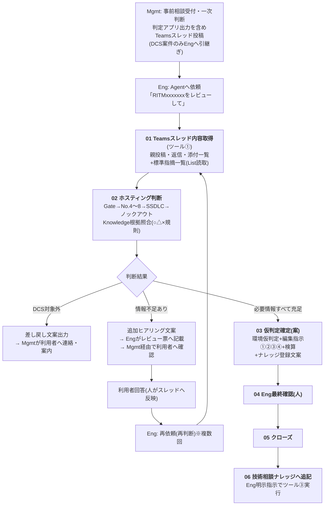
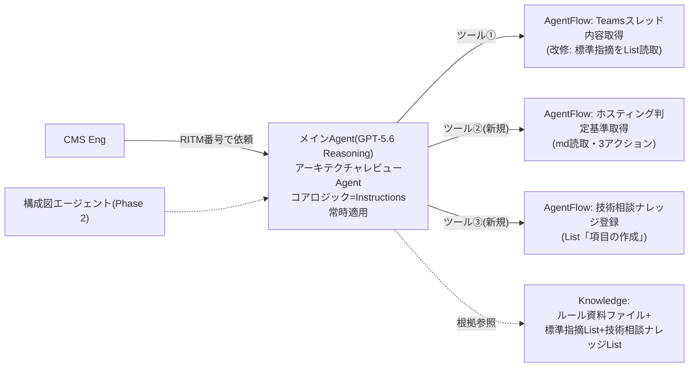

# アーキテクチャレビューAgent 全体構成 再整理案

| 項目 | 内容 |
|---|---|
| 版 | v1.3 |
| 更新日 | 2026-08-17 |
| v1.2からの変更 | ①**標準指摘一覧・技術相談ナレッジのSharePoint List化を反映**(方法Bの実現)。ツール①の読取先を「テンプレExcelコピー」→「**アーキテクチャレビュー票テンプレートList(CSP統合版)**」に変更 ②AI連携用フォルダは判定基準mdの置き場のみに縮小(テンプレコピー・テーブル化は不要) ③技術相談ナレッジの週次xlsxスナップショット運用を**廃止**(List直接Knowledge接続に置換) ④KnowledgeとツールでのList二役の使い分け規則を追加 ⑤Agent実機設定(GPT-5.6 Reasoning / Memory)の注記を追加 |
| 実装先 | Copilot Studio(JP-IT-Int-PAD-Prod)。フローは**AgentFlow(GA)**。Workflow・SkillsはPhase 2で評価 |

---

## 1. 全体ワークフロー(確定版・v1.2から変更なし)



責任分界・利用者回答の前提メモはv1.2と同じ(回答は最終的にスレッドにテキストで残す。返信・転記は人が実施)。

## 2. データソース構成(List化後の全体像)

| データ | 実体 | Agentへの渡し方 | 改版時の作業 |
|---|---|---|---|
| Teamsスレッド(判定アプリ出力含む) | Teamsチャネル | ツール①(Teamsコネクタ) | — |
| **標準指摘一覧** | **SharePoint List「アーキテクチャレビュー票テンプレート(CSP統合版)」**(新設・CSP列で3CSP統合) | **ツール①で全文渡し**(List読取・§4)+ Knowledge(根拠引用用・二役) | **Listの行を編集するだけ**。フロー・Agent無修正 |
| ホスティング判定基準 | md化予定(Eng作業・ID/版数/総行数付き) | ツール②で全文渡し(ファイル読取3アクション) | mdファイル差し替えのみ |
| ルール資料(Salus可否/Guardrails/TOM2024/PPA/Azure Independence) | 01_Knowledgeのファイル | Knowledge | ファイル差し替え |
| **技術相談ナレッジ** | **SharePoint List(既存・マスタ)** | **Knowledge(List直接接続)** + ツール③で追記 | — (**週次xlsxスナップショット運用は廃止**) |

### 重要規則: Listの「二役」の使い分け(Instructionsに明記)

標準指摘一覧Listは Knowledge と ツール① の両方から参照されるが、役割が異なる:

- **仕分け(①②③④+検算)は、必ずツール①の出力 reviewSheetStandardItems のみを正とする**。Knowledge検索結果だけで仕分けしない
- 理由: Knowledge(RAG)は関連断片のみを検索して渡すため、**検索に掛からなかった指摘行が検討されない漏れ**が起きる。検算(①+②+③=全NN行)が成立するのは全文渡しのツール出力だけ
- Knowledge側の用途は、個別指摘の根拠引用・「No.5の意図は?」といったQ&A・関連指摘の補足検索に限定

技術相談ナレッジも同様: Knowledgeでの参照は**参考のみ・判定根拠にしない**(過去環境・案件特有事情による見かけ上の矛盾がありうる)。

## 3. コンポーネント構成



### ツール一覧

| ツール | 実体 | 入出力 | 状態 |
|---|---|---|---|
| ① Teamsスレッド内容取得 | AgentFlow(構築済み) | RITM番号(+CSP) → threadContent / reviewSheetStandardItems / csp | **要改修1箇所**: 仮テキストのスイッチ→List読取(§4)。それ以外は変更なし |
| ② ホスティング判定基準取得 | AgentFlow(新規・3アクション) | 入力なし → hostingCriteria | トリガー→SharePoint「ファイル コンテンツの取得(パス)」→応答(base64なら`base64ToString()`) |
| ③ 技術相談ナレッジ登録 | AgentFlow(新規) | Listの列構成に合わせた入力 → 登録結果+リンク | Eng明示指示時のみ実行。入力設計にList列構成(列名・型・必須・選択肢値)が必要 |

### Agent実機設定の注記

- モデル: **GPT-5.6 Reasoning**(判定パイプラインのような多段推論に適切。応答時間は長め — 結合テストで体感を確認)
- **Memory(プレビュー)**: PoC中は**オフ推奨**。前案件の会話文脈が次案件の判定に混入すると、評価(案件ごとの再現性)が崩れるため。案件横断の記憶が欲しくなったらPhase 2で検証
- Skills: 不採用(v1.2の判断どおり。中核ロジックは常時適用のInstructionsへ)

### 実装形態の使い分け(v1.2からの変更点のみ)

| 要素 | v1.2 | **v1.3(確定)** |
|---|---|---|
| 標準指摘一覧の実体 | テンプレExcelコピー(AI連携用フォルダ・テーブル化) | **SharePoint List(CSP統合版)** |
| ツール①の読取方式 | フォルダ検索+Excel表読取 | **「複数の項目の取得」+CSPフィルター**(§4) |
| AI連携用フォルダ | テンプレコピー3本+判定基準md | **判定基準mdのみ**に縮小 |
| 技術相談ナレッジのAgent参照 | 匿名化xlsxスナップショット(週1)→Knowledge | **List直接Knowledge接続**(スナップショット廃止) |
| Search past casesフロー(Phase 2) | List直接検索の本命 | Knowledge直接接続で当面充足。検索精度が不足する場合のみ実装 |

※注意: 公式テンプレExcel(案件ごとにコピーして使う正式文書)は従来どおり存続。List化されたのは**Agentが読む標準指摘マスタ**であり、テンプレとListの内容一致を保つ運用(改版時に両方更新)が新たに必要 → 確認事項へ。

## 4. ツール①改修: 標準指摘一覧のList読取(1箇所のみ)

既存フローの「CSP分岐スイッチ(仮テキスト)」を以下に置き換える。**トリガー・Teams取得・CSP判定・応答スキーマは一切変更なし**:

```
CSP確定(既存)
 → 条件: CSP確定=「不明」
    はい: reviewSheetStandardItems に「CSPを指定して再実行」案内をセット
    いいえ:
      1. SharePoint「複数の項目の取得」: サイト=該当サイト / リスト=アーキテクチャレビュー票テンプレート(CSP統合版)
         - フィルタークエリ: CSP列の内部名 eq 'AWS' 形式(値=CSP確定の出力)
           ※「DCS共通」など全CSP共通行がある場合: (CSP eq '<確定CSP>') or (CSP eq '共通') のようにor条件
         - 並べ替え: No.列 asc / 上限件数: 既定(足りなければ設定で拡張)
      2. ヘッダー追記:【標準指摘一覧】CSP / 版(Listの版数列 or 固定文言) / 全NN行(length()で算出)
      3. Apply to each: 各行を [No.x] 環境:… / 対応区分:… / カテゴリ:… / 指摘概要:… / 指摘内容:… / 参考資料:… 形式で追記
      4. 末尾に「以上、全NN行」を追記(検算用)
 → Agent応答(既存のまま)
```

- フォールバック: List読取失敗時もスレッドは返す(reviewSheetStandardItems=「標準指摘一覧の取得に失敗しました。Listを直接確認してください」)
- 実装時の注意: フィルタークエリは**列の内部名**(表示名でない)を使う。選択肢列の値は完全一致。複数行テキスト列はHTMLが混ざる場合があるため、必要なら整形時に除去
- List設計の推奨列: No.(数値・並び順)/ CSP(選択肢: AWS・Azure・GCP・共通)/ 環境 / 対応区分 / カテゴリ / 指摘概要 / 指摘内容(複数行)/ 対応ガイドライン・参考資料 / **版数**(テンプレ何版由来かの追跡用)

## 5. 判断ロジックの実装(全体連携)

実行時にAgentへ渡る材料と、判断の流れ:

| ステップ | 材料 | 供給元 |
|---|---|---|
| 1. 案件情報の把握 | スレッド全文(判定アプリ出力・利用者回答含む) | ツール① threadContent |
| 2. ホスティング判定 | 判定基準md全文(ID・○△×付き) | ツール② hostingCriteria |
| 3. 判定の根拠づけ | Salus可否/Guardrails/TOM2024/PPA(AWS)/Independence(Azure) | Knowledge(検索) |
| 4. レビュー票仕分け | 標準指摘一覧全文(該当CSP+共通) | ツール① reviewSheetStandardItems |
| 5. 補足参照 | 個別指摘の背景・過去類似案件(参考のみ) | Knowledge(標準指摘List・技術相談ナレッジList) |
| 6. 登録(クローズ時) | ナレッジ登録文案→Eng確認→実行 | ツール③ |

判定規則(○=自動判定+根拠ID / △=判定案+要人手確認 / ×=判定せず追加ヒアリング文案 / 判定不能=判断不可+質問案)、Hub第1優先、検算、はv1.2 §2と同じ。

## 6. 段階導入ロードマップ

| フェーズ | 内容 |
|---|---|
| PoC(現行) | ツール①+レビュー票仕分け。結合テスト・品質評価(進行中) |
| PoC拡張 | ツール①のList読取改修(§4)/ 判定基準md化→ツール② / ツール③ / Instructions v3.0(二役規則含む)/ Memoryオフ確認 / テスト3パターン追加 |
| Phase 2 | 構成図エージェント / Connected agents分割 / Skills化比較 / Workflow(GA後)+Human Review / レビュー票xlsx自動転記 / 標準指摘Listと公式テンプレの同期自動化 |

## 7. 実装タスク(PoC拡張)

- [ ] 標準指摘List(CSP統合版)の列構成確認・データ投入完了確認(No.順・CSP選択肢・共通行の扱い・版数列)
- [ ] ツール①改修(§4): スイッチ→「複数の項目の取得」+整形。結合テスト(検算の全行数一致・100秒制限内)
- [ ] 判定基準一覧の確定→md化(Eng。ID・版数・総行数・○△×付き)→ AI連携用フォルダへ配置
- [ ] ツール②作成(3アクション・非同期応答オフ・発行)
- [ ] 技術相談ナレッジListの列構成確認 → ツール③作成
- [ ] Instructions v3.0作成・貼付(**二役規則**: 仕分けはツール出力のみを正とする/ナレッジは参考のみ、を含む)
- [ ] Agent設定確認: Memoryオフ(PoC中)、Search all websites削除済みの再確認
- [ ] テストケース追加3パターン(DCS対象外・Sandbox・ノックアウト→Disconnected)

## 8. 確認事項(残り)

| # | 確認内容 | 確認先 | 状態 |
|---|---|---|---|
| 1 | 標準指摘List(CSP統合版)の列構成・共通行の有無・版数管理方法 | Eng | 未 |
| 2 | **公式テンプレExcelと標準指摘Listの内容一致を保つ改版運用**(テンプレ改版時にList側も更新する手順・担当) | Eng / Rule資料Owner | 未(新規) |
| 3 | **技術相談ナレッジListのKnowledge接続と機密性**: 進行中案件・実名情報が含まれる場合の扱い(完了・匿名化案件のみに絞るビュー/別Listの要否) | ナレッジOwner / Mgmt | 未(重要) |
| 4 | 技術相談ナレッジListの列構成(ツール③入力設計用) | ナレッジOwner | 未 |
| 5 | 判定基準一覧の内容確定(Excelコメント論点解消)→md化 | 基準Owner / Eng | 進行中 |

---

## 付録: Instructionsモジュール構成案(v3.0の骨格・二役規則反映)

```text
# 役割: ホスティング環境判定+レビュー票編集指示+ナレッジ登録文案
# 進め方
1. RITM特定 → ツール①「Teamsスレッド内容取得」実行(利用者回答の返信も含めて読む)
2. ツール②「ホスティング判定基準取得」実行
3. Gate判定(No.1〜3)→ 不可ならMgmt差し戻し文案を出力して終了
4. 環境判定パイプライン(No.4→5→6-8→SSDLC→ノックアウト)を判定基準IDの順に全件評価
   - ○=自動判定+根拠ID / △=判定案+要人手確認 / ×=判定せず追加ヒアリング文案
5. 標準指摘一覧の全行仕分け(①②③④+検算)
6. 統合出力。全回答受領済みなら仮判定確定(案)+ナレッジ登録文案も出力
7. 「ナレッジに登録して」と明示指示があった場合のみ、文案の最終確認後にツール③実行
# 厳守事項
- 仕分け・検算は、ツール①の出力(reviewSheetStandardItems)のみを正とする。Knowledge検索結果だけで仕分けしない
- 技術相談ナレッジ(Knowledge)は参考のみ。判定根拠にしない
- 判定は常に「仮判定(案)」。確定・承認・利用者連絡・ナレッジ登録実行の判断は人
- Hub第1優先。ノックアウト該当時のみDisconnected
- AWS-PPAはAWS案件のみ、Azure IndependenceはAzure案件のみ。GCPはAWS/Azure同等+ノックアウト③
- 判定不能は「判断不可(情報不足)」+質問案でエスカレーション
```
