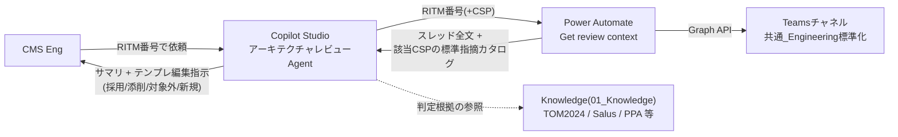
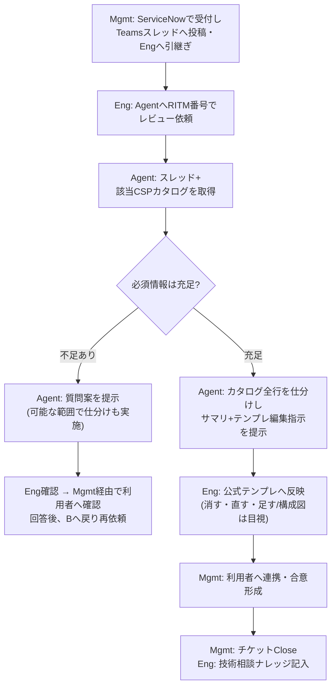

# アーキテクチャレビューAgent 設計書(PoC版)

| 項目 | 内容 |
|---|---|
| 版 | v2.1 |
| 更新日 | 2026-08-13 |
| 主な更新 | ①実施環境を **JP-IT-Int-PAD-Prod** に確定 ②Knowledge配置先を **01_Knowledge** に確定 ③標準指摘カタログは **フロー内蔵・全文渡し(方法A)** に決定 ④Agent出力を **テンプレ編集指示型** に変更 ⑤技術相談ナレッジは **Listエクスポート方式** |
| 構成方針 | **1 Agent + 1 Power Automateフロー + Knowledge参照** の最小構成。Agentは「案」を作るだけで、判断・承認・利用者への連携はすべて人が行う |

---

## 1. 目的

CMS Engが事前相談(Teamsスレッド)の内容確認からレビュー票初稿の作成までに掛けている時間を、Copilot Studio Agentで短縮する。

## 2. PoCスコープ

### やること

| # | 内容 |
|---|---|
| 1 | EngがAgentに「RITM1234567 をレビューして」と自然言語で依頼する |
| 2 | AgentがPower Automate経由で該当Teamsスレッド(親投稿・返信・添付一覧)と、**該当CSPの標準指摘カタログ全文**を取得する |
| 3 | Agentがカタログの全指摘行を仕分け(①採用/②添削/③対象外/④新規追加)し、Knowledgeと照合した判定案と合わせて**テンプレへの編集指示**として提示する |
| 4 | Engが公式テンプレをコピーし、編集指示どおりに消す・直す・足すだけで初稿完成(構成図は目視確認) |

### やらないこと(Phase 2以降)

| 項目 | PoCでの代替 |
|---|---|
| 構成図(画像)の自動解析 | Engが目視確認(環境制約: ファイル内画像は入力不可) |
| レビュー票xlsxへの自動書き込み | Engがテンプレへ反映(「Excel用」タブ区切り出力で貼り付けを支援) |
| レビュー記録のID採番・版管理 | RITM番号+実行日時で識別 |
| Rule MasterへのRule正規化 | 既存資料をKnowledgeとしてそのまま参照 |
| 構成図チェック専用Agent(Connected agents) | 1 Agent構成(W3に任意の比較検証あり → PoC計画書 手順4) |
| ナレッジ自動登録・ServiceNow連携・Teams自動投稿 | 人が実施 |
| 技術相談ナレッジListの直接検索 | エクスポートしたスナップショットをKnowledge参照(W3に任意検証あり) |

## 3. 技術検証結果(2026-08-13 実機確認済み)

Power Automateの**標準コネクタのみ(追加ライセンス不要)**でTeamsスレッドを取得できることを実機で確認した。本設計の土台となる事実。

| 確認項目 | 結果 | 使用アクション |
|---|---|---|
| 親投稿の本文 | ✅ 取得成功(`body.plainTextContent` にプレーンテキスト) | Teams「メッセージ詳細を取得する」 |
| 返信一覧 | ✅ 取得成功(HTTP 200、`value[]` に返信2件) | Teams「Microsoft Graph HTTP 要求を送信する」<br>`GET /teams/{チームID}/channels/{チャネルID}/messages/{親ID}/replies` |
| 添付ファイル | `attachments` 配列にファイル名とSharePoint URL(※**ファイルとして添付**した場合のみ) | 実体はSharePoint「パスによるファイル コンテンツの取得」で取得可 |
| 本文に貼り付けた画像 | ❌ 標準アクションでは取得不可(hostedContents) | PoC対象外 → Eng目視。**構成図はファイル添付/SPOリンクでの投稿を依頼**(§11) |

検証済みパラメータ:

| 項目 | 値 |
|---|---|
| チーム | JP CMS(ID: `5cfd8d24-98ff-43c5-a973-6ddb39689933`) |
| チャネル | 共通_Engineering標準化(ID: `19:8b661fc95b8d44e699cebdcbeb33b09c@thread.skype`) |
| テストスレッド | 【事前相談】RITM1234567(親メッセージID `1786584325327`、返信2件) |
| 接続 | Eng本人のユーザー委任。**本人が閲覧できるチームのみ取得可能**(権限面も安全) |

※検証はPersonal環境で実施。PoC本体は **JP-IT-Int-PAD-Prod** で新規作成する(手順・IDはそのまま利用可、接続は同環境で作り直し)。

## 4. 全体構成



| 構成要素 | 内容 | 備考 |
|---|---|---|
| 環境 | **JP-IT-Int-PAD-Prod**(確定) | AgentとフローはSame環境必須。Power Automate/Copilot Studio双方で環境を切り替えて作成 |
| Copilot Studio Agent | アーキテクチャレビューAgent(PoC)1体 | モデルは既定(GPT-5 Chat)、Web検索OFF |
| Power Automate | エージェントフロー1本「Get review context」 | 標準コネクタのみ。**CSP別カタログ3本をフロー内に内蔵** |
| Knowledge | 01_Knowledge(JP CMSサイト / Cloud681)の6ファイル | §7参照。**レビュー票テンプレxlsxは登録しない** |
| 保存先(任意・Phase 2) | SharePoint List「アーキテクチャレビュー記録」 | Cloud Flow経由で書込み |

## 5. カタログ設計(方法A: フロー内蔵・全文渡し)

**カタログ = CSP別レビュー票テンプレの標準指摘行そのもの。**
公式テンプレ(AWS v2.3 / Azure v2.6 / GCP v2.1)の「レビュー票」シートには標準指摘が最初から行として入っており、Engは毎回そこから選んで案件事情で添削している。Agentにも同じ材料・同じ手順を与える。

### なぜKnowledge(RAG)に入れないか

Knowledgeは「質問に関連しそうな断片だけを検索して渡す」方式のため、全件仕分けの用途では**検索に掛からなかった指摘行が検討されない**漏れが起きる。よってカタログはフロー内にテキストとして持ち、毎回**該当CSP分の全文**をAgentへ渡す。

> 使い分け原則: **全件仕分けが必要なもの → フローで渡す / 根拠を引くもの → Knowledge**

### CSPの決定ロジック(フロー内)

1. Agentが渡したCSP入力(任意)があればそれを優先
2. 未指定ならスレッド本文から自動判定(**Azure → GCP → AWS** の順で文字列判定。いずれも無ければ「不明」)
3. 「不明」の場合はカタログ未添付の旨を返し、AgentがEngへCSPを確認 → CSPを指定してツールを再実行

### カタログのテキスト形式

```text
【標準指摘カタログ】CSP: AWS / テンプレ版: v2.3 / 全NN行
---
[No.1] 環境: DCS共通 / 対応区分: 回答必須 / カテゴリ: CMSインフラ構築サービス
指摘概要: CMSインフラ構築サービスの利用要否
指摘内容: (テンプレ原文のまま)
対応ガイドライン・参考資料: (KBA URL等)
---
[No.2] …
---
以上、全NN行。
```

### 版管理・サイズ

- テンプレ改版時はカタログテキストを再生成し、フロー内の該当分岐を貼り替える。**版数はカタログ先頭行に記載**し、Agentはサマリに「適用カタログと版」を表示する
- 返すのは該当1CSP分のみ。1カタログが極端に長い場合(目安3万字超)は「回答必須」行を優先に絞る

## 6. To-Be業務フロー(PoC版)



### 役割分担

| 作業 | Agent | 人 |
|---|---|---|
| スレッド取得・情報整理 | ○ | — |
| カタログ全行の仕分け+編集指示 | ○(案まで) | Engが確認・テンプレへ反映 |
| 判定案(4値)+根拠 | ○(案まで) | Engが確認・修正 |
| 不足情報の質問案 | ○(案まで) | Engが選択、Mgmtが利用者へ確認 |
| 専門部門への相談 | △(相談内容の整理案まで) | 相談・判断・承認は人 |
| 利用者連携・合意・Close | — | Mgmt |
| 技術相談ナレッジへの記入 | —(Phase 2で案作成) | Eng |

## 7. Agent設計

| 項目 | 内容 |
|---|---|
| Agent名 | アーキテクチャレビューAgent(PoC) |
| 環境 | JP-IT-Int-PAD-Prod(フローと同一) |
| モデル | 既定(GPT-5 Chat) |
| Web検索 | OFF(Knowledgeの「Search all websites」を削除) |
| Instructions | 全文はPoC計画書 手順2 に記載(コピペ可) |

### 判定は4値のみ

| 判定 | 意味 |
|---|---|
| 利用可 | Rule上の懸念なし |
| 条件付き利用可 | 条件・制限付きで利用可 |
| 利用不可 | DCS対象外またはRule抵触 |
| 判断不可(情報不足) | 必須情報の不足・矛盾、またはRuleに記載なし |

### 出力フォーマット(テンプレ編集指示型)

```text
## レビューサマリ
- RITM: / CSP(適用カタログと版):
- 案件概要: 申請種別 / 利用者 / 利用目的(本番・非本番・PoC / 期間 / データ区分)/ 環境・主要Service
- 判定(案): 利用可 / 条件付き利用可 / 利用不可 / 判断不可(情報不足)
- 判定根拠: (参照資料名+要約)
- 不足情報と質問案: (あれば)
- 構成図: Engによる目視確認が必要(画像は解析対象外)

## レビュー票への編集指示(公式テンプレを開いて反映)
① そのまま採用: No一覧
② 添削して採用: Noごとに修正後の「指摘内容」全文+変更理由
③ 対象外(削除候補): Noごとに理由
④ 新規追加: 環境/対応区分/カテゴリ/指摘概要/指摘内容/対応ガイドライン・参考資料 の行データ
検算: ①+②+③ = カタログ全NN行(必ず記載)

※「Excel用」と依頼されたら②④をタブ区切りで再出力
※本出力はAgentの案。CMS Engの確認・修正、権限者の承認が必要
```

Engの作業は「公式テンプレをコピー → ①はそのまま → ②を差し替え → ③を削除 → ④を追記」。どこが標準どおりでどこをAgentが変えたかが一目で分かり、レビューと責任分界が明確になる。

### Tools

| ツール | 入力 | 出力 | 実体 |
|---|---|---|---|
| Get review context - Teamsスレッド取得 | RITM番号(必須)/ CSP(任意: AWS・Azure・GCP) | threadContent(スレッド全文)/ catalogText(該当CSPカタログ)/ csp(確定CSP) | Power Automate エージェントフロー |

### Knowledge(01_Knowledge / JP CMSサイト Cloud681)

| ファイル | 状況 | 用途 |
|---|---|---|
| TOM2024ホスティング環境の判定フロー.pdf | 配置済 | ホスティング可否の判定 |
| AWS-PPA-2026-Eligible-Use.md | 配置済 | PPA適用条件(AWS案件) |
| Microsoft Azure Independence Requirements.md | 配置済 | Azure独立性要件(Azure案件) |
| salus_cloudservices_details 1.xlsx | 配置済 | Service単位の利用可否 |
| Salus - Guardrails - v20260805.xlsx | **追加要** | ガードレール適合の確認 |
| 技術相談ナレッジ(エクスポート).xlsx | **追加要** | 過去案件の参考。**Listから完了・匿名化案件のみをxlsxエクスポート**(週1更新のスナップショット) |

※**レビュー票テンプレxlsxはKnowledgeに登録しない**(カタログはフロー内蔵で全文渡すため。§5)
※xlsxの引用が弱い場合は主要部のmd/PDF化を検討(チューニング)

## 8. データ保存(任意・Phase 2)

PoC中はチャット出力をEngがコピーして利用。記録を残す場合はSharePoint List「アーキテクチャレビュー記録」(Cloud Flow経由で書込み)。列: タイトル(RITM)/実行日時/判定案/編集指示全文/状態/担当Eng。

## 9. 環境制約と対処

| 制約(社内KB / Capability Matrixより) | PoCでの対処 |
|---|---|
| ファイル内画像・構成図画像は入力不可 | Eng目視。テキストと構造化レビュー票を主Inputにする |
| Knowledge(RAG)は断片検索のため全件参照に不向き | 標準指摘カタログはフロー内蔵で全文渡す(§5) |
| SharePoint Listへの直接Input不可 | Cloud Flow経由で読み書き |
| 自作Dataverse開発は禁止 | SharePoint + Cloud Flowで代替 |
| Agentの自動Trigger不可 | Engが手動でレビューを開始する運用 |
| 会話・UploadはJP Dataverseへ自動保存 | テストはダミーデータ。実データ利用前に取り扱いを確認 |
| 容量 50,000 call/24h 等 | PoC規模(3案件)では影響なし |

## 10. Phase 2以降へ先送りした項目と理由

| 項目 | 先送り理由 |
|---|---|
| カタログのSharePoint List化(方法B) | テンプレ改版への追随を楽にする改善。まず方法Aで効果検証 |
| 技術相談ナレッジListの直接検索(Search past casesフロー) | W3の任意検証で試行し、Phase 2で本採用判断 |
| レビュー票xlsxへの自動書き込み(Excel Online「表に行を追加」) | テンプレのテーブル化が前提。編集指示+タブ区切りで当面は十分 |
| Review Target ID / Review Record ID 等のID体系 | PoCはRITM+実行日時で識別できる |
| Rule Master正規化 | Rule Owner承認と運用体制が前提 |
| 構成図チェックAgent(Connected agents) | 画像入力不可のため効果限定。W3の比較検証(計画書 手順4)の結果で判断 |
| ナレッジ登録案の自動作成・Teams公開・ServiceNow連携 | PoC成功基準に含めず、業務側の承認を得てから |

## 11. 確認事項

**決定済み**: 実施環境=JP-IT-Int-PAD-Prod / Knowledge配置=01_Knowledge / レビュー票=CSP別公式テンプレ準拠(編集指示型) / カタログ=方法A

**残り**:

1. テンプレ現行版の確認(AWS v2.3 / Azure v2.6 / GCP v2.1 でよいか。old・Workフォルダは対象外か)
2. 技術相談ナレッジのエクスポート可否(完了・匿名化案件のみの条件で)
3. 「構成図は画像貼り付けでなくファイル添付/SPOリンクで投稿」の運用依頼可否
4. テスト用スレッド追加2件(情報不足ケース/対象外ケース)の作成
5. AgentのTeamsチャネル公開(Phase 2)の承認経路
