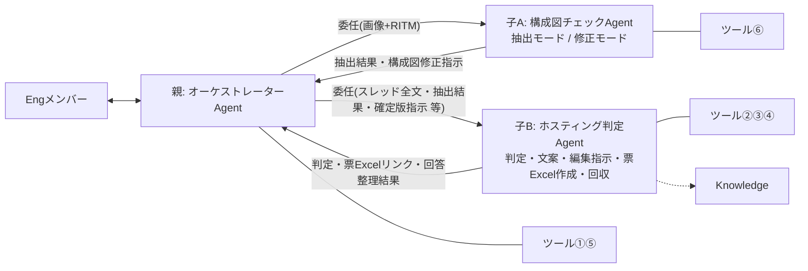
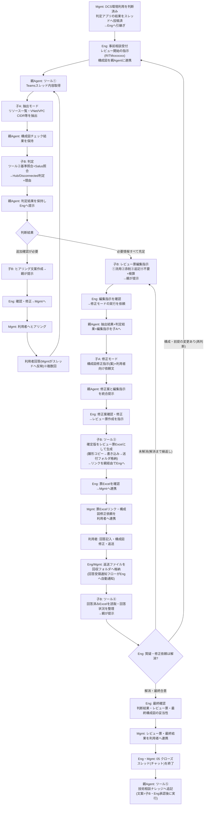

# アーキテクチャレビューAgent 設計書

| 項目 | 内容 |
|---|---|
| 版 | v3.3 |
| 更新日 | 2026-08-26 |
| v3.2からの変更 | ①**Excel直結方式を採用**: 案件レビュー票List【AI編集用】を**廃止**し、レビュー票の実体を「雛形から生成するExcelファイル」に一本化(ツール③改=票Excel作成/ツール④改=回答済みExcel読取) ②回答のList貼り付け作業を**廃止**(返送ファイルを回収フォルダへ置くだけ) ③(オプション)回答受領のTeams自動通知フローを追加 ④残る人間作業を「責任分界上必要な確認・対人連携のみ」に整理(§5) |
| 方針 | 本番を見据えたPoC。**人間の手間は「確認・承認・対人連携」だけに絞り、作業系はすべて自動化** |
| 構成 | 親: オーケストレーターAgent 1体+Connected agent 2体(子A: 構成図チェックAgent〈抽出/修正〉・子B: ホスティング判定Agent) |
| 実装先 | Copilot Studio(JP-IT-Int-PAD-Prod)。ツールはAgentFlow(GA)、親子連携はConnected Agents |

---

## 1. Agent構成と関連図

### Agent構成

| Agent | 役割 | ツール | Knowledge |
|---|---|---|---|
| **親: オーケストレーターAgent** | Engメンバーとの唯一の会話窓口。進行管理、子の呼出し、子Agent間のデータ連携(結果の保持・原文のままの受け渡し)、子の成果物をEngへ提示。**自分では判断・文案・票・指示を一切作成しない**。ツール①での取得・配布と、Eng承認後のツール⑤実行のみ | ①⑤ | なし |
| **子A: 構成図チェックAgent** | 【抽出モード】構成図(画像)から事実抽出+観点別チェック/【修正モード】抽出結果+判定結果+編集指示に基づく構成図修正指示(案)+利用者向け依頼文 | ⑥ | なし(※検討中) |
| **子B: ホスティング判定Agent** | (A)判定+Salus照合+ヒアリング文案 (B)レビュー票編集指示+検算 (C)**レビュー票Excelの作成**(確定版をツール③で直接生成) (D)**回答済みExcelの回収・整理**(ツール④) (E)ナレッジ登録文案 | ②③④ | Salus Status/技術相談ナレッジ(※検討中) |

### 関連図



### ツール一覧(実体はすべてAgentFlow・6本)

| # | ツール名 | 内容 | 持ち主 | 使う場面 | 状態 |
|---|---|---|---|---|---|
| ① | Teamsスレッド内容取得 | RITMでスレッド特定→親投稿・返信・添付一覧+対象CSPのアーキテクチャレビュー票【CSP統合】全文+CSP | 親 | レビュー開始時・再判断時に取得し、子へ配布 | **構築済み** |
| ② | ホスティング判定基準取得 | 判定基準md(全体基準+ノックアウト)を全文返却 | 判定Agent | 判定の冒頭 | **構築済み**(ファイル差し替え予定) |
| ③ | **レビュー票Excel作成** | 編集指示反映済みの確定版行データJSONを受領→雛形xlsxをコピー(`アーキテクチャレビュー票_RITMxxxxxxx.xlsx`・同名なら置換)→「表に行を追加」で書き込み→送付フォルダへ格納→リンク+件数返却 | 判定Agent | Eng確定後の票作成時 | 未(§6) |
| ④ | **回答済みレビュー票取得** | 回収フォルダからファイル名に該当RITMを含むxlsxを特定→「表内に存在する行を一覧表示」→回答込み全行をNo順で返却 | 判定Agent | 利用者回答の回収時 | 未(§6) |
| ⑤ | 技術相談ナレッジ追記 | ナレッジListへ「項目の作成」1件 | 親 | クローズ時・Eng承認後のみ親が実行(文案は判定Agent) | 未(List列構成待ち) |
| ⑥ | 構成図チェック観点取得 | 観点md(内訳付きヘッダー)を全文返却 | 構成図チェックAgent | 抽出モードの冒頭 | **構築済み**(ファイル差し替え予定) |

補助(オプション・Agentツールではない通常のクラウドフロー):

| フロー | 内容 | 効果 |
|---|---|---|
| 回答受領通知 | 回収フォルダの「ファイルが作成されたとき」トリガー→EngへTeamsメンション通知(RITM名入り) | 回答待ちの監視が不要になる(届いたら通知が来る) |

## 2. データ

| データ | 実体 | 用途 | 保守 | 備考 |
|---|---|---|---|---|
| アーキテクチャレビュー票【CSP統合】(ReviewSheet_templete) | SharePoint List(CSP統合・115行) | レビュー票のマスタ。ツール①が該当CSP行を全文取得→親経由で判定Agentへ渡り、編集指示(①〜④)の分母になる | 改版=行編集のみ | PoC期間中はMyList。本番運用時の格納先は別途検討 |
| **レビュー票Excel雛形.xlsx** | AI連携用フォルダ(ファイル名固定) | ツール③のコピー元。送付用の列だけのテーブル(テーブル名固定: T_レビュー票)+体裁・注意書き | 体裁変更=雛形差し替えのみ | **シート保護必須**(回答列のみ編集可)。利用者による構造破壊を防ぎ、ツール④の読取を保証する |
| **送付フォルダ** | SharePoint/OneDriveフォルダ | ツール③の出力先。`アーキテクチャレビュー票_RITMxxxxxxx.xlsx` が案件ごとに生成される | — | Mgmtはここのファイル(リンク)を利用者へ送るだけ |
| **回収フォルダ** | SharePoint/OneDriveフォルダ | 利用者から返送された回答済みExcelの置き場。ツール④がここから読取 | — | 返送ファイルはファイル名を大きく変えずに格納(④はRITM部分一致で特定するため「(回答済)」等の付加はOK)。回答受領通知フローの監視対象 |
| ホスティング判定基準.md | AI連携用フォルダ(ファイル名固定) | 判定Agentがツール②で全文取得し全行照合(RAG不使用) | 改版=ファイル差し替えのみ | 基準ID・版数・総行数を先頭に記載 |
| 構成図チェック観点.md | AI連携用フォルダ(ファイル名固定) | 構成図チェックAgentがツール⑥で全文取得し全件チェック | 改版=ファイル差し替え。増減時はヘッダー内訳も更新 | 内訳と実行数の不一致はAgentが警告 |
| 技術相談ナレッジList(マスタ維持) | SharePoint List | 参照=判定AgentのKnowledge(参考のみ)/追記=ツール⑤ | List直接管理 | 列構成の確認がツール⑤実装の前提 |
| Salus可否・Guardrails・TOM2024・AWS-PPA・Azure Independence | 01_Knowledgeのファイル群 | 判定AgentのKnowledge(判定根拠・Salus照合) | ファイル差し替え | AWS-PPAはAWS案件のみ、Azure IndependenceはAzure案件のみ。GCPはAWS/Azure同等扱い |

※**案件レビュー票List【AI編集用】は廃止**。レビュー記録はファイル(送付/回収フォルダ)として蓄積される。横断検索・分析が必要になったらPhase 2で「レビュー記録List」(ツール③の書込み先追加)を復活させる。

## 3. 全体ワークフロー



## 4. 人間に残る作業と理由(最小化後)

| 作業 | 担当 | 残す理由 |
|---|---|---|
| レビュー開始指示・構成図画像のアップ | Eng | 起点(Agentの自動Trigger不可の環境制約でもある) |
| 判定・文案・編集指示・修正案・票Excelの確認 | Eng | 責任分界(Agentはすべて案。確定は人) |
| 利用者・Mgmtとの対人連携(ヒアリング・送付・合意形成) | Mgmt | 対人コミュニケーションはAI非代替(方針) |
| 返送ファイルを回収フォルダへ置く | Eng/Mgmt | ファイル1つの移動のみ(通知フローが到着を自動通知) |
| 解消判定・最終確認・クローズ・ナレッジ登録承認 | Eng | 責任分界 |

※廃止された作業: RITMビューのフィルター・Excelエクスポート・列削除、回答のListへの貼り付け、案件Listの管理、送付ファイルの手動作成・命名。

## 5. 各AgentのInstructions(変更点のみ。全文はv3.2の4.1〜4.3を基に以下を差し替え)

### 親(4.1)の差し替え箇所

```text
# 案件レビュー票の作成(Engの「レビュー票を作成して」指示時のみ)
12. Engの確認・修正を反映した確定版の編集指示を、子Agent「ホスティング判定Agent」へ渡して票Excelの作成(ツール「レビュー票Excel作成」)を依頼する。
13. 判定Agentからの結果(書き込み件数と票Excelのリンク)をEngへ報告し、「Engが内容を確認→Mgmt経由で票Excelリンク・構成図修正依頼を利用者へ連携」の次アクションを案内する。

# 利用者回答の回収(Engの「回答を確認して」指示時のみ)
14. 子Agent「ホスティング判定Agent」へ回答の回収・整理を依頼し(RITM番号を渡す。判定Agentがツール「回答済みレビュー票取得」で回収フォルダから読取)、返ってきた整理結果を原文のまま提示する。解消の判断はEngが行う。
```

### 子B(4.3)の差し替え箇所

```text
# (C)票作成(→票Excel作成に変更)
9. 親から渡された確定版の編集指示に基づき、登録する行データ(①流用は原文、②は添削後全文、③追記行を追加。④不要は含めない)を組み立て、ツール「レビュー票Excel作成」を実行する(RITM番号+行データJSONを渡す)。
10. 返ってきた書き込み件数が編集指示の件数(①+②+③)と一致することを検算し、件数と票Excelのリンクを返す。

# (D)回答回収(→Excel読取に変更)
11. ツール「回答済みレビュー票取得」を実行し(RITM番号)、回収フォルダの回答済みExcelを正として、行ごとの回答状況(回答あり/なし/内容から再確認が必要と思われる点)を整理して返す。ファイルが見つからない場合は「回収フォルダに回答済みファイルがありません」と返す。解消の判断はEngが行う。

# モード一覧から(G)を削除(票作成に統合されたため)
```

### 子A(4.2)

変更なし(v3.2のまま)。

## 6. 実装メモ

### ツール③「レビュー票Excel作成」

- トリガー入力: `RITM番号`+`行データJSON`(確定版全行の配列)
- フロー: ①SharePoint「ファイルのコピー」で雛形を複製(名前 `アーキテクチャレビュー票_<RITM>.xlsx`、**同名時は置換**=未解消ループでの作り直しに対応)→ ②「JSONの解析」(スキーマ=雛形テーブルの列: No/環境/対応区分/カテゴリ/指摘概要/指摘内容/参考資料/回答欄…)→ ③Apply to each→Excel「表に行を追加」(テーブル=T_レビュー票)→ ④ファイルリンク+件数を応答
- 注意: コピー直後の行追加はファイルロックで失敗することがある→再試行ポリシー設定or遅延を挟む。JSON崩れ時は「作成失敗・件数0」を返す分岐

### ツール④「回答済みレビュー票取得」

- トリガー入力: `RITM番号`
- フロー: ①SharePoint「フォルダー内のファイルの一覧」(回収フォルダ)→ ②アレイのフィルター処理(ファイル名にRITM番号を含む・部分一致)→ ③0件なら「未回収」を応答/1件以上なら最新更新のファイルを選択→ ④Excel「表内に存在する行を一覧表示」(T_レビュー票)→ ⑤No順に整形して応答

### レビュー票Excel雛形の必須要件

1. 送付用の列だけのテーブル(テーブル名固定: `T_レビュー票`)。RITM・内部管理列は含めない
2. **シート保護**: 回答列(回答内容・回答者・回答日等)のみ編集可、他の列・構造はロック(ツール④の読取保証)
3. 表紙・注意書き(必要に応じて)。体裁は雛形側で完結させ、フローでは触らない

### (オプション)回答受領通知フロー

- トリガー: SharePoint「ファイルが作成されたとき」(回収フォルダ)
- アクション: Teams「チャットまたはチャネルでメッセージを投稿」(Eng宛メンション+ファイル名+リンク)
- ※Agentツールではない通常フロー。Agentは関与しない

## 7. 確認事項(残り)

| # | 内容 |
|---|---|
| 1 | Connected Agentsの環境可否・**画像が親→子Aへ渡るか**(最重要・ダミー検証30分) |
| 2 | 子の長文出力が要約されず親へ返るか/親が原文のまま受け渡せるか |
| 3 | **雛形Excelの列・体裁・シート保護範囲の確定**(利用者に見せる列/回答列の定義) |
| 4 | 送付フォルダ・回収フォルダの場所と権限(利用者へのリンク共有方法含む) |
| 5 | 技術相談ナレッジListの列構成(ツール⑤入力設計用) |
| 6 | 子A/子BのKnowledge要否(現状「※検討中」)の確定 |
| 7 | List・md・雛形・フォルダの共有サイトへの移設時期(PoC期間中はMyList/個人領域) |
