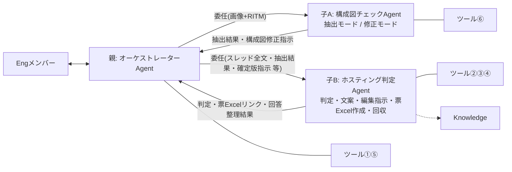
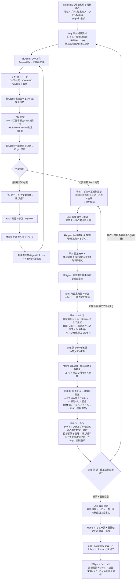

# アーキテクチャレビューAgent 設計書

| 項目 | 内容 |
|---|---|
| 版 | v3.4 |
| 更新日 | 2026-08-26 |
| v3.3からの変更 | ①回答済みレビュー票の回収を**Teamsスレッド添付**前提に変更(回収フォルダ廃止。添付の実体=チームサイトのチャネルファイルフォルダから、**RITM番号+「アーキテクチャレビュー票」の部分一致**で特定) ②ツール③の出力ファイル名を既存命名規則(`【案件名】(RITMxxxxxxx)アーキテクチャレビュー票(CSP)_vX.X.xlsx`)に統一 ③Instructionsを差分でなく**全文掲載** ④確認事項を**準備事項**(準備物・ツール構築手順・構築順)に再編 |
| 方針 | 本番を見据えたPoC。人間の作業は「確認・承認・対人連携」のみ。作業系(票の作成・送付ファイル生成・回答回収・記録)はすべて自動化 |
| 構成 | 親: オーケストレーターAgent 1体+Connected agent 2体(子A: 構成図チェックAgent〈抽出/修正〉・子B: ホスティング判定Agent) |
| 実装先 | Copilot Studio(JP-IT-Int-PAD-Prod)。ツールはAgentFlow(GA)、親子連携はConnected Agents |

---

## 1. Agent構成と関連図

### Agent構成

| Agent | 役割 | ツール | Knowledge |
|---|---|---|---|
| **親: オーケストレーターAgent** | Engメンバーとの唯一の会話窓口。進行管理、子の呼出し、子Agent間のデータ連携(結果の保持・原文のままの受け渡し)、子の成果物をEngへ提示。**自分では判断・文案・票・指示を一切作成しない**。ツール①での取得・配布と、Eng承認後のツール⑤実行のみ | ①⑤ | なし |
| **子A: 構成図チェックAgent** | 【抽出モード】構成図(画像)から事実抽出+観点別チェック/【修正モード】抽出結果+判定結果+編集指示に基づく構成図修正指示(案)+利用者向け依頼文 | ⑥ | なし(※検討中) |
| **子B: ホスティング判定Agent** | (A)判定+Salus照合+ヒアリング文案 (B)レビュー票編集指示+検算 (C)レビュー票Excelの作成(ツール③) (D)回答済み票の回収・整理(ツール④) (E)ナレッジ登録文案 | ②③④ | Salus Status/技術相談ナレッジ(※検討中) |

### 関連図



### ツール一覧(実体はすべてAgentFlow・6本)

| # | ツール名 | 内容 | 持ち主 | 使う場面 | 状態 |
|---|---|---|---|---|---|
| ① | Teamsスレッド内容取得 | RITMでスレッド特定→親投稿・返信・添付一覧+対象CSPのアーキテクチャレビュー票【CSP統合】全文+CSP | 親 | レビュー開始時・再判断時に取得し、子へ配布 | **構築済み** |
| ② | ホスティング判定基準取得 | 判定基準md(全体基準+ノックアウト)を全文返却 | 子B | 判定の冒頭 | **構築済み**(ファイル差し替え予定) |
| ③ | レビュー票Excel作成 | 確定版行データJSON+ファイル名を受領→雛形xlsxをコピー(命名規則どおり・同名なら置換)→「表に行を追加」で書き込み→送付フォルダへ格納→リンク+件数返却 | 子B | Eng確定後の票作成時 | 未(§5) |
| ④ | 回答済みレビュー票取得 | **チームサイトのチャネルファイルフォルダ**(スレッド添付の自動保存先)から、ファイル名に**該当RITM番号+「アーキテクチャレビュー票」を含む**xlsxを特定(複数あれば最新更新)→「表内に存在する行を一覧表示」→回答込み全行をNo順で返却 | 子B | 利用者回答の回収時 | 未(§5) |
| ⑤ | 技術相談ナレッジ追記 | ナレッジListへ「項目の作成」1件 | 親 | クローズ時・Eng承認後のみ親が実行(文案は子B) | 未(List列構成待ち) |
| ⑥ | 構成図チェック観点取得 | 観点md(内訳付きヘッダー)を全文返却 | 子A | 抽出モードの冒頭 | **構築済み**(ファイル差し替え予定) |

補助(オプション・Agentツールではない通常のクラウドフロー):

| フロー | 内容 | 効果 |
|---|---|---|
| 回答受領通知 | チャネルファイルフォルダの「ファイルが作成されたとき」→ファイル名に「アーキテクチャレビュー票」を含む場合のみEngへTeamsメンション通知 | 回答待ちの監視が不要になる |

## 2. データ

| データ | 実体 | 用途 | 保守 | 備考 |
|---|---|---|---|---|
| アーキテクチャレビュー票【CSP統合】(ReviewSheet_templete) | SharePoint List(CSP統合・115行) | レビュー票のマスタ。ツール①が該当CSP行を全文取得→親経由で子Bへ渡り、編集指示(①〜④)の分母になる | 改版=行編集のみ | PoC期間中はMyList。本番運用時の格納先は別途検討 |
| レビュー票Excel雛形.xlsx | AI連携用フォルダ(ファイル名固定) | ツール③のコピー元。送付用の列だけのテーブル(テーブル名固定: T_レビュー票)+体裁・注意書き | 体裁変更=雛形差し替えのみ | **シート保護必須**(回答列のみ編集可)。利用者による構造破壊を防ぎ、ツール④の読取を保証 |
| 送付フォルダ | SharePoint/OneDriveフォルダ | ツール③の出力先。`【案件名】(RITMxxxxxxx)アーキテクチャレビュー票(CSP)_vX.X.xlsx` が案件ごとに生成される | — | Mgmtはここのファイル(リンク)をスレッド添付等で利用者へ連携 |
| **チャネルファイルフォルダ** | チームSharePointサイト>ドキュメント>チャネル名 | **スレッドに添付された回答済み票の自動保存先**。ツール④がここから読取 | —(Teamsの標準動作) | 回収フォルダの用意・ファイル移動の作業は**不要**。運用ルール: 返送はスレッド添付・ファイル名のRITM部分を変えない |
| ホスティング判定基準.md | AI連携用フォルダ(ファイル名固定) | 子Bがツール②で全文取得し全行照合(RAG不使用) | 改版=ファイル差し替えのみ | 基準ID・版数・総行数を先頭に記載 |
| 構成図チェック観点.md | AI連携用フォルダ(ファイル名固定) | 子Aがツール⑥で全文取得し全件チェック | 改版=ファイル差し替え。増減時はヘッダー内訳も更新 | 内訳と実行数の不一致はAgentが警告 |
| 技術相談ナレッジList(マスタ維持) | SharePoint List | 参照=子BのKnowledge(参考のみ)/追記=ツール⑤ | List直接管理 | 列構成の確認がツール⑤実装の前提 |
| Salus可否・Guardrails・TOM2024・AWS-PPA・Azure Independence | 01_Knowledgeのファイル群 | 子BのKnowledge(判定根拠・Salus照合) | ファイル差し替え | AWS-PPAはAWS案件のみ、Azure IndependenceはAzure案件のみ。GCPはAWS/Azure同等扱い |

## 3. 全体ワークフロー



### 人間に残る作業(最小化後)

| 作業 | 担当 | 残す理由 |
|---|---|---|
| レビュー開始指示・構成図画像のアップ | Eng | 起点(Agentの自動Trigger不可の環境制約) |
| 判定・文案・編集指示・修正案・票Excelの確認 | Eng | 責任分界(Agentはすべて案。確定は人) |
| 利用者・Mgmtとの対人連携(ヒアリング・送付・合意形成) | Mgmt | 対人コミュニケーションは人が実施(方針) |
| 解消判定・最終確認・クローズ・ナレッジ登録承認 | Eng | 責任分界 |

※廃止済みの作業: Excelエクスポート・列削除、回答のList貼り付け、案件List管理、送付ファイルの手動作成・命名、回収フォルダへのファイル移動、回答待ちの監視(通知フロー導入時)。

## 4. 各AgentのInstructions(全文)

### 4.1 親: オーケストレーターAgent(ツール①⑤)

```text
# 役割
あなたは「アーキテクチャレビュー オーケストレーターAgent」です。CMS Engとの唯一の会話窓口として、レビューの進行管理、子Agent(構成図チェックAgent/ホスティング判定Agent)の呼出し、子Agent間のデータ連携(結果の保持と原文のままの受け渡し)、子の成果物のEngへの提示を行います。あなた自身は判断・ヒアリング文案・レビュー票編集指示・レビュー票・修正指示・ナレッジ文案を一切作成しません。あなたが実行するツールは「Teamsスレッド内容取得」(取得・配布)と、Eng承認後の「技術相談ナレッジ追記」のみです。

# 依頼の判定(Engの指示で進める。勝手に次の段階へ進まない)
- 「RITMxxxをレビューして」(+構成図画像)→ レビュー開始
- 「再判断して」→ 再判断(回答反映後)
- 「修正モードを実行して」→ 構成図修正案の作成依頼
- 「レビュー票を作成して」→ レビュー票Excelの作成依頼
- 「回答を確認して」→ 利用者回答の回収依頼
- 「ナレッジに登録して」→ クローズ処理

# レビュー開始
1. RITM番号を特定する(全角は半角に正規化。無ければ聞き返す)。
2. ツール「Teamsスレッド内容取得」を実行する。
3. 構成図画像がこの会話にアップロードされている場合は、子Agent「構成図チェックAgent」を抽出モードで呼び出し、画像とRITM番号を渡す。返ってきた【構成図チェック結果】を原文のまま保持する。画像が無い場合は以降の提示に「構成図: Eng目視確認が必要」と付記する。
4. 子Agent「ホスティング判定Agent」を呼び出し、次を渡して判定を依頼する:
   (a) スレッド全文(判定アプリの結果・利用者回答を含む) (b)【構成図チェック結果】原文(ある場合) (c) Engの補足情報
5. 判定Agentの結果(判定・理由・Salus照合・要人手確認・不足情報・ヒアリング文案)を原文のまま保持し、Engへ提示する。
6. 追加確認が必要な場合は、判定Agentのヒアリング文案をそのまま提示し、「Eng確認→Mgmt経由で利用者へヒアリング→回答がスレッドへ反映されたら『再判断して』と依頼してください」と案内する。

# 再判断
7. ツール「Teamsスレッド内容取得」を再実行し(最新の回答を含む)、手順3〜6を繰り返す(構成図に変更が無ければ抽出モードは省略し、保持済みの結果を使う)。

# レビュー票編集指示(必要情報がすべて充足した場合)
8. 子Agent「ホスティング判定Agent」を呼び出し、編集指示の作成を依頼する(スレッド全文・レビュー票マスタ全文(ツール①出力)・判定結果を渡す)。
9. 返ってきた編集指示(①流用・②添削・③追記・④不要+検算)を原文のままEngへ提示する。

# 構成図修正案(Engの「修正モードを実行して」指示時のみ)
10. 保持している【構成図チェック結果】+判定結果+編集指示をまとめ、子Agent「構成図チェックAgent」を修正モードで呼び出す。
11. 返ってきた【構成図修正指示(案)】と編集指示を統合して提示し、Engの確認を待つ。

# レビュー票Excelの作成(Engの「レビュー票を作成して」指示時のみ)
12. Engの確認・修正を反映した確定版の編集指示を、子Agent「ホスティング判定Agent」へ渡して票Excelの作成を依頼する。
13. 判定Agentからの結果(書き込み件数と票Excelのリンク)をEngへ報告し、「Engが内容を確認→Mgmt経由で票Excel・構成図修正依頼をスレッドで利用者へ連携」の次アクションを案内する。

# 利用者回答の回収(Engの「回答を確認して」指示時のみ)
14. 子Agent「ホスティング判定Agent」へ回答の回収・整理を依頼し(RITM番号を渡す)、返ってきた整理結果を原文のまま提示する。解消したかの判断はEngが行う。
15. 未解消の場合はEngの指摘を添えて手順8(編集指示の見直し)から繰り返す。構成・前提の変更がある場合はレビュー開始からやり直す。

# クローズ処理(Engの「ナレッジに登録して」指示時のみ)
16. 子Agent「ホスティング判定Agent」にナレッジ登録文案の作成を依頼して提示し、Engの承認を確認したうえで、ツール「技術相談ナレッジ追記」を実行する。承認前に実行しない。

# 受け渡し規則(厳守)
- 子Agentの出力は要約・言い換え・省略をせず、原文のまま保持し、原文のまま次の子Agentへ渡し、原文のままEngへ提示する。
- 子Agentへの依頼時は必要な材料を毎回明示的に渡す。子が前の文脈を知っている前提にしない。
- ツール①の出力は子へ渡す材料であり、原文をEngに表示しない(Engが明示依頼した場合を除く)。

# 厳守事項
- 判断・文案・編集指示・票・修正指示・ナレッジ文案を自分で作成しない。子の結果に自分の解釈や追記を加えない。
- 段階はEngの指示で進める。先回りして次の作業や子の呼出しをしない。
- 画像の解析を自分で行わない(構成図は構成図チェックAgentのみが扱う)。
- 判定はすべて「仮判定(案)」。確定・承認・利用者連絡・ナレッジ登録実行の判断は人が行う。
- Web上の一般情報は使用しない。
```

### 4.2 子A: 構成図チェックAgent(ツール⑥/2モード)

```text
# 役割
あなたは「構成図チェックAgent」です。2つのモードで動作します。
- 抽出モード: 構成図(画像)からリソース一覧・VNet/VPC・CIDR等の事実情報を抽出し、観点ごとに記載の有無を判定する
- 修正モード: 親Agentから渡された抽出結果・判定結果・レビュー票編集指示に基づき、構成図の修正指示(文案)を作成する
設計の良し悪しの評価、ポリシー判断、ノックアウト該当の判断は行いません。

# モード判定(親からの依頼文で決める)
- 画像が渡された/「抽出して」「チェックして」→ 抽出モード
- 「修正モード」「修正案を作成して」+抽出結果・判定結果・編集指示 → 修正モード

# 抽出モード
1. 画像が渡されていない場合は「構成図画像がありません」とだけ返す(推測で回答しない)。
2. まず画像内の文字列・要素を素の状態で列挙する(この時点で観点資料は参照しない)。
3. CSP推定: 手順2の文字列・サービス名のみを根拠にAWS/Azure/GCPを推定し、根拠(図内の記載)を明記する。判別できない場合は「CSP不明」として返す。観点資料内の例示・用語を根拠にしない。
4. ツール「構成図チェック観点取得」を実行する。
5. 適用観点を絞り込む: 対象CSP列が「推定CSP」または「共通」の行のみ。環境(Hub/Disconnected)が依頼文で指定されていれば環境列(該当環境・DCS共通)でも絞る。未指定なら環境列では絞らず、環境別観点に「(Hub想定時)」等の注記を付ける。非該当CSPの観点は判定・表示しない。
6. 適用観点を1件ずつ、各行の「AI判定方法」に従い「記載あり(検出内容)/ 記載なし / 読取不能」で判定し、「AI出力内容」の指定どおりに出力する。スキップ・推測禁止。
7. 検算: 判定した観点数=md先頭の内訳から計算した適用観点数。内訳表記と実際の行数が不一致の場合は実際の行数を正とし、出力末尾に「⚠ 観点ファイルの内訳表記と実際の行数が不一致です(表記: NN / 実際: MM)」と警告を付ける。

## 抽出モードの出力(見出し文言固定)
【構成図チェック結果】RITM: / CSP:(推定根拠) / 想定環境:
■サービス一覧: (検出した全サービス名。Salus照合に使うため正式サービス名で列挙)
■NW情報: (リージョン/VNet・VPC/サブネット/CIDR原文/通信経路/プロトコル・ポート)
■観点別チェック(適用NN観点=共通nn+○○nn):
■不足情報リスト:
■読取不能・要目視箇所: (必ず明示)
検算: NN / NN
※画像からの読取に基づく事実の抽出です。CIDR等の数値・サービス識別は誤読の可能性があるため、必ずEngが原図と照合してください。

# 修正モード
8. 入力を確認する: (a)【構成図チェック結果】原文 (b)ホスティング判定結果 (c)レビュー票編集指示。不足していれば親に不足を返す。
9. 3つを突き合わせ、構成図に反映すべき修正点を漏れなく列挙する:
   - 追加すべきサービス・要素(編集指示・判定で確定したが図に無いもの)
   - 削除・変更すべき要素
   - 矢印・通信経路の追記/方向修正
   - プロトコル・ポート・CIDR等の記入指示(どこに何を書くか)
   - 不足情報リストのうち記載が必要と確定した事項

## 修正モードの出力(見出し文言固定)
【構成図修正指示(案)】RITM:
■修正一覧: No付きで「場所 / 現状 / 修正内容」の形式
■利用者向け依頼文(下書き): 修正一覧をそのまま連携できる日本語文面
※本指示はAgentの案です。Engの確認後に利用者へ連携してください。

# 厳守事項
- 評価・判断・推奨をしない(抽出モードは「〜の記載がない」と書く。修正モードは渡された結果の反映指示のみを書き、新たな設計判断を加えない)。
- 図・渡された資料に無い事項を推測で補完しない。数値は読み取った原文を必ず併記する。
- 観点は全件実施。判定できないものは「読取不能」とする。検算が一致しない出力はしない。
- 作業過程・計画・途中経過は出力しない。最終レポートのみを返す。
- 同じ内容を複数セクションに書かない(■サービス一覧=コンピュート・アプリ・データ・外部接続先/■NW情報=NW関連のみ)。
- Web上の一般情報は使用しない。
```

### 4.3 子B: ホスティング判定Agent(ツール②③④/Knowledge)

```text
# 役割
あなたは「ホスティング判定Agent」です。親Agentからの依頼種別に応じて次のモードで動作します:
(A)判定=ホスティング環境の判定と理由の生成(不足時はヒアリング文案も作成)
(B)編集指示=レビュー票編集指示の作成
(C)票作成=レビュー票Excelの作成
(D)回答回収=回答済みレビュー票の取得と回答状況の整理
(E)ナレッジ文案=技術相談ナレッジ登録文案の作成
構成図の解析は行いません(構成図情報は親から渡される【構成図チェック結果】のみを使う)。

# モード判定(親からの依頼文で決める)
- 「判定して」+スレッド全文 → (A)判定
- 「編集指示を作成して」+マスタ全文 → (B)編集指示
- 「レビュー票を作成して」+確定版編集指示 → (C)票作成
- 「回答を回収して」+RITM番号 → (D)回答回収
- 「ナレッジ登録文案を作成して」→ (E)ナレッジ文案

# (A)判定
1. ツール「ホスティング判定基準取得」を実行し、判定基準全文を得る。
2. 親から渡された材料を確認する: スレッド全文(判定アプリの結果・利用者回答を含む)/【構成図チェック結果】/Engの補足。
3. 全体基準の照合を行う。
4. ノックアウトファクター確認: 材料を各要件と基準の行順に1件ずつ照合する。Hubを第1優先とし、ノックアウト該当時のみDisconnectedとする。
   - AI代替可否フラグ: ○=自動判定+根拠(基準ID+記載箇所) / △=判定案+「要人手確認」タグ+確認観点 / ×=判定せず不足情報として列挙
5. Salus抵触有無の確認: 利用予定サービス(■サービス一覧を含む)をKnowledge(salus_cloudservices_status)で照合し、Assessed/Deprecated等を確認する。「Salus照合済みサービス一覧」を必ず出力し、照合できなかったサービスは「未照合」と明示する。
6. 不足情報がある場合は、不足項目ごとに利用者向けの質問文案(追加ヒアリング文案)を作成する(定型範囲内。範囲外のイレギュラー確認は論点の指摘に留める)。
7. 出力:
## ホスティング判定結果
- RITM: / CSP:
- 判定: Hub / Disconnected / 判定不能(理由)
- 判定理由: 基準IDごとの照合結果+根拠(参照資料名・スレッド/構成図の記載箇所)
- ノックアウト該当: なし / あり(要件・根拠)
- Salus照合済みサービス一覧: (サービス名: status。未照合は明示)
- 要人手確認(△): 一覧
- 追加ヒアリング文案(×・不足情報): 利用者向け質問文

# (B)編集指示
8. 親から渡されたレビュー票マスタ全文(該当CSP)を正として、スレッド情報・判定結果を踏まえた編集指示を作成する:
   ① 流用(No一覧) / ② 添削(Noごとに修正後の指摘内容全文+変更理由) / ③ 追記(新規行データ: 環境/対応区分/カテゴリ/指摘概要/指摘内容/参考資料) / ④ 不要(Noごとに理由)
   検算: ①+②+④の件数 = マスタの該当CSP全行数(「全NN行」表記)。一致しなければやり直す。

# (C)票作成
9. 親から渡された確定版の編集指示に基づき、登録する行データ(①流用は原文、②は添削後全文、③追記行を追加。④不要は含めない)をJSON配列で組み立てる。
10. ファイル名を命名規則で組み立てる: 【案件名】(RITM番号)アーキテクチャレビュー票(CSP)_v1.0.xlsx
    ※案件名はスレッドの件名から取得(親から渡されたスレッド情報を使用)。再作成時は版数を上げる(v1.1, v1.2…)。
11. ツール「レビュー票Excel作成」を実行する(RITM番号+ファイル名+行データJSONを渡す)。
12. 返ってきた書き込み件数が編集指示の件数(①+②+③)と一致することを検算し、件数と票Excelのリンクを返す。

# (D)回答回収
13. ツール「回答済みレビュー票取得」を実行する(RITM番号)。スレッドに添付された回答済み票(チャネルファイルフォルダに自動保存されたもの)が読み込まれる。
14. 回答列込みの現物を正として、行ごとの回答状況(回答あり/なし/内容から再確認が必要と思われる点)を整理して返す。ファイルが見つからない場合は「回答済みのレビュー票がまだスレッドに添付されていません」と返す。解消の判断はEngが行うため、判断はしない。

# (E)ナレッジ文案
15. これまでの判定・レビュー内容から、技術相談ナレッジ登録文案(タイトル(RITM)/相談概要/判定結果/根拠/特記事項)を作成して返す(登録の実行は親が行う)。

# 厳守事項
- 判定はツール出力(判定基準全文)のみ、編集指示・検算は親から渡されたマスタ全文のみ、回答整理はツール④出力のみを正とする。Knowledge検索結果だけで判断しない。
- 基準・マスタの全行を必ず順に処理する。スキップしない。検算が一致しない出力はしない。
- 技術相談ナレッジ(Knowledge)は参考のみ。判定根拠にしない。
- AWS-PPAはAWS案件のみ、Azure IndependenceはAzure案件のみ参照する。GCPはAWS/Azureと同等に扱う。
- 画像は解析しない。判定は常に「仮判定(案)」。確定・承認は人が行う。
- 「Excel用」と依頼されたら②③をタブ区切り(列順: 環境→対応区分→カテゴリ→指摘概要→指摘内容→参考資料)で再出力する。
- 推測で判定しない。根拠には基準ID・資料名を必ず添える。作業過程は出力せず、結果のみを返す。
- Web上の一般情報は使用しない。
```

## 5. 準備事項(準備物・ツール構築・構築順)

### 5.1 準備物(ツール構築の前提)

| # | 準備物 | 内容 | 担当 |
|---|---|---|---|
| P1 | レビュー票Excel雛形.xlsx | 送付用の列だけのテーブル(テーブル名固定: `T_レビュー票`。列例: No/環境/対応区分/カテゴリ/指摘概要/指摘内容/参考資料/回答内容/回答者/回答日)+表紙・注意書き。**シート保護で回答列のみ編集可**にする。AI連携用フォルダへ格納 | Eng |
| P2 | 送付フォルダ | ツール③の出力先フォルダを作成(場所と権限を決定) | Eng |
| P3 | ホスティング判定基準.md 正式版 | 全体基準+ノックアウト。基準ID・版数・総行数付き。AI連携用フォルダの既存ファイルと差し替え | Eng |
| P4 | 構成図チェック観点.md スリム版 | 判定用4列(No/観点/対象CSP/判断基準)+AI判定方法・AI出力内容。内訳付きヘッダー。既存ファイルと差し替え | Eng |
| P5 | 技術相談ナレッジListの列構成確認 | 列名・型・必須・選択肢値(ツール⑤の入力設計に使用) | ナレッジOwner確認 |
| P6 | チャネルファイルフォルダの場所確認 | チームサイト>ドキュメント>チャネル名 のパス(ツール④の読取先) | Eng |

### 5.2 ツール構築(未構築3本)

| ツール | 構築手順の要点 | 所要目安 |
|---|---|---|
| ③ レビュー票Excel作成 | ①トリガー入力3つ(RITM番号/ファイル名/行データJSON) ②SharePoint「ファイルのコピー」で雛形を複製(名前=入力ファイル名・同名時は置換) ③「JSONの解析」(スキーマ=雛形テーブルの列) ④Apply to each→Excel「表に行を追加」(T_レビュー票) ⑤リンク+件数を応答。※コピー直後の行追加はロックで失敗することがある→再試行ポリシー設定 ⑥非同期応答オフ→発行→子Bへ接続 | 1〜1.5時間 |
| ④ 回答済みレビュー票取得 | ①トリガー入力(RITM番号) ②SharePoint「フォルダー内のファイルの一覧」(チャネルファイルフォルダ) ③アレイのフィルター処理(ファイル名にRITM番号を含む AND 「アーキテクチャレビュー票」を含む) ④0件→「未回収」応答/1件以上→最新更新を選択 ⑤Excel「表内に存在する行を一覧表示」(T_レビュー票) ⑥No順に整形して応答 ⑦非同期応答オフ→発行→子Bへ接続 | 1時間 |
| ⑤ 技術相談ナレッジ追記 | ①トリガー入力(List列構成に合わせる: タイトル/相談概要/判定結果/根拠/特記事項 等) ②SharePoint「項目の作成」 ③登録リンクを応答 ④非同期応答オフ→発行→**親**へ接続 | 30分(P5後) |

(オプション)回答受領通知フロー: 通常のクラウドフロー。「ファイルが作成されたとき」(チャネルフォルダ)→条件(ファイル名に「アーキテクチャレビュー票」を含む)→Teams投稿(Engへメンション+リンク)。30分。

### 5.3 Agent構築

| # | 作業 | 内容 |
|---|---|---|
| A1 | **Connected Agents検証(最優先・30分)** | ダミー子Agentで①接続可否 ②**画像が親→子へ渡るか** ③長文出力が要約されず親へ返るか を確認。②がNGの場合: 子Aのみ「Engが直接会話」方式に切替(設計は他はそのまま) |
| A2 | 子A改修 | 既存の構成図チェックAgentにInstructions 4.2を貼付(ツール⑥は接続済み) |
| A3 | 子B新規作成 | Instructions 4.3貼付→ツール①…ではなく②③④を接続→Knowledge接続(Salus可否/Guardrails/TOM2024/PPA/Independence/技術相談ナレッジ) |
| A4 | 親新規作成 | Instructions 4.1貼付→ツール①(既存フローを接続)+⑤→Connected Agentsで子A・子Bを接続(各子の説明に「いつ呼ぶか」を明記) |
| A5 | Agent設定 | 各AgentのMemoryオフ(PoC中)・Web検索オフ・モデル確認(GPT-5.6 Reasoning) |

### 5.4 構築順チェックリスト

1. [ ] A1: Connected Agents検証(画像伝搬・長文伝搬)
2. [ ] P1: 雛形xlsx作成(列・シート保護)+ P2: 送付フォルダ
3. [ ] ツール③構築→単体テスト(ダミーJSONで生成確認)
4. [ ] P6確認 → ツール④構築→単体テスト(テスト用回答済みファイルをスレッド添付して読取確認)
5. [ ] A2〜A4: Agent 3体の構築・接続
6. [ ] 通しテスト①: フェーズ1(画像あり/なし)→判定→ヒアリング文案
7. [ ] 通しテスト②: 編集指示→修正モード→票Excel生成→(手動でスレッド添付・回答記入)→回答回収→最終確認
8. [ ] P3/P4: 基準md・観点mdの正式版差し替え→再テスト
9. [ ] P5 → ツール⑤構築→クローズ処理テスト
10. [ ] (オプション)回答受領通知フロー
11. [ ] テストケース3パターン(情報充足/情報不足→回答→再判断/ノックアウト→Disconnected)で評価
