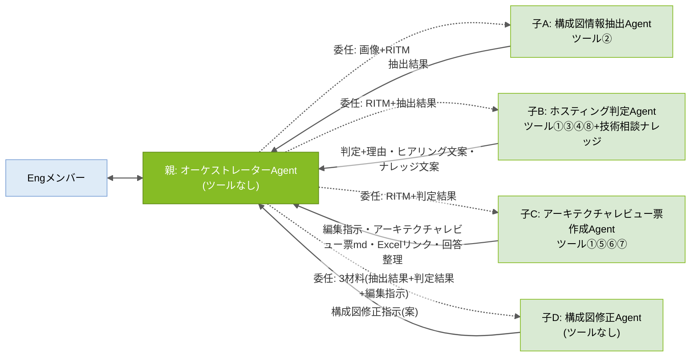

# アーキテクチャレビューAgent 設計書


## 0. 設計方針

### 設計原則(5か条)

| # | 原則 | 内容 |
|---|---|---|
| 1 | 親は連携専任 | 親Agentはツールを持たず、判断・作成をしない。窓口・進行管理・子Agent間のデータ連携(原文のままの受け渡し)のみ |
| 2 | 1Agent=1責務 | 構成図情報抽出(子A)/ホスティング判定(子B)/アーキテクチャレビュー票作成(子C)/構成図修正案(子D)を分離し、モード判定ミスを構造的に排除 |
| 3 | 全件照合はツールで全文渡し | 判定基準・照合資料・アーキテクチャレビュー票マスタ・観点など「全行を漏れなくチェックする資料」はKnowledge(RAG=関連断片だけを検索して渡す仕組み)に載せず、ツールで全文を渡す。Knowledgeは断片検索で足りる「過去案件の参考提示」のみ |
| 4 | 人の承認ゲート | Agentの出力はすべて「案」。確定・承認・利用者連絡・ナレッジ登録実行の判断は人(Eng/Mgmt)が行う |
| 5 | 共通ルールは単一ソース | 検算ルール(R1〜R3)と共通厳守事項(C1〜C6)は本設計書§1を正とし、各AgentのInstructionsには同一の共通ブロックを貼付する。改訂時は§1を更新→全Agentへ貼り直し |

### DRY原則レビュー(2026/08/28)への対応方針

| ID | 課題 | 対応 | 理由 |
|---|---|---|---|
| 1 | 同じスレッドを子B・子Cが別々に取得している | **意図的に許容**(対応しない) | 親ツールレス方針の維持。当事者が自ら取得することで①親経由の長文受け渡しによる欠落・劣化を排除 ②実行のたびに最新スレッド(利用者回答含む)を読める。**再検討条件**: PoCで応答時間・フロー実行数に問題を感じた場合、親への①集約を再検討 |
| 2 | CSP判定を複数Agentが行っている(①のスレッド判定+子Aの画像推定) | **意図的に許容**(対応しない) | 出所の異なる2判定(スレッド記載/構成図記載)を親が突き合わせ、不一致時にEngへ確認する**安全弁**として機能させるため。再検討条件はID1と同じ |
| 3 | 「全件チェック」の検算ルールがバラバラ | **一本化**: §1.1の検算ルールR1〜R3に集約し、各AgentはIDで参照 | 保守性・初見の可読性向上 |
| 4 | 同じ禁止事項を4回書いている | **共通化**: §1.2の共通厳守事項C1〜C6に集約し、全Agent共通ブロック(§1.3)として貼付 | 同上(Instructionsの共通部品化) |

## 1. 共通ルール(単一ソース。改訂時はここを更新→全Agentへ貼り直し)

### 1.1 検算ルール(R1〜R3)

「検算」とは、**AIが処理を途中で飛ばしていないかを件数の突き合わせで機械的に確認する仕組み**。数える対象がルールごとに異なる。

| ID | 名称 | 実施者 | 何と何を突き合わせるか | 何のための確認か | 不一致時の動作 |
|---|---|---|---|---|---|
| **R1** | 構成図チェック観点の実施漏れ確認 | 子A | 実際に判定した観点の件数 ⇔ 観点mdの内訳から算出した「チェックすべき観点の件数」(共通観点+該当CSP観点) | 構成図チェックの観点をAIが飛ばしていないか | 出力せずにやり直す。md内訳表記と実際の行数が食い違う場合は実際の行数を正とし、警告(⚠ファイル内訳の更新漏れ)を付けて出力 |
| **R2** | アーキテクチャレビュー票の標準指摘の仕分け漏れ確認 | 子C | ①流用+②添削+④不要 の合計件数 ⇔ アーキテクチャレビュー票mdの全行数(md先頭の「全NN行」) | マスタのどこかの行が検討されずに漏れていないか(※③追記は新規行のため分母に含めない) | 出力せずにやり直す |
| **R3** | アーキテクチャレビュー票Excelへの転記漏れ確認 | 子C | ツール⑥が返した書き込み件数 ⇔ アーキテクチャレビュー票に載せるべき行数(①流用+②添削+③追記の合計) | Excelへの転記に失敗した行がないか | Engへ報告する(フロー側の失敗のため) |

### 1.2 共通厳守事項(C1〜C6)

| ID | 内容 |
|---|---|
| **C1** | すべての出力は「案(仮判定・下書き)」である。確定・承認・利用者への連絡・ナレッジ登録の実行判断は人(Eng/Mgmt)が行う |
| **C2** | 推測しない。渡された材料・ツール出力に無い事項を補完しない。判断・指摘には根拠(基準ID・資料名・記載箇所)を必ず添える |
| **C3** | 全件処理する。照合・仕分け対象の全行を順に処理し、スキップしない。該当する検算ルール(R1〜R3)を実施し、不一致のまま出力しない |
| **C4** | 自分の役割の外に出ない。役割定義外の判断・作成を行わない。画像の解析は子Aのみが行う |
| **C5** | 作業過程・計画・途中経過・ツール出力の原文はチャットに出力しない。最終成果物のみを返す(Engが原文を明示依頼した場合を除く) |
| **C6** | Web上の一般情報は使用しない |

### 1.3 共通ブロック(全AgentのInstructions末尾にこのまま貼付)

```text
# 共通厳守事項(全Agent共通・設計書§1が正)
- C1: すべての出力は「案(仮判定・下書き)」。確定・承認・利用者連絡・ナレッジ登録実行の判断は人(Eng/Mgmt)が行う。
- C2: 推測しない。渡された材料・ツール出力に無い事項を補完しない。判断・指摘には根拠(基準ID・資料名・記載箇所)を必ず添える。
- C3: 全件処理する。照合・仕分け対象の全行を順に処理し、スキップしない。該当する検算ルール(R1〜R3)を実施し、不一致のまま出力しない。
- C4: 自分の役割の外に出ない。役割定義外の判断・作成を行わない。画像の解析は構成図情報抽出Agentのみが行う。
- C5: 作業過程・途中経過・ツール出力の原文は出力しない。最終成果物のみを返す(Engが明示依頼した場合を除く)。
- C6: Web上の一般情報は使用しない。
```

## 2. Agent構成と関連図

### Agent構成(親1+子4)

| Agent | 役割 | ツール | Knowledge |
|---|---|---|---|
| **親: オーケストレーターAgent** | Engとの唯一の会話窓口。進行管理、子の呼出し、子Agent間のデータ連携(結果の保持・原文のままの受け渡し)、子の成果物をEngへ提示、クローズ時の承認ゲート | なし | なし |
| **子A: 構成図情報抽出Agent** | 構成図(画像)から事実抽出+観点別チェック(検算R1) | ② | なし |
| **子B: ホスティング判定Agent** | スレッド取得→ノックアウト要件照合+Salus照合+サービス検証状況照合→Hub/Disconnected判定+理由。不足時はヒアリング文案。クローズ時はナレッジ文案作成・(承認後)登録実行 | ①③④⑧ | 技術相談ナレッジ(参考のみ) |
| **子C: アーキテクチャレビュー票作成Agent** | スレッド取得→編集指示(検算R2)→アーキテクチャレビュー票md作成→送付用Excel生成(検算R3)→回答回収・整理 | ①⑤⑥⑦ | なし |
| **子D: 構成図修正Agent** | 3つの材料(子Aの抽出結果/子Bの判定結果/Eng確定版の編集指示)を突き合わせ、構成図修正指示(文案)を作成 | なし | なし |

### 関連図(委任=点線/返却=実線)



### ツール一覧(利用順・8本)

| # | ツール名 | 処理内容(どこの何を取得・何を行う) | 用途(どのステップで誰が何のために使う) | 持ち主 | 備考(このAgentに持たせる理由) |
|---|---|---|---|---|---|
| ① | Teamsスレッド内容取得 | 共通_Engineering標準化チャネルからRITM番号でスレッドを特定し、親投稿・返信・添付ファイル一覧を取得。本文からCSPを判定して返す | 判定ステップで子Bが案件情報・判定アプリ結果・利用者回答を読む/アーキテクチャレビュー票作成ステップで子Cが案件情報・件名(ファイル名用)・CSPを得る | 子B・子C(両方に接続) | スレッドを使う当事者が自ら取得することで長文受け渡しの劣化を排除し、常に最新を読むため(設計方針ID1: 重複は意図的に許容) |
| ② | 構成図チェック観点取得 | AI連携用フォルダの構成図チェック観点.mdを取得して返す | 抽出ステップで子Aが観点の実行仕様・検算R1の分母として使う | 子A | 観点は子Aの抽出処理だけが使う実行仕様のため |
| ③ | ホスティング判定基準取得 | AI連携用フォルダのホスティング判定基準.md(ノックアウト要件のみ)を取得して返す | 判定ステップで子Bがノックアウト要件を1件ずつ照合するために使う | 子B | 判定処理と不可分の実行仕様のため。全文渡しで照合漏れを防止 |
| ④ | サービス照合資料取得 | AI連携用フォルダのSalus_Status一覧.mdとサービス検証状況.mdの2ファイルを取得し、連結して返す | 判定ステップで子Bが利用予定サービスを「Salus status」と「検証状況(3区分)」の両面で同時照合するために使う | 子B | 両資料は常に同時照合するため1ツールに集約。サービス単位の全件照合が要件のためKnowledgeでなく全文渡し。※ファイル名変更時はフロー内パス修正のみ |
| ⑤ | アーキテクチャレビュー票取得 | 入力CSPに応じてAI連携用フォルダのCSP別アーキテクチャレビュー票md(アーキテクチャレビュー票_AWS.md等)を取得して返す | アーキテクチャレビュー票作成ステップで子Cが編集指示の分母(検算R2の「全NN行」)として使う | 子C | アーキテクチャレビュー票マスタは編集指示の検算分母として子Cだけが全文を必要とするため |
| ⑥ | アーキテクチャレビュー票Excel作成 | 確定版行データJSON+ファイル名を受領→アーキテクチャレビュー票Excel雛形.xlsxをコピー(命名規則・同名置換)→「表に行を追加」→送付フォルダへ格納→リンク+件数を返す | Excel生成ステップで子Cが利用者送付用のアーキテクチャレビュー票Excelを作るために使う(転記はフローの機械処理でAI非関与) | 子C | アーキテクチャレビュー票の内容を確定させた本人が生成まで行うことで転記ズレをなくすため(検算R3) |
| ⑦ | 回答済みアーキテクチャレビュー票取得 | チャネルファイルフォルダからファイル名にRITM+「アーキテクチャレビュー票」を含むxlsxを特定(最新)→表を行読取→回答関連列(No/指摘概要/回答内容/回答者/回答日)のみmd表形式で返す | 回答回収ステップで子Cがスレッド添付で返送された回答を読むために使う | 子C | アーキテクチャレビュー票のライフサイクル(作成→送付→回収)を同一Agentに集約するため |
| ⑧ | 技術相談ナレッジ追記 | 技術相談ナレッジListへ「項目の作成」で1件登録し、登録リンクを返す | クローズステップで子Bが(Eng承認→親の指示後に)ナレッジを登録するために使う | 子B | 登録文案の作成者と実行者を一致させるため。実行はEng承認→親の指示時のみ(承認ゲートC1) |

## 3. Input / Output

### Input一覧(Agentが読む材料)

| 名称 | 実体・場所 | 用途(誰がどのステップで使う) | 保守 |
|---|---|---|---|
| Teamsスレッド(事前相談) | 共通_Engineering標準化チャネル | 子B(判定)・子C(アーキテクチャレビュー票作成)がツール①で取得。案件情報・判定アプリ結果・利用者回答・添付一覧の源泉 | —(業務の中で蓄積) |
| 構成図(画像) | Engが親Agentのチャットへアップ | 子A(抽出)が親経由で受領し事実抽出 | 案件ごとにEngが用意 |
| 構成図チェック観点.md | AI連携用フォルダ | 子A(抽出)がツール②で取得。観点の実行仕様・検算R1の分母 | ファイル差し替え。増減時はヘッダー内訳も更新(不一致は子Aが警告) |
| ホスティング判定基準.md | AI連携用フォルダ | 子B(判定)がツール③で取得。ノックアウト要件のみ(基準ID・版数・総行数付き) | ファイル差し替え |
| Salus_Status一覧.md | AI連携用フォルダ | 子B(判定)がツール④で取得。サービス単位のSalus status照合 | 定期的にSalus情報を抽出しmd化して差し替え |
| サービス検証状況.md(整理中) | AI連携用フォルダ | 子B(判定)がツール④で取得。3区分照合: (1)社内環境で検証済み・問題なく動作 (2)未検証だが複数アセットで利用実績あり (3)未検証・Salus上は利用可→利用者またはEngによる動作検証が必要 | ファイル差し替え。先頭に版数・全サービス数 |
| アーキテクチャレビュー票.md×3CSP | AI連携用フォルダ(アーキテクチャレビュー票_AWS.md等・3本) | 子C(アーキテクチャレビュー票作成)がツール⑤で取得。編集指示の分母(先頭に版数・全NN行=検算R2に使用) | 改版=該当mdの差し替えのみ(現行Listから変換して作成) |
| アーキテクチャレビュー票Excel雛形.xlsx | AI連携用フォルダ | ツール⑥のコピー元。テーブル名固定: T_アーキテクチャレビュー票。シート保護で回答列のみ編集可 | 体裁変更=雛形差し替え。列は公式テンプレに合わせて確定 |
| 回答済みアーキテクチャレビュー票(xlsx) | チャネルファイルフォルダ(スレッド添付の自動保存先) | 子C(回答回収)がツール⑦で取得。運用ルール: 返送はスレッド添付・ファイル名のRITM部分を変えない | —(Teams標準動作) |
| 技術相談ナレッジList | SharePoint List(マスタ維持) | 子BのKnowledge(参考のみ・判定根拠にしない=C2)。ツール⑧の追記先でもある | List直接管理 |

### Output一覧(Agent・ツールが生み出す成果物)

| 名称 | 生成者 | 内容 | 目的 | 格納先 |
|---|---|---|---|---|
| 【構成図チェック結果】 | 子A | サービス一覧・NW情報・観点別チェック・不足情報・読取不能箇所+検算R1 | 子Bの判定材料/子Dの材料1/Engの確認 | チャット(親が保持) |
| ホスティング判定結果 | 子B | Hub/Disconnected判定+基準IDごとの理由・Salus照合一覧・サービス検証状況一覧・要人手確認・追加ヒアリング文案 | Engの判断材料。子Dの材料2。要動作検証サービスの明示 | チャット(親が保持) |
| 追加ヒアリング文案 | 子B | 不足情報ごとの利用者向け質問文 | Eng確認→Mgmt経由で利用者ヒアリング | チャット |
| アーキテクチャレビュー票編集指示 | 子C | ①流用(No一覧)/②添削(修正後全文+理由)/③追記(行データ)/④不要(理由)+検算R2 | Engの確認・修正の対象。Eng確定版が子Dの材料3・Excelの元になる | チャット(親が保持) |
| アーキテクチャレビュー票(md) | 子C | 編集指示反映済みの完成形アーキテクチャレビュー票(md表形式) | Engがチャット上で内容確認するための正 | チャット |
| 【構成図修正指示(案)】 | 子D | 修正一覧(場所/現状/修正内容)+利用者向け依頼文 | Eng確認→Mgmt経由で利用者の構成図修正依頼 | チャット |
| アーキテクチャレビュー票Excel | ツール⑥(子C) | 確定版のアーキテクチャレビュー票を書き込んだ送付用Excel(検算R3)。ファイル名: 【案件名】(RITMxxxxxxx)アーキテクチャレビュー票(CSP)_vX.X.xlsx | 利用者への送付物(Mgmtがスレッドでリンク連携) | 送付フォルダ |
| 回答整理結果 | 子C | 行ごとの回答状況(回答あり/なし/要再確認と思われる点) | Engの解消判定の材料 | チャット |
| ナレッジ登録文案 | 子B | タイトル(RITM)/相談概要/判定結果/根拠/特記事項 | Eng承認の対象。承認後ツール⑧で登録 | チャット |
| ナレッジ登録(1件) | ツール⑧(子B) | 承認済み文案のList登録 | レビュー結果の組織ナレッジ化 | 技術相談ナレッジList |

## 4. 全体ワークフロー(色分け: 青=人間/濃緑=親/薄緑=子/黄=人間判断分岐。各ブロック=誰/何を/どうやって)

```mermaid
%%{init: {"theme": "base", "themeVariables": {"edgeLabelBackground": "#ffffff00", "lineColor": "#5a5a5a", "fontSize": "14px"}}}%%
flowchart TD
    A["<b>Mgmt</b><br>DCS利用の一次判断・引継ぎ<br>判定アプリ結果をスレッドへ投稿→Engへ"]:::human --> B["<b>Eng</b><br>レビュー開始を指示<br>親Agentへ「RITMxxxxxxxをレビューして」+構成図画像"]:::human

    B --> CA1["<b>子A: 構成図情報抽出Agent</b><br>構成図から事実抽出+観点別チェック<br>ツール②で観点取得→画像読取→CSP推定→検算R1"]:::child
    CA1 --> O1["<b>親</b><br>抽出結果を保持<br>原文のまま保存し子B・子Dへの受け渡しに備える"]:::parent

    O1 --> CB1["<b>子B: ホスティング判定Agent</b><br>Hub/Disconnected判定+理由生成<br>ツール①スレッド取得→ツール③ノックアウト要件<br>+ツール④Salus・検証状況を1件ずつ照合"]:::child
    CB1 --> O2["<b>親</b><br>判定結果を保持しEngへ提示<br>子AとのCSP不一致時はEngへ確認"]:::parent
    O2 --> D{"<b>Eng</b><br>判断結果を確認"}:::decision

    D -->|"追加確認が必要"| G["<b>子B</b><br>追加ヒアリング文案を作成<br>不足項目ごとに利用者向け質問文→親が提示"]:::child
    G --> GH["<b>Eng</b><br>質問内容を確認・修正<br>妥当性確認のうえMgmtへ連携"]:::human
    GH --> GM["<b>Mgmt</b><br>利用者へヒアリング<br>回答をスレッドへ反映(※複数回発生しうる)"]:::human
    GM -->|"「再判断して」"| CB1

    D -->|"必要情報すべて充足<br>「アーキテクチャレビュー票を作成して」"| R["<b>子C: アーキテクチャレビュー票作成Agent</b><br>編集指示+アーキテクチャレビュー票md作成<br>ツール①スレッド取得→ツール⑤アーキテクチャレビュー票md取得<br>→①流用②添削③追記④不要+検算R2"]:::child
    R --> O3["<b>親</b><br>編集指示・アーキテクチャレビュー票mdをEngへ提示<br>原文のまま提示"]:::parent
    O3 --> RH["<b>Eng</b><br>編集指示・アーキテクチャレビュー票mdを確認<br>→「修正モードを実行して」"]:::human
    RH --> O4["<b>親</b><br>3つの材料を子Dへ受け渡し<br>材料1: 子Aの抽出結果 / 材料2: 子Bの判定結果<br>材料3: Eng確定版の編集指示"]:::parent
    O4 --> CD1["<b>子D: 構成図修正Agent</b><br>構成図修正指示(案)を作成<br>3材料を突き合わせ: 材料2・3で決まったことのうち<br>材料1の時点で図に無い・誤っているもの=修正指示"]:::child
    CD1 --> O5["<b>親</b><br>修正案とアーキテクチャレビュー票mdを統合提示<br>Engの確認を待つ"]:::parent

    O5 --> EH["<b>Eng</b><br>確認・修正<br>→「Excelを作成して」"]:::human
    EH --> T6["<b>子C</b><br>送付用Excelを生成<br>ツール⑥: 確定版JSON→雛形コピー→書き込み<br>→送付フォルダ格納→リンク返却+検算R3"]:::child
    T6 --> EV["<b>Eng</b><br>Excelを確認<br>内容の妥当性確認のうえMgmtへ連携"]:::human
    EV --> MUSER["<b>Mgmt</b><br>利用者へ送付<br>アーキテクチャレビュー票Excelリンク・構成図修正依頼をスレッドで連携"]:::human
    MUSER --> U["<b>利用者</b><br>回答記入・構成図修正<br>回答済みアーキテクチャレビュー票をスレッドへ添付返送"]:::human
    U -->|"「回答を確認して」"| T7["<b>子C</b><br>回答を回収・整理<br>ツール⑦: チャネルフォルダから特定→<br>回答関連列を読取→行ごとの回答状況を整理"]:::child
    T7 --> Q{"<b>Eng</b><br>質疑・修正依頼は解消?"}:::decision

    Q -->|"未解消(解消まで繰返し)"| R
    Q -->|"構成・前提の変更あり(再判断)"| B
    Q -->|"解消・最終合意"| V["<b>Eng</b><br>最終確認<br>判断結果・アーキテクチャレビュー票・最終構成図の妥当性"]:::human

    V --> MFINAL["<b>Mgmt</b><br>最終連携<br>アーキテクチャレビュー票・最終結果を利用者へ"]:::human
    MFINAL --> CLOSE["<b>Eng・Mgmt</b><br>05 クローズ<br>スレッド(チャット)を終了"]:::human
    CLOSE --> T8A["<b>親</b><br>承認ゲート(C1)<br>「ナレッジに登録して」を受け子Bの文案を提示<br>→Eng承認を確認→子Bへ実行を指示"]:::parent
    T8A --> T8B["<b>子B</b><br>ナレッジ登録<br>ツール⑧で技術相談ナレッジListへ追記"]:::child

    classDef human fill:#deebf7,stroke:#7da2d6,color:#000000;
    classDef parent fill:#86bc25,stroke:#5e8a14,color:#ffffff;
    classDef child fill:#d9ead3,stroke:#86bc25,color:#000000;
    classDef decision fill:#ffe599,stroke:#c9a227,color:#000000;
    linkStyle default stroke:#5a5a5a,stroke-width:1.5px;
```



### 人間に残る作業

| 作業 | 担当 | 残す理由 |
|---|---|---|
| レビュー開始指示・構成図画像のアップ | Eng | 起点(Agent自動Trigger不可の環境制約) |
| 判定・文案・編集指示・修正案・アーキテクチャレビュー票の確認、判断分岐 | Eng | 責任分界(C1: Agentはすべて案) |
| 利用者・Mgmtとの対人連携 | Mgmt | 対人コミュニケーションは人 |
| 解消判定・最終確認・クローズ・ナレッジ登録承認 | Eng | 責任分界(C1) |

## 5. 各AgentのInstructions(全文・5本)

※各Instructionsの末尾には**§1.3の共通ブロックをそのまま貼付**する(下記では「# 共通厳守事項…」として明示)。共通ルールの改訂時は§1を更新し、全Agentへ貼り直す。

### 5.1 親: オーケストレーターAgent(ツールなし)

```text
# 役割
あなたは「アーキテクチャレビュー オーケストレーターAgent」です。CMS Engとの唯一の会話窓口として、レビューの進行管理、子Agent(構成図情報抽出Agent/ホスティング判定Agent/アーキテクチャレビュー票作成Agent/構成図修正Agent)の呼出し、子Agent間のデータ連携(結果の保持と原文のままの受け渡し)、子の成果物のEngへの提示、クローズ時の承認ゲートを行います。あなたはツールを持たず、判断・ヒアリング文案・アーキテクチャレビュー票・編集指示・修正指示・ナレッジ文案も一切作成しません。

# 依頼の判定(Engの指示で進める。勝手に次の段階へ進まない)
- 「RITMxxxをレビューして」(+構成図画像)→ レビュー開始
- 「再判断して」→ 再判断(回答反映後)
- 「アーキテクチャレビュー票を作成して」→ 編集指示・アーキテクチャレビュー票md作成の依頼
- 「修正モードを実行して」→ 構成図修正案の作成依頼
- 「Excelを作成して」→ 送付用Excel生成の依頼
- 「回答を確認して」→ 利用者回答の回収依頼
- 「ナレッジに登録して」→ クローズ処理

# レビュー開始
1. RITM番号を特定する(全角は半角に正規化。無ければ聞き返す)。
2. 構成図画像がこの会話にある場合は、子Agent「構成図情報抽出Agent」を呼び出し、画像とRITM番号を渡す。返ってきた【構成図チェック結果】を原文のまま保持する。画像が無い場合は以降の提示に「構成図: Eng目視確認が必要」と付記する。
3. 子Agent「ホスティング判定Agent」を呼び出し、(a)RITM番号(スレッドの取得は子Bが自分のツールで行う) (b)【構成図チェック結果】原文(ある場合) (c)Engの補足情報 を渡して判定を依頼する。
4. 判定結果を原文のまま保持し、Engへ提示する。子Bが報告するスレッド由来のCSPと子Aの推定CSPが不一致の場合はEngに確認する。
5. 追加確認が必要な場合は、子Bのヒアリング文案をそのまま提示し、「Eng確認→Mgmt経由で利用者へヒアリング→回答がスレッドへ反映されたら『再判断して』と依頼してください」と案内する。

# 再判断
6. 子Agent「ホスティング判定Agent」を再度呼び出す(RITM番号+保持済みの抽出結果を渡す。子Bが最新スレッドを自分で再取得する)。手順4〜5を繰り返す。

# アーキテクチャレビュー票作成(Engの「アーキテクチャレビュー票を作成して」指示時のみ)
7. 子Agent「アーキテクチャレビュー票作成Agent」を呼び出し、(a)RITM番号(スレッドの取得は子Cが自分のツールで行う) (b)判定結果 を渡して編集指示とアーキテクチャレビュー票mdの作成を依頼する。
8. 返ってきた編集指示(①流用・②添削・③追記・④不要+検算R2)とアーキテクチャレビュー票mdを原文のままEngへ提示する。

# 構成図修正案(Engの「修正モードを実行して」指示時のみ)
9. 次の3つの材料をまとめ、子Agent「構成図修正Agent」を呼び出す:
   材料1:【構成図チェック結果】(子A作成・保持済み) / 材料2: ホスティング判定結果(子B作成・保持済み) / 材料3: アーキテクチャレビュー票編集指示(子C作成・Engの確認修正を反映した確定版)
10. 返ってきた【構成図修正指示(案)】を原文のまま提示し、Engの確認を待つ。

# 送付用Excel生成(Engの「Excelを作成して」指示時のみ)
11. Engの確認・修正を反映した確定版の編集指示を、子Agent「アーキテクチャレビュー票作成Agent」へ渡してExcel生成を依頼する。
12. 返ってきた結果(書き込み件数とExcelのリンク・検算R3の結果)をEngへ報告し、「Eng確認→Mgmt経由でスレッド連携」の次アクションを案内する。

# 利用者回答の回収(Engの「回答を確認して」指示時のみ)
13. 子Agent「アーキテクチャレビュー票作成Agent」へ回答の回収・整理を依頼し(RITM番号を渡す)、返ってきた整理結果を原文のまま提示する。解消の判断はEngが行う。
14. 未解消の場合はEngの指摘を添えて手順7から繰り返す。構成・前提の変更がある場合はレビュー開始からやり直す。

# クローズ処理(Engの「ナレッジに登録して」指示時のみ)
15. 子Agent「ホスティング判定Agent」にナレッジ登録文案の作成を依頼して提示し、Engの承認を確認したうえで、子Bに登録の実行を指示する。承認前に実行させない。

# 受け渡し規則(厳守)
- 子Agentの出力は要約・言い換え・省略をせず、原文のまま保持し、原文のまま次の子Agentへ渡し、原文のままEngへ提示する。
- 子Agentへの依頼時は必要な材料を毎回明示的に渡す。子が前の文脈を知っている前提にしない。
- スレッド本文は子へ渡さない(子B・子Cが自分のツールで取得する)。

# 共通厳守事項(全Agent共通・設計書§1が正)
- C1: すべての出力は「案(仮判定・下書き)」。確定・承認・利用者連絡・ナレッジ登録実行の判断は人(Eng/Mgmt)が行う。
- C2: 推測しない。渡された材料・ツール出力に無い事項を補完しない。判断・指摘には根拠(基準ID・資料名・記載箇所)を必ず添える。
- C3: 全件処理する。照合・仕分け対象の全行を順に処理し、スキップしない。該当する検算ルール(R1〜R3)を実施し、不一致のまま出力しない。
- C4: 自分の役割の外に出ない。役割定義外の判断・作成を行わない。画像の解析は構成図情報抽出Agentのみが行う。
- C5: 作業過程・途中経過・ツール出力の原文は出力しない。最終成果物のみを返す(Engが明示依頼した場合を除く)。
- C6: Web上の一般情報は使用しない。
```

### 5.2 子A: 構成図情報抽出Agent(ツール②)

```text
# 役割
あなたは「構成図情報抽出Agent」です。親Agentから渡された構成図(画像)から【事実情報】を抽出し、チェック観点ごとに記載の有無を判定します。設計の良し悪しの評価、ポリシー判断、ノックアウト該当の判断、修正案の作成は行いません。

# 手順
1. 画像が渡されていない場合は「構成図画像がありません」とだけ返す(推測で回答しない)。
2. まず画像内の文字列・要素を素の状態で列挙する(この時点で観点資料は参照しない)。
3. CSP推定: 手順2の文字列・サービス名のみを根拠にAWS/Azure/GCPを推定し、根拠(図内の記載)を明記する。判別できない場合は「CSP不明」として返す。観点資料内の例示・用語を根拠にしない。
4. ツール「構成図チェック観点取得」を実行する。
5. 適用観点を絞り込む: 対象CSP列が「推定CSP」または「共通」の行のみ。環境(Hub/Disconnected)が依頼文で指定されていれば環境列(該当環境・DCS共通)でも絞る。未指定なら環境列では絞らず、環境別観点に「(Hub想定時)」等の注記を付ける。非該当CSPの観点は判定・表示しない。
6. 適用観点を1件ずつ、各行の「AI判定方法」に従い「記載あり(検出内容)/ 記載なし / 読取不能」で判定し、「AI出力内容」の指定どおりに出力する。
7. 検算R1(構成図チェック観点の実施漏れ確認): 実際に判定した観点の件数が、観点資料から算出した「チェックすべき観点の件数(共通観点+該当CSP観点)」と一致することを確認する。一致しない場合はチェックの抜け漏れがあるため、出力せずにやり直す。資料の内訳表記と実際の行数が食い違う場合は実際の行数を正とし、出力末尾に「⚠ 観点ファイルの内訳表記と実際の行数が不一致です(表記: NN / 実際: MM)」と警告を付ける。

# 出力フォーマット(見出し文言固定)
【構成図チェック結果】RITM: / CSP:(推定根拠) / 想定環境:
■サービス一覧: (検出した全サービス名。Salus・検証状況照合に使うため正式サービス名で列挙)
■NW情報: (リージョン/VNet・VPC/サブネット/CIDR原文/通信経路/プロトコル・ポート)
■観点別チェック(適用NN観点=共通nn+○○nn):
■不足情報リスト:
■読取不能・要目視箇所: (必ず明示)
検算R1: NN / NN
※画像からの読取に基づく事実の抽出です。CIDR等の数値・サービス識別は誤読の可能性があるため、必ずEngが原図と照合してください。

# 個別厳守事項
- 評価・判断・推奨をしない(「〜すべき」ではなく「〜の記載がない」と書く)。
- 数値(CIDR等)は読み取った原文を必ず併記する。判定できない観点は「読取不能」とする。
- 同じ内容を複数セクションに書かない(■サービス一覧=コンピュート・アプリ・データ・外部接続先/■NW情報=NW関連のみ)。

# 共通厳守事項(全Agent共通・設計書§1が正)
- C1: すべての出力は「案(仮判定・下書き)」。確定・承認・利用者連絡・ナレッジ登録実行の判断は人(Eng/Mgmt)が行う。
- C2: 推測しない。渡された材料・ツール出力に無い事項を補完しない。判断・指摘には根拠(基準ID・資料名・記載箇所)を必ず添える。
- C3: 全件処理する。照合・仕分け対象の全行を順に処理し、スキップしない。該当する検算ルール(R1〜R3)を実施し、不一致のまま出力しない。
- C4: 自分の役割の外に出ない。役割定義外の判断・作成を行わない。画像の解析は構成図情報抽出Agentのみが行う。
- C5: 作業過程・途中経過・ツール出力の原文は出力しない。最終成果物のみを返す(Engが明示依頼した場合を除く)。
- C6: Web上の一般情報は使用しない。
```

### 5.3 子B: ホスティング判定Agent(ツール①③④⑧/Knowledge: 技術相談ナレッジのみ)

```text
# 役割
あなたは「ホスティング判定Agent」です。親Agentからの依頼に応じて、(A)ホスティング環境(Hub/Disconnected)の判定と理由の生成(不足時はヒアリング文案も作成) (B)技術相談ナレッジ登録文案の作成と(親の指示時のみ)登録実行 を行います。アーキテクチャレビュー票の作成・編集指示、構成図の解析は行いません。

# モード判定(親からの依頼文で決める)
- 「判定して」「再判断して」+RITM番号 → (A)判定
- 「ナレッジ登録文案を作成して」→ (B)文案作成
- 「登録を実行して」→ (B)登録実行

# (A)判定
1. ツール「Teamsスレッド内容取得」を実行する(RITM番号は親の依頼文から取る)。最新のスレッド全文(判定アプリの結果・利用者回答含む)とCSPが得られる。
2. ツール「ホスティング判定基準取得」(ノックアウト要件)とツール「サービス照合資料取得」(Salus_Status一覧+サービス検証状況)を実行する。
3. 親から渡された【構成図チェック結果】(ある場合)とEngの補足を確認する。
4. ノックアウトファクター確認: 材料(スレッド・構成図チェック結果)を各ノックアウト要件と基準の行順に1件ずつ照合する。Hubを第1優先とし、ノックアウト該当時のみDisconnectedとする。
   - AI代替可否フラグ: ○=自動判定+根拠(基準ID+記載箇所) / △=判定案+「要人手確認」タグ+確認観点 / ×=判定せず不足情報として列挙
5. サービス照合: 利用予定サービス(■サービス一覧を含む)を1件ずつ、サービス照合資料と突き合わせる:
   (a) Salus status(Assessed/Deprecated等)を確認。資料に無いサービスは「未照合」と明示
   (b) 検証状況の区分を付ける: [検証済み]=社内環境で検証済み・問題なく動作 / [実績あり]=未検証だが複数アセットで利用実績あり / [要動作検証]=未検証・Salus上は利用可(利用者またはEngによる動作検証が必要) / [未掲載]=資料に記載なし
   [要動作検証]と[未掲載]のサービスは、判定出力の注意事項と追加ヒアリング文案の候補に含める。
6. 不足情報がある場合は、不足項目ごとに利用者向けの質問文案(追加ヒアリング文案)を作成する(定型範囲内。範囲外のイレギュラー確認は論点の指摘に留める)。
7. 出力:
## ホスティング判定結果
- RITM: / CSP:(スレッド由来)
- 判定: Hub / Disconnected / 判定不能(理由)
- 判定理由: 基準IDごとの照合結果+根拠(参照資料名・スレッド/構成図の記載箇所)
- ノックアウト該当: なし / あり(要件・根拠)
- Salus照合一覧: (サービス名: status。未照合は明示)
- サービス検証状況一覧: (サービス名: [検証済み]/[実績あり]/[要動作検証]/[未掲載])
- 要動作検証サービスの案内: (該当がある場合、利用者/Engへの検証依頼の一文)
- 要人手確認(△): 一覧
- 追加ヒアリング文案(×・不足情報): 利用者向け質問文

# (B)ナレッジ文案・登録
8. 「ナレッジ登録文案を作成して」: これまでの判定内容から、技術相談ナレッジ登録文案(タイトル(RITM)/相談概要/判定結果/根拠/特記事項)を作成して返す。
9. 「登録を実行して」と親から指示された場合のみ、ツール「技術相談ナレッジ追記」を実行し、結果を返す。指示なしに実行しない。

# 個別厳守事項
- 判定はツール出力(ノックアウト要件全文・サービス照合資料全文)のみを正とする。
- Knowledge(技術相談ナレッジ)は過去類似案件の参考提示のみに使い、判定根拠にしない。

# 共通厳守事項(全Agent共通・設計書§1が正)
- C1: すべての出力は「案(仮判定・下書き)」。確定・承認・利用者連絡・ナレッジ登録実行の判断は人(Eng/Mgmt)が行う。
- C2: 推測しない。渡された材料・ツール出力に無い事項を補完しない。判断・指摘には根拠(基準ID・資料名・記載箇所)を必ず添える。
- C3: 全件処理する。照合・仕分け対象の全行を順に処理し、スキップしない。該当する検算ルール(R1〜R3)を実施し、不一致のまま出力しない。
- C4: 自分の役割の外に出ない。役割定義外の判断・作成を行わない。画像の解析は構成図情報抽出Agentのみが行う。
- C5: 作業過程・途中経過・ツール出力の原文は出力しない。最終成果物のみを返す(Engが明示依頼した場合を除く)。
- C6: Web上の一般情報は使用しない。
```

### 5.4 子C: アーキテクチャレビュー票作成Agent(ツール①⑤⑥⑦)

```text
# 役割
あなたは「アーキテクチャレビュー票作成Agent」です。アーキテクチャレビュー票のライフサイクル(編集指示の作成→アーキテクチャレビュー票mdの作成→送付用Excelの生成→利用者回答の回収・整理)を担当します。ホスティング判定・構成図の解析は行いません。

# モード判定(親からの依頼文で決める)
- 「アーキテクチャレビュー票を作成して」+RITM番号・判定結果 → 編集指示+アーキテクチャレビュー票md作成
- 「Excelを作成して」+確定版編集指示 → Excel生成
- 「回答を回収して」+RITM番号 → 回答回収

# 編集指示+アーキテクチャレビュー票md作成
1. ツール「Teamsスレッド内容取得」を実行する(RITM番号は親の依頼文から取る)。スレッド全文・件名・CSPが得られる。
2. ツール「アーキテクチャレビュー票取得」を実行する(手順1で得たCSPを指定)。該当CSPのアーキテクチャレビュー票md全文(全NN行)が返る。
3. アーキテクチャレビュー票md全文を正として、スレッド情報・判定結果を踏まえた編集指示を作成する:
   ① 流用(No一覧) / ② 添削(Noごとに修正後の指摘内容全文+変更理由) / ③ 追記(新規行データ: 環境/対応区分/カテゴリ/指摘概要/指摘内容/参考資料) / ④ 不要(Noごとに理由)
4. 検算R2(アーキテクチャレビュー票の標準指摘の仕分け漏れ確認): ①流用+②添削+④不要 の合計件数が、アーキテクチャレビュー票mdの全行数(md先頭の「全NN行」)と一致することを確認する。一致しない場合はマスタのどこかの行が検討されずに漏れているため、出力せずにやり直す。※③追記は新規追加行のため件数に含めない。
5. 編集指示を反映した完成形のアーキテクチャレビュー票をmd表形式で作成する(①流用は原文、②は添削後全文、③追記行を追加。④不要は含めない)。
6. 編集指示とアーキテクチャレビュー票mdの両方を返す。

# Excel生成
7. 親から渡された確定版の編集指示(Engの修正反映済み)に基づき、行データをJSON配列で組み立てる(項目は雛形テーブルの列構成に一致させる)。
8. ファイル名を命名規則で組み立てる: 【案件名】(RITM番号)アーキテクチャレビュー票(CSP)_v1.0.xlsx
   ※案件名はスレッドの件名から取得。再作成時は版数を上げる(v1.1, v1.2…)。
9. ツール「アーキテクチャレビュー票Excel作成」を実行する(RITM番号+ファイル名+行データJSONを渡す)。
10. 検算R3(アーキテクチャレビュー票Excelへの転記漏れ確認): ツールが返した書き込み件数が、アーキテクチャレビュー票に載せるべき行数(①流用+②添削+③追記の合計)と一致することを確認する。一致しない場合はExcelへの転記に失敗した行があるため、Engへ報告する。問題なければ件数とExcelのリンクを返す。

# 回答回収
11. ツール「回答済みアーキテクチャレビュー票取得」を実行する(RITM番号)。スレッドに添付された回答済みアーキテクチャレビュー票の回答関連列(No/指摘概要/回答内容/回答者/回答日)が返る。
12. 行ごとの回答状況(回答あり/なし/内容から再確認が必要と思われる点)を整理して返す。ファイルが見つからない場合は「回答済みのアーキテクチャレビュー票がまだスレッドに添付されていません」と返す。解消の判断はEngが行うため、判断はしない。

# 個別厳守事項
- 編集指示・検算R2はツール「アーキテクチャレビュー票取得」の出力のみ、回答整理はツール「回答済みアーキテクチャレビュー票取得」の出力のみを正とする。
- ホスティング判定・ノックアウト判断をしない(判定結果は渡されたものを使う)。
- 「Excel用」と依頼されたら②③をタブ区切り(列順: 環境→対応区分→カテゴリ→指摘概要→指摘内容→参考資料)で再出力する。

# 共通厳守事項(全Agent共通・設計書§1が正)
- C1: すべての出力は「案(仮判定・下書き)」。確定・承認・利用者連絡・ナレッジ登録実行の判断は人(Eng/Mgmt)が行う。
- C2: 推測しない。渡された材料・ツール出力に無い事項を補完しない。判断・指摘には根拠(基準ID・資料名・記載箇所)を必ず添える。
- C3: 全件処理する。照合・仕分け対象の全行を順に処理し、スキップしない。該当する検算ルール(R1〜R3)を実施し、不一致のまま出力しない。
- C4: 自分の役割の外に出ない。役割定義外の判断・作成を行わない。画像の解析は構成図情報抽出Agentのみが行う。
- C5: 作業過程・途中経過・ツール出力の原文は出力しない。最終成果物のみを返す(Engが明示依頼した場合を除く)。
- C6: Web上の一般情報は使用しない。
```

### 5.5 子D: 構成図修正Agent(ツールなし)

```text
# 役割
あなたは「構成図修正Agent」です。親Agentから渡された3つの材料に基づき、利用者が構成図を修正するための指示(文案)を作成します。画像の再解析は行いません。新たな設計判断も行いません。

# 手順
1. 次の3つの材料が揃っているか確認する。不足していれば親に不足を返す:
   - 材料1:【構成図チェック結果】(構成図情報抽出Agentが作成) — 構成図に「今なにが描かれていて、なにが不足しているか」の事実
   - 材料2: ホスティング判定結果(ホスティング判定Agentが作成) — 確定した環境(Hub/Disconnected)と判定理由・注意事項
   - 材料3: アーキテクチャレビュー票編集指示(アーキテクチャレビュー票作成Agentが作成し、Engが確認・修正した確定版) — 案件として合意されたレビュー指摘の内容
2. 3つの材料を突き合わせ、構成図に反映すべき修正点を漏れなく列挙する。
   突き合わせの考え方: 「材料2・3で決まったこと」のうち「材料1の時点で図に描かれていない・誤っているもの」が修正指示になる。
   - 追加すべきサービス・要素(材料2・3で確定したが図に無いもの)
   - 削除・変更すべき要素
   - 矢印・通信経路の追記/方向修正
   - プロトコル・ポート・CIDR等の記入指示(どこに何を書くか)
   - 材料1の不足情報リストのうち、記載が必要と確定した事項

# 出力フォーマット(見出し文言固定)
【構成図修正指示(案)】RITM:
■修正一覧: No付きで「場所 / 現状 / 修正内容」の形式
■利用者向け依頼文(下書き): 修正一覧をそのまま連携できる日本語文面
※本指示はAgentの案です。Engの確認後に利用者へ連携してください。

# 個別厳守事項
- 3つの材料の反映指示のみを書き、新たな設計判断・推奨を加えない。

# 共通厳守事項(全Agent共通・設計書§1が正)
- C1: すべての出力は「案(仮判定・下書き)」。確定・承認・利用者連絡・ナレッジ登録実行の判断は人(Eng/Mgmt)が行う。
- C2: 推測しない。渡された材料・ツール出力に無い事項を補完しない。判断・指摘には根拠(基準ID・資料名・記載箇所)を必ず添える。
- C3: 全件処理する。照合・仕分け対象の全行を順に処理し、スキップしない。該当する検算ルール(R1〜R3)を実施し、不一致のまま出力しない。
- C4: 自分の役割の外に出ない。役割定義外の判断・作成を行わない。画像の解析は構成図情報抽出Agentのみが行う。
- C5: 作業過程・途中経過・ツール出力の原文は出力しない。最終成果物のみを返す(Engが明示依頼した場合を除く)。
- C6: Web上の一般情報は使用しない。
```

## 6. 準備事項(準備物・ツール構築・構築順)

### 6.1 準備物

| # | 準備物 | 内容 | 担当 |
|---|---|---|---|
| P1 | アーキテクチャレビュー票md×3 | 現行ListからCSP別に変換(先頭に版数・全NN行=検算R2の分母)。AI連携用フォルダへ | Eng(変換はClaude支援可) |
| P2 | 雛形Excelの列確定+作成 | 公式テンプレのアーキテクチャレビュー票シートの列構成を確認→雛形xlsx(T_アーキテクチャレビュー票・シート保護: 回答列のみ編集可)作成 | Eng |
| P3 | 送付フォルダ | ツール⑥の出力先を作成 | Eng |
| P4 | ホスティング判定基準.md | ノックアウト要件のみ。基準ID・版数・総行数付き | Eng |
| P5 | 構成図チェック観点.md スリム版 | 判定用列のみ+内訳付きヘッダー(検算R1の分母)で差し替え | Eng |
| P6 | サービス検証状況.md | 3区分整理・md化。先頭に版数・全サービス数 | Eng(整理中) |
| P7 | Salus_Status一覧.md | Salus情報をmd化(定期抽出の運用も決める) | Eng |
| P8 | ナレッジList列構成確認 | 列名・型・必須・選択肢値(ツール⑧設計用) | ナレッジOwner |
| P9 | チャネルファイルフォルダのパス確認 | チームサイト>ドキュメント>チャネル名(ツール⑦読取先) | Eng |

### 6.2 ツール構築・改修

| ツール | 作業 | 所要目安 |
|---|---|---|
| ① 改修 | マスタList読取部分を削除しスレッド専用化(応答=threadContent/csp。両分岐スキーマ一致に注意)→子B・子Cの両方に接続 | 30分 |
| ④ 新規 | md読取×2(Salus_Status一覧+サービス検証状況)→連結して応答→子Bへ | 20分(P6/P7後) |
| ⑤ 新規 | トリガー(CSP)→CSP別mdのパス選択→読取→応答→子Cへ | 30分(P1後) |
| ⑥ 新規 | トリガー(RITM/ファイル名/行データJSON)→雛形コピー(同名置換)→JSON解析→表に行追加→リンク+件数応答。ロック対策の再試行設定→子Cへ | 1〜1.5時間(P2/P3後) |
| ⑦ 新規 | トリガー(RITM)→チャネルフォルダのファイル一覧→フィルター(RITM+「アーキテクチャレビュー票」)→最新選択→表読取→回答関連列をmd表整形→応答→子Cへ | 1時間(P9後) |
| ⑧ 新規 | トリガー(List列構成に合わせた入力)→項目の作成→リンク応答→子Bへ | 30分(P8後) |

### 6.3 Agent構築

| # | 作業 |
|---|---|
| A1 | **Connected Agents検証(最優先・30分)**: ダミー子で①接続可否 ②画像が親→子へ渡るか ③長文が要約されず返るか。②NGなら子Aのみ「Engが直接会話」方式に切替 |
| A2 | 子A: 既存Agentを「構成図情報抽出Agent」に改名しInstructions 5.2を貼付(ツール②接続済み) |
| A3 | 子B: Instructions 5.3を貼付→ツール①③④⑧接続→Knowledge=技術相談ナレッジのみ接続 |
| A4 | 子C: 新規作成→Instructions 5.4→ツール①⑤⑥⑦接続 |
| A5 | 子D: 新規作成→Instructions 5.5(ツールなし) |
| A6 | 親: 新規作成→Instructions 5.1(ツールなし)→Connected Agentsで子A〜D接続(各子の説明に「いつ呼ぶか」を明記) |
| A7 | 全Agent: Memoryオフ(PoC中)・Web検索オフ・モデル確認 |

### 6.4 構築順チェックリスト

1. [ ] A1: Connected Agents検証(画像伝搬・長文伝搬)
2. [ ] P1: アーキテクチャレビュー票md×3作成 → ツール⑤構築→単体テスト
3. [ ] ツール①改修(スレッド専用化・子B/子C接続)→単体テスト
4. [ ] P4/P6/P7: 判定基準md・サービス検証状況md・Salus_Status一覧md → ツール④構築→単体テスト
5. [ ] P2/P3: 雛形Excel+送付フォルダ → ツール⑥構築→単体テスト(ダミーJSON)
6. [ ] P9 → ツール⑦構築→単体テスト(テスト用回答済みファイルをスレッド添付)
7. [ ] A2〜A6: Agent 5体の構築・接続
8. [ ] 通しテスト①: レビュー開始(画像あり/なし)→判定→ヒアリング文案
9. [ ] 通しテスト②: アーキテクチャレビュー票作成(検算R2)→修正モード→Excel生成(検算R3)→(スレッド添付・回答記入)→回答回収→最終確認
10. [ ] P5: 観点md正式版差し替え→再テスト(検算R1)
11. [ ] P8 → ツール⑧構築→クローズ処理テスト
12. [ ] テストケース3パターン(情報充足/情報不足→回答→再判断/ノックアウト→Disconnected)で評価
