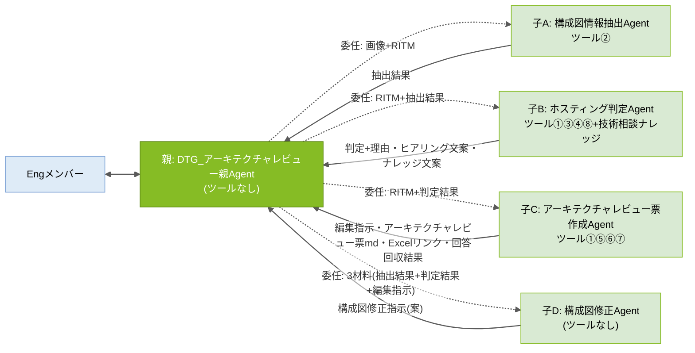
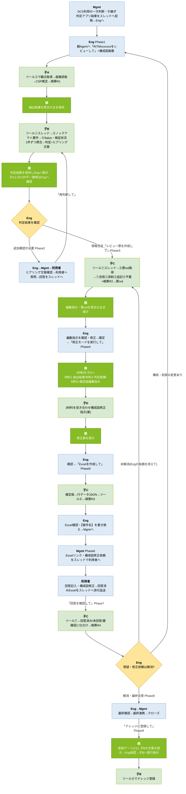

# アーキテクチャレビューAgent 設計書


---

## 0. 設計方針

### 設計原則(5か条)

| # | 原則 | 内容 |
|---|---|---|
| 1 | 親は連携専任 | 親Agentはツールを持たず、判断・作成をしない。窓口・進行管理・子Agent間のデータ連携(原文のままの受け渡し)のみ |
| 2 | 1Agent=1責務 | 構成図情報抽出(子A)/ホスティング判定(子B)/アーキテクチャレビュー票作成(子C)/構成図修正案(子D)を分離し、モード判定ミスを構造的に排除 |
| 3 | 全件照合はツールで全文渡し | 判定基準・照合資料・アーキテクチャレビュー票マスタ・観点など「全行を漏れなくチェックする資料」はKnowledge(RAG=関連断片だけを検索して渡す仕組み)に載せず、ツールで全文を渡す。Knowledgeは断片検索で足りる「過去案件の参考提示」のみ |
| 4 | 人の承認ゲート | Agentの出力はすべて「案」。確定・承認・利用者連絡・ナレッジ登録実行の判断は人(Eng/Mgmt)が行う |
| 5 | 共通ルールは単一ソース | 検算ルール(R1〜R4)と共通厳守事項(C1〜C6)は本設計書§1を正とし、各AgentのInstructionsには同一の共通ブロックを貼付する。改訂時は§1を更新→全Agentへ貼り直し |

### DRY原則レビュー(2026/08/28)への対応方針

| ID | 課題 | 対応 | 理由 |
|---|---|---|---|
| 1 | 同じスレッドを子B・子Cが別々に取得している | **意図的に許容**(対応しない) | 親ツールレス方針の維持。当事者が自ら取得することで①親経由の長文受け渡しによる欠落・劣化を排除 ②実行のたびに最新スレッド(利用者回答含む)を読める。**再検討条件**: PoCで応答時間・フロー実行数に問題を感じた場合、親への①集約を再検討 |
| 2 | CSP判定を複数Agentが行っている(①のスレッド判定+子Aの画像推定) | **意図的に許容**(対応しない) | 出所の異なる2判定(スレッド記載/構成図記載)を親が突き合わせ、不一致時にEngへ確認する**安全弁**として機能させるため。再検討条件はID1と同じ |
| 3 | 「全件チェック」の検算ルールがバラバラ | **一本化**: §1.1の検算ルールR1〜R4に集約し、各AgentはIDで参照 | 保守性・初見の可読性向上 |
| 4 | 同じ禁止事項を4回書いている | **共通化**: §1.2の共通厳守事項C1〜C6に集約し、全Agent共通ブロック(§1.3)として貼付 | 同上(Instructionsの共通部品化) |
| 5 | Instructions全文が設計書とInstructions集の両方にある(v5.0で追加) | **単一化**: Instructions集を正とし、設計書は設計(何を・なぜ)のみを持つ | 改訂時の二重更新・不整合を防ぐ |

---

## 1. 共通ルール(単一ソース。改訂時はここを更新→全Agentへ貼り直し)

### 1.1 検算ルール(R1〜R4)

「検算」とは、**AIが処理を途中で飛ばしていないかを件数の突き合わせで機械的に確認する仕組み**。数える対象がルールごとに異なる。

| ID | 名称 | 実施者 | 何と何を突き合わせるか | 何のための確認か | 不一致時の動作 |
|---|---|---|---|---|---|
| **R1** | 構成図チェック観点の実施漏れ確認 | 子A | 実際に判定した観点の件数 ⇔ 観点mdの内訳から算出した「チェックすべき観点の件数」(共通観点+該当CSP観点) | 構成図チェックの観点をAIが飛ばしていないか | 出力せずにやり直す。md内訳表記と実際の行数が食い違う場合は実際の行数を正とし、警告(⚠ファイル内訳の更新漏れ)を付けて出力 |
| **R2** | アーキテクチャレビュー票の標準指摘の仕分け漏れ確認 | 子C | ①流用+②添削+④不要 の合計件数 ⇔ アーキテクチャレビュー票mdの全行数(md先頭の「全NN行」) | マスタのどこかの行が検討されずに漏れていないか(※③追記は新規行のため分母に含めない) | 出力せずにやり直す |
| **R3** | アーキテクチャレビュー票Excelへの転記漏れ確認 | 子C | ツール⑥が返した書き込み件数 ⇔ アーキテクチャレビュー票に載せるべき行数(①流用+②添削+③追記の合計) | Excelへの転記に失敗した行がないか | Engへ報告する(フロー側の失敗のため) |
| **R4** | 利用者回答の仕分け漏れ確認(v5.0新設) | 子C | [回答済み]+[未回答]+[要確認] の合計件数 ⇔ ツール⑦が返した「全行数: NN件」 | 回答済みアーキテクチャレビュー票の行を飛ばして仕分けていないか | 出力せずにやり直す |

**R4の追加理由**: ツール⑦の実機テスト(2026/09/02)で、Agentが回答済みNoを列挙した際に順序の乱れ(No.24, 26, 27, 23…)と件数のみの報告(「未回答: 1件」で番号なし)が発生した。行の読み飛ばし・重複計上のサインであるため、件数の突き合わせと全件の昇順列挙を義務付ける。

### 1.2 共通厳守事項(C1〜C6)

| ID | 内容 |
|---|---|
| **C1** | すべての出力は「案(仮判定・下書き)」である。確定・承認・利用者への連絡・ナレッジ登録の実行判断は人(Eng/Mgmt)が行う |
| **C2** | 推測しない。渡された材料・ツール出力に無い事項を補完しない。判断・指摘には根拠(基準ID・資料名・記載箇所)を必ず添える |
| **C3** | 全件処理する。照合・仕分け対象の全行を順に処理し、スキップしない。該当する検算ルール(R1〜R4)を実施し、不一致のまま出力しない |
| **C4** | 自分の役割の外に出ない。役割定義外の判断・作成を行わない。画像の解析は子Aのみが行う |
| **C5** | 作業過程・計画・途中経過・ツール出力の原文はチャットに出力しない。最終成果物のみを返す(Engが原文を明示依頼した場合を除く) |
| **C6** | Web上の一般情報は使用しない |

### 1.3 共通ブロック(全AgentのInstructions末尾にこのまま貼付)

```text
# 共通厳守事項(全Agent共通・設計書§1が正)
- C1: すべての出力は「案(仮判定・下書き)」。確定・承認・利用者連絡・ナレッジ登録実行の判断は人(Eng/Mgmt)が行う。
- C2: 推測しない。渡された材料・ツール出力に無い事項を補完しない。判断・指摘には根拠(基準ID・資料名・記載箇所)を必ず添える。
- C3: 全件処理する。照合・仕分け対象の全行を順に処理し、スキップしない。該当する検算ルール(R1〜R4)を実施し、不一致のまま出力しない。
- C4: 自分の役割の外に出ない。役割定義外の判断・作成を行わない。画像の解析は構成図情報抽出Agentのみが行う。
- C5: 作業過程・途中経過・ツール出力の原文は出力しない。最終成果物のみを返す(Engが明示依頼した場合を除く)。
- C6: Web上の一般情報は使用しない。
```

---

## 2. Agent構成と関連図

### 2.1 実装方式: 子Agent方式

親Agentの「エージェント」タブから「エージェントの追加 → 新規作成」で子を作る方式。既存の公開済みAgentを接続するConnected Agents方式とは次の点が異なる。

| 観点 | 子Agent方式(採用) | Connected Agents方式 |
|---|---|---|
| 子の作り方 | 親の中で新規作成 | 独立Agentを作って公開し、親から接続 |
| 公開 | 親から一括(子の個別公開は不要) | 子を先に公開しないと接続候補に出ない |
| 構築順 | 親 → 子 | 子 → 親 |
| 子の単独利用・他の親からの再利用 | 不可 | 可能 |
| 設計への影響 | なし(親1+子4、ツール割当、R・C各ルールはそのまま) | — |

**将来の注意**: Mgmt側にも親Agentを建てる構想(MTG資料参照)を進める場合、両方の親から共通で使いたい子は独立Agent(公開済み)として作り直す必要がある。PoC範囲では影響なし。

**運用メモ**: ツール⑥⑦の動作検証は公開済みの単体Agent `DTG_ReviewSheetGenerator` で実施した。親配下の子Cにも同じツールを接続済み。単体Agentはツール改修時の検証用として残す(PoC終了時に整理)。

### 2.2 Agent構成(親1+子4)

| 設計上の呼び名 | Copilot Studio上のAgent名 | 役割 | ツール | Knowledge |
|---|---|---|---|---|
| **親: オーケストレーターAgent** | `DTG_アーキテクチャレビュー親Agent` | Engとの唯一の会話窓口。進行管理、子の呼出し、子Agent間のデータ連携(結果の保持・原文のままの受け渡し)、子の成果物をEngへ提示、クローズ時の承認ゲート | なし | なし |
| **子A: 構成図情報抽出Agent** | `構成図情報抽出Agent` | 構成図(画像)から事実抽出+観点別チェック(検算R1) | ② | なし |
| **子B: ホスティング判定Agent** | `ホスティング判定Agent` | スレッド取得→ノックアウト要件照合+Salus照合+サービス検証状況照合→DCS Hub/Disconnect判定+理由。不足時はヒアリング文案。クローズ時はナレッジ文案作成・(承認後)登録実行 | ①③④⑧ | 技術相談ナレッジ(参考のみ) |
| **子C: アーキテクチャレビュー票作成Agent** | `アーキテクチャレビュー票作成Agent` | スレッド取得→編集指示(検算R2)→アーキテクチャレビュー票md作成→送付用Excel生成(検算R3)→回答回収・仕分け(検算R4) | ①⑤⑥⑦ | なし |
| **子D: 構成図修正Agent** | `構成図修正Agent` | 3つの材料(子Aの抽出結果/子Bの判定結果/Eng確定版の編集指示)を突き合わせ、構成図修正指示(文案)を作成 | なし | なし |

**名前の一致**: 親のInstructionsは子を上表の名前で文字列指定する。1文字でも違うと親は子を呼び出せず、エラーも出さずに処理を続けるため、名前は上表と完全一致させる。

### 2.3 関連図(委任=点線/返却=実線)



### 2.4 ツール一覧(利用順・8本)

| No | ツール名 | 説明 | 用途 | 持ち主 | 備考 |
|---|---|---|---|---|---|
| ① | Teamsスレッド内容取得 | 共通_Engineering標準化チャネルからRITM番号でスレッドを特定(件名+本文を検索)し、親投稿・全返信(HTML→テキスト変換済み)・添付ファイル一覧を取得。本文からCSP(Azure/GCP/AWS/不明)を判定して返す。入力でCSPを指定した場合はそれを優先 | 子B: 判定時に案件情報・ホスティング判断アプリの結果・利用者回答を読む(再判断のたびに再取得)。子C: アーキテクチャレビュー票作成時に案件情報と、Excelファイル名に使うCSPを得る | 子B・子C | スレッドを使う当事者が自ら取得することで、親経由の長文受け渡しによる劣化を排除し、常に最新を読む(方針ID1)。**実装済み** |
| ② | 構成図チェック観点取得 | AI連携用フォルダの構成図チェック観点.mdを全文取得して返す | 子Aが観点の実行仕様、および検算R1の分母として使う | 子A | 観点は子Aの抽出処理だけが使う実行仕様のため。**実装済み**(スリム版mdへの差し替えは未・P5) |
| ③ | ホスティング判定基準取得 | AI連携用フォルダのホスティング判定基準.md(ノックアウト要件のみ)を全文取得して返す | 子Bがノックアウト要件を1件ずつ照合するために使う | 子B | 判定処理と不可分の実行仕様のため。全文渡しで照合漏れを防止。**実装済み**(正式版mdは未・P4) |
| ④ | サービス照合資料取得 | AI連携用フォルダのSalus_Status一覧.mdとサービス検証状況.mdを取得し、`salusStatus` / `serviceVerification` の2出力で返す | 子Bが利用予定サービスを「Salus status」と「検証状況(3区分)」の両面で同時照合するために使う | 子B | 両資料は常に同時照合するため1ツールに集約。サービス単位の全件照合が要件のためKnowledgeでなく全文渡し。**実装済み**(サービス検証状況.mdは現在テスト内容のみ・P6) |
| ⑤ | アーキテクチャレビュー票取得 | 入力CSPに応じて、AI連携用フォルダのCSP別アーキテクチャレビュー票md(固定ファイル名)を全文取得して返す | 子Cが編集指示の分母(検算R2の「全NN行」)として使う | 子C | アーキテクチャレビュー票マスタは編集指示の検算分母として子Cだけが全文を必要とするため。**実装済み** |
| ⑥ | アーキテクチャレビュー票Excel作成 | RITM番号・CSP・行データJSONを受領→雛形xlsxをコピーして送付フォルダに「【案件名】(RITMxxxxxxx)アーキテクチャレビュー票(CSP).xlsx」を作成→JSON解析→Officeスクリプト「アーキテクチャレビュー_行追加」でテーブル`T_アーキテクチャレビュー票`へ行追加→書き込み件数+ファイルリンクを返す | 子Cが確定版の編集指示から利用者送付用Excelを作るために使う(転記はフローの機械処理でAI非関与) | 子C | アーキテクチャレビュー票を確定させた本人が生成まで行うことで転記ズレをなくす(検算R3)。**実装済み**。Excelコネクタ「表に行を追加」は動的ファイル指定時に列マッピングできないためOfficeスクリプト方式を採用。スクリプトのファイル指定は「ファイルの作成」出力の`Path`を使う(`Id`はエンコード済みパスのため不可)。行データJSONのキーはExcel見出しと完全一致が必要(「No.」のピリオド含む)。【案件名】は人が書き換える |
| ⑦ | 回答済みアーキテクチャレビュー票取得 | RITM番号を受領→チャネルファイルフォルダ(共通_Engineering標準化)の一覧取得→ファイル名に「RITM番号」を含む→「アーキテクチャレビュー票」を含む.xlsx に2段階で絞込→最終更新が最新の1件を選択→テーブル`T_アーキテクチャレビュー票`を読取→「対象ファイル名/全行数/md表(No・ステータス・指摘概要・指摘内容・回答内容・回答者・回答日)」を返す。該当なしは「回答済みのアーキテクチャレビュー票がまだスレッドに添付されていません。」を返す | 子Cが利用者からの回答を読み、[回答済み]/[未回答]/[要確認]に仕分けるために使う(検算R4) | 子C | アーキテクチャレビュー票のライフサイクル(作成→送付→回収)を同一Agentに集約するため。**実装済み**。スレッド添付の実体はチャネルフォルダに自動保存されるため、添付URLを解析せずフォルダ検索で特定する方式を採用。フィルターの真偽値比較は型不一致で0件になるため文字列比較で実装。日付列はExcelシリアル値で返るためフロー側でyyyy/MM/ddへ変換(文字列入力にも対応)。セル内改行は`<br>`、縦棒は全角に置換してmd表の崩れを防止 |
| ⑧ | 技術相談ナレッジ追記 | List列構成に沿った16項目を受領→技術相談ナレッジListへ「項目の作成」で1件登録→登録リンクを返す | 子BがEng承認→親の指示後にナレッジを登録するために使う | 子B | 登録文案の作成者と実行者を一致させるため。実行はEng承認→親の指示時のみ(承認ゲートC1)。選択肢列はListの定義値と完全一致が必要。**未実装** |

---

## 3. Input / Output

### 3.1 Input一覧(Agentが読む材料)

| 名称 | 実体・場所 | 用途(誰がどのステップで使う) | 保守 |
|---|---|---|---|
| Teamsスレッド(事前相談) | 共通_Engineering標準化チャネル | 子B(判定)・子C(アーキテクチャレビュー票作成)がツール①で取得。案件情報・判定アプリ結果・利用者回答・添付一覧の源泉 | —(業務の中で蓄積) |
| 構成図(画像) | Engが親Agentのチャットへアップ | 子A(抽出)が親経由で受領し事実抽出 | 案件ごとにEngが用意 |
| 構成図チェック観点.md | AI連携用フォルダ | 子A(抽出)がツール②で取得。観点の実行仕様・検算R1の分母 | ファイル差し替え。増減時はヘッダー内訳も更新(不一致は子Aが警告) |
| ホスティング判定基準.md | AI連携用フォルダ | 子B(判定)がツール③で取得。ノックアウト要件のみ(基準ID・版数・総行数付き) | ファイル差し替え |
| Salus_Status一覧.md | AI連携用フォルダ | 子B(判定)がツール④で取得(`salusStatus`)。サービス単位のSalus status照合 | 定期的にSalus情報を抽出しmd化して差し替え |
| サービス検証状況.md | AI連携用フォルダ | 子B(判定)がツール④で取得(`serviceVerification`)。3区分照合: (1)社内環境で検証済み・問題なく動作 (2)未検証だが複数アセットで利用実績あり (3)未検証・Salus上は利用可→利用者またはEngによる動作検証が必要 | ファイル差し替え。先頭に版数・全サービス数。**現在はテスト内容のみ** |
| アーキテクチャレビュー票.md×3CSP | AI連携用フォルダ(アーキテクチャレビュー票_AWS.md等・3本) | 子C(アーキテクチャレビュー票作成)がツール⑤で取得。編集指示の分母(先頭に版数・全NN行=検算R2に使用) | 改版=該当mdの差し替えのみ |
| アーキテクチャレビュー票Excel雛形.xlsx | AI連携用フォルダ | ツール⑥のコピー元。テーブル名固定: `T_アーキテクチャレビュー票`。列: No. / ステータス / 環境 / 対応区分 / カテゴリ / 指摘概要 / 指摘内容 / 対応ガイドライン・参考資料 / 記入日 / 記入者 / 回答日 / 回答内容 / 回答者 / 備考。**シート保護なし**(PoC判断)。テーブル内の空行は削除済み(3行目はテーブル維持のための非表示行) | 体裁変更=雛形差し替え。列を変えた場合はOfficeスクリプトの見出し一致ルールにより追加設定は不要だが、子CのJSONキー一覧(Instructions)を更新 |
| Officeスクリプト「アーキテクチャレビュー_行追加」 | OneDrive「Documents/Office スクリプト」 | ツール⑥が「スクリプトの実行」で呼ぶ。JSON配列を受け取り、見出し名でマッピングしてテーブル末尾に行追加、件数を返す | 列名依存なし(見出しで動的マッピング)。テーブル名`T_アーキテクチャレビュー票`のみ固定 |
| 回答済みアーキテクチャレビュー票(xlsx) | チャネルファイルフォルダ(スレッド添付の自動保存先: ドキュメント > 共通_Engineering標準化) | 子C(回答回収)がツール⑦で取得。運用ルール: 返送はスレッド添付・**ファイル名のRITM部分と「アーキテクチャレビュー票」を変えない** | —(Teams標準動作) |
| 技術相談ナレッジList | SharePoint List(マスタ維持) | 子BのKnowledge(参考のみ・判定根拠にしない=C2)。ツール⑧の追記先でもある | List直接管理 |

### 3.2 Output一覧(Agent・ツールが生み出す成果物)

| 名称 | 生成者 | 内容 | 目的 | 格納先 |
|---|---|---|---|---|
| 【構成図チェック結果】 | 子A | サービス一覧・NW情報・観点別チェック・不足情報・読取不能箇所+検算R1 | 子Bの判定材料/子Dの材料1/Engの確認 | チャット(親が保持) |
| ホスティング判定結果 | 子B | DCS Hub/DCS Disconnect/DCS Sandbox判定+基準IDごとの理由・Salus照合一覧・サービス検証状況一覧・要人手確認・追加ヒアリング文案 | Engの判断材料。子Dの材料2。要動作検証サービスの明示 | チャット(親が保持) |
| 追加ヒアリング文案 | 子B | 不足情報ごとの利用者向け質問文 | Eng確認→Mgmt経由で利用者ヒアリング | チャット |
| アーキテクチャレビュー票編集指示 | 子C | ①流用(No一覧)/②添削(修正後全文+理由)/③追記(行データ)/④不要(理由)+検算R2 | Engの確認・修正の対象。Eng確定版が子Dの材料3・Excelの元になる | チャット(親が保持) |
| アーキテクチャレビュー票(md) | 子C | 編集指示反映済みの完成形アーキテクチャレビュー票(md表形式) | Engがチャット上で内容確認するための正 | チャット |
| 【構成図修正指示(案)】 | 子D | 修正一覧(場所/現状/修正内容)+利用者向け依頼文 | Eng確認→Mgmt経由で利用者の構成図修正依頼 | チャット |
| アーキテクチャレビュー票Excel | ツール⑥(子C) | 確定版のアーキテクチャレビュー票を書き込んだ送付用Excel(検算R3)。ファイル名: `【案件名】(RITMxxxxxxx)アーキテクチャレビュー票(CSP).xlsx`(【案件名】は人が書き換える) | 利用者への送付物(Mgmtがスレッドでリンク連携) | 送付フォルダ |
| 回答回収結果 | 子C | 集計(全NN件=回答済み/未回答/要確認)・未回答No一覧・要確認一覧(No/指摘概要/回答の要点/不十分な点)・回答済みNo一覧+検算R4 | Engの解消判定の材料 | チャット |
| ナレッジ登録文案 | 子B | 技術相談ナレッジListの16項目(選択肢は定義値と完全一致) | Eng承認の対象。承認後ツール⑧で登録 | チャット |
| ナレッジ登録(1件) | ツール⑧(子B) | 承認済み文案のList登録 | レビュー結果の組織ナレッジ化 | 技術相談ナレッジList |

---

## 4. 全体ワークフロー

### 4.1 概要図(色分け: 青=人間/濃緑=親/薄緑=子/黄=人間判断分岐)



### 4.2 親が会話中に保持する状態

親はツールを持たないが、**子の出力を原文のまま保持し、後続の子へ渡す役割**を担う。会話内で保持する項目は次のとおり。

| 保持する項目 | 誰から受け取る | いつ受け取る | 誰へ渡す |
|---|---|---|---|
| RITM番号 | Eng | Phase 1 | 全ての子(毎回) |
| 構成図画像 | Eng | Phase 1 | 子A |
| CSP(図由来) | 子A | Phase 1 | Eng(スレッド由来と不一致時の確認) |
| 【構成図チェック結果】 | 子A | Phase 1 | 子B(Phase 1・2)、子D(Phase 4・材料1) |
| CSP(スレッド由来) | 子B | Phase 1 | 子C(Phase 5・Excelファイル名用) |
| ホスティング判定結果 | 子B | Phase 1(Phase 2で更新) | Eng、子C(Phase 3)、子D(Phase 4・材料2)、子B(Phase 9) |
| 追加ヒアリング文案 | 子B | Phase 1・2 | Eng |
| アーキテクチャレビュー票編集指示(案) | 子C | Phase 3 | Eng |
| アーキテクチャレビュー票編集指示(確定版) | Eng(修正を反映) | Phase 3の末尾 | 子D(Phase 4・材料3)、子C(Phase 5) |
| 【構成図修正指示(案)】 | 子D | Phase 4 | Eng |
| Excelリンク・書き込み件数 | 子C | Phase 5 | Eng |
| 回答回収結果 | 子C | Phase 7 | Eng、子C(Phase 3再実行時にEngの指摘と併せて) |
| ナレッジ登録文案(案→承認済み) | 子B → Eng | Phase 9 | 子B(実行時) |

### 4.3 フェーズ別の動作詳細

各ステップで「誰が・誰から何を受け取り・何を行い・誰へ何を渡すか」を示す。**親は常に原文のまま受け渡し、要約・言い換えをしない**。

#### Phase 0: 前提(人間・Agent関与なし)

| Step | 主体 | 受け取る(誰から・何を) | 行うこと | 渡す(誰へ・何を) |
|---|---|---|---|---|
| 0-1 | Mgmt | 利用者から: 事前相談 | DCS利用の一次判断。ホスティング判断アプリを実行 | スレッドへ: 案件情報+判断アプリ結果を投稿 |
| 0-2 | Mgmt | — | Engへ引き継ぎ | Engへ: RITM番号とスレッドの連絡 |

#### Phase 1: レビュー開始 — Engの指示「RITMxxxxxxxをレビューして」

| Step | 主体 | 受け取る(誰から・何を) | 行うこと | 渡す(誰へ・何を) |
|---|---|---|---|---|
| 1-1 | Eng | Mgmtから: RITM番号 | 親のチャットへ「RITM1234567をレビューして」を投稿。構成図画像があれば同じメッセージに添付 | 親へ: 指示文(+構成図画像) |
| 1-2 | 親 | Engから: 指示文(+画像) | 指示を「レビュー開始」と判定。RITM番号を抽出して半角に正規化(無ければEngへ聞き返して停止)。画像の有無を確認 | — |
| 1-3 | 親 | — | 画像あり: 子Aを呼び出す。画像なし: 1-6へ進み、以降の提示に「構成図: Eng目視確認が必要」を付記 | 子Aへ: 構成図画像+RITM番号+依頼文「構成図を解析して」 |
| 1-4 | 子A | 親から: 画像+RITM番号 | 画像内の文字列・要素を列挙→図内記載のみを根拠にCSP推定→ツール②で観点md取得→適用観点(共通+該当CSP)に絞込→1件ずつ判定→検算R1 | 親へ:【構成図チェック結果】(RITM/CSP+根拠/サービス一覧/NW情報/観点別チェック/不足情報/読取不能箇所/検算R1) |
| 1-5 | 親 | 子Aから:【構成図チェック結果】 | 原文のまま保持(後で子B・子Dへ渡す)。CSP(図由来)を控える | — |
| 1-6 | 親 | — | 子Bを呼び出す。**スレッド本文は渡さない**(子Bが自分で取得) | 子Bへ: RITM番号+【構成図チェック結果】原文(あれば)+Engの補足情報(あれば)+依頼文「判定して」 |
| 1-7 | 子B | 親から: 上記 | ツール①(RITM→スレッド全文+CSP)→ツール③(ノックアウト要件)→ツール④(salusStatus+serviceVerification)→ノックアウト要件を行順に1件ずつ照合(DCS Hub優先)→利用予定サービスを1件ずつ両資料と照合→不足情報ごとに利用者向け質問文案 | 親へ: ホスティング判定結果(判定/理由(基準ID)/ノックアウト該当/Salus照合一覧/検証状況一覧/要動作検証案内/要人手確認/追加ヒアリング文案) |
| 1-8 | 親 | 子Bから: 判定結果 | 原文のまま保持。CSP(図由来・1-5)とCSP(スレッド由来・判定結果内)を突き合わせ | Engへ: 判定結果の原文。CSP不一致なら「図とスレッドでCSPが異なる。どちらが正か」の確認。ヒアリング文案があれば「Eng確認→Mgmt経由でヒアリング→スレッド反映後に『再判断して』」の案内 |
| 1-9 | Eng | 親から: 判定結果 | 内容を確認し分岐。追加確認が必要 → Phase 2。情報充足 → Phase 3 | — |

#### Phase 2: 追加ヒアリング〜再判断 — Engの指示「再判断して」(複数回あり得る)

| Step | 主体 | 受け取る(誰から・何を) | 行うこと | 渡す(誰へ・何を) |
|---|---|---|---|---|
| 2-1 | Eng | 親から: 追加ヒアリング文案 | 質問内容の妥当性を確認・修正 | Mgmtへ: 確定した質問文 |
| 2-2 | Mgmt | Engから: 質問文 | 利用者へヒアリング。回答をスレッドへ投稿(回答が揃うまで繰り返す) | スレッドへ: 利用者回答。Engへ: 反映の連絡 |
| 2-3 | Eng | Mgmtから: 反映の連絡 | 親へ「再判断して」を投稿 | 親へ: 指示文 |
| 2-4 | 親 | Engから: 指示文 | 「再判断」と判定。保持済みのRITM番号・【構成図チェック結果】を使う(Engに再入力させない) | 子Bへ: RITM番号+【構成図チェック結果】原文(保持分)+依頼文「再判断して」 |
| 2-5 | 子B | 親から: 上記 | ツール①で最新スレッド(利用者回答を含む)を再取得→③④→再照合→判定を更新 | 親へ: 更新後のホスティング判定結果 |
| 2-6 | 親 | 子Bから: 更新後判定結果 | 保持していた判定結果を更新後のもので差し替え | Engへ: 更新後判定結果の原文 |
| 2-7 | Eng | 親から: 更新後判定結果 | 1-9と同じ分岐。充足するまでPhase 2を繰り返す | — |

#### Phase 3: アーキテクチャレビュー票作成 — Engの指示「レビュー票を作成して」

| Step | 主体 | 受け取る(誰から・何を) | 行うこと | 渡す(誰へ・何を) |
|---|---|---|---|---|
| 3-1 | Eng | 親から: 判定結果(充足済み) | 親へ「レビュー票を作成して」を投稿 | 親へ: 指示文 |
| 3-2 | 親 | Engから: 指示文 | 「レビュー票作成」と判定。**スレッド本文は渡さない** | 子Cへ: RITM番号+ホスティング判定結果(保持分・原文)+依頼文「レビュー票を作成して」 |
| 3-3 | 子C | 親から: 上記 | ツール①(スレッド全文+CSP。CSPが「不明」なら停止しEng確認)→ツール⑤(CSPを渡し、票md全文+全NN行)→全行を①流用/②添削/③追記/④不要に仕分け→検算R2→編集指示を反映した票mdを作成 | 親へ: 編集指示(①〜④+検算R2)+アーキテクチャレビュー票md+適用テンプレート名 |
| 3-4 | 親 | 子Cから: 編集指示+票md | 編集指示を「案」として保持 | Engへ: 編集指示と票mdの原文 |
| 3-5 | Eng | 親から: 編集指示+票md | 内容を確認。修正がある場合は修正点をチャットで親に伝える(例: 「No.5は不要にして」「No.12の指摘内容を〜に変えて」)。問題なければ「確定」と伝える | 親へ: 修正指示 または 確定の宣言 |
| 3-6 | 親 | Engから: 修正指示 | 修正がある場合: 子Cへ修正点を添えて再依頼(3-3〜3-4を繰り返す)。「確定」を受けたら、その時点の編集指示を**確定版**として保持 | (修正時)子Cへ: 前回の編集指示+Engの修正点+依頼文「修正を反映して再出力して」 |

#### Phase 4: 構成図修正案 — Engの指示「修正モードを実行して」

| Step | 主体 | 受け取る(誰から・何を) | 行うこと | 渡す(誰へ・何を) |
|---|---|---|---|---|
| 4-1 | Eng | — | 親へ「修正モードを実行して」を投稿 | 親へ: 指示文 |
| 4-2 | 親 | Engから: 指示文 | 「構成図修正案」と判定。3材料が揃っているか確認(材料1が無い=画像なしの場合はEngへ「構成図が無いため修正案は作成できない」と返す) | 子Dへ: 材料1【構成図チェック結果】原文+材料2 ホスティング判定結果原文+材料3 確定版編集指示+依頼文「構成図修正指示を作成して」 |
| 4-3 | 子D | 親から: 3材料 | 3材料を突き合わせ、「材料2・3で決まったこと」のうち「材料1の時点で図に無い・誤っているもの」を修正指示として列挙。利用者向け依頼文を下書き | 親へ:【構成図修正指示(案)】(修正一覧: 場所/現状/修正内容+利用者向け依頼文) |
| 4-4 | 親 | 子Dから: 修正指示(案) | 保持 | Engへ: 原文 |
| 4-5 | Eng | 親から: 修正指示(案) | 確認・修正。問題なければPhase 5へ | — |

#### Phase 5: 送付用Excel生成 — Engの指示「Excelを作成して」

| Step | 主体 | 受け取る(誰から・何を) | 行うこと | 渡す(誰へ・何を) |
|---|---|---|---|---|
| 5-1 | Eng | — | 親へ「Excelを作成して」を投稿 | 親へ: 指示文 |
| 5-2 | 親 | Engから: 指示文 | 「Excel生成」と判定。確定版編集指示が保持されているか確認(無ければPhase 3の確定を促す) | 子Cへ: RITM番号+CSP(スレッド由来)+確定版編集指示+依頼文「Excelを作成して」 |
| 5-3 | 子C | 親から: 上記 | 確定版編集指示から行データJSONを組み立て(①流用+②添削+③追記。キーは8つ・Excel見出しと完全一致)→ツール⑥を実行(RITM番号/CSP/JSON)→返却された書き込み件数と行数を突き合わせ(検算R3) | 親へ: 書き込み件数+Excelリンク+検算R3結果 |
| (⑥内部) | フロー | 子Cから: RITM/CSP/JSON | 雛形取得→ファイル作成(`【案件名】(RITM)アーキテクチャレビュー票(CSP).xlsx`)→JSON解析→Officeスクリプトでテーブルへ行追加 | 子Cへ: result(件数)+fileLink |
| 5-4 | 親 | 子Cから: 件数+リンク+R3 | 保持 | Engへ: 件数・リンク・検算R3結果+「Eng確認→Mgmt経由でスレッド連携」の案内 |
| 5-5 | Eng | 親から: リンク | Excelを開いて内容確認。**ファイル名の【案件名】を実際の案件名に書き換える**(人の作業) | Mgmtへ: Excelリンク+構成図修正依頼文(Phase 4の成果物) |

#### Phase 6: 利用者への送付・回答(人間のみ)

| Step | 主体 | 受け取る(誰から・何を) | 行うこと | 渡す(誰へ・何を) |
|---|---|---|---|---|
| 6-1 | Mgmt | Engから: Excelリンク+修正依頼文 | スレッドで利用者へ連携 | 利用者へ: スレッド投稿 |
| 6-2 | 利用者 | Mgmtから: スレッド投稿 | アーキテクチャレビュー票に回答を記入・構成図を修正。回答済みExcelを**スレッドへ添付**して返送(**ファイル名のRITM部分・「アーキテクチャレビュー票」は変えない**) | スレッドへ: 回答済みExcel(チャネルフォルダに自動保存される) |
| 6-3 | Mgmt | 利用者から: 返送 | 返送を確認 | Engへ: 返送の連絡 |

#### Phase 7: 回答回収 — Engの指示「回答を確認して」

| Step | 主体 | 受け取る(誰から・何を) | 行うこと | 渡す(誰へ・何を) |
|---|---|---|---|---|
| 7-1 | Eng | Mgmtから: 返送の連絡 | 親へ「回答を確認して」を投稿 | 親へ: 指示文 |
| 7-2 | 親 | Engから: 指示文 | 「回答回収」と判定 | 子Cへ: RITM番号+依頼文「回答を回収して」 |
| 7-3 | 子C | 親から: RITM番号 | ツール⑦を実行→対象ファイル名/全行数/md表を受領→全行を[回答済み]/[未回答]/[要確認]に仕分け→検算R4。未添付メッセージの場合は「回答未着」とだけ報告 | 親へ: 回答回収結果(集計/未回答No一覧/要確認一覧/回答済みNo一覧/検算R4) |
| (⑦内部) | フロー | 子Cから: RITM番号 | チャネルフォルダ一覧→RITMで絞込→「アーキテクチャレビュー票」+.xlsxで絞込→最新1件→テーブル読取→md整形 | 子Cへ: answerSheet+fileName(未添付時は固定メッセージ) |
| 7-4 | 親 | 子Cから: 回答回収結果 | 保持 | Engへ: 原文 |
| 7-5 | Eng | 親から: 回答回収結果 | 解消判定。未解消 → Engの指摘を添えてPhase 3へ(親が子Cに「回答を踏まえた編集指示の見直し」を依頼)。構成・前提の変更あり → Phase 1へ。解消 → Phase 8 | (未解消時)親へ: 指摘+「レビュー票を見直して」 |

#### Phase 8: 最終確認・クローズ(人間のみ)

| Step | 主体 | 受け取る(誰から・何を) | 行うこと | 渡す(誰へ・何を) |
|---|---|---|---|---|
| 8-1 | Eng | 親から: 回答回収結果(解消) | 判定結果・アーキテクチャレビュー票・最終構成図の妥当性を最終確認 | Mgmtへ: 最終結果 |
| 8-2 | Mgmt | Engから: 最終結果 | 利用者へ最終連携 | 利用者へ: スレッド投稿 |
| 8-3 | Eng・Mgmt | — | スレッド(チャット)をクローズ | — |

#### Phase 9: ナレッジ登録 — Engの指示「ナレッジに登録して」

| Step | 主体 | 受け取る(誰から・何を) | 行うこと | 渡す(誰へ・何を) |
|---|---|---|---|---|
| 9-1 | Eng | — | 親へ「ナレッジに登録して」を投稿 | 親へ: 指示文 |
| 9-2 | 親 | Engから: 指示文 | 「クローズ処理」と判定 | 子Bへ: RITM番号+ホスティング判定結果(保持分・最終版)+依頼文「ナレッジ登録文案を作成して」 |
| 9-3 | 子B | 親から: 上記 | 判定結果・スレッド情報(ツール①で再取得可)・レビュー経緯から技術相談ナレッジListの16項目の文案を作成。確定できない項目は「(未記入)」 | 親へ: ナレッジ登録文案(16項目) |
| 9-4 | 親 | 子Bから: 文案 | 「案」として保持 | Engへ: 文案原文+「内容を確認し、登録してよければ『承認』と返してください」 |
| 9-5 | Eng | 親から: 文案 | 確認・修正(「(未記入)」の項目を埋める)。承認 | 親へ: 承認(+修正内容) |
| 9-6 | 親 | Engから: 承認 | 承認を確認。**承認前は絶対に実行させない**(C1)。修正があれば承認済み文案に反映 | 子Bへ: 承認済み文案(16項目)+依頼文「登録を実行して」 |
| 9-7 | 子B | 親から: 承認済み文案 | ツール⑧を実行(16項目。選択肢は定義値と完全一致) | 親へ: 登録リンク |
| 9-8 | 親 | 子Bから: 登録リンク | — | Engへ: 登録完了+リンク |

### 4.4 人間に残る作業

| 作業 | 担当 | 残す理由 |
|---|---|---|
| レビュー開始指示・構成図画像のアップ | Eng | 起点(Agent自動Trigger不可の環境制約) |
| 判定・文案・編集指示・修正案・アーキテクチャレビュー票の確認、判断分岐、編集指示の確定 | Eng | 責任分界(C1: Agentはすべて案) |
| Excelファイル名の【案件名】書き換え | Eng | 案件名の表記は人が決める(Agentに推測させない) |
| 利用者・Mgmtとの対人連携、スレッドへの投稿 | Mgmt | 対人コミュニケーションは人。Agentはスレッドへ投稿しない |
| 解消判定・最終確認・クローズ・ナレッジ登録承認 | Eng | 責任分界(C1) |

---

## 5. 各AgentのInstructions

**Instructions全文は「Instructions集_子Agent方式_v5.0」を正とする**(本書からは重複排除のため削除)。本書§1.3の共通ブロックを各Instructionsの末尾に貼付すること。

各Agentの説明(Description)は次のとおり。親が子を呼び分ける唯一の判断材料になるため、必ず設定する。

| Agent | 説明(Description) |
|---|---|
| DTG_アーキテクチャレビュー親Agent | CMS Engの窓口として、アーキテクチャレビューの進行管理と子Agentの呼び出し・結果の受け渡しを行うAgent。 |
| 構成図情報抽出Agent | 構成図(画像)からリソース・NW情報などの事実を抽出し、チェック観点ごとに記載の有無を判定するAgent。構成図の内容を読み取る必要があるときに使用する。 |
| ホスティング判定Agent | ノックアウト要件・Salus status・サービス検証状況を照合し、DCSホスティング環境の判定と理由を生成するAgent。技術相談ナレッジの登録文案作成と(承認後の)登録も行う。 |
| アーキテクチャレビュー票作成Agent | アーキテクチャレビュー票の編集指示作成・票mdの作成・送付用Excelの生成・利用者回答の回収を担当するAgent。 |
| 構成図修正Agent | 構成図チェック結果・判定結果・編集指示を突き合わせ、利用者向けの構成図修正指示(文案)を作成するAgent。 |

ツールの説明文(ツール追加時に設定)は「ツール説明文集_Agent別_v1.1」を参照。

---

## 6. 準備事項(準備物・ツール構築・構築順)

### 6.1 準備物

| # | 準備物 | 内容 | 担当 | 状況(2026/09/02) |
|---|---|---|---|---|
| P1 | アーキテクチャレビュー票md×3 | 現行ListからCSP別に変換(先頭に版数・全NN行=検算R2の分母)。AI連携用フォルダへ | Eng | 完了 |
| P2 | 雛形Excel | テーブル`T_アーキテクチャレビュー票`。空行削除済み。シート保護なし(PoC判断) | Eng | 完了 |
| P3 | 送付フォルダ | ツール⑥の出力先 | Eng | 完了 |
| P4 | ホスティング判定基準.md | ノックアウト要件のみ。基準ID・版数・総行数付き | Eng | **未**(正式版) |
| P5 | 構成図チェック観点.md スリム版 | 判定用列のみ+内訳付きヘッダー(検算R1の分母)。Azure等の例示を除去しCSP誤推定を防ぐ | Eng | **未** |
| P6 | サービス検証状況.md | 3区分整理・md化。先頭に版数・全サービス数 | Eng | **仮**(テスト内容のみ) |
| P7 | Salus_Status一覧.md | Salus情報をmd化(定期抽出の運用も決める) | Eng | 要確認 |
| P8 | ナレッジList列構成 | 列名・型・必須・選択肢値(ツール⑧設計用) | ナレッジOwner | 完了(16項目確定) |
| P9 | チャネルファイルフォルダのパス | ドキュメント > 共通_Engineering標準化(ツール⑦読取先) | Eng | 完了 |
| P10 | Officeスクリプト「アーキテクチャレビュー_行追加」 | ツール⑥用。OneDrive「Documents/Office スクリプト」に保存 | Eng | 完了 |

### 6.2 ツール構築

| ツール | 状況 | 補足 |
|---|---|---|
| ① Teamsスレッド内容取得 | 完了(子B・子C接続済み) | 件名+本文でRITM検索、HTML→テキスト変換、CSP自動判定 |
| ② 構成図チェック観点取得 | 完了 | P5差し替え後に再テスト(検算R1) |
| ③ ホスティング判定基準取得 | 完了 | P4差し替え後に再テスト |
| ④ サービス照合資料取得 | 完了 | salusStatus / serviceVerification の2出力 |
| ⑤ アーキテクチャレビュー票取得 | 完了 | CSP別固定ファイル名 |
| ⑥ アーキテクチャレビュー票Excel作成 | 完了 | Officeスクリプト方式。`?['Path']`指定 |
| ⑦ 回答済みアーキテクチャレビュー票取得 | 完了 | フォルダ検索方式。md表整形・日付変換 |
| ⑧ 技術相談ナレッジ追記 | **未実装** | 16入力。選択肢の完全一致。手順書あり |

### 6.3 Agent構築(子Agent方式)

| # | 作業 | 状況 |
|---|---|---|
| A1 | **子Agent方式での伝搬検証(最優先)**: ①構成図画像が親→子Aへ渡るか ②子の長文出力が要約されずに親へ返るか。①NGなら子Aのみ「Engが直接会話」方式に切替 | **未実施** |
| A2 | 親 `DTG_アーキテクチャレビュー親Agent`: Instructions集v5.0 §1を貼付。Web検索オフ | 作成済み(v5.0反映は未) |
| A3 | 子A〜D: 親の「エージェント」タブから新規作成。各Instructions集v5.0 §2〜5を貼付。説明(Description)設定 | 作成済み(v5.0反映は未) |
| A4 | ツール接続: 子A=② / 子B=①③④(⑧は構築後) / 子C=①⑤⑥⑦ | 子Cは完了。子A・子Bは要確認 |
| A5 | ツール説明文: ツール説明文集v1.1をAgent別に設定 | 未 |
| A6 | 子Bにナレッジ「技術相談ナレッジ(Cons)」接続 | 要確認 |
| A7 | 全Agent: Memoryオフ(PoC中)・Web検索オフ | 要確認 |
| A8 | 親から公開 | — |

### 6.4 構築順チェックリスト

1. [x] P1: アーキテクチャレビュー票md×3 → ツール⑤
2. [x] ツール①(スレッド専用化・子B/子C接続)
3. [x] ツール④(salusStatus / serviceVerification)
4. [x] P2/P3/P10 → ツール⑥(Officeスクリプト方式)
5. [x] P9 → ツール⑦(フォルダ検索方式・md整形)
6. [x] 親+子A〜Dの作成(子Agent方式)
7. [ ] **A1: 子Agent方式での画像伝搬・長文伝搬の検証**
8. [ ] A2〜A7: Instructions v5.0・説明文・ツール説明文・ナレッジ・設定の反映
9. [ ] 通しテスト①: Phase 1〜2(レビュー開始(画像あり/なし)→判定→ヒアリング文案→再判断)
10. [ ] 通しテスト②: Phase 3〜7(レビュー票作成(R2)→修正モード→Excel生成(R3)→スレッド添付・回答記入→回答回収(R4))
11. [ ] P4/P5/P6/P7: 正式版md差し替え → ②③④再テスト(R1)
12. [ ] P8 → ツール⑧構築 → Phase 9テスト
13. [ ] テストケース3パターン(情報充足/情報不足→回答→再判断/ノックアウト→DCS Disconnect)で評価

---

## 7. 既知の課題・リスク

| # | 課題 | 影響 | 対策・状況 |
|---|---|---|---|
| 1 | 構成図画像の読取精度(AWS図をAzureと誤認した実績あり) | 子Aの抽出結果・CSP推定の信頼性 | P5で観点mdからAzure等の例示を除去し、図内文字列のみを根拠にCSP推定。親が子Bのスレッド由来CSPと突き合わせて不一致時はEng確認(方針ID2) |
| 2 | 子Agent方式での画像伝搬が未検証 | 子Aが画像を受け取れない場合、レビュー開始フローが成立しない | A1で最優先検証。NGなら子Aは「Engが直接会話」方式に切替 |
| 3 | Agentの件数報告の乱れ(⑦テストで観測) | 回答の読み飛ばし・重複計上 | 検算R4新設。全件を昇順で列挙し件数と突き合わせる |
| 4 | 雛形Excelにシート保護なし | 利用者がテーブル構造を壊すと⑦が読めない | PoCでは運用ルール(RITM部分・「アーキテクチャレビュー票」を変えない、行の挿入削除をしない)で対応。本番化時にシート保護を再検討 |
| 5 | フィルター処理の真偽値比較が型不一致で0件になる | ⑦のようなフォルダ検索を他ツールで作る際に再発しうる | 真偽値ではなく文字列比較(`if(条件,'hit','no')`等)で実装する。手順書に反映 |
| 6 | 同じ200応答を返す2つの「エージェントに応答する」はスキーマ完全一致が必要 | 分岐のあるツール(①⑦)の保存・公開失敗 | 出力名・説明を一方からコピー&ペーストで揃える(手打ちしない)。コードビューで両方を同一JSONに上書きするのが確実 |
