# アーキテクチャレビューAgent 設計書

## 0. 設計方針

### 設計原則

| 6 | 1指示=1子Agent | Engの1つの指示に対して親が呼び出す子は1体のみ。子の結果を提示したら停止し、次の指示を待つ。段階ごとに必ず人の確認が挟まる構造にする(原則4の実装手段。) |

## 4. 全体ワークフロー

### 4.1 概要図(色分け: 青=人間/濃緑=親/薄緑=子/黄=人間判断分岐)

親のノードは「**受け取ったもの → 行うこと → 呼び出す相手(渡すもの)**」の順で書く。子は必ず親の呼び出しノードの直後に置き、子の出力は必ず親の保持ノードへ戻る(子同士が直接やり取りすることはない)。

```mermaid
%%{init: {"theme": "base", "themeVariables": {"edgeLabelBackground": "#ffffff00", "lineColor": "#5a5a5a", "fontSize": "13px"}}}%%
flowchart TD
    subgraph P0["Phase 0: 前提(人間のみ)"]
        A["<b>Mgmt</b><br>DCS利用の一次判断・判定アプリ実行<br>結果をスレッドへ投稿→Engへ引継ぎ"]:::human
    end

    subgraph P1a["Phase 1a: 構成図の抽出"]
        B["<b>Eng</b><br>親へ「RITMxxxxxxxをレビューして」<br>+構成図画像を添付"]:::human
        O1a["<b>親</b> Engから指示文+画像を受領<br>指示を「構成図の抽出」と判定、RITM番号を抽出・半角正規化、画像の有無を確認<br>→ 子Aを呼び出し(渡す: 構成図画像+RITM番号)"]:::parent
        CA1["<b>子A</b> 構成図情報抽出<br>ツール②観点取得→画像読取→CSP推定(図内記載のみ根拠)<br>→観点別チェック→検算R1"]:::child
        O1b["<b>親</b> 子Aから【構成図チェック結果】を受領し原文のまま保持<br>→ Engへ原文のまま提示+「確認後『判定して』。誤読があれば訂正を」と案内して停止<br>※ここで子Bは呼ばない(1指示=1子Agent)"]:::parent
        O1x["<b>親</b> 画像なし<br>「画像を添付して再依頼するか、構成図なしで進めるなら『判定して』」と案内して停止"]:::parent
        D0{"<b>Eng</b><br>抽出結果を原図と照合<br>CSP・サービス名の誤読があれば訂正を用意"}:::decision
    end

    subgraph P1b["Phase 1b: ホスティング判定"]
        E1["<b>Eng</b><br>親へ「判定して」<br>(+抽出結果への訂正・補足があれば併記)"]:::human
        O1c["<b>親</b> Engから指示文(+訂正・補足)を受領<br>指示を「ホスティング判定」と判定<br>→ 子Bを呼び出し(渡す: RITM番号+抽出結果原文+Engの訂正・補足) ※スレッド本文は渡さない"]:::parent
        CB1["<b>子B</b> ホスティング判定<br>ツール①スレッド取得→③ノックアウト要件→④Salus・検証状況<br>→1件ずつ照合→判定+理由+追加ヒアリング文案"]:::child
        O1d["<b>親</b> 子Bから判定結果を受領し原文のまま保持<br>図由来CSPとスレッド由来CSPを突合(不一致はEngへ確認)<br>→ Engへ判定結果を提示(ヒアリング文案があれば次アクションも案内)して停止"]:::parent
        D{"<b>Eng</b><br>判定結果を確認"}:::decision
    end

    subgraph P2["Phase 2: 追加ヒアリング〜再判断(複数回あり)"]
        GH["<b>Eng</b><br>ヒアリング文案を確認・修正→Mgmtへ"]:::human
        GM["<b>Mgmt</b><br>利用者へヒアリング→回答をスレッドへ反映→Engへ連絡"]:::human
        E2["<b>Eng</b><br>親へ「再判断して」"]:::human
        O2a["<b>親</b> Engから指示文を受領<br>指示を「再判断」と判定(Engに再入力させない)<br>→ 子Bを呼び出し(渡す: 保持済みのRITM番号+抽出結果+Engの訂正・補足)"]:::parent
        CB2["<b>子B</b> 再判定<br>ツール①で最新スレッド(利用者回答を含む)を再取得<br>→③④→再照合→判定を更新"]:::child
    end

    subgraph P3["Phase 3: アーキテクチャレビュー票作成"]
        E3["<b>Eng</b><br>親へ「レビュー票を作成して」"]:::human
        O3a["<b>親</b> Engから指示文を受領<br>指示を「レビュー票作成」と判定<br>→ 子Cを呼び出し(渡す: RITM番号+判定結果) ※スレッド本文は渡さない"]:::parent
        CC1["<b>子C</b> 編集指示+票md作成<br>ツール①スレッド取得→⑤票md取得(全NN行)<br>→①流用②添削③追記④不要→検算R2→票md"]:::child
        O3b["<b>親</b> 子Cから編集指示・票mdを受領し「案」として保持<br>→ Engへ原文のまま提示"]:::parent
        E3b{"<b>Eng</b><br>編集指示を確認"}:::decision
        O3c["<b>親</b> Engから修正点を受領<br>→ 子Cを再呼び出し(渡す: 前回の編集指示+Engの修正点)"]:::parent
        O3d["<b>親</b> Engから「確定」を受領<br>→ その時点の編集指示を確定版として保持"]:::parent
    end

    subgraph P4["Phase 4: 構成図修正案"]
        E4["<b>Eng</b><br>親へ「修正モードを実行して」"]:::human
        O4a["<b>親</b> Engから指示文を受領<br>指示を「構成図修正案」と判定、3材料が揃っているか確認<br>→ 子Dを呼び出し(渡す: 材料1 抽出結果+材料2 判定結果+材料3 確定版編集指示)"]:::parent
        CD1["<b>子D</b> 構成図修正指示(案)作成<br>材料2・3で決まったことのうち<br>材料1の時点で図に無い・誤っているもの=修正指示"]:::child
        O4b["<b>親</b> 子Dから修正指示(案)を受領し保持<br>→ Engへ原文のまま提示"]:::parent
        E4b["<b>Eng</b><br>修正指示(案)を確認・修正"]:::human
    end

    subgraph P5["Phase 5: 送付用Excel生成"]
        E5["<b>Eng</b><br>親へ「Excelを作成して」"]:::human
        O5a["<b>親</b> Engから指示文を受領<br>指示を「Excel生成」と判定、確定版編集指示が保持されているか確認<br>→ 子Cを呼び出し(渡す: RITM番号+CSP+確定版編集指示)"]:::parent
        CC2["<b>子C</b> Excel生成<br>確定版→行データJSON(見出しと完全一致)<br>→ツール⑥→返却件数と突合(検算R3)"]:::child
        O5b["<b>親</b> 子Cから件数・Excelリンク・R3結果を受領し保持<br>→ Engへ報告+「Eng確認→Mgmt経由でスレッド連携」を案内"]:::parent
        E5b["<b>Eng</b><br>Excelを確認、【案件名】を書き換え→Mgmtへ"]:::human
    end

    subgraph P6["Phase 6: 送付・回答(人間のみ)"]
        M6["<b>Mgmt</b><br>Excelリンク+構成図修正依頼をスレッドで利用者へ"]:::human
        U6["<b>利用者</b><br>回答記入・構成図修正<br>回答済みExcelをスレッドへ添付返送(ファイル名のRITM部分は変えない)"]:::human
        M6b["<b>Mgmt</b><br>返送を確認→Engへ連絡"]:::human
    end

    subgraph P7["Phase 7: 回答回収"]
        E7["<b>Eng</b><br>親へ「回答を確認して」"]:::human
        O7a["<b>親</b> Engから指示文を受領<br>指示を「回答回収」と判定<br>→ 子Cを呼び出し(渡す: RITM番号)"]:::parent
        CC3["<b>子C</b> 回答回収<br>ツール⑦→対象ファイル・全行数・md表<br>→「回答済み」「未回答」「要確認」に仕分け→検算R4"]:::child
        O7b["<b>親</b> 子Cから回答回収結果を受領し保持<br>→ Engへ原文のまま提示"]:::parent
        Q{"<b>Eng</b><br>質疑・修正依頼は解消?"}:::decision
        O7c["<b>親</b> Engから指摘を受領<br>→ 子Cを呼び出し(渡す: RITM番号+回答回収結果+Engの指摘、依頼「レビュー票を見直して」)"]:::parent
    end

    subgraph P8["Phase 8: 最終確認・クローズ(人間のみ)"]
        V["<b>Eng</b><br>判定結果・票・最終構成図を最終確認→Mgmtへ"]:::human
        MF["<b>Mgmt</b><br>利用者へ最終連携"]:::human
        CL["<b>Eng・Mgmt</b><br>スレッドをクローズ"]:::human
    end

    subgraph P9["Phase 9: ナレッジ登録"]
        E9["<b>Eng</b><br>親へ「ナレッジに登録して」"]:::human
        O9a["<b>親</b> Engから指示文を受領<br>指示を「クローズ処理」と判定<br>→ 子Bを呼び出し(渡す: RITM番号+最終判定結果、依頼「ナレッジ登録文案を作成して」)"]:::parent
        CB3["<b>子B</b> ナレッジ登録文案作成<br>技術相談ナレッジListの16項目<br>確定できない項目は「(未記入)」"]:::child
        O9b["<b>親</b> 子Bから文案を受領し「案」として保持<br>→ Engへ提示+「承認しますか」"]:::parent
        E9b{"<b>Eng</b><br>文案を確認・修正"}:::decision
        O9c["<b>親</b> Engから承認(+修正内容)を受領、承認前は実行させない(C1)<br>→ 子Bを呼び出し(渡す: 承認済み文案、依頼「登録を実行して」)"]:::parent
        CB4["<b>子B</b> ナレッジ登録<br>ツール⑧で技術相談ナレッジListへ1件登録"]:::child
        O9d["<b>親</b> 子Bから登録リンクを受領<br>→ Engへ登録完了を報告"]:::parent
    end

    A --> B --> O1a
    O1a -->|"画像あり"| CA1 --> O1b --> D0
    O1a -->|"画像なし"| O1x --> E1
    D0 -->|"問題なし / 訂正を添えて"| E1
    E1 --> O1c --> CB1 --> O1d --> D

    D -->|"追加確認が必要"| GH --> GM --> E2 --> O2a --> CB2 --> O1d
    D -->|"情報充足"| E3

    E3 --> O3a --> CC1 --> O3b --> E3b
    E3b -->|"修正あり"| O3c --> CC1
    E3b -->|"確定"| O3d --> E4

    E4 --> O4a --> CD1 --> O4b --> E4b --> E5
    E5 --> O5a --> CC2 --> O5b --> E5b --> M6 --> U6 --> M6b --> E7
    E7 --> O7a --> CC3 --> O7b --> Q

    Q -->|"未解消(編集指示の見直し)"| O7c --> CC1
    Q -->|"構成・前提の変更あり"| B
    Q -->|"解消・最終合意"| V --> MF --> CL --> E9

    E9 --> O9a --> CB3 --> O9b --> E9b
    E9b -->|"承認(+修正内容)"| O9c --> CB4 --> O9d

    classDef human fill:#deebf7,stroke:#7da2d6,color:#000000;
    classDef parent fill:#86bc25,stroke:#5e8a14,color:#ffffff;
    classDef child fill:#d9ead3,stroke:#86bc25,color:#000000;
    classDef decision fill:#ffe599,stroke:#c9a227,color:#000000;
    linkStyle default stroke:#5a5a5a,stroke-width:1.5px;
```

**図の読み方**

| 表現 | 意味 |
|---|---|
| 親ノード1行目 | 誰から何を受け取ったか |
| 親ノード2行目 | 親自身が行うこと(指示の判定・保持・突合・確認) |
| 親ノード3行目「→ 子Xを呼び出し(渡す: …)」 | どの子を呼び、何を渡すか。ここに書いていないものは渡さない(例: スレッド本文) |
| 子ノード | 呼ばれた子が使うツールと処理、実施する検算 |
| 子ノードからの矢印 | 必ず親の保持ノードへ戻る。子から別の子へ直接渡ることはない |
| 黄のひし形 | 人(Eng)の判断分岐。Agentは分岐を判断しない |

各ステップで「誰が・誰から何を受け取り・何を行い・誰へ何を渡すか」を示す。**親は常に原文のまま受け渡し、要約・言い換えをしない**。

#### Phase 0: 前提(人間・Agent関与なし)

| Step | 主体 | 受け取る(誰から・何を) | 行うこと | 渡す(誰へ・何を) |
|---|---|---|---|---|
| 0-1 | Mgmt | 利用者から: 事前相談 | DCS利用の一次判断。ホスティング判断アプリを実行 | スレッドへ: 案件情報+判断アプリ結果を投稿 |
| 0-2 | Mgmt | — | Engへ引き継ぎ | Engへ: RITM番号とスレッドの連絡 |

#### Phase 1a: 構成図の抽出 — Engの指示「RITMxxxxxxxをレビューして」

| Step | 主体 | 受け取る(誰から・何を) | 行うこと | 渡す(誰へ・何を) |
|---|---|---|---|---|
| 1a-1 | Eng | Mgmtから: RITM番号 | 親のチャットへ「RITM1234567をレビューして」を投稿。構成図画像があれば同じメッセージに添付 | 親へ: 指示文(+構成図画像) |
| 1a-2 | 親 | Engから: 指示文(+画像) | 指示を「構成図の抽出」と判定。RITM番号を抽出して半角に正規化(無ければEngへ聞き返して停止)。画像の有無を確認 | — |
| 1a-3 | 親 | — | 画像あり: 子Aを呼び出す。画像なし: 「構成図画像がありません。画像を添付して再依頼するか、構成図なしで進める場合は『判定して』と指示してください」と案内して停止(**子Bは呼ばない**) | 子Aへ: 構成図画像+RITM番号+依頼文「構成図を解析して」 |
| 1a-4 | 子A | 親から: 画像+RITM番号 | 画像内の文字列・要素を列挙→図内記載のみを根拠にCSP推定→ツール②で観点md取得→適用観点(共通+該当CSP)に絞込→1件ずつ判定→検算R1 | 親へ:【構成図チェック結果】(RITM/CSP+根拠/サービス一覧/NW情報/観点別チェック/不足情報/読取不能箇所/検算R1) |
| 1a-5 | 親 | 子Aから:【構成図チェック結果】 | 原文のまま保持(後で子B・子Dへ渡す)。CSP(図由来)を控える。**子Bは呼ばずに停止**(1指示=1子Agent) | Engへ:【構成図チェック結果】の原文+「内容を確認し、問題なければ『判定して』と指示してください。CSPやサービス名の誤読があれば訂正内容を伝えてください」 |
| 1a-6 | Eng | 親から: 抽出結果 | サービス一覧・NW情報・CSP推定を原図と照合。誤読があれば訂正内容を用意する | — |

#### Phase 1b: ホスティング判定 — Engの指示「判定して」

| Step | 主体 | 受け取る(誰から・何を) | 行うこと | 渡す(誰へ・何を) |
|---|---|---|---|---|
| 1b-1 | Eng | — | 親へ「判定して」を投稿。抽出結果への訂正・補足があれば同じメッセージに書く(例:「判定して。CSPはAWS。右下にRDSあり」) | 親へ: 指示文(+訂正・補足) |
| 1b-2 | 親 | Engから: 指示文(+訂正・補足) | 指示を「ホスティング判定」と判定。**スレッド本文は渡さない**(子Bが自分で取得) | 子Bへ: RITM番号+【構成図チェック結果】原文(あれば。無ければ「構成図: Eng目視確認が必要」を付記)+Engの訂正・補足+依頼文「判定して」 |
| 1b-3 | 子B | 親から: 上記 | ツール①(RITM→スレッド全文+CSP)→ツール③(ノックアウト要件)→ツール④(salusStatus+serviceVerification)→Engの訂正があれば抽出結果より優先→ノックアウト要件を行順に1件ずつ照合(DCS Hub優先)→利用予定サービスを1件ずつ両資料と照合→不足情報ごとに利用者向け質問文案 | 親へ: ホスティング判定結果(判定/理由(基準ID)/ノックアウト該当/Salus照合一覧/検証状況一覧/要動作検証案内/要人手確認/追加ヒアリング文案) |
| 1b-4 | 親 | 子Bから: 判定結果 | 原文のまま保持。CSP(図由来・1a-5)とCSP(スレッド由来・判定結果内)を突き合わせ。**停止** | Engへ: 判定結果の原文。CSP不一致なら「図とスレッドでCSPが異なる。どちらが正か」の確認。ヒアリング文案があれば「Eng確認→Mgmt経由でヒアリング→スレッド反映後に『再判断して』」の案内 |
| 1b-5 | Eng | 親から: 判定結果 | 内容を確認し分岐。追加確認が必要 → Phase 2。情報充足 → Phase 3 | — |

#### Phase 2: 追加ヒアリング〜再判断 — Engの指示「再判断して」(複数回あり得る)

| Step | 主体 | 受け取る(誰から・何を) | 行うこと | 渡す(誰へ・何を) |
|---|---|---|---|---|
| 2-1 | Eng | 親から: 追加ヒアリング文案 | 質問内容の妥当性を確認・修正 | Mgmtへ: 確定した質問文 |
| 2-2 | Mgmt | Engから: 質問文 | 利用者へヒアリング。回答をスレッドへ投稿(回答が揃うまで繰り返す) | スレッドへ: 利用者回答。Engへ: 反映の連絡 |
| 2-3 | Eng | Mgmtから: 反映の連絡 | 親へ「再判断して」を投稿 | 親へ: 指示文 |
| 2-4 | 親 | Engから: 指示文 | 「再判断」と判定。保持済みのRITM番号・【構成図チェック結果】・Engの訂正を使う(Engに再入力させない) | 子Bへ: RITM番号+【構成図チェック結果】原文(保持分)+Engの訂正・補足+依頼文「再判断して」 |
| 2-5 | 子B | 親から: 上記 | ツール①で最新スレッド(利用者回答を含む)を再取得→③④→再照合→判定を更新 | 親へ: 更新後のホスティング判定結果 |
| 2-6 | 親 | 子Bから: 更新後判定結果 | 保持していた判定結果を更新後のもので差し替え | Engへ: 更新後判定結果の原文 |
| 2-7 | Eng | 親から: 更新後判定結果 | 1b-5と同じ分岐。充足するまでPhase 2を繰り返す | — |

#### Phase 3: アーキテクチャレビュー票作成 — Engの指示「レビュー票を作成して」

| Step | 主体 | 受け取る(誰から・何を) | 行うこと | 渡す(誰へ・何を) |
|---|---|---|---|---|
| 3-1 | Eng | 親から: 判定結果(充足済み) | 親へ「レビュー票を作成して」を投稿 | 親へ: 指示文 |
| 3-2 | 親 | Engから: 指示文 | 「レビュー票作成」と判定。**スレッド本文は渡さない** | 子Cへ: RITM番号+ホスティング判定結果(保持分・原文)+依頼文「レビュー票を作成して」 |
| 3-3 | 子C | 親から: 上記 | ツール①(スレッド全文+CSP。CSPが「不明」なら停止しEng確認)→ツール⑤(CSPを渡し、票md全文+全NN行)→全行を①流用/②添削/③追記/④不要に仕分け→検算R2→編集指示を反映した票mdを作成 | 親へ: 編集指示(①〜④+検算R2)+アーキテクチャレビュー票md+適用テンプレート名 |
| 3-4 | 親 | 子Cから: 編集指示+票md | 編集指示を「案」として保持 | Engへ: 編集指示と票mdの原文 |
| 3-5 | Eng | 親から: 編集指示+票md | 内容を確認。修正がある場合は修正点をチャットで親に伝える(例: 「No.5は不要にして」「No.12の指摘内容を〜に変えて」)。問題なければ「確定」と伝える | 親へ: 修正指示 または 確定の宣言 |
| 3-6 | 親 | Engから: 修正指示 | 修正がある場合: 子Cへ修正点を添えて再依頼(3-3〜3-4を繰り返す)。「確定」を受けたら、その時点の編集指示を**確定版**として保持 | (修正時)子Cへ: 前回の編集指示+Engの修正点+依頼文「修正を反映して再出力して」 |

#### Phase 4: 構成図修正案 — Engの指示「修正モードを実行して」

| Step | 主体 | 受け取る(誰から・何を) | 行うこと | 渡す(誰へ・何を) |
|---|---|---|---|---|
| 4-1 | Eng | — | 親へ「修正モードを実行して」を投稿 | 親へ: 指示文 |
| 4-2 | 親 | Engから: 指示文 | 「構成図修正案」と判定。3材料が揃っているか確認(材料1が無い=画像なしの場合はEngへ「構成図が無いため修正案は作成できない」と返す) | 子Dへ: 材料1【構成図チェック結果】原文+材料2 ホスティング判定結果原文+材料3 確定版編集指示+依頼文「構成図修正指示を作成して」 |
| 4-3 | 子D | 親から: 3材料 | 3材料を突き合わせ、「材料2・3で決まったこと」のうち「材料1の時点で図に無い・誤っているもの」を修正指示として列挙。利用者向け依頼文を下書き | 親へ:【構成図修正指示(案)】(修正一覧: 場所/現状/修正内容+利用者向け依頼文) |
| 4-4 | 親 | 子Dから: 修正指示(案) | 保持 | Engへ: 原文 |
| 4-5 | Eng | 親から: 修正指示(案) | 確認・修正。問題なければPhase 5へ | — |

#### Phase 5: 送付用Excel生成 — Engの指示「Excelを作成して」

| Step | 主体 | 受け取る(誰から・何を) | 行うこと | 渡す(誰へ・何を) |
|---|---|---|---|---|
| 5-1 | Eng | — | 親へ「Excelを作成して」を投稿 | 親へ: 指示文 |
| 5-2 | 親 | Engから: 指示文 | 「Excel生成」と判定。確定版編集指示が保持されているか確認(無ければPhase 3の確定を促す) | 子Cへ: RITM番号+CSP(スレッド由来)+確定版編集指示+依頼文「Excelを作成して」 |
| 5-3 | 子C | 親から: 上記 | 確定版編集指示から行データJSONを組み立て(①流用+②添削+③追記。キーは8つ・Excel見出しと完全一致)→ツール⑥を実行(RITM番号/CSP/JSON)→返却された書き込み件数と行数を突き合わせ(検算R3) | 親へ: 書き込み件数+Excelリンク+検算R3結果 |
| (⑥内部) | フロー | 子Cから: RITM/CSP/JSON | 雛形取得→ファイル作成(`【案件名】(RITM)アーキテクチャレビュー票(CSP).xlsx`)→JSON解析→Officeスクリプトでテーブルへ行追加 | 子Cへ: result(件数)+fileLink |
| 5-4 | 親 | 子Cから: 件数+リンク+R3 | 保持 | Engへ: 件数・リンク・検算R3結果+「Eng確認→Mgmt経由でスレッド連携」の案内 |
| 5-5 | Eng | 親から: リンク | Excelを開いて内容確認。**ファイル名の【案件名】を実際の案件名に書き換える**(人の作業) | Mgmtへ: Excelリンク+構成図修正依頼文(Phase 4の成果物) |

#### Phase 6: 利用者への送付・回答(人間のみ)

| Step | 主体 | 受け取る(誰から・何を) | 行うこと | 渡す(誰へ・何を) |
|---|---|---|---|---|
| 6-1 | Mgmt | Engから: Excelリンク+修正依頼文 | スレッドで利用者へ連携 | 利用者へ: スレッド投稿 |
| 6-2 | 利用者 | Mgmtから: スレッド投稿 | アーキテクチャレビュー票に回答を記入・構成図を修正。回答済みExcelを**スレッドへ添付**して返送(**ファイル名のRITM部分・「アーキテクチャレビュー票」は変えない**) | スレッドへ: 回答済みExcel(チャネルフォルダに自動保存される) |
| 6-3 | Mgmt | 利用者から: 返送 | 返送を確認 | Engへ: 返送の連絡 |

#### Phase 7: 回答回収 — Engの指示「回答を確認して」

| Step | 主体 | 受け取る(誰から・何を) | 行うこと | 渡す(誰へ・何を) |
|---|---|---|---|---|
| 7-1 | Eng | Mgmtから: 返送の連絡 | 親へ「回答を確認して」を投稿 | 親へ: 指示文 |
| 7-2 | 親 | Engから: 指示文 | 「回答回収」と判定 | 子Cへ: RITM番号+依頼文「回答を回収して」 |
| 7-3 | 子C | 親から: RITM番号 | ツール⑦を実行→対象ファイル名/全行数/md表を受領→全行を[回答済み]/[未回答]/[要確認]に仕分け→検算R4。未添付メッセージの場合は「回答未着」とだけ報告 | 親へ: 回答回収結果(集計/未回答No一覧/要確認一覧/回答済みNo一覧/検算R4) |
| (⑦内部) | フロー | 子Cから: RITM番号 | チャネルフォルダ一覧→RITMで絞込→「アーキテクチャレビュー票」+.xlsxで絞込→最新1件→テーブル読取→md整形 | 子Cへ: answerSheet+fileName(未添付時は固定メッセージ) |
| 7-4 | 親 | 子Cから: 回答回収結果 | 保持 | Engへ: 原文 |
| 7-5 | Eng | 親から: 回答回収結果 | 解消判定。未解消 → Engの指摘を添えてPhase 3へ(親が子Cに「回答を踏まえた編集指示の見直し」を依頼)。構成・前提の変更あり → Phase 1aへ。解消 → Phase 8 | (未解消時)親へ: 指摘+「レビュー票を見直して」 |

#### Phase 8: 最終確認・クローズ(人間のみ)

| Step | 主体 | 受け取る(誰から・何を) | 行うこと | 渡す(誰へ・何を) |
|---|---|---|---|---|
| 8-1 | Eng | 親から: 回答回収結果(解消) | 判定結果・アーキテクチャレビュー票・最終構成図の妥当性を最終確認 | Mgmtへ: 最終結果 |
| 8-2 | Mgmt | Engから: 最終結果 | 利用者へ最終連携 | 利用者へ: スレッド投稿 |
| 8-3 | Eng・Mgmt | — | スレッド(チャット)をクローズ | — |

#### Phase 9: ナレッジ登録 — Engの指示「ナレッジに登録して」

| Step | 主体 | 受け取る(誰から・何を) | 行うこと | 渡す(誰へ・何を) |
|---|---|---|---|---|
| 9-1 | Eng | — | 親へ「ナレッジに登録して」を投稿 | 親へ: 指示文 |
| 9-2 | 親 | Engから: 指示文 | 「クローズ処理」と判定 | 子Bへ: RITM番号+ホスティング判定結果(保持分・最終版)+依頼文「ナレッジ登録文案を作成して」 |
| 9-3 | 子B | 親から: 上記 | 判定結果・スレッド情報(ツール①で再取得可)・レビュー経緯から技術相談ナレッジListの16項目の文案を作成。確定できない項目は「(未記入)」 | 親へ: ナレッジ登録文案(16項目) |
| 9-4 | 親 | 子Bから: 文案 | 「案」として保持 | Engへ: 文案原文+「内容を確認し、登録してよければ『承認』と返してください」 |
| 9-5 | Eng | 親から: 文案 | 確認・修正(「(未記入)」の項目を埋める)。承認 | 親へ: 承認(+修正内容) |
| 9-6 | 親 | Engから: 承認 | 承認を確認。**承認前は絶対に実行させない**(C1)。修正があれば承認済み文案に反映 | 子Bへ: 承認済み文案(16項目)+依頼文「登録を実行して」 |
| 9-7 | 子B | 親から: 承認済み文案 | ツール⑧を実行(16項目。選択肢は定義値と完全一致) | 親へ: 登録リンク |
| 9-8 | 親 | 子Bから: 登録リンク | — | Engへ: 登録完了+リンク |

### 4.4 人間に残る作業

| 作業 | 担当 | 残す理由 |
|---|---|---|
| レビュー開始指示・構成図画像のアップ | Eng | 起点(Agent自動Trigger不可の環境制約) |
| 判定・文案・編集指示・修正案・アーキテクチャレビュー票の確認、判断分岐、編集指示の確定 | Eng | 責任分界(C1: Agentはすべて案) |
| Excelファイル名の【案件名】書き換え | Eng | 案件名の表記は人が決める(Agentに推測させない) |
| 利用者・Mgmtとの対人連携、スレッドへの投稿 | Mgmt | 対人コミュニケーションは人。Agentはスレッドへ投稿しない |
| 解消判定・最終確認・クローズ・ナレッジ登録承認 | Eng | 責任分界(C1) |
