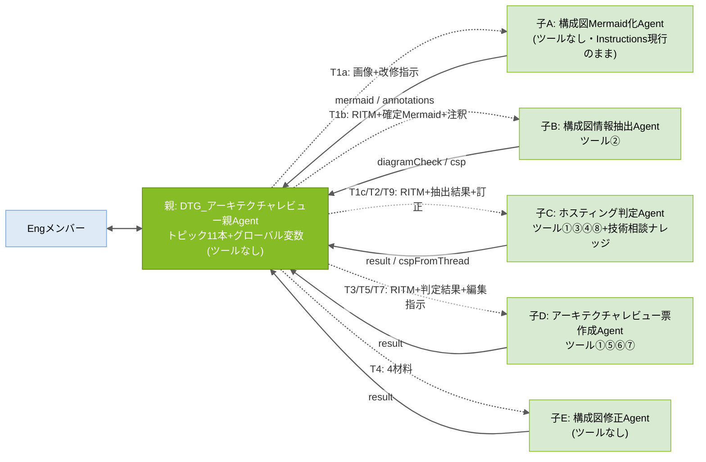

# アーキテクチャレビューAgent 設計書

## 0. 設計方針

### 設計原則(8か条)

| # | 原則 | 内容 |
|---|---|---|
| 1 | 親は連携専任 | 親Agentはツールを持たず、判断・作成をしない。窓口・進行管理・子Agent間のデータ連携のみ。進行管理は**トピック**で行い、受け渡しは**グローバル変数**で行う |
| 2 | 1Agent=1責務 | 構成図Mermaid化(子A)/構成図情報抽出(子B)/ホスティング判定(子C)/アーキテクチャレビュー票作成(子D)/構成図修正案(子E)を分離し、モード判定ミスを構造的に排除 |
| 3 | 全件照合はツールで全文渡し | 判定基準・照合資料・アーキテクチャレビュー票マスタ・観点など「全行を漏れなくチェックする資料」はKnowledge(RAG)に載せず、ツールで全文を渡す。Knowledgeは断片検索で足りる「過去案件の参考提示」のみ |
| 4 | 人の承認ゲート | Agentの出力はすべて「案」。確定・承認・利用者連絡・ナレッジ登録実行の判断は人(Eng/Mgmt)が行う |
| 5 | 共通ルールは単一ソース | 検算ルール(R1〜R4)と共通厳守事項(C1〜C6)は本設計書§1を正とし、各AgentのInstructionsには同一の共通ブロックを貼付する |
| 6 | 1指示=1子Agent | Engの1つの入力に対して親が呼び出す子は1体のみ。子の結果を提示したら停止し、次の入力を待つ。トピックの「質問する」ノードと終了で構造的に保証する |
| 7 | 親はハイブリッド(トピック駆動) | 生成オーケストレーションは**Phase間の振り分け**(どのトピックに入るか)だけに使い、**Phase内の手順・停止・ループはトピックで固定**する。状態はグローバル変数で持ち、「親が覚えている」に依存しない(MS公式「必ず指定どおりに実行させたいものはトピックで包む」に準拠) |
| 8 | 画像を読むのは子Aだけ | 構成図の画像/PDFは子Aだけが読み、人が確認・訂正した**Mermaid+注釈情報**を後続の正とする。子B以降はテキスト処理のみ(画像読取の揺らぎを1か所に閉じ込め、人のゲートで潰す) |

### DRY原則レビューへの対応方針

| ID | 課題 | 対応 | 理由 |
|---|---|---|---|
| 1 | 同じスレッドを子C・子Dが別々に取得している | **意図的に許容** | 当事者が自ら取得することで①親経由の長文受け渡しによる劣化を排除 ②実行のたびに最新スレッドを読める。再検討条件: 応答時間・フロー実行数に問題が出た場合 |
| 2 | CSP判定を複数Agentが行っている(①のスレッド判定+子BのMermaid由来推定) | **意図的に許容** | 出所の異なる2判定を親(トピックT1c)が突き合わせ、不一致時にEngへ確認する安全弁 |
| 3 | 「全件チェック」の検算ルールがバラバラ | **一本化**: §1.1のR1〜R4に集約 | 保守性 |
| 4 | 同じ禁止事項を複数回書いている | **共通化**: §1.2のC1〜C6を共通ブロック(§1.3)として貼付 | 同上 |
| 5 | Instructions全文が設計書とInstructions集の両方にある | **単一化**: Instructions集を正とし、設計書は設計のみ | 二重更新の防止 |
| 6 | 子Agentが5体(MS公式は「サブタスクごとにAgentを作らない」を推奨)(v6.0追加) | **意図的に許容** | 各子が固有のツール・入出力・ループ(子Aの改修ループ、子Dの修正ループ)を持ち、責務境界が明確。MS公式の「固有のツール/ナレッジを持つ領域は分ける」に該当。選択肢数(子5+トピック11+ツール0)は劣化目安の30〜40未満 |

---

## 1. 共通ルール(単一ソース。改訂時はここを更新→全Agentへ貼り直し)

### 1.1 検算ルール(R1〜R4)

「検算」とは、**AIが処理を途中で飛ばしていないかを件数の突き合わせで機械的に確認する仕組み**。

| ID | 名称 | 実施者 | 何と何を突き合わせるか | 何のための確認か | 不一致時の動作 |
|---|---|---|---|---|---|
| **R1** | 構成図チェック観点の実施漏れ確認 | 子B | 実際に判定した観点の件数 ⇔ 観点mdの内訳から算出した「チェックすべき観点の件数」(共通観点+該当CSP観点) | 構成図チェックの観点をAIが飛ばしていないか | 出力せずにやり直す。md内訳表記と実際の行数が食い違う場合は実際の行数を正とし、警告を付けて出力 |
| **R2** | アーキテクチャレビュー票の標準指摘の仕分け漏れ確認 | 子D | ①流用+②添削+④不要 の合計件数 ⇔ アーキテクチャレビュー票mdの全行数 | マスタの行が検討されずに漏れていないか(③追記は分母に含めない) | 出力せずにやり直す |
| **R3** | アーキテクチャレビュー票Excelへの転記漏れ確認 | 子D | ツール⑥が返した書き込み件数 ⇔ 載せるべき行数(①+②+③) | Excelへの転記に失敗した行がないか | Engへ報告する |
| **R4** | 利用者回答の仕分け漏れ確認 | 子D | [回答済み]+[未回答]+[要確認] の合計件数 ⇔ ツール⑦が返した「全行数: NN件」 | 回答済み票の行を飛ばして仕分けていないか | 出力せずにやり直す |

### 1.2 共通厳守事項(C1〜C6)

| ID | 内容 |
|---|---|
| **C1** | すべての出力は「案(仮判定・下書き)」である。確定・承認・利用者への連絡・ナレッジ登録の実行判断は人(Eng/Mgmt)が行う |
| **C2** | 推測しない。渡された材料・ツール出力に無い事項を補完しない。判断・指摘には根拠(基準ID・資料名・記載箇所・ノードID)を必ず添える |
| **C3** | 全件処理する。照合・仕分け対象の全行を順に処理し、スキップしない。該当する検算ルール(R1〜R4)を実施し、不一致のまま出力しない |
| **C4** | 自分の役割の外に出ない。役割定義外の判断・作成を行わない。**構成図の画像/PDFの解析は子A(構成図Mermaid化Agent)のみが行い、子B以降はMermaid+注釈情報のテキストだけを読む** |
| **C5** | 作業過程・計画・途中経過・ツール出力の原文はチャットに出力しない。最終成果物のみを返す(Engが原文を明示依頼した場合を除く) |
| **C6** | Web上の一般情報は使用しない |

### 1.3 共通ブロック(全AgentのInstructions末尾にこのまま貼付)

```text
# 共通厳守事項(全Agent共通・設計書§1が正)
- C1: すべての出力は「案(仮判定・下書き)」。確定・承認・利用者連絡・ナレッジ登録実行の判断は人(Eng/Mgmt)が行う。
- C2: 推測しない。渡された材料・ツール出力に無い事項を補完しない。判断・指摘には根拠(基準ID・資料名・記載箇所・ノードID)を必ず添える。
- C3: 全件処理する。照合・仕分け対象の全行を順に処理し、スキップしない。該当する検算ルール(R1〜R4)を実施し、不一致のまま出力しない。
- C4: 自分の役割の外に出ない。役割定義外の判断・作成を行わない。構成図の画像の解析は構成図Mermaid化Agentのみが行う。
- C5: 作業過程・途中経過・ツール出力の原文は出力しない。最終成果物のみを返す(Engが明示依頼した場合を除く)。
- C6: Web上の一般情報は使用しない。
```

※子A(構成図Mermaid化Agent)のInstructionsは現行のものを変更しないため、この共通ブロックは貼付しない(子Aの指示文内の「絶対に守ること」が同等の役割を担う)。

---

## 2. Agent構成と関連図

### 2.1 実装方式

**子Agent方式**(親の「エージェント」タブから子を新規作成)は変更なし。親の進行制御を**ハイブリッド方式**に変更する。

| 層 | 担当 | 内容 |
|---|---|---|
| Phase間の振り分け | 生成オーケストレーション | Engの入力(「レビューして」「抽出して」…)を、**トピックの説明文**に基づいて該当トピックへ振り分ける |
| Phase内の手順 | トピック(11本) | 「入力を受け取る→子Agentを呼ぶ→出力を変数に保存→Engへ提示→次の指示を案内して終了」を固定手順として持つ。改修ループが必要なPhaseは「質問する」ノードで入力を待ち、自己リダイレクトで繰り返す |
| 状態の保持 | グローバル変数 | RITM・確定Mermaid・注釈・抽出結果・判定結果・編集指示(案/確定)・回答回収結果・ナレッジ文案 |
| 子との受け渡し | 子Agentの入力・出力定義 | トピックの「エージェントを追加する」ノードで子の入力に変数を渡し、子の出力を変数で受け取る |
| 親のInstructions | 原則のみ | 役割・原則(1指示=1子、子を直接呼ばずトピックで実行)・受け渡し規則・C1〜C6。約1,000字 |

MS公式の根拠: 「必ず指定どおりに実行させたいものは決定的に扱う(AIプランナーに公開しない、またはユーザー確認を要するトピックで包む)」「トピック内から子Agentへ明示的にリダイレクトでき、子Agentに入力・出力を定義すると出力ごとにトピック変数が自動作成される」「子Agentは常に親の文脈を受け取る」。

### 2.2 Agent構成(親1+子5)

| 設計上の呼び名 | Copilot Studio上のAgent名 | 役割 | ツール | Knowledge | 入力(トピックから) | 出力(トピックへ) |
|---|---|---|---|---|---|---|
| **親** | `DTG_アーキテクチャレビュー親Agent` | Engとの唯一の会話窓口。トピックで進行管理、子の呼出し、変数での受け渡し、Engへの提示、承認ゲート | なし | なし | — | — |
| **子A: 構成図Mermaid化Agent** | `構成図Mermaid化Agent` | 構成図の画像/PDFをMermaidコード+注釈情報に書き起こす。Engの改修指示を反映して再出力。**Instructionsは現行のまま変更しない** | なし | なし | instruction / previousMermaid / previousAnnotations(画像は会話の添付から) | mermaid / annotations |
| **子B: 構成図情報抽出Agent** | `構成図情報抽出Agent` | Mermaid+注釈情報から事実抽出+観点別チェック(検算R1)。画像は読まない | ② | なし | ritm / mermaid / annotations | diagramCheck / csp |
| **子C: ホスティング判定Agent** | `ホスティング判定Agent` | スレッド取得→ノックアウト要件・Salus・検証状況照合→DCS Hub/Disconnect判定。不足時はヒアリング文案。クローズ時はナレッジ文案作成・(承認後)登録 | ①③④⑧ | 技術相談ナレッジ(参考のみ) | mode / ritm / diagramCheck / engCorrection / approvedDraft | result / cspFromThread |
| **子D: アーキテクチャレビュー票作成Agent** | `アーキテクチャレビュー票作成Agent` | 編集指示(R2)→票md→Excel生成(R3)→回答回収(R4) | ①⑤⑥⑦ | なし | mode / ritm / csp / judgement / editInstruction / engFeedback / answerResult | result |
| **子E: 構成図修正Agent** | `構成図修正Agent` | 4つの材料(抽出結果・確定Mermaid・判定結果・確定版編集指示)を突き合わせ、構成図修正指示(文案)を作成 | なし | なし | diagramCheck / mermaid / judgement / editFinal | result |

**名前の一致**: 親のトピックは子をノードで直接選ぶため、v5系のような「名前の文字列一致」への依存は無くなる。ただしトピックの説明文とEngの指示語は一致させる。

### 2.3 関連図(委任=点線/返却=実線。すべて親のトピック経由)



### 2.4 ツール一覧(利用順・8本)

| No | ツール名 | 説明 | 用途 | 持ち主 | 備考 |
|---|---|---|---|---|---|
| ① | Teamsスレッド内容取得 | 共通_Engineering標準化チャネルからRITM番号でスレッドを特定(件名+本文を検索)し、親投稿・全返信(HTML→テキスト変換済み)・添付ファイル一覧を取得。本文からCSP(Azure/GCP/AWS/不明)を判定して返す。入力でCSPを指定した場合はそれを優先 | 子C: 判定時に案件情報・ホスティング判断アプリの結果・利用者回答を読む(再判断のたびに再取得)。子D: アーキテクチャレビュー票作成時に案件情報と、Excelファイル名に使うCSPを得る | 子C・子D | スレッドを使う当事者が自ら取得することで、親経由の長文受け渡しによる劣化を排除し、常に最新を読む(方針ID1)。**実装済み** |
| ② | 構成図チェック観点取得 | AI連携用フォルダの構成図チェック観点.mdを全文取得して返す | 子Bが観点の実行仕様、および検算R1の分母として使う | 子B | 観点は子Bの抽出処理だけが使う実行仕様のため。**実装済み**(判定方法をMermaid前提で書いた正式版mdへの差し替えは未・P5) |
| ③ | ホスティング判定基準取得 | AI連携用フォルダのホスティング判定基準.md(ノックアウト要件のみ)を全文取得して返す | 子Cがノックアウト要件を1件ずつ照合するために使う | 子C | 判定処理と不可分の実行仕様のため。**実装済み**(正式版mdは未・P4) |
| ④ | サービス照合資料取得 | Salus_Status一覧.mdとサービス検証状況.mdを取得し、`salusStatus` / `serviceVerification` の2出力で返す | 子Cが利用予定サービスを「Salus status」と「検証状況(3区分)」の両面で同時照合するために使う | 子C | 両資料は常に同時照合するため1ツールに集約。**実装済み**(サービス検証状況.mdはテスト内容のみ・P6) |
| ⑤ | アーキテクチャレビュー票取得 | 入力CSPに応じて、CSP別アーキテクチャレビュー票md(固定ファイル名)を全文取得して返す | 子Dが編集指示の分母(検算R2の「全NN行」)として使う | 子D | マスタは編集指示の検算分母として子Dだけが全文を必要とするため。**実装済み** |
| ⑥ | アーキテクチャレビュー票Excel作成 | RITM番号・CSP・行データJSONを受領→雛形xlsxをコピーして送付フォルダに「【案件名】(RITMxxxxxxx)アーキテクチャレビュー票(CSP).xlsx」を作成→JSON解析→Officeスクリプト「アーキテクチャレビュー_行追加」でテーブル`T_アーキテクチャレビュー票`へ行追加→書き込み件数+ファイルリンクを返す | 子Dが確定版の編集指示から利用者送付用Excelを作るために使う(転記はフローの機械処理) | 子D | 票を確定させた本人が生成まで行うことで転記ズレをなくす(検算R3)。**実装済み**。動的ファイル指定のためOfficeスクリプト方式。ファイル指定は「ファイルの作成」出力の`Path`。行データJSONのキーはExcel見出しと完全一致(「No.」のピリオド含む)。【案件名】は人が書き換える |
| ⑦ | 回答済みアーキテクチャレビュー票取得 | RITM番号を受領→チャネルファイルフォルダの一覧→RITM番号を含む→「アーキテクチャレビュー票」を含む.xlsxに絞込→最終更新が最新の1件→テーブル読取→「対象ファイル名/全行数/md表(No・ステータス・指摘概要・指摘内容・回答内容・回答者・回答日)」を返す。該当なしは固定メッセージ | 子Dが利用者回答を読み、[回答済み]/[未回答]/[要確認]に仕分けるために使う(検算R4) | 子D | 票のライフサイクル(作成→送付→回収)を同一Agentに集約。**実装済み**。詳細はツール設計書v1.1 |
| ⑧ | 技術相談ナレッジ追記 | 16項目を受領→技術相談ナレッジListへ「項目の作成」→登録リンクを返す | 子CがEng承認→親(T9)の指示後にナレッジを登録するために使う | 子C | 文案作成者と実行者を一致させる。実行は承認後のみ(C1)。**未実装** |

### 2.5 親のトピック一覧(11本。詳細仕様はInstructions集v6.0)

| ID | トピック名 | Engの指示(トリガー) | 呼ぶ子 | 停止の作り方 |
|---|---|---|---|---|
| T1a-1 | 構成図のMermaid化(初回) | 「RITMxxxをレビューして」+画像 | 子A | 提示後 T1a-2 へ移動 |
| T1a-2 | Mermaidの改修ループ | (T1a-1から自動) | 子A | 「質問する」で改修指示 or『完了』を待つ。改修なら再呼び出し→自己リダイレクト |
| T1b | 構成図の情報抽出 | 「抽出して」 | 子B | 提示して終了 |
| T1c | ホスティング判定 | 「判定して」(+訂正・補足) | 子C | 提示して終了 |
| T2 | 再判定 | 「再判断して」 | 子C | 提示して終了 |
| T3-1 | アーキテクチャレビュー票作成 | 「レビュー票を作成して」/「レビュー票を見直して」(+指摘) | 子D | 提示後 T3-2 へ移動 |
| T3-2 | 編集指示の修正ループ | (T3-1から自動) | 子D | 「質問する」で修正点 or『確定』を待つ。修正なら再呼び出し→自己リダイレクト |
| T4 | 構成図修正案 | 「修正モードを実行して」 | 子E | 提示して終了 |
| T5 | 送付用Excel生成 | 「Excelを作成して」 | 子D | 提示して終了 |
| T7 | 回答回収 | 「回答を確認して」 | 子D | 提示して終了 |
| T9 | ナレッジ登録 | 「ナレッジに登録して」 | 子C(2回) | 文案提示→「質問する」で『承認』を待つ→登録実行 |

---

## 3. Input / Output

### 3.1 Input一覧(Agentが読む材料)

| 名称 | 実体・場所 | 用途(誰がどのステップで使う) | 保守 |
|---|---|---|---|
| Teamsスレッド(事前相談) | 共通_Engineering標準化チャネル | 子C(判定)・子D(票作成)がツール①で取得 | —(業務の中で蓄積) |
| 構成図(画像/PDF) | Engが親Agentのチャットへ添付(**必須**) | **子A(Mermaid化)だけ**が読む。子B以降は読まない | 案件ごとにEngが用意。凡例付きが望ましい |
| 確定Mermaid+注釈情報 | 親のグローバル変数(子Aの出力をEngが確認・改修した最終版) | 子B(抽出)・子E(修正案)の入力。図の「正」 | 案件ごとに生成 |
| 構成図チェック観点.md | AI連携用フォルダ | 子B(抽出)がツール②で取得。観点の実行仕様・検算R1の分母。**「AI判定方法」列はMermaid前提**(ノード/subgraph/接続/ラベル/注釈情報のどれを見て判定するか)で書く | ファイル差し替え。増減時はヘッダー内訳も更新 |
| ホスティング判定基準.md | AI連携用フォルダ | 子C(判定)がツール③で取得 | ファイル差し替え |
| Salus_Status一覧.md / サービス検証状況.md | AI連携用フォルダ | 子C(判定)がツール④で取得 | ファイル差し替え |
| アーキテクチャレビュー票.md×3CSP | AI連携用フォルダ | 子D(票作成)がツール⑤で取得。検算R2の分母 | 改版=該当mdの差し替え |
| アーキテクチャレビュー票Excel雛形.xlsx | AI連携用フォルダ | ツール⑥のコピー元。テーブル`T_アーキテクチャレビュー票`。シート保護なし | 体裁変更=雛形差し替え |
| Officeスクリプト「アーキテクチャレビュー_行追加」 | OneDrive「Documents/Office スクリプト」 | ツール⑥が実行 | テーブル名のみ固定 |
| 回答済みアーキテクチャレビュー票(xlsx) | チャネルファイルフォルダ | 子D(回答回収)がツール⑦で取得。ファイル名のRITM部分・「アーキテクチャレビュー票」を変えない | —(Teams標準動作) |
| 技術相談ナレッジList | SharePoint List | 子CのKnowledge(参考のみ)。ツール⑧の追記先 | List直接管理 |

### 3.2 Output一覧(Agent・ツールが生み出す成果物)

| 名称 | 生成者 | 内容 | 目的 | 格納先 |
|---|---|---|---|---|
| Mermaidコード+注釈情報 | 子A | 構成図をflowchart LRで書き起こしたMermaid(複製ノード等の特例を含む)と、図上の凡例・脚注などMermaidで表せない情報 | Engが確認・改修して**確定版**にする。確定版は子B・子Eの入力 | グローバル変数(親)。EngはMermaid Live/VS Codeで描画確認 |
| 【構成図チェック結果】 | 子B | サービス一覧・NW情報・観点別チェック・不足情報・Mermaidに記載のない箇所+検算R1 | 子Cの判定材料/子Eの材料/Engの確認 | グローバル変数 |
| ホスティング判定結果 | 子C | DCS Hub/Disconnect/Sandbox判定+基準IDごとの理由・Salus照合一覧・検証状況一覧・要人手確認・追加ヒアリング文案 | Engの判断材料。子Eの材料 | グローバル変数 |
| アーキテクチャレビュー票編集指示 | 子D | ①流用/②添削/③追記/④不要+検算R2 | Engの確認・修正の対象。確定版が子Eの材料・Excelの元 | グローバル変数(案/確定) |
| アーキテクチャレビュー票(md) | 子D | 編集指示反映済みの完成形 | Engの内容確認 | チャット |
| 【構成図修正指示(案)】 | 子E | 修正一覧(ノードID/場所/現状/修正内容)+利用者向け依頼文 | Eng確認→Mgmt経由で利用者へ | グローバル変数 |
| アーキテクチャレビュー票Excel | ツール⑥(子D) | 送付用Excel。ファイル名`【案件名】(RITMxxxxxxx)アーキテクチャレビュー票(CSP).xlsx`(【案件名】は人が書き換え) | 利用者への送付物 | 送付フォルダ |
| 回答回収結果 | 子D | 集計・未回答No一覧・要確認一覧・回答済みNo一覧+検算R4 | Engの解消判定の材料 | グローバル変数 |
| ナレッジ登録文案 / 登録(1件) | 子C / ツール⑧ | 16項目の文案 / 承認済み文案のList登録 | Eng承認→登録 | グローバル変数 / 技術相談ナレッジList |

---

## 4. 全体ワークフロー

### 4.1 概要図(色分け: 青=人間/濃緑=親(トピック)/薄緑=子/黄=人間判断分岐)

親のノードは「**受け取ったもの → 行うこと → 呼び出す相手(渡すもの)**」の順で書き、括弧内に実行するトピックIDを示す。子は必ず親の呼び出しノードの直後に置き、子の出力は必ず親の保存ノードへ戻る。

```mermaid
%%{init: {"theme": "base", "themeVariables": {"edgeLabelBackground": "#ffffff00", "lineColor": "#5a5a5a", "fontSize": "13px"}}}%%
flowchart TD
    subgraph P0["Phase 0: 前提(人間のみ)"]
        A["<b>Mgmt</b><br>DCS利用の一次判断・判定アプリ実行<br>結果をスレッドへ投稿→Engへ引継ぎ"]:::human
    end

    subgraph P1a["Phase 1a: 構成図のMermaid化(T1a-1 → T1a-2)"]
        B["<b>Eng</b><br>親へ「RITMxxxxxxxをレビューして」<br>+構成図画像/PDFを添付(必須)"]:::human
        O1a["<b>親</b>(T1a-1) 指示文からRITM番号を入力として受領→Global.RITMへ保存<br>→ 子Aを呼び出し(渡す: 添付画像+指示「Mermaidへ書き起こし」)"]:::parent
        CA1["<b>子A</b> 構成図Mermaid化<br>4パス(文字→ノード→枠→接続)+凡例で書き起こし<br>→Mermaidコード+注釈情報"]:::child
        O1b["<b>親</b>(T1a-1) 出力mermaid/annotationsを受領し下書き変数へ保存<br>→ Engへ提示+「Mermaid Live/VS Codeで確認。修正内容 or『完了』を入力」<br>→ T1a-2へ移動"]:::parent
        D0{"<b>Eng</b><br>Mermaidを描画して原図と照合"}:::decision
        O1c["<b>親</b>(T1a-2) 改修指示を「質問する」で受領<br>→ 子Aを呼び出し(渡す: 直前のMermaid+注釈+改修指示)"]:::parent
        CA2["<b>子A</b> 改修指示を反映<br>→Mermaid+注釈情報を全体再出力"]:::child
        O1d["<b>親</b>(T1a-2) 下書き変数を更新<br>→ Engへ提示 → 再び入力待ち(自己リダイレクト)"]:::parent
        O1e["<b>親</b>(T1a-2) 『完了』を受領<br>→ Global.Mermaid / Global.Annotations に確定<br>→「次は『抽出して』」と案内して終了"]:::parent
    end

    subgraph P1b["Phase 1b: 構成図の情報抽出(T1b)"]
        E1b["<b>Eng</b><br>親へ「抽出して」"]:::human
        O2a["<b>親</b>(T1b) Global.RITM / Mermaid / Annotations を読む<br>→ 子Bを呼び出し(渡す: RITM+確定Mermaid+注釈) ※画像は渡さない"]:::parent
        CB1["<b>子B</b> 構成図情報抽出<br>ツール②観点取得→Mermaid/注釈から要素列挙→CSP推定<br>→観点別チェック→検算R1"]:::child
        O2b["<b>親</b>(T1b) 出力diagramCheck/cspを受領→Global保存<br>→ Engへ提示+「原図と照合。問題なければ『判定して』、訂正は添えて」→終了"]:::parent
        D1{"<b>Eng</b><br>抽出結果を確認"}:::decision
    end

    subgraph P1c["Phase 1c: ホスティング判定(T1c)"]
        E1c["<b>Eng</b><br>親へ「判定して」(+抽出結果への訂正・補足)"]:::human
        O3a["<b>親</b>(T1c) 訂正・補足を入力として受領→Global.EngCorrection保存<br>→ 子Cを呼び出し(渡す: RITM+抽出結果+Engの訂正、mode=判定) ※スレッド本文は渡さない"]:::parent
        CC1["<b>子C</b> ホスティング判定<br>ツール①スレッド取得→③ノックアウト要件→④Salus・検証状況<br>→1件ずつ照合→判定+理由+追加ヒアリング文案"]:::child
        O3b["<b>親</b>(T1c) 出力result/cspFromThreadを受領→Global保存<br>図由来CSPと突合(不一致は表示)<br>→ Engへ提示+次の案内→終了"]:::parent
        D{"<b>Eng</b><br>判定結果を確認"}:::decision
    end

    subgraph P2["Phase 2: 追加ヒアリング〜再判断(T2・複数回あり)"]
        GH["<b>Eng</b><br>ヒアリング文案を確認・修正→Mgmtへ"]:::human
        GM["<b>Mgmt</b><br>利用者へヒアリング→回答をスレッドへ反映→Engへ連絡"]:::human
        E2["<b>Eng</b><br>親へ「再判断して」"]:::human
        O4a["<b>親</b>(T2) Global.RITM / DiagramCheck / EngCorrection を読む<br>→ 子Cを呼び出し(渡す: 同上、mode=再判定)"]:::parent
        CC2["<b>子C</b> 再判定<br>ツール①で最新スレッド(利用者回答含む)を再取得→③④→再照合"]:::child
        O4b["<b>親</b>(T2) Global.Judgement を更新<br>→ Engへ提示→終了"]:::parent
    end

    subgraph P3["Phase 3: アーキテクチャレビュー票作成(T3-1 → T3-2)"]
        E3["<b>Eng</b><br>親へ「レビュー票を作成して」"]:::human
        O5a["<b>親</b>(T3-1) Global.RITM / Judgement を読む<br>→ 子Dを呼び出し(渡す: RITM+判定結果、mode=票作成) ※スレッド本文は渡さない"]:::parent
        CD1["<b>子D</b> 編集指示+票md作成<br>ツール①スレッド取得→⑤票md取得(全NN行)<br>→①流用②添削③追記④不要→検算R2→票md"]:::child
        O5b["<b>親</b>(T3-1) 出力resultを下書き変数へ保存<br>→ Engへ提示+「修正点 or『確定』を入力」→ T3-2へ移動"]:::parent
        D3{"<b>Eng</b><br>編集指示を確認"}:::decision
        O5c["<b>親</b>(T3-2) 修正点を「質問する」で受領<br>→ 子Dを呼び出し(渡す: 直前の編集指示+修正点、mode=修正反映)"]:::parent
        CD1r["<b>子D</b> 修正を反映して全体再出力"]:::child
        O5d["<b>親</b>(T3-2) 下書き変数を更新→提示→再び入力待ち(自己リダイレクト)"]:::parent
        O5e["<b>親</b>(T3-2) 『確定』を受領→Global.EditFinal に確定<br>→「次は『修正モードを実行して』」と案内して終了"]:::parent
    end

    subgraph P4["Phase 4: 構成図修正案(T4)"]
        E4["<b>Eng</b><br>親へ「修正モードを実行して」"]:::human
        O6a["<b>親</b>(T4) 4材料が揃っているか確認<br>→ 子Eを呼び出し(渡す: 材料1 抽出結果+確定Mermaid / 材料2 判定結果 / 材料3 確定版編集指示)"]:::parent
        CE1["<b>子E</b> 構成図修正指示(案)作成<br>材料2・3で決まったことのうち材料1で図に無い・誤っているもの<br>=修正指示(ノードID・接続で指定)"]:::child
        O6b["<b>親</b>(T4) Global.FixInstruction 保存→Engへ提示→終了"]:::parent
        E4b["<b>Eng</b><br>修正指示(案)を確認・修正"]:::human
    end

    subgraph P5["Phase 5: 送付用Excel生成(T5)"]
        E5["<b>Eng</b><br>親へ「Excelを作成して」"]:::human
        O7a["<b>親</b>(T5) Global.EditFinal の有無を確認<br>→ 子Dを呼び出し(渡す: RITM+CSP+確定版編集指示、mode=Excel生成)"]:::parent
        CD2["<b>子D</b> Excel生成<br>確定版→行データJSON(見出しと完全一致)<br>→ツール⑥→返却件数と突合(検算R3)"]:::child
        O7b["<b>親</b>(T5) 件数・リンク・R3結果を保存<br>→ Engへ報告+「Eng確認→Mgmt経由でスレッド連携」を案内→終了"]:::parent
        E5b["<b>Eng</b><br>Excelを確認、【案件名】を書き換え→Mgmtへ"]:::human
    end

    subgraph P6["Phase 6: 送付・回答(人間のみ)"]
        M6["<b>Mgmt</b><br>Excelリンク+構成図修正依頼をスレッドで利用者へ"]:::human
        U6["<b>利用者</b><br>回答記入・構成図修正<br>回答済みExcelをスレッドへ添付返送(ファイル名のRITM部分は変えない)"]:::human
        M6b["<b>Mgmt</b><br>返送を確認→Engへ連絡"]:::human
    end

    subgraph P7["Phase 7: 回答回収(T7)"]
        E7["<b>Eng</b><br>親へ「回答を確認して」"]:::human
        O8a["<b>親</b>(T7) Global.RITM を読む<br>→ 子Dを呼び出し(渡す: RITM、mode=回答回収)"]:::parent
        CD3["<b>子D</b> 回答回収<br>ツール⑦→対象ファイル・全行数・md表<br>→「回答済み」「未回答」「要確認」に仕分け→検算R4"]:::child
        O8b["<b>親</b>(T7) Global.AnswerResult 保存→Engへ提示→終了"]:::parent
        Q{"<b>Eng</b><br>質疑・修正依頼は解消?"}:::decision
    end

    subgraph P8["Phase 8: 最終確認・クローズ(人間のみ)"]
        V["<b>Eng</b><br>判定結果・票・最終構成図を最終確認→Mgmtへ"]:::human
        MF["<b>Mgmt</b><br>利用者へ最終連携"]:::human
        CL["<b>Eng・Mgmt</b><br>スレッドをクローズ"]:::human
    end

    subgraph P9["Phase 9: ナレッジ登録(T9)"]
        E9["<b>Eng</b><br>親へ「ナレッジに登録して」"]:::human
        O9a["<b>親</b>(T9) Global.RITM / Judgement を読む<br>→ 子Cを呼び出し(渡す: RITM+判定結果、mode=ナレッジ文案作成)"]:::parent
        CC3["<b>子C</b> ナレッジ登録文案作成<br>技術相談ナレッジListの16項目<br>確定できない項目は「(未記入)」"]:::child
        O9b["<b>親</b>(T9) 文案を下書き変数へ保存<br>→ Engへ提示+「修正があれば含めて『承認』と入力」→「質問する」で待つ"]:::parent
        D9{"<b>Eng</b><br>文案を確認・修正"}:::decision
        O9c["<b>親</b>(T9) 『承認』(+修正内容)を受領。承認以外なら中止<br>→ 子Cを呼び出し(渡す: 承認済み文案+修正内容、mode=登録実行)"]:::parent
        CC4["<b>子C</b> ナレッジ登録<br>ツール⑧で技術相談ナレッジListへ1件登録"]:::child
        O9d["<b>親</b>(T9) 登録リンクを受領→Engへ登録完了を報告→終了"]:::parent
    end

    A --> B --> O1a --> CA1 --> O1b --> D0
    D0 -->|"修正あり"| O1c --> CA2 --> O1d --> D0
    D0 -->|"『完了』"| O1e --> E1b
    E1b --> O2a --> CB1 --> O2b --> D1
    D1 -->|"問題なし / 訂正を添えて"| E1c
    E1c --> O3a --> CC1 --> O3b --> D

    D -->|"追加確認が必要"| GH --> GM --> E2 --> O4a --> CC2 --> O4b --> D
    D -->|"情報充足"| E3

    E3 --> O5a --> CD1 --> O5b --> D3
    D3 -->|"修正あり"| O5c --> CD1r --> O5d --> D3
    D3 -->|"『確定』"| O5e --> E4

    E4 --> O6a --> CE1 --> O6b --> E4b --> E5
    E5 --> O7a --> CD2 --> O7b --> E5b --> M6 --> U6 --> M6b --> E7
    E7 --> O8a --> CD3 --> O8b --> Q

    Q -->|"未解消:『レビュー票を見直して』+指摘"| O5a
    Q -->|"構成・前提の変更あり"| B
    Q -->|"解消・最終合意"| V --> MF --> CL --> E9

    E9 --> O9a --> CC3 --> O9b --> D9
    D9 -->|"『承認』(+修正内容)"| O9c --> CC4 --> O9d

    classDef human fill:#deebf7,stroke:#7da2d6,color:#000000;
    classDef parent fill:#86bc25,stroke:#5e8a14,color:#ffffff;
    classDef child fill:#d9ead3,stroke:#86bc25,color:#000000;
    classDef decision fill:#ffe599,stroke:#c9a227,color:#000000;
    linkStyle default stroke:#5a5a5a,stroke-width:1.5px;
```



### 4.2 親が保持する状態(グローバル変数)

親の「保持」はすべてグローバル変数で行う。変数名はInstructions集v6.0のトピック仕様と一致させる。

| 変数 | 内容 | 設定するトピック | 使うトピック |
|---|---|---|---|
| Global.RITM | RITM番号(半角) | T1a-1 | 全て |
| Global.MermaidDraft / Global.AnnotationsDraft | Mermaid化の下書き(改修ループ中) | T1a-1, T1a-2 | T1a-2 |
| Global.Mermaid / Global.Annotations | **確定**Mermaid+注釈情報 | T1a-2(『完了』時) | T1b, T4 |
| Global.DiagramCheck | 【構成図チェック結果】 | T1b | T1c, T2, T4 |
| Global.CspFromDiagram | 子Bが推定したCSP | T1b | T1c(突合) |
| Global.EngCorrection | 抽出結果へのEngの訂正・補足 | T1c | T1c, T2 |
| Global.Judgement | ホスティング判定結果(最新) | T1c, T2 | T3-1, T4, T9 |
| Global.CspFromThread | スレッド由来CSP | T1c | T1c(突合), T5 |
| Global.EditDraft | 編集指示(案・修正ループ中) | T3-1, T3-2 | T3-2 |
| Global.EditFinal | **確定版**編集指示 | T3-2(『確定』時) | T4, T5 |
| Global.FixInstruction | 構成図修正指示(案) | T4 | — |
| Global.ExcelResult | 書き込み件数・リンク・R3 | T5 | — |
| Global.AnswerResult | 回答回収結果 | T7 | T3-1(見直し時) |
| Global.KnowledgeDraft | ナレッジ登録文案 | T9 | T9 |

### 4.3 フェーズ別の動作詳細

各ステップで「誰が・誰から何を受け取り・何を行い・誰へ何を渡すか」を示す。親の行は実行するトピックとノードを括弧で示す。

#### Phase 0: 前提(人間・Agent関与なし)

| Step | 主体 | 受け取る(誰から・何を) | 行うこと | 渡す(誰へ・何を) |
|---|---|---|---|---|
| 0-1 | Mgmt | 利用者から: 事前相談 | DCS利用の一次判断。ホスティング判断アプリを実行 | スレッドへ: 案件情報+判断アプリ結果を投稿 |
| 0-2 | Mgmt | — | Engへ引き継ぎ | Engへ: RITM番号とスレッドの連絡 |

#### Phase 1a: 構成図のMermaid化 — Engの指示「RITMxxxxxxxをレビューして」+画像(T1a-1 → T1a-2)

| Step | 主体 | 受け取る(誰から・何を) | 行うこと | 渡す(誰へ・何を) |
|---|---|---|---|---|
| 1a-1 | Eng | Mgmtから: RITM番号 | 親のチャットへ「RITM1234567をレビューして」を投稿し、構成図画像/PDFを**同じメッセージに添付**(必須) | 親へ: 指示文+画像 |
| 1a-2 | 親(T1a-1 トリガー) | Engから: 指示文+画像 | 生成オーケストレーションがT1a-1を選択し、トリガー入力`RITM番号`を指示文から抽出(無ければ自動で聞き返す)。Global.RITMへ保存 | — |
| 1a-3 | 親(T1a-1 エージェントノード) | — | 子Aを呼び出す | 子Aへ: instruction=「添付された構成図をMermaidへ書き起こしてください」、previousMermaid=空、previousAnnotations=空(画像は会話の添付として子Aが受け取る) |
| 1a-4 | 子A | 親から: 上記+添付画像 | 4パス(文字→ノード→枠と包含→接続)+凡例で書き起こし。図に無いものは足さない。DCS Service Hub内firewallの複製ノード等の特例を適用 | 親へ: mermaid(コード)、annotations(注釈情報) |
| 1a-5 | 親(T1a-1 変数設定→メッセージ→リダイレクト) | 子Aから: mermaid / annotations | Global.MermaidDraft / AnnotationsDraft へ保存 | Engへ: Mermaidコード+注釈情報+「Mermaid LiveまたはVS Codeで描画して原図と照合してください。修正があれば内容を、問題なければ『完了』と入力してください」→ T1a-2へ移動 |
| 1a-6 | Eng | 親から: Mermaid+注釈 | Mermaid Live / VS Codeで描画し、原図と照合。誤り・不足があれば改修指示を用意 | 親へ: 改修指示 または『完了』 |
| 1a-7 | 親(T1a-2 質問ノード→条件) | Engから: 入力 | 入力が『完了』か判定 | — |
| 1a-8 | 親(T1a-2 改修分岐) | (改修指示の場合) | 子Aを呼び出す | 子Aへ: instruction=Engの改修指示、previousMermaid=Global.MermaidDraft、previousAnnotations=Global.AnnotationsDraft |
| 1a-9 | 子A | 親から: 上記 | 改修指示を最小変更として反映し、Mermaid+注釈を**全体**再出力(解釈が分かれる場合のみ質問) | 親へ: mermaid / annotations |
| 1a-10 | 親(T1a-2) | 子Aから: 出力 | 下書き変数を更新 | Engへ: 再出力を提示 → T1a-2の先頭へ自己リダイレクト(1a-6へ戻る) |
| 1a-11 | 親(T1a-2 完了分岐) | (『完了』の場合) | Global.Mermaid / Global.Annotations に下書きを確定。下書き変数は残す(再改修時に使用) | Engへ:「構成図を確定しました。次は『抽出して』と指示してください」→ 終了 |

#### Phase 1b: 構成図の情報抽出 — Engの指示「抽出して」(T1b)

| Step | 主体 | 受け取る(誰から・何を) | 行うこと | 渡す(誰へ・何を) |
|---|---|---|---|---|
| 1b-1 | Eng | 親から: 確定案内 | 親へ「抽出して」を投稿 | 親へ: 指示文 |
| 1b-2 | 親(T1b 条件) | Engから: 指示文 | Global.Mermaid が空なら「先に構成図のMermaid化を完了してください」と案内して終了 | — |
| 1b-3 | 親(T1b エージェントノード) | — | 子Bを呼び出す。**画像は渡さない** | 子Bへ: ritm=Global.RITM、mermaid=Global.Mermaid、annotations=Global.Annotations |
| 1b-4 | 子B | 親から: 上記 | ツール②で観点md取得→Mermaidのノード・subgraph・接続・ラベルと注釈情報から要素を列挙→ラベル文字列のみを根拠にCSP推定→適用観点(共通+該当CSP)に絞込→観点の「AI判定方法」(Mermaid前提)に従い1件ずつ判定→検算R1。複製ノード(`_copy_N`)は実体1つとして数える | 親へ: diagramCheck(【構成図チェック結果】全文)、csp |
| 1b-5 | 親(T1b 変数設定→メッセージ) | 子Bから: 出力 | Global.DiagramCheck / CspFromDiagram へ保存 | Engへ:【構成図チェック結果】原文+「原図・Mermaidと照合し、問題なければ『判定して』と指示してください。訂正・補足があれば『判定して。CSPはAWS…』のように添えてください」→ 終了 |
| 1b-6 | Eng | 親から: 抽出結果 | サービス一覧・NW情報・CSP推定を確認。誤りがあれば訂正内容を用意 | — |

#### Phase 1c: ホスティング判定 — Engの指示「判定して」(T1c)

| Step | 主体 | 受け取る(誰から・何を) | 行うこと | 渡す(誰へ・何を) |
|---|---|---|---|---|
| 1c-1 | Eng | — | 親へ「判定して」を投稿。訂正・補足があれば同じメッセージに書く | 親へ: 指示文(+訂正・補足) |
| 1c-2 | 親(T1c トリガー→変数設定) | Engから: 指示文 | トリガー入力`訂正・補足`(任意)を抽出し Global.EngCorrection へ保存。Global.DiagramCheck が空なら「構成図なし」として扱い「構成図: Eng目視確認が必要」を付記 | — |
| 1c-3 | 親(T1c エージェントノード) | — | 子Cを呼び出す。**スレッド本文は渡さない** | 子Cへ: mode=判定、ritm、diagramCheck、engCorrection |
| 1c-4 | 子C | 親から: 上記 | ツール①(RITM→スレッド全文+CSP)→ツール③→ツール④→Engの訂正があれば抽出結果より優先→ノックアウト要件を1件ずつ照合(DCS Hub優先)→サービスを両資料と照合→不足情報ごとにヒアリング文案 | 親へ: result(ホスティング判定結果全文)、cspFromThread |
| 1c-5 | 親(T1c 変数設定→条件→メッセージ) | 子Cから: 出力 | Global.Judgement / CspFromThread へ保存。CspFromDiagram と CspFromThread が両方あり不一致なら注意文を付ける | Engへ: 判定結果原文(+CSP不一致の注意)+「追加確認が必要なら Eng確認→Mgmt経由でヒアリング→反映後『再判断して』。充足なら『レビュー票を作成して』」→ 終了 |
| 1c-6 | Eng | 親から: 判定結果 | 内容を確認し分岐。追加確認が必要 → Phase 2。情報充足 → Phase 3 | — |

#### Phase 2: 追加ヒアリング〜再判断 — Engの指示「再判断して」(T2・複数回あり得る)

| Step | 主体 | 受け取る(誰から・何を) | 行うこと | 渡す(誰へ・何を) |
|---|---|---|---|---|
| 2-1 | Eng | 親から: 追加ヒアリング文案 | 質問内容の妥当性を確認・修正 | Mgmtへ: 確定した質問文 |
| 2-2 | Mgmt | Engから: 質問文 | 利用者へヒアリング。回答をスレッドへ投稿 | スレッドへ: 利用者回答。Engへ: 反映の連絡 |
| 2-3 | Eng | Mgmtから: 反映の連絡 | 親へ「再判断して」を投稿 | 親へ: 指示文 |
| 2-4 | 親(T2 エージェントノード) | Engから: 指示文 | 保持済みの変数を使う(Engに再入力させない) | 子Cへ: mode=再判定、ritm、diagramCheck、engCorrection |
| 2-5 | 子C | 親から: 上記 | ツール①で最新スレッド(利用者回答を含む)を再取得→③④→再照合→判定を更新 | 親へ: result、cspFromThread |
| 2-6 | 親(T2 変数設定→メッセージ) | 子Cから: 出力 | Global.Judgement を更新 | Engへ: 更新後判定結果の原文→ 終了 |
| 2-7 | Eng | 親から: 更新後判定結果 | 1c-6と同じ分岐。充足するまでPhase 2を繰り返す | — |

#### Phase 3: アーキテクチャレビュー票作成 — Engの指示「レビュー票を作成して」(T3-1 → T3-2)

| Step | 主体 | 受け取る(誰から・何を) | 行うこと | 渡す(誰へ・何を) |
|---|---|---|---|---|
| 3-1 | Eng | 親から: 判定結果(充足済み) | 親へ「レビュー票を作成して」を投稿(Phase 7からの戻りは「レビュー票を見直して」+指摘) | 親へ: 指示文(+指摘) |
| 3-2 | 親(T3-1 エージェントノード) | Engから: 指示文 | **スレッド本文は渡さない** | 子Dへ: mode=票作成、ritm、judgement=Global.Judgement、answerResult=Global.AnswerResult(あれば)、engFeedback=指摘(あれば) |
| 3-3 | 子D | 親から: 上記 | ツール①(スレッド全文+CSP。「不明」なら停止しEng確認)→ツール⑤(票md全文+全NN行)→全行を①〜④に仕分け→検算R2→票md作成 | 親へ: result(編集指示+票md+適用テンプレート名) |
| 3-4 | 親(T3-1 変数設定→メッセージ→リダイレクト) | 子Dから: result | Global.EditDraft へ保存 | Engへ: 編集指示と票mdの原文+「修正があれば修正点を、問題なければ『確定』と入力してください」→ T3-2へ移動 |
| 3-5 | Eng | 親から: 編集指示+票md | 内容を確認 | 親へ: 修正点(例:「No.5は不要にして」) または『確定』 |
| 3-6 | 親(T3-2 質問ノード→条件) | Engから: 入力 | 『確定』なら Global.EditFinal ← Global.EditDraft、「次は『修正モードを実行して』」と案内して終了。修正なら子Dを呼び出し(mode=修正反映、editInstruction=Global.EditDraft、engFeedback=修正点)→ 出力で Global.EditDraft を更新→提示→ T3-2の先頭へ自己リダイレクト | (修正時)子Dへ: 上記 |

#### Phase 4: 構成図修正案 — Engの指示「修正モードを実行して」(T4)

| Step | 主体 | 受け取る(誰から・何を) | 行うこと | 渡す(誰へ・何を) |
|---|---|---|---|---|
| 4-1 | Eng | — | 親へ「修正モードを実行して」を投稿 | 親へ: 指示文 |
| 4-2 | 親(T4 条件→エージェントノード) | Engから: 指示文 | Global.DiagramCheck / Mermaid / Judgement / EditFinal が揃っているか確認(欠けていれば不足を案内して終了) | 子Eへ: diagramCheck、mermaid、judgement、editFinal |
| 4-3 | 子E | 親から: 4材料 | 「判定結果・確定版編集指示で決まったこと」のうち「抽出結果・Mermaidの時点で図に無い・誤っているもの」を修正指示として列挙(ノードID・接続で対象を指定)。利用者向け依頼文を下書き | 親へ: result(【構成図修正指示(案)】) |
| 4-4 | 親(T4 変数設定→メッセージ) | 子Eから: result | Global.FixInstruction へ保存 | Engへ: 原文+「確認後『Excelを作成して』」→ 終了 |
| 4-5 | Eng | 親から: 修正指示(案) | 確認・修正。問題なければPhase 5へ | — |

#### Phase 5: 送付用Excel生成 — Engの指示「Excelを作成して」(T5)

| Step | 主体 | 受け取る(誰から・何を) | 行うこと | 渡す(誰へ・何を) |
|---|---|---|---|---|
| 5-1 | Eng | — | 親へ「Excelを作成して」を投稿 | 親へ: 指示文 |
| 5-2 | 親(T5 条件→エージェントノード) | Engから: 指示文 | Global.EditFinal が空なら「先にレビュー票を確定してください」と案内して終了 | 子Dへ: mode=Excel生成、ritm、csp=Global.CspFromThread、editInstruction=Global.EditFinal |
| 5-3 | 子D | 親から: 上記 | 確定版から行データJSONを組み立て(キー8つ・Excel見出しと完全一致)→ツール⑥→返却件数と突合(検算R3) | 親へ: result(書き込み件数+Excelリンク+検算R3) |
| (⑥内部) | フロー | 子Dから: RITM/CSP/JSON | 雛形取得→ファイル作成→JSON解析→Officeスクリプトで行追加 | 子Dへ: result(件数)+fileLink |
| 5-4 | 親(T5 変数設定→メッセージ) | 子Dから: result | Global.ExcelResult へ保存 | Engへ: 件数・リンク・R3+「Eng確認→Mgmt経由でスレッド連携」→ 終了 |
| 5-5 | Eng | 親から: リンク | Excelを開いて確認。**ファイル名の【案件名】を実際の案件名に書き換える** | Mgmtへ: Excelリンク+構成図修正依頼文 |

#### Phase 6: 利用者への送付・回答(人間のみ)

| Step | 主体 | 受け取る(誰から・何を) | 行うこと | 渡す(誰へ・何を) |
|---|---|---|---|---|
| 6-1 | Mgmt | Engから: Excelリンク+修正依頼文 | スレッドで利用者へ連携 | 利用者へ: スレッド投稿 |
| 6-2 | 利用者 | Mgmtから: スレッド投稿 | 回答を記入・構成図を修正。回答済みExcelをスレッドへ添付返送(ファイル名のRITM部分・「アーキテクチャレビュー票」は変えない) | スレッドへ: 回答済みExcel |
| 6-3 | Mgmt | 利用者から: 返送 | 返送を確認 | Engへ: 返送の連絡 |

#### Phase 7: 回答回収 — Engの指示「回答を確認して」(T7)

| Step | 主体 | 受け取る(誰から・何を) | 行うこと | 渡す(誰へ・何を) |
|---|---|---|---|---|
| 7-1 | Eng | Mgmtから: 返送の連絡 | 親へ「回答を確認して」を投稿 | 親へ: 指示文 |
| 7-2 | 親(T7 エージェントノード) | Engから: 指示文 | — | 子Dへ: mode=回答回収、ritm |
| 7-3 | 子D | 親から: RITM | ツール⑦→対象ファイル名/全行数/md表→全行を[回答済み]/[未回答]/[要確認]に仕分け→検算R4。未添付メッセージなら「回答未着」とだけ報告 | 親へ: result(回答回収結果) |
| (⑦内部) | フロー | 子Dから: RITM | チャネルフォルダ一覧→RITMで絞込→「アーキテクチャレビュー票」+.xlsxで絞込→最新1件→テーブル読取→md整形 | 子Dへ: answerSheet+fileName |
| 7-4 | 親(T7 変数設定→メッセージ) | 子Dから: result | Global.AnswerResult へ保存 | Engへ: 原文+「未解消なら『レビュー票を見直して』+指摘、前提変更なら『レビューして』からやり直し、解消なら最終確認後『ナレッジに登録して』」→ 終了 |
| 7-5 | Eng | 親から: 回答回収結果 | 解消判定。未解消 → Phase 3(T3-1に指摘を添えて)。構成・前提の変更あり → Phase 1a。解消 → Phase 8 | — |

#### Phase 8: 最終確認・クローズ(人間のみ)

| Step | 主体 | 受け取る(誰から・何を) | 行うこと | 渡す(誰へ・何を) |
|---|---|---|---|---|
| 8-1 | Eng | 親から: 回答回収結果(解消) | 判定結果・アーキテクチャレビュー票・最終構成図の妥当性を最終確認 | Mgmtへ: 最終結果 |
| 8-2 | Mgmt | Engから: 最終結果 | 利用者へ最終連携 | 利用者へ: スレッド投稿 |
| 8-3 | Eng・Mgmt | — | スレッドをクローズ | — |

#### Phase 9: ナレッジ登録 — Engの指示「ナレッジに登録して」(T9)

| Step | 主体 | 受け取る(誰から・何を) | 行うこと | 渡す(誰へ・何を) |
|---|---|---|---|---|
| 9-1 | Eng | — | 親へ「ナレッジに登録して」を投稿 | 親へ: 指示文 |
| 9-2 | 親(T9 エージェントノード) | Engから: 指示文 | — | 子Cへ: mode=ナレッジ文案作成、ritm、diagramCheck、judgement=Global.Judgement |
| 9-3 | 子C | 親から: 上記 | 判定結果・スレッド情報(ツール①で再取得可)から16項目の文案を作成。確定できない項目は「(未記入)」 | 親へ: result(文案) |
| 9-4 | 親(T9 変数設定→メッセージ→質問ノード) | 子Cから: result | Global.KnowledgeDraft へ保存 | Engへ: 文案原文+「修正があれば修正内容を含めて『承認』と入力してください。登録しない場合は『中止』」 |
| 9-5 | Eng | 親から: 文案 | 確認・修正(「(未記入)」を埋める)。承認 | 親へ:『承認』(+修正内容) または『中止』 |
| 9-6 | 親(T9 条件) | Engから: 入力 | 『承認』を含まなければ「登録を中止しました」と案内して終了(承認前は絶対に実行しない=C1) | (承認時)子Cへ: mode=登録実行、approvedDraft=Global.KnowledgeDraft+Engの修正内容 |
| 9-7 | 子C | 親から: 承認済み文案 | 修正内容を反映した最終値でツール⑧を実行(選択肢は定義値と完全一致) | 親へ: result(登録リンク) |
| 9-8 | 親(T9 メッセージ) | 子Cから: result | — | Engへ: 登録完了+リンク→ 終了 |

### 4.4 人間に残る作業

| 作業 | 担当 | 残す理由 |
|---|---|---|
| レビュー開始指示・構成図画像の添付 | Eng | 起点(Agent自動Trigger不可の環境制約) |
| **Mermaidの描画確認(Mermaid Live / VS Code)と改修指示、『完了』の宣言** | Eng | 図の解釈を人が確定させる(v6.0で追加)。Copilot Studioのチャット内ではMermaidが描画されないため外部ツールで確認する |
| 判定・文案・編集指示・修正案・票の確認、判断分岐、編集指示の確定 | Eng | 責任分界(C1) |
| Excelファイル名の【案件名】書き換え | Eng | 案件名の表記は人が決める |
| 利用者・Mgmtとの対人連携、スレッドへの投稿 | Mgmt | 対人コミュニケーションは人。Agentはスレッドへ投稿しない |
| 解消判定・最終確認・クローズ・ナレッジ登録承認 | Eng | 責任分界(C1) |

---

## 5. 各AgentのInstructionsとトピック

**Instructions全文・親のトピック設計・子の入出力定義は「Instructions集_v6.0」を正とする。** 本書§1.3の共通ブロックを各Instructions(子Aを除く)の末尾に貼付すること。

各Agentの説明(Description)。親の生成オーケストレーションが直接子を選ばないよう、子の説明には「親のトピックから呼び出される」旨を入れる。

| Agent | 説明(Description) |
|---|---|
| DTG_アーキテクチャレビュー親Agent | CMS Engの窓口として、アーキテクチャレビューの進行管理を行うAgent。各段階はトピックで実行し、子Agentの結果を提示して次の指示を待つ。 |
| 構成図Mermaid化Agent | 構成図の画像/PDFをMermaidコードと注釈情報に書き起こし、人の改修指示を反映するAgent。親のトピック(T1a)からのみ呼び出される。 |
| 構成図情報抽出Agent | 確定したMermaidと注釈情報からリソース・NW情報などの事実を抽出し、チェック観点ごとに記載の有無を判定するAgent。画像は読まない。親のトピック(T1b)からのみ呼び出される。 |
| ホスティング判定Agent | ノックアウト要件・Salus status・サービス検証状況を照合し、DCSホスティング環境の判定と理由を生成するAgent。技術相談ナレッジの登録文案作成と(承認後の)登録も行う。親のトピック(T1c/T2/T9)からのみ呼び出される。 |
| アーキテクチャレビュー票作成Agent | アーキテクチャレビュー票の編集指示作成・票mdの作成・送付用Excelの生成・利用者回答の回収を担当するAgent。親のトピック(T3/T5/T7)からのみ呼び出される。 |
| 構成図修正Agent | 抽出結果・確定Mermaid・判定結果・確定版編集指示を突き合わせ、利用者向けの構成図修正指示(文案)を作成するAgent。親のトピック(T4)からのみ呼び出される。 |

ツールの説明文は「ツール説明文集_Agent別_v1.2」を参照。

---

## 6. 準備事項(準備物・ツール構築・構築順)

### 6.1 準備物

| # | 準備物 | 内容 | 担当 | 状況(2026/09/04) |
|---|---|---|---|---|
| P1 | アーキテクチャレビュー票md×3 | CSP別。先頭に版数・全NN行 | Eng | 完了 |
| P2 | 雛形Excel | テーブル`T_アーキテクチャレビュー票`。シート保護なし | Eng | 完了 |
| P3 | 送付フォルダ | ツール⑥の出力先 | Eng | 完了 |
| P4 | ホスティング判定基準.md | ノックアウト要件のみ。基準ID・版数・総行数付き | Eng | **未**(正式版) |
| P5 | 構成図チェック観点.md | 判定用列のみ+内訳付きヘッダー。**「AI判定方法」はMermaid前提**(ノード/subgraph/接続/ラベル/注釈情報のどれを見て判定するかを書く)。分類制へ移行予定(別途整理中) | Eng | **未** |
| P6 | サービス検証状況.md | 3区分整理・md化 | Eng | **仮**(テスト内容のみ) |
| P7 | Salus_Status一覧.md | Salus情報をmd化 | Eng | 要確認 |
| P8 | ナレッジList列構成 | 16項目確定 | ナレッジOwner | 完了 |
| P9 | チャネルファイルフォルダのパス | ドキュメント > 共通_Engineering標準化 | Eng | 完了 |
| P10 | Officeスクリプト「アーキテクチャレビュー_行追加」 | ツール⑥用 | Eng | 完了 |
| P11 | 子Agentの入力・出力定義(v6.0追加) | 各子Agentの設定画面で§2.2の入力・出力を定義(名前・型・説明)。Instructions集v6.0 §Bの定義どおり | Eng | **未** |
| P12 | Mermaid確認環境(v6.0追加) | EngがMermaid Live(https://mermaid.live)またはVS Code(Markdown Preview Mermaid Support)で描画確認できること | Eng | 完了(VS Codeで確認済み) |

### 6.2 ツール構築

| ツール | 状況 | 補足 |
|---|---|---|
| ①〜⑦ | 完了 | 持ち主の記号を v6.0 で振り直し(② 子B / ①③④⑧ 子C / ①⑤⑥⑦ 子D)。フロー自体の変更なし |
| ⑧ | **未実装** | 16入力。選択肢の完全一致 |

### 6.3 Agent構築(子Agent方式+トピック)

| # | 作業 | 状況 |
|---|---|---|
| A1 | **方式検証(最優先)**: ①子Aが親の添付画像を読めるか(子は親の文脈を受け取る仕様。要実機確認) ②子の出力(mermaid等)がトピック変数に入るか ③T1a-2の自己リダイレクトによる改修ループが動くか ④生成オーケストレーションが子を直接呼ばず、トピックを経由するか ⑤長文(Mermaid数百行)が変数経由で劣化なく子Bへ渡るか | **未実施** |
| A2 | 子A `構成図Mermaid化Agent`: 作成済み。Instructionsは現行のまま。入力・出力を定義(P11) | 作成済み(入出力定義は未) |
| A3 | 子B〜E: Instructions集v6.0 §2〜5を貼付。入力・出力を定義(P11)。説明(Description)を§5どおりに設定 | 作成済み(v6.0反映は未) |
| A4 | ツール接続: 子B=② / 子C=①③④(⑧は構築後) / 子D=①⑤⑥⑦ | 要確認(記号振り直し後の再点検) |
| A5 | 親: Instructions集v6.0 §1のスリム版Instructionsを貼付。**トピック11本**を§1のトピック仕様どおりに作成。グローバル変数を作成 | **未** |
| A6 | ツール説明文: ツール説明文集v1.2をAgent別に設定 | 未 |
| A7 | 子Cにナレッジ「技術相談ナレッジ(Cons)」接続 | 要確認 |
| A8 | 全Agent: Memoryオフ(PoC中)・Web検索オフ | 要確認 |
| A9 | 親から公開 | — |

### 6.4 構築順チェックリスト

1. [x] ツール①〜⑦構築
2. [x] 親+子A〜Eの作成(子Agent方式)
3. [ ] **P11: 子Agentの入力・出力定義**
4. [ ] **A5: 親のトピックT1a-1 / T1a-2 を先行作成 → A1①②③④の検証**(ここで方式の成否が決まる)
5. [ ] A5: 残りのトピック(T1b〜T9)作成、親Instructionsスリム版貼付
6. [ ] A3: 子B〜EのInstructions v6.0反映、説明文設定
7. [ ] 通しテスト①: Phase 1a〜1c(Mermaid化→改修ループ→『完了』→抽出→判定)。A1⑤の長文伝搬もここで確認
8. [ ] 通しテスト②: Phase 3〜7(票作成→修正ループ→『確定』→修正案→Excel(R3)→回答回収(R4))
9. [ ] P4/P5/P6/P7: 正式版md差し替え → ②③④再テスト(R1)
10. [ ] P8 → ツール⑧構築 → Phase 9テスト
11. [ ] テストケース3パターン(情報充足/情報不足→回答→再判断/ノックアウト→DCS Disconnect)で評価

---

## 7. 既知の課題・リスク

| # | 課題 | 影響 | 対策・状況 |
|---|---|---|---|
| 1 | 構成図画像の読取精度(AWS図をAzureと誤認した実績あり) | 図の解釈誤りが判定に波及 | **v6.0で構造的に対処**: 画像を読むのは子Aだけにし、人が描画確認・改修した確定Mermaidを後続の正にする。CSPはMermaidのラベル文字列のみから推定(子B)し、スレッド由来CSPと突合 |
| 2 | 子Aへの画像伝搬が未検証 | 子Aが添付画像を受け取れない場合、Phase 1aが成立しない | MS公式「子Agentは常に親の文脈を受け取る」を根拠に成立見込み。A1①で最優先検証。NGなら子Aだけ「Engが直接会話」方式(独立Agent)に切替 |
| 3 | 子の出力→トピック変数、自己リダイレクトのループが未検証 | トピック駆動が成立しない | A1②③で検証。②NGなら子の応答テキストを変数に入れる代替、③NGなら改修ループを「修正して」指示のトピック(T1a-2を都度起動)に変更 |
| 4 | 生成オーケストレーションが子を直接呼ぶ可能性 | トピックを迂回して連鎖する | 子の説明文に「親のトピックからのみ呼び出される」を明記し、親Instructionsで「子を直接呼ばずトピックで実行」を指示。A1④で検証。NGなら子の「有効」トグルの挙動を確認 |
| 5 | Agentの件数報告の乱れ(⑦テストで観測) | 回答の読み飛ばし・重複計上 | 検算R4。全件を昇順で列挙し件数と突き合わせる |
| 6 | 雛形Excelにシート保護なし | 利用者がテーブル構造を壊すと⑦が読めない | 運用ルールで対応。本番化時に再検討 |
| 7 | フィルター処理の真偽値比較が型不一致で0件になる | 他ツール作成時に再発しうる | 文字列比較で実装(ツール設計書§0.2) |
| 8 | 同じ200応答を返す2つの「エージェントに応答する」はスキーマ完全一致が必要 | 分岐のあるツールの公開失敗 | コピー&ペーストまたはコードビューで同一にする |
| 9 | Copilot StudioチャットでMermaidが描画されない | Engが図として確認できない | Mermaid Live / VS Codeで描画する運用(4.4)。コピーしやすいようMermaidはコードブロックで提示 |
| 10 | 観点mdの判定方法が画像前提のまま | 子Bが判定できない観点が出る | P5でMermaid前提に書き直す(分類制への移行と同時に) |
