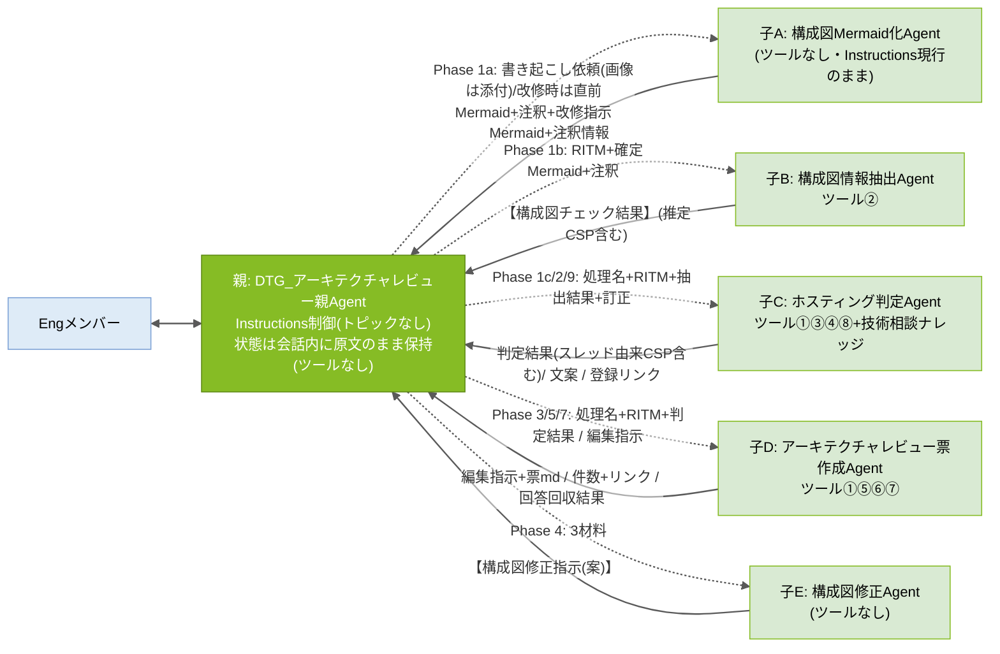

# アーキテクチャレビューAgent 設計書

## 0. 設計方針

### 設計原則(8か条)

| # | 原則 | 内容 |
|---|---|---|
| 1 | 親は連携専任 | 親Agentはツールを持たず、判断・作成をしない。窓口・進行管理・子Agent間のデータ連携のみ。進行管理は**親のInstructions**で行い、受け渡しは**依頼文(処理名+材料の原文)**で行う |
| 2 | 1Agent=1責務 | 構成図Mermaid化(子A)/構成図情報抽出(子B)/ホスティング判定(子C)/アーキテクチャレビュー票作成(子D)/構成図修正案(子E)を分離し、モード判定ミスを構造的に排除 |
| 3 | 全件照合はツールで全文渡し | 判定基準・照合資料・アーキテクチャレビュー票マスタ・観点など「全行を漏れなくチェックする資料」はKnowledge(RAG)に載せず、ツールで全文を渡す。Knowledgeは断片検索で足りる「過去案件の参考提示」のみ |
| 4 | 人の承認ゲート | Agentの出力はすべて「案」。確定・承認・利用者連絡・ナレッジ登録実行の判断は人(Eng/Mgmt)が行う |
| 5 | 共通ルールは単一ソース | 検算ルール(R1〜R4)と共通厳守事項(C1〜C6)は本設計書§1を正とし、各AgentのInstructionsには同一の共通ブロックを貼付する |
| 6 | 1指示=1子Agent | Engの1つの入力に対して親が呼び出す子は1体・1回のみ。子の結果を提示したら停止し、次の入力を待つ。親Instructionsの先頭に原則として置き、**テスト(§6.3 A1③)で担保**する(v6.1のようなトピック構造による保証ではない) |
| 7 | 親はInstructions制御(トピックなし) | 生成オーケストレーションが親Instructionsの「依頼の判定」表に従って子を選び、Phase内の手順・停止・改修ループも親Instructionsの手順で指示する。状態は親が**会話内で原文のまま保持**する。採用理由: 構築が容易で、Engが読んで直せる(保守性)。MS公式は「必ず指定どおりに実行させたいものはトピックで包む」を推奨しており、本版はその推奨から外れる代わりにテストで確認し、成立しない場合は v6.1 へ戻す |
| 8 | 画像を読むのは子Aだけ | 構成図の画像/PDFは子Aだけが読み、人が確認・訂正した**Mermaid+注釈情報**を後続の正とする。子B以降はテキスト処理のみ(画像読取の揺らぎを1か所に閉じ込め、人のゲートで潰す) |

### DRY原則レビュー(2026/08/28)への対応方針

| ID | 課題 | 対応 | 理由 |
|---|---|---|---|
| 1 | 同じスレッドを子C・子Dが別々に取得している | **意図的に許容** | 当事者が自ら取得することで①親経由の長文受け渡しによる劣化を排除 ②実行のたびに最新スレッドを読める。再検討条件: 応答時間・フロー実行数に問題が出た場合 |
| 2 | CSP判定を複数Agentが行っている(①のスレッド判定+子BのMermaid由来推定) | **意図的に許容** | 出所の異なる2判定を親(Phase 1c 手順9)が突き合わせ、不一致時にEngへ確認する安全弁 |
| 3 | 「全件チェック」の検算ルールがバラバラ | **一本化**: §1.1のR1〜R4に集約 | 保守性 |
| 4 | 同じ禁止事項を複数回書いている | **共通化**: §1.2のC1〜C6を共通ブロック(§1.3)として貼付 | 同上 |
| 5 | Instructions全文が設計書とInstructions集の両方にある | **単一化**: Instructions集を正とし、設計書は設計のみ | 二重更新の防止 |
| 6 | 子Agentが5体(MS公式は「サブタスクごとにAgentを作らない」を推奨)(v6.0追加) | **意図的に許容** | 各子が固有のツール・処理・ループ(子Aの改修ループ、子Dの修正ループ)を持ち、責務境界が明確。MS公式の「固有のツール/ナレッジを持つ領域は分ける」に該当。親の選択肢数(子5+トピック0+ツール0)は劣化目安の30〜40未満 |
| 7 | 親の進行制御をInstructionsで行う(MS公式は決定的な手順をトピックで包むことを推奨)(v7.0追加) | **PoCで検証のうえ判断** | 構築容易性と保守性を優先。1指示=1子・原文のまま提示・改修ループの判別が成立するかを§6.3 A1で検証し、成立しなければ v6.1(トピック駆動)へ戻す |

---

## 1. 共通ルール(単一ソース。改訂時はここを更新→全Agentへ貼り直し)

### 1.1 検算ルール(R1〜R4)

「検算」とは、**AIが処理を途中で飛ばしていないかを件数の突き合わせで機械的に確認する仕組み**。

| ID | 名称 | 実施者 | 何と何を突き合わせるか | 何のための確認か | 不一致時の動作 |
|---|---|---|---|---|---|
| **R1** | 構成図チェック観点の実施漏れ確認 | 子B | 実際に判定した観点の件数 ⇔ 観点mdの内訳から算出した「チェックすべき観点の件数」(共通観点+該当CSP観点) | 構成図チェックの観点をAIが飛ばしていないか | 出力せずにやり直す。md内訳表記と実際の行数が食い違う場合は実際の行数を正とし、警告を付けて出力 |
| **R2** | アーキテクチャレビュー票の標準指摘の仕分け漏れ確認 | 子D | ①流用+②添削+④不要 の合計件数 ⇔ アーキテクチャレビュー票mdの全行数 | マスタの行が検討されずに漏れていないか(③追記は分母に含めない) | 出力せずにやり直す |
| **R3** | アーキテクチャレビュー票Excelへの転記漏れ確認 | 子D | ツール⑥が返した書き込み件数 ⇔ 載せるべき行数(①+②+③) | Excelへの転記に失敗した行がないか | Engへ報告する |
| **R4** | 利用者回答の仕分け漏れ確認 | 子D | [回答済み]+[未回答]+[要確認] の合計件数 ⇔ ツール⑦が返した「全行数: NN件」 | 回答済み票の行を飛ばして仕分けていないか | 出力せずにやり直す |

### 1.2 共通厳守事項(C1〜C6)

| ID | 内容 |
|---|---|
| **C1** | すべての出力は「案(仮判定・下書き)」である。確定・承認・利用者への連絡・ナレッジ登録の実行判断は人(Eng/Mgmt)が行う |
| **C2** | 推測しない。渡された材料・ツール出力に無い事項を補完しない。判断・指摘には根拠(基準ID・資料名・記載箇所・ノードID)を必ず添える |
| **C3** | 全件処理する。照合・仕分け対象の全行を順に処理し、スキップしない。該当する検算ルール(R1〜R4)を実施し、不一致のまま出力しない |
| **C4** | 自分の役割の外に出ない。役割定義外の判断・作成を行わない。**構成図の画像/PDFの解析は子A(構成図Mermaid化Agent)のみが行い、子B以降はMermaid+注釈情報のテキストだけを読む** |
| **C5** | 作業過程・計画・途中経過・ツール出力の原文はチャットに出力しない。最終成果物のみを返す(Engが原文を明示依頼した場合を除く) |
| **C6** | Web上の一般情報は使用しない |

### 1.3 共通ブロック(全AgentのInstructions末尾にこのまま貼付)

```text
# 共通厳守事項(全Agent共通・設計書§1が正)
- C1: すべての出力は「案(仮判定・下書き)」。確定・承認・利用者連絡・ナレッジ登録実行の判断は人(Eng/Mgmt)が行う。
- C2: 推測しない。渡された材料・ツール出力に無い事項を補完しない。判断・指摘には根拠(基準ID・資料名・記載箇所・ノードID)を必ず添える。
- C3: 全件処理する。照合・仕分け対象の全行を順に処理し、スキップしない。該当する検算ルール(R1〜R4)を実施し、不一致のまま出力しない。
- C4: 自分の役割の外に出ない。役割定義外の判断・作成を行わない。構成図の画像の解析は構成図Mermaid化Agentのみが行う。
- C5: 作業過程・途中経過・ツール出力の原文は出力しない。最終成果物のみを返す(Engが明示依頼した場合を除く)。
- C6: Web上の一般情報は使用しない。
```

※子A(構成図Mermaid化Agent)のInstructionsは現行のものを変更しないため、この共通ブロックは貼付しない(子Aの指示文内の「絶対に守ること」が同等の役割を担う)。

---

## 2. Agent構成と関連図

### 2.1 実装方式

**子Agent方式**(親の「エージェント」タブから子を新規作成)は変更なし。親の進行制御を**Instructions制御**(トピックなし)にする。

| 層 | 担当 | 内容 |
|---|---|---|
| Phase間の振り分け | 生成オーケストレーション+親Instructions「依頼の判定」 | Engの入力(「レビューして」「抽出して」…)を、親Instructionsの指示語表と子の説明文に基づいて該当する子Agentの呼び出しに振り分ける |
| Phase内の手順 | 親Instructions(手順1〜20) | 「材料を揃える→子Agentを1体呼ぶ→出力を原文のまま保持→Engへ提示→次の指示を案内して停止」を各Phaseの手順として記述。改修ループ(Phase 1a・3)は「確認待ちの状態で修正内容が来たら再呼び出し、『完了』『確定』で確定」と記述 |
| 状態の保持 | 親の会話内(原文のまま) | RITM・下書き/確定Mermaid+注釈・抽出結果・判定結果・編集指示(案/確定)・修正指示案・Excel結果・回答回収結果・ナレッジ文案。同じ会話を使い続ける限り保持。**別の会話で再開したPhase(2・3見直し・4・5・7・9)では、親がRITMを聞き返し、長文の状態はEngが前回の会話から貼り付ける** |
| 子との受け渡し | 依頼文(自然言語) | 親が子への依頼文に**処理名**(判定/再判定/票作成/修正反映/Excel生成/回答回収/ナレッジ文案作成/登録実行)と**材料の原文**を明示して渡し、子は成果物の全文だけを応答で返す。子の入力・出力定義は使わない |
| 親のInstructions | 完全制御版 | 役割・1指示=1子の原則・依頼の判定・保持する状態・Phase別手順(20手順)・受け渡し規則・C1〜C6。約5,000字(上限8,000字) |

MS公式の根拠と本版の位置づけ: 「子Agentは常に親の文脈を受け取る」(画像は会話の添付として子Aへ届く前提)、「生成オーケストレーションは名前・説明文に基づいて子Agentやツールを選ぶ」(子の説明文に「親Agentからのみ呼び出される」を入れ、Engの発話から直接選ばれないようにする)。一方でMS公式は「必ず指定どおりに実行させたいものはトピックで包む」を推奨している。本版はこの推奨から外れるため、1指示=1子・原文のまま提示・改修ループの判別を§6.3 A1で検証し、成立しなければ v6.1 へ戻す。

**方式の比較(採用判断の材料)**

| 観点 | v7.0 Instructions制御 | v6.1 トピック駆動 |
|---|---|---|
| 構築 | 親・子のInstructionsと説明文を貼るだけ。トピック・変数の作成なし | トピック11本・グローバル変数16個・子の入出力を画面で作成(コード エディター併用) |
| 保守 | 手順の変更=Instructionsの文言変更。Engが読んで直せる | 手順の変更=トピックのノード変更。画面操作の習熟が要る |
| 決定性 | LLM依存(連鎖・要約・状態判別のリスク)。Instructionsとテストで担保 | トピックの構造で保証(質問ノード・条件・終了) |
| 状態 | 会話内保持(会話が続く限り)。別会話はEngが貼り付け | グローバル変数(セッション内限定)。別セッションはEngが貼り付け |
| 原文のまま転送 | 親のLLMが転記(要約のリスク) | 変数で機械的に転送 |
| MS公式の推奨 | 外れる(決定的な手順はトピック推奨) | 準拠 |

### 2.2 Agent構成(親1+子5)

| 設計上の呼び名 | Copilot Studio上のAgent名 | 役割 | ツール | Knowledge | 親から受け取るもの(依頼文) | 親へ返すもの(応答) |
|---|---|---|---|---|---|---|
| **親** | `DTG_アーキテクチャレビュー親Agent` | Engとの唯一の会話窓口。Instructionsで進行管理、子の呼出し(1指示=1体)、原文のままの受け渡し、Engへの提示、承認ゲート | なし | なし | — | — |
| **子A: 構成図Mermaid化Agent** | `構成図Mermaid化Agent` | 構成図の画像/PDFをMermaidコード+注釈情報に書き起こす。Engの改修指示を反映して再出力。**Instructionsは現行のまま変更しない** | なし | なし | 初回: 書き起こし依頼(画像は会話の添付から)/ 改修: 直前のMermaid+注釈+改修指示 | Mermaidコード+注釈情報(または質問) |
| **子B: 構成図情報抽出Agent** | `構成図情報抽出Agent` | Mermaid+注釈情報から事実抽出+観点別チェック(検算R1)。画像は読まない | ② | なし | RITM+確定Mermaid+注釈情報 | 【構成図チェック結果】(推定CSPを含む) |
| **子C: ホスティング判定Agent** | `ホスティング判定Agent` | スレッド取得→ノックアウト要件・Salus・検証状況照合→DCS Hub/Disconnect判定。不足時はヒアリング文案。クローズ時はナレッジ文案作成・(承認後)登録 | ①③④⑧ | 技術相談ナレッジ(参考のみ) | 処理名(判定/再判定/ナレッジ文案作成/登録実行)+RITM+【構成図チェック結果】+Engの訂正・補足(+承認済み文案) | ホスティング判定結果(スレッド由来CSPを含む)/ ナレッジ文案 / 登録リンク |
| **子D: アーキテクチャレビュー票作成Agent** | `アーキテクチャレビュー票作成Agent` | 編集指示(R2)→票md→Excel生成(R3)→回答回収(R4) | ①⑤⑥⑦ | なし | 処理名(票作成/修正反映/Excel生成/回答回収)+RITM+判定結果 / 編集指示+修正点 / CSP+確定版編集指示 / RITMのみ | 編集指示+票md / 件数+リンク+R3 / 回答回収結果 |
| **子E: 構成図修正Agent** | `構成図修正Agent` | 4つの材料(抽出結果・確定Mermaid・判定結果・確定版編集指示)を突き合わせ、構成図修正指示(文案)を作成 | なし | なし | 材料1【構成図チェック結果】+確定Mermaid / 材料2 判定結果 / 材料3 確定版編集指示 | 【構成図修正指示(案)】 |

**名前の一致**: 生成オーケストレーションは子を**名前と説明文**で選ぶため、親Instructionsに書く子Agent名はCopilot Studio上の名前と完全一致させる。子の説明文には「親Agentからのみ呼び出される(Engとは直接会話しない)」を入れ、Engの発話から子が直接選ばれないようにする。

### 2.3 関連図(委任=点線/返却=実線。すべて親の依頼文経由)



### 2.4 ツール一覧(利用順・8本)

| No | ツール名 | 説明 | 用途 | 持ち主 | 備考 |
|---|---|---|---|---|---|
| ① | Teamsスレッド内容取得 | 共通_Engineering標準化チャネルからRITM番号でスレッドを特定(件名+本文を検索)し、親投稿・全返信(HTML→テキスト変換済み)・添付ファイル一覧を取得。本文からCSP(Azure/GCP/AWS/不明)を判定して返す。入力でCSPを指定した場合はそれを優先 | 子C: 判定時に案件情報・ホスティング判断アプリの結果・利用者回答を読む(再判断のたびに再取得)。子D: アーキテクチャレビュー票作成時に案件情報と、Excelファイル名に使うCSPを得る | 子C・子D | スレッドを使う当事者が自ら取得することで、親経由の長文受け渡しによる劣化を排除し、常に最新を読む(方針ID1)。**実装済み** |
| ② | 構成図チェック観点取得 | AI連携用フォルダの構成図チェック観点.mdを全文取得して返す | 子Bが観点の実行仕様、および検算R1の分母として使う | 子B | 観点は子Bの抽出処理だけが使う実行仕様のため。**実装済み**(判定方法をMermaid前提で書いた正式版mdへの差し替えは未・P5) |
| ③ | ホスティング判定基準取得 | AI連携用フォルダのホスティング判定基準.md(ノックアウト要件のみ)を全文取得して返す | 子Cがノックアウト要件を1件ずつ照合するために使う | 子C | 判定処理と不可分の実行仕様のため。**実装済み**(正式版mdは未・P4) |
| ④ | サービス照合資料取得 | Salus_Status一覧.mdとサービス検証状況.mdを取得し、`salusStatus` / `serviceVerification` の2出力で返す | 子Cが利用予定サービスを「Salus status」と「検証状況(3区分)」の両面で同時照合するために使う | 子C | 両資料は常に同時照合するため1ツールに集約。**実装済み**(サービス検証状況.mdはテスト内容のみ・P6) |
| ⑤ | アーキテクチャレビュー票取得 | 入力CSPに応じて、CSP別アーキテクチャレビュー票md(固定ファイル名)を全文取得して返す | 子Dが編集指示の分母(検算R2の「全NN行」)として使う | 子D | マスタは編集指示の検算分母として子Dだけが全文を必要とするため。**実装済み** |
| ⑥ | アーキテクチャレビュー票Excel作成 | RITM番号・CSP・行データJSONを受領→雛形xlsxをコピーして送付フォルダに「【案件名】(RITMxxxxxxx)アーキテクチャレビュー票(CSP).xlsx」を作成→JSON解析→Officeスクリプト「アーキテクチャレビュー_行追加」でテーブル`T_アーキテクチャレビュー票`へ行追加→書き込み件数+ファイルリンクを返す | 子Dが確定版の編集指示から利用者送付用Excelを作るために使う(転記はフローの機械処理) | 子D | 票を確定させた本人が生成まで行うことで転記ズレをなくす(検算R3)。**実装済み**。動的ファイル指定のためOfficeスクリプト方式。ファイル指定は「ファイルの作成」出力の`Path`。行データJSONのキーはExcel見出しと完全一致(「No.」のピリオド含む)。【案件名】は人が書き換える |
| ⑦ | 回答済みアーキテクチャレビュー票取得 | RITM番号を受領→チャネルファイルフォルダの一覧→RITM番号を含む→「アーキテクチャレビュー票」を含む.xlsxに絞込→最終更新が最新の1件→テーブル読取→「対象ファイル名/全行数/md表(No・ステータス・指摘概要・指摘内容・回答内容・回答者・回答日)」を返す。該当なしは固定メッセージ | 子Dが利用者回答を読み、[回答済み]/[未回答]/[要確認]に仕分けるために使う(検算R4) | 子D | 票のライフサイクル(作成→送付→回収)を同一Agentに集約。**実装済み**。詳細はツール設計書v1.1 |
| ⑧ | 技術相談ナレッジ追記 | 16項目を受領→技術相談ナレッジListへ「項目の作成」→登録リンクを返す | 子CがEng承認→親(手順20)の「登録実行」依頼後にナレッジを登録するために使う | 子C | 文案作成者と実行者を一致させる。実行は承認後のみ(C1)。**未実装** |

### 2.5 親の指示語と処理の一覧(親Instructions「依頼の判定」と対応。詳細手順はInstructions集v7.0 §A-2)

| Phase | Engの指示 | 親の処理(Instructions手順) | 呼ぶ子 | 停止の作り方 |
|---|---|---|---|---|
| 1a | 「RITMxxxをレビューして」+画像 | 構成図のMermaid化(手順1〜3) | 子A | Mermaid+注釈を提示し「修正内容 or『完了』」を求めて停止 |
| 1a | (Mermaid確認待ちで)修正内容 | Mermaidの改修(手順4) | 子A | 直前の下書き+改修指示で再呼び出し→再提示して停止(『完了』まで繰り返す) |
| 1a | (Mermaid確認待ちで)「完了」 | Mermaidの確定(手順5) | なし | 確定を宣言し「次は『抽出して』」と案内して停止 |
| 1b | 「抽出して」 | 構成図の情報抽出(手順6〜7) | 子B | 提示して停止 |
| 1c | 「判定して」(+訂正・補足) | ホスティング判定(手順8〜9) | 子C | 提示して停止(CSP不一致は注意文) |
| 2 | 「再判断して」 | 再判定(手順10) | 子C | 提示して停止。別会話なら状態の復帰(RITM聞き返し/貼り付け)を先に行う |
| 3 | 「レビュー票を作成して」/「レビュー票を見直して」(+指摘) | 票作成(手順11〜12) | 子D | 編集指示+票mdを提示し「修正点 or『確定』」を求めて停止 |
| 3 | (編集指示確認待ちで)修正点 / 「確定」 | 修正反映 / 確定(手順13) | 子D / なし | 再提示して停止 / 確定を宣言し「次は『修正モードを実行して』」と案内して停止 |
| 4 | 「修正モードを実行して」 | 構成図修正案(手順14〜15) | 子E | 3材料が揃わなければ子を呼ばず案内して停止。提示して停止 |
| 5 | 「Excelを作成して」 | 送付用Excel生成(手順16〜17) | 子D | 件数・リンク・R3を報告して停止 |
| 7 | 「回答を確認して」 | 回答回収(手順18) | 子D | 提示して停止。**別会話で始まることが多い**(RITMは指示文から) |
| 9 | 「ナレッジに登録して」→「承認」 | ナレッジ文案作成→登録実行(手順19〜20) | 子C(2回、別メッセージ) | 文案提示→『承認』or『中止』を求めて停止→承認時のみ登録して報告 |

---

## 3. Input / Output

### 3.1 Input一覧(Agentが読む材料)

| 名称 | 実体・場所 | 用途(誰がどのステップで使う) | 保守 |
|---|---|---|---|
| Teamsスレッド(事前相談) | 共通_Engineering標準化チャネル | 子C(判定)・子D(票作成)がツール①で取得 | —(業務の中で蓄積) |
| 構成図(画像/PDF) | Engが親Agentのチャットへ添付(**必須**) | **子A(Mermaid化)だけ**が読む。子B以降は読まない | 案件ごとにEngが用意。凡例付きが望ましい |
| 確定Mermaid+注釈情報 | 親の会話内(子Aの出力をEngが確認・改修し『完了』と言った時点の版) | 子B(抽出)・子E(修正案)へ親が依頼文で渡す。図の「正」 | 案件ごとに生成 |
| 構成図チェック観点.md | AI連携用フォルダ | 子B(抽出)がツール②で取得。観点の実行仕様・検算R1の分母。**「AI判定方法」列はMermaid前提**(ノード/subgraph/接続/ラベル/注釈情報のどれを見て判定するか)で書く | ファイル差し替え。増減時はヘッダー内訳も更新 |
| ホスティング判定基準.md | AI連携用フォルダ | 子C(判定)がツール③で取得 | ファイル差し替え |
| Salus_Status一覧.md / サービス検証状況.md | AI連携用フォルダ | 子C(判定)がツール④で取得 | ファイル差し替え |
| アーキテクチャレビュー票.md×3CSP | AI連携用フォルダ | 子D(票作成)がツール⑤で取得。検算R2の分母 | 改版=該当mdの差し替え |
| アーキテクチャレビュー票Excel雛形.xlsx | AI連携用フォルダ | ツール⑥のコピー元。テーブル`T_アーキテクチャレビュー票`。シート保護なし | 体裁変更=雛形差し替え |
| Officeスクリプト「アーキテクチャレビュー_行追加」 | OneDrive「Documents/Office スクリプト」 | ツール⑥が実行 | テーブル名のみ固定 |
| 回答済みアーキテクチャレビュー票(xlsx) | チャネルファイルフォルダ | 子D(回答回収)がツール⑦で取得。ファイル名のRITM部分・「アーキテクチャレビュー票」を変えない | —(Teams標準動作) |
| 技術相談ナレッジList | SharePoint List | 子CのKnowledge(参考のみ)。ツール⑧の追記先 | List直接管理 |

### 3.2 Output一覧(Agent・ツールが生み出す成果物)

| 名称 | 生成者 | 内容 | 目的 | 格納先 |
|---|---|---|---|---|
| Mermaidコード+注釈情報 | 子A | 構成図をflowchart LRで書き起こしたMermaid(複製ノード等の特例を含む)と、図上の凡例・脚注などMermaidで表せない情報 | Engが確認・改修して**確定版**にする。確定版は子B・子Eの入力 | 親の会話内(チャットに原文のまま提示)。EngはMermaid Live/VS Codeで描画確認 |
| 【構成図チェック結果】 | 子B | サービス一覧・NW情報・観点別チェック・不足情報・Mermaidに記載のない箇所+検算R1 | 子Cの判定材料/子Eの材料/Engの確認 | 親の会話内(チャット) |
| ホスティング判定結果 | 子C | DCS Hub/Disconnect/Sandbox判定+基準IDごとの理由・Salus照合一覧・検証状況一覧・要人手確認・追加ヒアリング文案 | Engの判断材料。子Eの材料 | 親の会話内(チャット) |
| アーキテクチャレビュー票編集指示 | 子D | ①流用/②添削/③追記/④不要+検算R2 | Engの確認・修正の対象。確定版が子Eの材料・Excelの元 | 親の会話内(案/確定) |
| アーキテクチャレビュー票(md) | 子D | 編集指示反映済みの完成形 | Engの内容確認 | チャット |
| 【構成図修正指示(案)】 | 子E | 修正一覧(ノードID/場所/現状/修正内容)+利用者向け依頼文 | Eng確認→Mgmt経由で利用者へ | 親の会話内(チャット) |
| アーキテクチャレビュー票Excel | ツール⑥(子D) | 送付用Excel。ファイル名`【案件名】(RITMxxxxxxx)アーキテクチャレビュー票(CSP).xlsx`(【案件名】は人が書き換え) | 利用者への送付物 | 送付フォルダ |
| 回答回収結果 | 子D | 集計・未回答No一覧・要確認一覧・回答済みNo一覧+検算R4 | Engの解消判定の材料 | 親の会話内(チャット) |
| ナレッジ登録文案 / 登録(1件) | 子C / ツール⑧ | 16項目の文案 / 承認済み文案のList登録 | Eng承認→登録 | 親の会話内 / 技術相談ナレッジList |

---

## 4. 全体ワークフロー

### 4.1 概要図(色分け: 青=人間/濃緑=親(Instructions手順)/薄緑=子/黄=人間判断分岐)

親のノードは「**受け取ったもの → 行うこと → 呼び出す相手(渡すもの)**」の順で書き、括弧内に親Instructionsの手順番号を示す。子は必ず親の呼び出しノードの直後に置き、子の出力は必ず親の保持ノードへ戻る(子同士が直接やり取りすることはない)。

```mermaid
%%{init: {"theme": "base", "themeVariables": {"edgeLabelBackground": "#ffffff00", "lineColor": "#5a5a5a", "fontSize": "13px"}}}%%
flowchart TD
    subgraph P0["Phase 0: 前提(人間のみ)"]
        A["<b>Mgmt</b><br>DCS利用の一次判断・判定アプリ実行<br>結果をスレッドへ投稿→Engへ引継ぎ"]:::human
    end

    subgraph P1a["Phase 1a: 構成図のMermaid化(手順1〜5)"]
        B["<b>Eng</b><br>親へ「RITMxxxxxxxをレビューして」<br>+構成図画像/PDFを添付(必須)"]:::human
        O1a["<b>親</b>(手順1〜2) 指示文+画像を受領。RITM番号を特定(半角正規化)、添付を確認<br>→ 子Aを呼び出し(渡す: 依頼「Mermaidへ書き起こし」。画像は会話の添付)"]:::parent
        CA1["<b>子A</b> 構成図Mermaid化<br>4パス(文字→ノード→枠→接続)+凡例で書き起こし<br>→Mermaidコード+注釈情報"]:::child
        O1b["<b>親</b>(手順3) Mermaid+注釈を下書きとして原文のまま保持<br>→ Engへコードブロックで提示+「Mermaid Live/VS Codeで確認。修正内容 or『完了』を入力」→停止"]:::parent
        D0{"<b>Eng</b><br>Mermaidを描画して原図と照合"}:::decision
        O1c["<b>親</b>(手順4) 改修指示を受領(Mermaid確認待ちでの「完了」以外の入力)<br>→ 子Aを呼び出し(渡す: 直前の下書きMermaid+注釈+改修指示)"]:::parent
        CA2["<b>子A</b> 改修指示を反映<br>→Mermaid+注釈情報を全体再出力"]:::child
        O1d["<b>親</b>(手順4) 下書きを置き換え→再提示→停止(再び入力待ち)"]:::parent
        O1e["<b>親</b>(手順5) 『完了』を受領<br>→ 下書きを確定Mermaid・確定注釈として保持<br>→「次は『抽出して』」と案内して停止"]:::parent
    end

    subgraph P1b["Phase 1b: 構成図の情報抽出(手順6〜7)"]
        E1b["<b>Eng</b><br>親へ「抽出して」"]:::human
        O2a["<b>親</b>(手順6〜7) 確定Mermaidの有無を確認<br>→ 子Bを呼び出し(渡す: RITM+確定Mermaid+注釈の原文) ※画像は渡さない"]:::parent
        CB1["<b>子B</b> 構成図情報抽出<br>ツール②観点取得→Mermaid/注釈から要素列挙→CSP推定<br>→観点別チェック→検算R1"]:::child
        O2b["<b>親</b>(手順7) 【構成図チェック結果】(図由来CSP含む)を原文のまま保持<br>→ Engへ提示+「原図と照合。問題なければ『判定して』、訂正は添えて」→停止"]:::parent
        D1{"<b>Eng</b><br>抽出結果を確認"}:::decision
    end

    subgraph P1c["Phase 1c: ホスティング判定(手順8〜9)"]
        E1c["<b>Eng</b><br>親へ「判定して」(+抽出結果への訂正・補足)"]:::human
        O3a["<b>親</b>(手順8) 指示文(+訂正・補足)を受領<br>→ 子Cを呼び出し(渡す: 処理名「判定」+RITM+【構成図チェック結果】原文+Engの訂正) ※スレッド本文は渡さない"]:::parent
        CC1["<b>子C</b> ホスティング判定<br>ツール①スレッド取得→③ノックアウト要件→④Salus・検証状況<br>→1件ずつ照合→判定+理由+追加ヒアリング文案"]:::child
        O3b["<b>親</b>(手順9) 判定結果(スレッド由来CSP含む)を原文のまま保持<br>図由来CSPと突合(不一致は注意文)<br>→ Engへ提示+次の案内→停止"]:::parent
        D{"<b>Eng</b><br>判定結果を確認"}:::decision
    end

    subgraph P2["Phase 2: 追加ヒアリング〜再判断(手順10・複数回あり)"]
        GH["<b>Eng</b><br>ヒアリング文案を確認・修正→Mgmtへ"]:::human
        GM["<b>Mgmt</b><br>利用者へヒアリング→回答をスレッドへ反映→Engへ連絡"]:::human
        E2["<b>Eng</b><br>親へ「再判断して」"]:::human
        O4a["<b>親</b>(手順10) 保持済みの状態を使う(別会話なら復帰: RITM聞き返し/貼り付け)<br>→ 子Cを呼び出し(渡す: 処理名「再判定」+RITM+【構成図チェック結果】+訂正)"]:::parent
        CC2["<b>子C</b> 再判定<br>ツール①で最新スレッド(利用者回答含む)を再取得→③④→再照合"]:::child
        O4b["<b>親</b>(手順10) 判定結果を最新版に置き換え<br>→ Engへ提示→停止"]:::parent
    end

    subgraph P3["Phase 3: アーキテクチャレビュー票作成(手順11〜13)"]
        E3["<b>Eng</b><br>親へ「レビュー票を作成して」"]:::human
        O5a["<b>親</b>(手順11) 指示文を受領<br>→ 子Dを呼び出し(渡す: 処理名「票作成」+RITM+判定結果原文。見直し時は回答回収結果+指摘も) ※スレッド本文は渡さない"]:::parent
        CD1["<b>子D</b> 編集指示+票md作成<br>ツール①スレッド取得→⑤票md取得(全NN行)<br>→①流用②添削③追記④不要→検算R2→票md"]:::child
        O5b["<b>親</b>(手順12) 編集指示+票mdを「案」として原文のまま保持<br>→ Engへ提示+「修正点 or『確定』を入力」→停止"]:::parent
        D3{"<b>Eng</b><br>編集指示を確認"}:::decision
        O5c["<b>親</b>(手順13) 修正点を受領(編集指示確認待ち)<br>→ 子Dを呼び出し(渡す: 処理名「修正反映」+直前の編集指示原文+修正点)"]:::parent
        CD1r["<b>子D</b> 修正を反映して全体再出力"]:::child
        O5d["<b>親</b>(手順13) 案を置き換え→提示→停止(再び入力待ち)"]:::parent
        O5e["<b>親</b>(手順13) 『確定』を受領→その時点の編集指示を確定版として保持<br>→「次は『修正モードを実行して』」と案内して停止"]:::parent
    end

    subgraph P4["Phase 4: 構成図修正案(手順14〜15)"]
        E4["<b>Eng</b><br>親へ「修正モードを実行して」"]:::human
        O6a["<b>親</b>(手順14) 3材料が揃っているか確認(欠けていれば案内して停止)<br>→ 子Eを呼び出し(渡す: 材料1 抽出結果+確定Mermaid / 材料2 判定結果 / 材料3 確定版編集指示)"]:::parent
        CE1["<b>子E</b> 構成図修正指示(案)作成<br>材料2・3で決まったことのうち材料1で図に無い・誤っているもの<br>=修正指示(ノードID・接続で指定)"]:::child
        O6b["<b>親</b>(手順15) 修正指示(案)を原文のまま保持→Engへ提示→停止"]:::parent
        E4b["<b>Eng</b><br>修正指示(案)を確認・修正"]:::human
    end

    subgraph P5["Phase 5: 送付用Excel生成(手順16〜17)"]
        E5["<b>Eng</b><br>親へ「Excelを作成して」"]:::human
        O7a["<b>親</b>(手順16) 確定版編集指示の有無を確認<br>→ 子Dを呼び出し(渡す: 処理名「Excel生成」+RITM+スレッド由来CSP+確定版編集指示原文)"]:::parent
        CD2["<b>子D</b> Excel生成<br>確定版→行データJSON(見出しと完全一致)<br>→ツール⑥→返却件数と突合(検算R3)"]:::child
        O7b["<b>親</b>(手順17) 件数・リンク・R3結果を保持<br>→ Engへ報告+「Eng確認→Mgmt経由でスレッド連携」を案内→停止"]:::parent
        E5b["<b>Eng</b><br>Excelを確認、【案件名】を書き換え→Mgmtへ"]:::human
    end

    subgraph P6["Phase 6: 送付・回答(人間のみ)"]
        M6["<b>Mgmt</b><br>Excelリンク+構成図修正依頼をスレッドで利用者へ"]:::human
        U6["<b>利用者</b><br>回答記入・構成図修正<br>回答済みExcelをスレッドへ添付返送(ファイル名のRITM部分は変えない)"]:::human
        M6b["<b>Mgmt</b><br>返送を確認→Engへ連絡"]:::human
    end

    subgraph P7["Phase 7: 回答回収(手順18)"]
        E7["<b>Eng</b><br>親へ「回答を確認して」(別会話ならRITM番号を添える)"]:::human
        O8a["<b>親</b>(手順18) RITMを特定(別会話なら指示文から/聞き返し)<br>→ 子Dを呼び出し(渡す: 処理名「回答回収」+RITM)"]:::parent
        CD3["<b>子D</b> 回答回収<br>ツール⑦→対象ファイル・全行数・md表<br>→「回答済み」「未回答」「要確認」に仕分け→検算R4"]:::child
        O8b["<b>親</b>(手順18) 回答回収結果を原文のまま保持→Engへ提示→停止"]:::parent
        Q{"<b>Eng</b><br>質疑・修正依頼は解消?"}:::decision
    end

    subgraph P8["Phase 8: 最終確認・クローズ(人間のみ)"]
        V["<b>Eng</b><br>判定結果・票・最終構成図を最終確認→Mgmtへ"]:::human
        MF["<b>Mgmt</b><br>利用者へ最終連携"]:::human
        CL["<b>Eng・Mgmt</b><br>スレッドをクローズ"]:::human
    end

    subgraph P9["Phase 9: ナレッジ登録(手順19〜20)"]
        E9["<b>Eng</b><br>親へ「ナレッジに登録して」"]:::human
        O9a["<b>親</b>(手順19) 指示文を受領(別会話なら復帰)<br>→ 子Cを呼び出し(渡す: 処理名「ナレッジ文案作成」+RITM+最終の判定結果原文)"]:::parent
        CC3["<b>子C</b> ナレッジ登録文案作成<br>技術相談ナレッジListの16項目<br>確定できない項目は「(未記入)」"]:::child
        O9b["<b>親</b>(手順19) 文案を原文のまま保持<br>→ Engへ提示+「修正があれば含めて『承認』、しないなら『中止』」→停止"]:::parent
        D9{"<b>Eng</b><br>文案を確認・修正"}:::decision
        O9c["<b>親</b>(手順20) 『承認』(+修正内容)を受領。承認以外なら中止<br>→ 子Cを呼び出し(渡す: 処理名「登録実行」+承認済み文案+修正内容)"]:::parent
        CC4["<b>子C</b> ナレッジ登録<br>ツール⑧で技術相談ナレッジListへ1件登録"]:::child
        O9d["<b>親</b>(手順20) 登録リンクを受領→Engへ登録完了を報告→停止"]:::parent
    end

    A --> B --> O1a --> CA1 --> O1b --> D0
    D0 -->|"修正あり"| O1c --> CA2 --> O1d --> D0
    D0 -->|"『完了』"| O1e --> E1b
    E1b --> O2a --> CB1 --> O2b --> D1
    D1 -->|"問題なし / 訂正を添えて"| E1c
    E1c --> O3a --> CC1 --> O3b --> D

    D -->|"追加確認が必要"| GH --> GM --> E2 --> O4a --> CC2 --> O4b --> D
    D -->|"情報充足"| E3

    E3 --> O5a --> CD1 --> O5b --> D3
    D3 -->|"修正あり"| O5c --> CD1r --> O5d --> D3
    D3 -->|"『確定』"| O5e --> E4

    E4 --> O6a --> CE1 --> O6b --> E4b --> E5
    E5 --> O7a --> CD2 --> O7b --> E5b --> M6 --> U6 --> M6b --> E7
    E7 --> O8a --> CD3 --> O8b --> Q

    Q -->|"未解消:『レビュー票を見直して』+指摘"| O5a
    Q -->|"構成・前提の変更あり"| B
    Q -->|"解消・最終合意"| V --> MF --> CL --> E9

    E9 --> O9a --> CC3 --> O9b --> D9
    D9 -->|"『承認』(+修正内容)"| O9c --> CC4 --> O9d

    classDef human fill:#deebf7,stroke:#7da2d6,color:#000000;
    classDef parent fill:#86bc25,stroke:#5e8a14,color:#ffffff;
    classDef child fill:#d9ead3,stroke:#86bc25,color:#000000;
    classDef decision fill:#ffe599,stroke:#c9a227,color:#000000;
    linkStyle default stroke:#5a5a5a,stroke-width:1.5px;
```



### 4.2 親が保持する状態(会話内・原文のまま)

変数は使わない。親は子の出力を**会話の中で原文のまま**保持し、必要なPhaseで依頼文に載せて子へ渡す。状態名はInstructions集v7.0 §A-3と一致させる。

**寿命の注意**: 状態は会話履歴そのものなので、**同じ会話(チャット)を使い続ける限り**保持される。Phase 6(利用者の回答待ち)で日をまたぎ、新しい会話で再開した場合や、Teamsで新しいチャットを始めた場合・「会話のリセット」後は、親はRITM番号を聞き返し、長文の状態(判定結果・確定版編集指示・確定Mermaid・【構成図チェック結果】)はEngが前回の会話からコピーして貼り付ける(親Instructions「保持する状態」の復帰規則)。また、会話が非常に長くなると親が古い状態を正確に参照できなくなる可能性がある(§7-6)。本番化時はSharePointへの保存・復元ツール(⑨)で置き換える。

| 状態 | 内容 | 作られるPhase | 使われるPhase |
|---|---|---|---|
| RITM番号 | 半角に正規化した番号 | 1a | 全て |
| 下書きMermaid / 下書き注釈情報 | 子Aの直近の出力(改修ループ中) | 1a | 1a(改修時に子Aへ渡す) |
| 確定Mermaid / 確定注釈情報 | Engが『完了』と言った時点の下書き | 1a | 1b, 4 |
| 【構成図チェック結果】/ 図由来CSP | 子Bの出力(CSPは見出し行) | 1b | 1c(突合), 2, 4 |
| Engの訂正・補足 | 「判定して」に添えられた文 | 1c | 1c, 2 |
| ホスティング判定結果(最新)/ スレッド由来CSP | 子Cの出力(CSPは見出し行) | 1c, 2 | 1c(突合), 3, 4, 5, 9 |
| 編集指示(案)/ 確定版編集指示 | 子Dの出力 / Engが『確定』と言った時点の案 | 3 | 3(修正反映), 4, 5 |
| 【構成図修正指示(案)】 | 子Eの出力 | 4 | — |
| Excel生成結果 | 書き込み件数・リンク・R3 | 5 | — |
| 回答回収結果 | 子Dの出力 | 7 | 3(見直し時) |
| ナレッジ文案 | 子Cの出力 | 9 | 9(登録実行) |

### 4.3 フェーズ別の動作詳細

各ステップで「誰が・誰から何を受け取り・何を行い・誰へ何を渡すか」を示す。親の行は該当する親Instructionsの手順番号を括弧で示す(Instructions集v7.0 §A-2)。

#### Phase 0: 前提(人間・Agent関与なし)

| Step | 主体 | 受け取る(誰から・何を) | 行うこと | 渡す(誰へ・何を) |
|---|---|---|---|---|
| 0-1 | Mgmt | 利用者から: 事前相談 | DCS利用の一次判断。ホスティング判断アプリを実行 | スレッドへ: 案件情報+判断アプリ結果を投稿 |
| 0-2 | Mgmt | — | Engへ引き継ぎ | Engへ: RITM番号とスレッドの連絡 |

#### Phase 1a: 構成図のMermaid化 — Engの指示「RITMxxxxxxxをレビューして」+画像(手順1〜5)

| Step | 主体 | 受け取る(誰から・何を) | 行うこと | 渡す(誰へ・何を) |
|---|---|---|---|---|
| 1a-1 | Eng | Mgmtから: RITM番号 | 親のチャットへ「RITM1234567をレビューして」を投稿し、構成図画像/PDFを**同じメッセージに添付**(必須) | 親へ: 指示文+画像 |
| 1a-2 | 親(手順1) | Engから: 指示文+画像 | 指示語から「Mermaid化」と判定。RITM番号を特定(全角は半角に。無ければ聞き返す)。添付が無ければ案内して停止 | — |
| 1a-3 | 親(手順2) | — | 子Aを呼び出す(この入力で呼ぶ子はこの1体だけ) | 子Aへ: 依頼「添付された構成図の画像またはPDFをMermaidへ書き起こしてください」(画像は会話の添付として子Aが受け取る) |
| 1a-4 | 子A | 親から: 依頼+添付画像 | 4パス(文字→ノード→枠と包含→接続)+凡例で書き起こし。図に無いものは足さない。DCS Service Hub内firewallの複製ノード等の特例を適用 | 親へ: Mermaidコード+注釈情報 |
| 1a-5 | 親(手順3) | 子Aから: Mermaid+注釈 | 下書きとして原文のまま保持 | Engへ: Mermaidコード(コードブロック)+注釈情報+「Mermaid LiveまたはVS Codeで描画して原図と照合してください。修正があれば内容を、問題なければ『完了』と入力してください」→ 停止 |
| 1a-6 | Eng | 親から: Mermaid+注釈 | Mermaid Live / VS Codeで描画し、原図と照合。誤り・不足があれば改修指示を用意 | 親へ: 改修指示 または『完了』 |
| 1a-7 | 親(手順4) | Engから: 入力 | Mermaid確認待ちの状態で『完了』以外なら改修指示と判定 | — |
| 1a-8 | 親(手順4) | (改修指示の場合) | 子Aを呼び出す | 子Aへ: 「以下のMermaidと注釈情報を、次の指示で修正して全体を再出力してください」+直前の下書きMermaid原文+注釈情報原文+Engの改修指示 |
| 1a-9 | 子A | 親から: 上記 | 改修指示を最小変更として反映し、Mermaid+注釈を**全体**再出力(解釈が分かれる場合のみ質問) | 親へ: Mermaid+注釈情報(または質問) |
| 1a-10 | 親(手順4) | 子Aから: 出力 | 下書きを置き換える(質問の場合は質問を原文のまま提示) | Engへ: 再出力を1a-5と同じ形式で提示 → 停止(1a-6へ戻る) |
| 1a-11 | 親(手順5) | (『完了』の場合) | 下書きを確定Mermaid・確定注釈情報として保持 | Engへ:「構成図を確定しました。次は『抽出して』と指示してください」→ 停止 |

#### Phase 1b: 構成図の情報抽出 — Engの指示「抽出して」(手順6〜7)

| Step | 主体 | 受け取る(誰から・何を) | 行うこと | 渡す(誰へ・何を) |
|---|---|---|---|---|
| 1b-1 | Eng | 親から: 確定案内 | 親へ「抽出して」を投稿 | 親へ: 指示文 |
| 1b-2 | 親(手順6) | Engから: 指示文 | 確定Mermaidが無ければ「先に構成図のMermaid化を完了してください」と案内して停止 | — |
| 1b-3 | 親(手順7) | — | 子Bを呼び出す。**画像は渡さない** | 子Bへ: RITM番号+確定Mermaid原文+確定注釈情報原文 |
| 1b-4 | 子B | 親から: 上記 | ツール②で観点md取得→Mermaidのノード・subgraph・接続・ラベルと注釈情報から要素を列挙→ラベル文字列のみを根拠にCSP推定→適用観点(共通+該当CSP)に絞込→観点の「AI判定方法」(Mermaid前提)に従い1件ずつ判定→検算R1。複製ノード(`_copy_N`)は実体1つとして数える | 親へ:【構成図チェック結果】全文(推定CSPは見出し行) |
| 1b-5 | 親(手順7) | 子Bから: 出力 | 【構成図チェック結果】と図由来CSPを原文のまま保持 | Engへ:【構成図チェック結果】原文+「原図・Mermaidと照合し、問題なければ『判定して』と指示してください。訂正・補足があれば『判定して。CSPはAWS』のように添えてください」→ 停止 |
| 1b-6 | Eng | 親から: 抽出結果 | サービス一覧・NW情報・CSP推定を確認。誤りがあれば訂正内容を用意 | — |

#### Phase 1c: ホスティング判定 — Engの指示「判定して」(手順8〜9)

| Step | 主体 | 受け取る(誰から・何を) | 行うこと | 渡す(誰へ・何を) |
|---|---|---|---|---|
| 1c-1 | Eng | — | 親へ「判定して」を投稿。訂正・補足があれば同じメッセージに書く | 親へ: 指示文(+訂正・補足) |
| 1c-2 | 親(手順8) | Engから: 指示文 | 訂正・補足があれば「Engの訂正・補足」として保持。【構成図チェック結果】が無ければ「構成図: Eng目視確認が必要」を付記する | — |
| 1c-3 | 親(手順8) | — | 子Cを呼び出す。**スレッド本文は渡さない** | 子Cへ: 処理名「判定」+RITM番号+【構成図チェック結果】原文+Engの訂正・補足 |
| 1c-4 | 子C | 親から: 上記 | ツール①(RITM→スレッド全文+CSP)→ツール③→ツール④→Engの訂正があれば抽出結果より優先→ノックアウト要件を1件ずつ照合(DCS Hub優先)→サービスを両資料と照合→不足情報ごとにヒアリング文案 | 親へ: ホスティング判定結果全文(スレッド由来CSPは見出し行) |
| 1c-5 | 親(手順9) | 子Cから: 出力 | 判定結果とスレッド由来CSPを原文のまま保持。図由来CSPとスレッド由来CSPが両方あり不一致なら注意文を付ける | Engへ: 判定結果原文(+CSP不一致の注意)+「追加確認が必要なら Eng確認→Mgmt経由でヒアリング→反映後『再判断して』。充足なら『レビュー票を作成して』」→ 停止 |
| 1c-6 | Eng | 親から: 判定結果 | 内容を確認し分岐。追加確認が必要 → Phase 2。情報充足 → Phase 3 | — |

#### Phase 2: 追加ヒアリング〜再判断 — Engの指示「再判断して」(手順10・複数回あり得る)

| Step | 主体 | 受け取る(誰から・何を) | 行うこと | 渡す(誰へ・何を) |
|---|---|---|---|---|
| 2-1 | Eng | 親から: 追加ヒアリング文案 | 質問内容の妥当性を確認・修正 | Mgmtへ: 確定した質問文 |
| 2-2 | Mgmt | Engから: 質問文 | 利用者へヒアリング。回答をスレッドへ投稿 | スレッドへ: 利用者回答。Engへ: 反映の連絡 |
| 2-3 | Eng | Mgmtから: 反映の連絡 | 親へ「再判断して」を投稿(別会話なら「RITM1234567を再判断して」) | 親へ: 指示文 |
| 2-3b | 親(保持する状態の復帰規則) | Engから: 指示文 | 別会話の場合: RITMを指示文から取得(無ければ聞き返し)。【構成図チェック結果】が会話に無ければ貼り付けを求めて停止 | (無いとき)Engへ: 質問 |
| 2-4 | 親(手順10) | Engから: 指示文 | 保持済みの状態を使う(Engに再入力させない) | 子Cへ: 処理名「再判定」+RITM番号+【構成図チェック結果】原文+Engの訂正・補足 |
| 2-5 | 子C | 親から: 上記 | ツール①で最新スレッド(利用者回答を含む)を再取得→③④→再照合→判定を更新 | 親へ: ホスティング判定結果(更新版) |
| 2-6 | 親(手順10) | 子Cから: 出力 | 判定結果を最新版に置き換えて保持 | Engへ: 更新後判定結果の原文→ 停止 |
| 2-7 | Eng | 親から: 更新後判定結果 | 1c-6と同じ分岐。充足するまでPhase 2を繰り返す | — |

#### Phase 3: アーキテクチャレビュー票作成 — Engの指示「レビュー票を作成して」(手順11〜13)

| Step | 主体 | 受け取る(誰から・何を) | 行うこと | 渡す(誰へ・何を) |
|---|---|---|---|---|
| 3-1 | Eng | 親から: 判定結果(充足済み) | 親へ「レビュー票を作成して」を投稿(Phase 7からの戻りは「レビュー票を見直して」+指摘) | 親へ: 指示文(+指摘) |
| 3-1b | 親(復帰規則) | Engから: 指示文 | 別会話の場合(見直し時に多い): RITMを指示文から取得(無ければ聞き返し)。判定結果が会話に無ければ貼り付けを求めて停止 | (無いとき)Engへ: 質問 |
| 3-2 | 親(手順11) | Engから: 指示文 | **スレッド本文は渡さない** | 子Dへ: 処理名「票作成」+RITM番号+ホスティング判定結果原文(見直し時は回答回収結果原文+Engの指摘も) |
| 3-3 | 子D | 親から: 上記 | ツール①(スレッド全文+CSP。「不明」なら停止しEng確認)→ツール⑤(票md全文+全NN行)→全行を①〜④に仕分け→検算R2→票md作成 | 親へ: 編集指示+票md+適用テンプレート名 |
| 3-4 | 親(手順12) | 子Dから: 出力 | 編集指示(案)として原文のまま保持 | Engへ: 編集指示と票mdの原文+「修正があれば修正点を、問題なければ『確定』と入力してください」→ 停止 |
| 3-5 | Eng | 親から: 編集指示+票md | 内容を確認 | 親へ: 修正点(例:「No.5は不要にして」) または『確定』 |
| 3-6 | 親(手順13) | Engから: 入力 | 編集指示確認待ちの状態で『確定』なら、その時点の案を確定版として保持し「次は『修正モードを実行して』」と案内して停止。修正点なら子Dを呼び出し(処理名「修正反映」+直前の編集指示原文+修正点)→ 出力で案を置き換え→提示→停止(3-5へ戻る) | (修正時)子Dへ: 上記 |

#### Phase 4: 構成図修正案 — Engの指示「修正モードを実行して」(手順14〜15)

| Step | 主体 | 受け取る(誰から・何を) | 行うこと | 渡す(誰へ・何を) |
|---|---|---|---|---|
| 4-1 | Eng | — | 親へ「修正モードを実行して」を投稿 | 親へ: 指示文 |
| 4-2 | 親(手順14) | Engから: 指示文 | 材料1(【構成図チェック結果】+確定Mermaid)/ 材料2(判定結果)/ 材料3(確定版編集指示)が揃っているか確認。欠けていれば不足を案内して停止(子を呼ばない。別会話なら貼り付けを求める) | 子Eへ: 3材料の原文 |
| 4-3 | 子E | 親から: 3材料 | 「判定結果・確定版編集指示で決まったこと」のうち「抽出結果・Mermaidの時点で図に無い・誤っているもの」を修正指示として列挙(ノードID・接続で対象を指定)。利用者向け依頼文を下書き | 親へ:【構成図修正指示(案)】 |
| 4-4 | 親(手順15) | 子Eから: 出力 | 原文のまま保持 | Engへ: 原文+「確認後『Excelを作成して』」→ 停止 |
| 4-5 | Eng | 親から: 修正指示(案) | 確認・修正。問題なければPhase 5へ | — |

#### Phase 5: 送付用Excel生成 — Engの指示「Excelを作成して」(手順16〜17)

| Step | 主体 | 受け取る(誰から・何を) | 行うこと | 渡す(誰へ・何を) |
|---|---|---|---|---|
| 5-1 | Eng | — | 親へ「Excelを作成して」を投稿 | 親へ: 指示文 |
| 5-2 | 親(手順16) | Engから: 指示文 | 確定版編集指示が無ければ『確定』を促して停止(別会話なら貼り付けを求める) | 子Dへ: 処理名「Excel生成」+RITM番号+スレッド由来CSP+確定版編集指示原文 |
| 5-3 | 子D | 親から: 上記 | 確定版から行データJSONを組み立て(キー8つ・Excel見出しと完全一致)→ツール⑥→返却件数と突合(検算R3) | 親へ: 書き込み件数+Excelリンク+検算R3 |
| (⑥内部) | フロー | 子Dから: RITM/CSP/JSON | 雛形取得→ファイル作成→JSON解析→Officeスクリプトで行追加 | 子Dへ: result(件数)+fileLink |
| 5-4 | 親(手順17) | 子Dから: 出力 | Excel生成結果を保持 | Engへ: 件数・リンク・R3+「Excelを確認し【案件名】を書き換え→Mgmt経由でスレッド連携」→ 停止 |
| 5-5 | Eng | 親から: リンク | Excelを開いて確認。**ファイル名の【案件名】を実際の案件名に書き換える** | Mgmtへ: Excelリンク+構成図修正依頼文 |

#### Phase 6: 利用者への送付・回答(人間のみ)

| Step | 主体 | 受け取る(誰から・何を) | 行うこと | 渡す(誰へ・何を) |
|---|---|---|---|---|
| 6-1 | Mgmt | Engから: Excelリンク+修正依頼文 | スレッドで利用者へ連携 | 利用者へ: スレッド投稿 |
| 6-2 | 利用者 | Mgmtから: スレッド投稿 | 回答を記入・構成図を修正。回答済みExcelをスレッドへ添付返送(ファイル名のRITM部分・「アーキテクチャレビュー票」は変えない) | スレッドへ: 回答済みExcel |
| 6-3 | Mgmt | 利用者から: 返送 | 返送を確認 | Engへ: 返送の連絡 |

#### Phase 7: 回答回収 — Engの指示「回答を確認して」(手順18)

| Step | 主体 | 受け取る(誰から・何を) | 行うこと | 渡す(誰へ・何を) |
|---|---|---|---|---|
| 7-1 | Eng | Mgmtから: 返送の連絡 | 親へ「回答を確認して」を投稿(**別会話で始まることが多い**ため「RITM1234567の回答を確認して」とRITMを添える) | 親へ: 指示文 |
| 7-2 | 親(手順18) | Engから: 指示文 | RITMを特定(指示文から。無ければ聞き返し)。この処理に他の状態は不要 | 子Dへ: 処理名「回答回収」+RITM番号 |
| 7-3 | 子D | 親から: RITM | ツール⑦→対象ファイル名/全行数/md表→全行を[回答済み]/[未回答]/[要確認]に仕分け→検算R4。未添付メッセージなら「回答未着」とだけ報告 | 親へ: 回答回収結果 |
| (⑦内部) | フロー | 子Dから: RITM | チャネルフォルダ一覧→RITMで絞込→「アーキテクチャレビュー票」+.xlsxで絞込→最新1件→テーブル読取→md整形 | 子Dへ: answerSheet+fileName |
| 7-4 | 親(手順18) | 子Dから: 出力 | 回答回収結果を原文のまま保持 | Engへ: 原文+「未解消なら『レビュー票を見直して』+指摘、前提変更なら『レビューして』からやり直し、解消なら最終確認後『ナレッジに登録して』」→ 停止 |
| 7-5 | Eng | 親から: 回答回収結果 | 解消判定。未解消 → Phase 3(「レビュー票を見直して」+指摘)。構成・前提の変更あり → Phase 1a。解消 → Phase 8 | — |

#### Phase 8: 最終確認・クローズ(人間のみ)

| Step | 主体 | 受け取る(誰から・何を) | 行うこと | 渡す(誰へ・何を) |
|---|---|---|---|---|
| 8-1 | Eng | 親から: 回答回収結果(解消) | 判定結果・アーキテクチャレビュー票・最終構成図の妥当性を最終確認 | Mgmtへ: 最終結果 |
| 8-2 | Mgmt | Engから: 最終結果 | 利用者へ最終連携 | 利用者へ: スレッド投稿 |
| 8-3 | Eng・Mgmt | — | スレッドをクローズ | — |

#### Phase 9: ナレッジ登録 — Engの指示「ナレッジに登録して」(手順19〜20)

| Step | 主体 | 受け取る(誰から・何を) | 行うこと | 渡す(誰へ・何を) |
|---|---|---|---|---|
| 9-1 | Eng | — | 親へ「ナレッジに登録して」を投稿 | 親へ: 指示文 |
| 9-2 | 親(手順19) | Engから: 指示文 | 別会話ならRITMを聞き返し、判定結果が会話に無ければ貼り付けを求めて停止 | 子Cへ: 処理名「ナレッジ文案作成」+RITM番号+最終のホスティング判定結果原文 |
| 9-3 | 子C | 親から: 上記 | 判定結果・スレッド情報(ツール①で再取得可)から16項目の文案を作成。確定できない項目は「(未記入)」 | 親へ: 文案 |
| 9-4 | 親(手順19) | 子Cから: 文案 | 原文のまま保持 | Engへ: 文案原文+「修正があれば修正内容を含めて『承認』と入力してください。登録しない場合は『中止』」→ 停止 |
| 9-5 | Eng | 親から: 文案 | 確認・修正(「(未記入)」を埋める)。承認 | 親へ:『承認』(+修正内容) または『中止』 |
| 9-6 | 親(手順20) | Engから: 入力 | 『承認』を含まなければ「登録を中止しました」と案内して停止(承認前は絶対に実行させない=C1) | (承認時)子Cへ: 処理名「登録実行」+承認済み文案+Engの修正内容 |
| 9-7 | 子C | 親から: 承認済み文案 | 修正内容を反映した最終値でツール⑧を実行(選択肢は定義値と完全一致) | 親へ: 登録リンク |
| 9-8 | 親(手順20) | 子Cから: 出力 | — | Engへ: 登録完了+リンク→ 停止 |

### 4.4 人間に残る作業

| 作業 | 担当 | 残す理由 |
|---|---|---|
| レビュー開始指示・構成図画像の添付 | Eng | 起点(Agent自動Trigger不可の環境制約) |
| **Mermaidの描画確認(Mermaid Live / VS Code)と改修指示、『完了』の宣言** | Eng | 図の解釈を人が確定させる(v6.0で追加)。Copilot Studioのチャット内ではMermaidが描画されないため外部ツールで確認する |
| 判定・文案・編集指示・修正案・票の確認、判断分岐、編集指示の確定 | Eng | 責任分界(C1) |
| Excelファイル名の【案件名】書き換え | Eng | 案件名の表記は人が決める |
| 利用者・Mgmtとの対人連携、スレッドへの投稿 | Mgmt | 対人コミュニケーションは人。Agentはスレッドへ投稿しない |
| 解消判定・最終確認・クローズ・ナレッジ登録承認 | Eng | 責任分界(C1) |
| 別会話で再開したときの状態の貼り付け(判定結果・確定版編集指示・確定Mermaid・【構成図チェック結果】) | Eng | 状態は会話内保持のため(v7.0)。本番化時はツール⑨で自動化 |

---

## 5. 各AgentのInstructionsと説明文

**Instructions全文・親が保持する状態・構築/検証手順は「Instructions集_v7.0_Instructions制御版」を正とする。** 本書§1.3の共通ブロックを各Instructions(子Aを除く)の末尾に貼付すること。子の入力・出力は定義しない(子Aに作成済みのものは削除)。

各Agentの説明(Description)。生成オーケストレーションは名前と説明文で子を選ぶため、子の説明には「**親Agentからのみ呼び出される(Engとは直接会話しない)**」を入れ、Engの発話から子が直接選ばれないようにする。

| Agent | 説明(Description) |
|---|---|
| DTG_アーキテクチャレビュー親Agent | CMS Engの窓口として、アーキテクチャレビューの進行管理を行うAgent。Engの指示ごとに子Agentを1体だけ呼び出し、その結果を原文のまま提示して次の指示を待つ。 |
| 構成図Mermaid化Agent | 構成図の画像/PDFをMermaidコードと注釈情報に書き起こし、人の改修指示を反映するAgent。親Agentからのみ呼び出される(Engとは直接会話しない)。 |
| 構成図情報抽出Agent | 確定したMermaidと注釈情報からリソース・NW情報などの事実を抽出し、チェック観点ごとに記載の有無を判定するAgent。画像は読まない。親Agentからのみ呼び出される(Engとは直接会話しない)。 |
| ホスティング判定Agent | ノックアウト要件・Salus status・サービス検証状況を照合し、DCSホスティング環境の判定と理由を生成するAgent。技術相談ナレッジの登録文案作成と(承認後の)登録も行う。親Agentからのみ呼び出される(Engとは直接会話しない)。 |
| アーキテクチャレビュー票作成Agent | アーキテクチャレビュー票の編集指示作成・票mdの作成・送付用Excelの生成・利用者回答の回収を担当するAgent。親Agentからのみ呼び出される(Engとは直接会話しない)。 |
| 構成図修正Agent | 抽出結果・確定Mermaid・判定結果・確定版編集指示を突き合わせ、利用者向けの構成図修正指示(文案)を作成するAgent。親Agentからのみ呼び出される(Engとは直接会話しない)。 |

ツールの説明文は「ツール説明文集_Agent別_v1.2」を参照。

---

## 6. 準備事項(準備物・ツール構築・構築順)

### 6.1 準備物

| # | 準備物 | 内容 | 担当 | 状況(2026/09/04) |
|---|---|---|---|---|
| P1 | アーキテクチャレビュー票md×3 | CSP別。先頭に版数・全NN行 | Eng | 完了 |
| P2 | 雛形Excel | テーブル`T_アーキテクチャレビュー票`。シート保護なし | Eng | 完了 |
| P3 | 送付フォルダ | ツール⑥の出力先 | Eng | 完了 |
| P4 | ホスティング判定基準.md | ノックアウト要件のみ。基準ID・版数・総行数付き | Eng | **未**(正式版) |
| P5 | 構成図チェック観点.md | 判定用列のみ+内訳付きヘッダー。**「AI判定方法」はMermaid前提**(ノード/subgraph/接続/ラベル/注釈情報のどれを見て判定するかを書く)。分類制へ移行予定(別途整理中) | Eng | **未** |
| P6 | サービス検証状況.md | 3区分整理・md化 | Eng | **仮**(テスト内容のみ) |
| P7 | Salus_Status一覧.md | Salus情報をmd化 | Eng | 要確認 |
| P8 | ナレッジList列構成 | 16項目確定 | ナレッジOwner | 完了 |
| P9 | チャネルファイルフォルダのパス | ドキュメント > 共通_Engineering標準化 | Eng | 完了 |
| P10 | Officeスクリプト「アーキテクチャレビュー_行追加」 | ツール⑥用 | Eng | 完了 |
| P11 | 子Agentの入力・出力定義 | **v7.0では使わない**。子Aに作成済みの入力3・出力3は削除する(v6.1へ戻す場合に再作成) | Eng | 削除する |
| P12 | Mermaid確認環境(v6.0追加) | EngがMermaid Live(https://mermaid.live)またはVS Code(Markdown Preview Mermaid Support)で描画確認できること | Eng | 完了(VS Codeで確認済み) |

### 6.2 ツール構築

| ツール | 状況 | 補足 |
|---|---|---|
| ①〜⑦ | 完了 | 持ち主の記号を v6.0 で振り直し(② 子B / ①③④⑧ 子C / ①⑤⑥⑦ 子D)。フロー自体の変更なし |
| ⑧ | **未実装** | 16入力。選択肢の完全一致 |

### 6.3 Agent構築(子Agent方式+Instructions制御)

| # | 作業 | 状況 |
|---|---|---|
| A1 | **方式検証(最優先)**: ①子Aが親の添付画像を読めるか(子は親の文脈を受け取る仕様。要実機確認) ②親が子の出力(特にMermaid・【構成図チェック結果】)を**原文のまま**提示するか(行数・内容を子Aの単体出力と比較) ③**1指示=1子**が守られるか(「レビューして」の直後に子B・子Cが続けて動かない) ④Mermaid確認待ちでの改修指示/『完了』の判別が安定するか ⑤長文(Mermaid数百行)が親の依頼文経由で劣化なく子Bへ渡るか ⑥別会話で再開したとき、RITMの聞き返し/長文の貼り付け依頼が正しく出るか ⑦子が「〜を教えてください」と入力を聞き返さないか(入力定義の削除漏れ検知)。検証手順はInstructions集v7.0 §C-2 | **未実施** |
| A2 | 子A `構成図Mermaid化Agent`: 作成済み。Instructionsは現行のまま。**入力3・出力3を削除**(P11) | 作成済み(入出力の削除は未) |
| A3 | 子B〜E: Instructions集v7.0 §2〜5を貼付。説明(Description)を§5どおりに設定 | 作成済み(v7.0反映は未) |
| A4 | ツール接続: 子B=② / 子C=①③④(⑧は構築後) / 子D=①⑤⑥⑦ | 要確認(記号振り直し後の再点検) |
| A5 | 親: Instructions集v7.0 §A-2の完全制御版Instructionsを貼付、説明を§5どおりに設定。作成済みトピック `T1a-1` を**オフ**(削除しない)。グローバル変数・システムトピックの変更は不要 | **未** |
| A6 | ツール説明文: ツール説明文集v1.2をAgent別に設定 | 未 |
| A7 | 子Cにナレッジ「技術相談ナレッジ(Cons)」接続 | 要確認 |
| A8 | 全Agent: Memoryオフ(PoC中)・Web検索オフ。子の「実行後」は「応答しない」 | 要確認 |
| A9 | 親から公開 | — |

### 6.4 構築順チェックリスト

1. [x] ツール①〜⑦構築
2. [x] 親+子A〜Eの作成(子Agent方式)
3. [ ] **A5: T1a-1をオフ / A2: 子Aの入力・出力を削除**(Instructions集v7.0 §C-1 ①②)
4. [ ] **A5: 親Instructions(完全制御版)貼付 → A1①②③④の検証**(ここで方式の成否が決まる。NGなら v6.1 へ)
5. [ ] A3: 子B〜EのInstructions v7.0反映、説明文設定
6. [ ] 通しテスト①: Phase 1a〜1c(Mermaid化→改修ループ→『完了』→抽出→判定)。A1⑤の長文伝搬もここで確認
7. [ ] 通しテスト②: Phase 3〜7(票作成→修正ループ→『確定』→修正案→Excel(R3)→回答回収(R4))。A1⑥の別会話復帰はPhase 7で確認
8. [ ] P4/P5/P6/P7: 正式版md差し替え → ②③④再テスト(R1)
9. [ ] P8 → ツール⑧構築 → Phase 9テスト
10. [ ] テストケース3パターン(情報充足/情報不足→回答→再判断/ノックアウト→DCS Disconnect)で評価
11. [ ] 方式の採用判断(v7.0継続 / v6.1トピック方式へ切替)を§7-3〜7-5の結果で決める

---

## 7. 既知の課題・リスク

| # | 課題 | 影響 | 対策・状況 |
|---|---|---|---|
| 1 | 構成図画像の読取精度(AWS図をAzureと誤認した実績あり) | 図の解釈誤りが判定に波及 | **v6.0で構造的に対処**: 画像を読むのは子Aだけにし、人が描画確認・改修した確定Mermaidを後続の正にする。CSPはMermaidのラベル文字列のみから推定(子B)し、スレッド由来CSPと突合 |
| 2 | 子Aへの画像伝搬が未検証 | 子Aが添付画像を受け取れない場合、Phase 1aが成立しない | MS公式「子Agentは常に親の文脈を受け取る」を根拠に成立見込み。A1①で最優先検証。NGなら子Aだけ「Engが直接会話」方式(独立Agent)に切替 |
| 3 | **親のLLMが子の出力を要約・整形する**(v7.0固有) | Mermaidの行が欠ける・【構成図チェック結果】が省略され、後続の判定・修正案が狂う | 親Instructions「受け渡し規則」(1行も変えない・(中略)禁止・全文)+子は成果物全文だけを返す。A1②⑤で子の単体出力と比較。**NGなら v6.1(変数で機械転送)へ切替** |
| 4 | **生成オーケストレーションが子を連鎖して呼ぶ**(v7.0固有) | 人の確認ゲート(Mermaid確認・判定確認)が飛ばされる | 親Instructions先頭の「1指示=1子Agentの原則」+子の説明文「親Agentからのみ呼び出される」。A1③で検証。**NGなら v6.1 へ切替** |
| 5 | **確認待ち状態の判別**(v7.0固有) | Mermaid改修指示を新規依頼と誤認、『完了』『確定』を取りこぼす | 親Instructions「依頼の判定」に状態(Mermaid確認待ち/編集指示確認待ち)を定義。A1④で検証。改善しなければ指示語を固定(「Mermaid修正: 〜」「Mermaid確定」)。それでもNGなら v6.1 へ |
| 6 | 状態は会話内保持: **別会話で失われる / 長い会話で古い状態を参照できない**(v7.0固有) | Phase 6で日をまたいだ後や、長大な会話の後半で親が材料を誤る | 別会話はEngが貼り付け(§4.2)。1案件は同じ会話を使う運用。**将来検討**: 案件状態をSharePointへ保存・復元するツール⑨で貼り付け運用を無くす |
| 7 | 親Instructionsの肥大(約5,000字/上限8,000字)(v7.0固有) | 手順追加で上限に達する。長いほど指示の遵守率が下がる | 手順追加時は文字数を計測。3,000字の余裕を超える見込みなら v6.1(スリム版1,000字+トピック)へ |
| 8 | Agentの件数報告の乱れ(⑦テストで観測) | 回答の読み飛ばし・重複計上 | 検算R4。全件を昇順で列挙し件数と突き合わせる |
| 9 | 雛形Excelにシート保護なし | 利用者がテーブル構造を壊すと⑦が読めない | 運用ルールで対応。本番化時に再検討 |
| 10 | フィルター処理の真偽値比較が型不一致で0件になる | 他ツール作成時に再発しうる | 文字列比較で実装(ツール設計書§0.2) |
| 11 | 同じ200応答を返す2つの「エージェントに応答する」はスキーマ完全一致が必要 | 分岐のあるツールの公開失敗 | コピー&ペーストまたはコードビューで同一にする |
| 12 | Copilot StudioチャットでMermaidが描画されない | Engが図として確認できない | Mermaid Live / VS Codeで描画する運用(4.4)。コピーしやすいようMermaidはコードブロックで提示 |
| 13 | 観点mdの判定方法が画像前提のまま | 子Bが判定できない観点が出る | P5でMermaid前提に書き直す(分類制への移行と同時に) |
| 14 | 子Agentの入力定義が残っていると、親が埋められない入力をEngに聞き返す(2026/09/07 実機で観測: previousAnnotations) | 子を呼ぶ前に会話が止まる | v7.0では子の入力・出力を定義しない(子Aの定義は削除)。v6.1へ戻す場合は「ユーザーに求める必要がある」をオフにし、初回は「(初回のため無し)」を渡す |

---

## 付録: v6.1からの変更箇所一覧(差分確認用)

| # | 箇所 | 変更内容 |
|---|---|---|
| 1 | ヘッダー | 版=v7.0(Instructions制御版)。「位置づけ」「v6.1からの変更」を追加。実装先・関連文書を更新 |
| 2 | §0 設計原則 1 | 進行管理=トピック/受け渡し=グローバル変数 → 進行管理=親Instructions/受け渡し=依頼文 |
| 3 | §0 設計原則 6 | 「トピックの質問ノードと終了で構造的に保証」→「親Instructionsの原則+テストで担保」 |
| 4 | §0 設計原則 7 | 「親はハイブリッド(トピック駆動)」→「親はInstructions制御(トピックなし)」。採用理由とMS推奨との関係を記載 |
| 5 | §0 DRY対応方針 2・6 | 「親(トピックT1c)」→「親(Phase 1c 手順9)」。選択肢数を「トピック0」に |
| 6 | §0 DRY対応方針 7(新規) | 「進行制御をInstructionsで行う」をPoC検証のうえ判断する方針として追加 |
| 7 | §2.1 実装方式 | 5層の表をInstructions制御前提に全面書き換え。MS根拠の段落を更新。**方式比較表を新設** |
| 8 | §2.2 Agent構成 | 列「入力(トピックから)/出力(トピックへ)」→「親から受け取るもの(依頼文)/親へ返すもの(応答)」。親の役割を更新。「名前の一致」段落を更新 |
| 9 | §2.3 関連図 | 親ノードと矢印ラベルをトピックID→Phase・依頼文の内容に変更 |
| 10 | §2.4 ツール⑧ | 用途の「親(T9)」→「親(手順20)」 |
| 11 | §2.5 | 「親のトピック一覧(11本)」→「親の指示語と処理の一覧」(Instructions手順番号で対応) |
| 12 | §3.1 確定Mermaid行 | 実体=グローバル変数 → 親の会話内 |
| 13 | §3.2 格納先 | グローバル変数 → 親の会話内(チャット) |
| 14 | §4.1 概要図 | 親ノードの「(T1a-1)」等を「(手順n)」に変更、Global.○○ の表現を状態名に変更、停止の表現を「終了」→「停止」に統一。フローの形は不変 |
| 15 | §4.2 | 「親が保持する状態(グローバル変数)」→「(会話内・原文のまま)」。表の列を「作られるPhase/使われるPhase」に。寿命の注意を会話ベースに書き換え |
| 16 | §4.3 全Phase | 親の行の「(T○ ノード名)」→「(手順n)」。変数名→状態名。復帰ステップ(SR/PS)→「保持する状態の復帰規則」。処理内容・子の動作は不変 |
| 17 | §4.4 | 「別会話で再開したときの状態の貼り付け」を追加 |
| 18 | §5 | 見出し「Instructionsとトピック」→「Instructionsと説明文」。正はInstructions集v7.0。子の説明文を「親Agentからのみ呼び出される(Engとは直接会話しない)」に統一。親の説明文を更新 |
| 19 | §6.1 P11 | 子の入力・出力定義 → v7.0では使わない(削除) |
| 20 | §6.3 | 見出しを「子Agent方式+Instructions制御」に。A1の検証項目を7項目に置き換え。A2・A3・A5・A8を更新 |
| 21 | §6.4 | 手順3〜4・7・11をInstructions制御版の順に書き換え |
| 22 | §7 | 旧3(子出力→変数・自己リダイレクト)、旧4(トピック迂回)、旧11(グローバル変数の寿命)、旧12(会話のリセット)を削除。新3〜7(要約・連鎖・状態判別・会話内保持・Instructions肥大)と新14(入力定義による聞き返し)を追加。旧5〜10は8〜13に繰り下げ |
| — | 変更なし | §1(R1〜R4・C1〜C6・共通ブロック)、§2.4ツール一覧(⑧の用途表記を除く)、§3.1(確定Mermaid行を除く)、§4.3のPhase 0/6/8、§6.2、Agent構成(親1+子5)、Phase構成、子AのInstructions |
