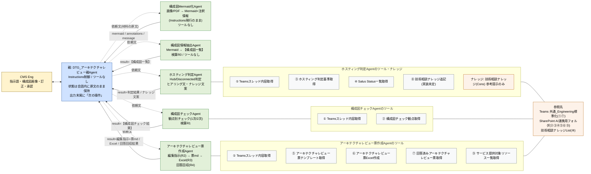

# アーキテクチャレビューAgent 設計書(v8.0)

## 1. 実装方式

### 1.1 親Agent+子Agent方式(Connected Agentsではない)

**採用する方式**: 親Agentの「エージェント」タブから作成する**子Agent(child agent)**方式。子Agentは親Agentの中に存在する軽量なAgentで、自分のInstructions・ツール・ナレッジを持ち、親から自然言語のタスクを受け取って実行し、結果を親へ返す。

| 観点 | 子Agent方式(採用) | Connected Agents(既存Agentを接続) |
|---|---|---|
| 作り方 | 親の中に作る。親と一緒に公開・管理する | 別に公開済みのCopilot Studio Agentを親へ接続する |
| 会話コンテキスト | 親の会話の文脈(添付ファイルを含む)を子が受け取る。構成図の画像を子が読めるのはこのため | 接続先は別Agentのため、親から渡した内容だけを受け取る |
| 親へ返るもの | 既定では「実行中に起こったことの自然言語要約」。**そのため本設計では子に出力(Output)を定義し、成果物の全文を返す** | 同様に応答テキスト |
| ツール数の上限 | 子Agentは独自のオーケストレーションを持ち、ツール数は親と別枠 | 接続先Agentの枠 |
| 本PoCでの判断 | 1つの業務(アーキテクチャレビュー)を1つの親で完結させ、子は親からしか呼ばれない。画像を子に読ませたい。→ 子Agent方式 | 他業務(事前相談Agent等)と共用するAgentができた時点で検討 |

親Agentは**生成オーケストレーション**で動く。生成オーケストレーションは、Engの入力とAgentのInstructionsをもとに、名前と説明文から適切な子Agent・ツール・トピックを選んで実行する仕組みである。本設計では親がツールを持たず、選ぶ対象は子Agentだけにしている。

Microsoft公式ドキュメント:

- 子エージェントを追加する: https://learn.microsoft.com/ja-jp/microsoft-copilot-studio/add-agent-child-agent
- 他のエージェントの概要を追加(子エージェント / 接続されたエージェントの位置づけ): https://learn.microsoft.com/ja-jp/microsoft-copilot-studio/authoring-add-other-agents
- 既存のCopilot Studioエージェントに接続する(Connected Agents): https://learn.microsoft.com/ja-jp/microsoft-copilot-studio/add-agent-copilot-studio-agent
- マルチエージェント オーケストレーション パターンとベスト プラクティス: https://learn.microsoft.com/ja-jp/microsoft-copilot-studio/guidance/multi-agent-patterns
- 生成オーケストレーション機能を適用する: https://learn.microsoft.com/ja-jp/microsoft-copilot-studio/guidance/generative-orchestration
- 生成オーケストレーションのための高品質な指示を構成する: https://learn.microsoft.com/ja-jp/microsoft-copilot-studio/guidance/generative-mode-guidance

### 1.2 進行制御はInstructions(トピックではない)

**採用する方式**: レビューの進行(どの段階で、どの子Agentへ、何を渡し、次に何を案内するか)は、親AgentのInstructionsに「依頼の判定(指示語 → 処理 → 子Agent)」「手順1〜17」「保持する状態」「出力の終わり方(次の操作)」として書き、生成オーケストレーションに実行させる。トピック・グローバル変数・子Agentの入力定義は使わない。子Agentの**出力定義だけ**は使う(§1.1のとおり、出力が無いと親に要約しか返らないため)。

| 観点 | Instructions制御(採用) | トピック制御(v6.1設計。戻せるように保持) |
|---|---|---|
| 仕組み | 親のInstructions(自然言語)に手順を書き、生成オーケストレーションが判断して子を呼ぶ | トピック(条件・変数設定・子Agent呼び出しノードを並べた会話フロー)を作り、トリガー(エージェントが選択する / リダイレクト)で起動する。状態はグローバル変数(`Global.xxx`)に持ち、子への受け渡しは子Agentノードの入力・出力で行う |
| 決定性 | 生成AIの判断に依存する(指示語で判断させる・1指示=1子で制限して補う) | 高い(ノードの順に必ず実行される) |
| 状態の保持 | 会話の中に原文のまま保持する(要約・省略の禁止をInstructionsに明記) | グローバル変数に確実に保持できる |
| 構築・保守 | 画面はInstructionsの編集のみ。分岐追加は文の追加 | トピック11本・変数16個以上の作成と保守(v6.1)。変数のスコープ変更が不可逆など、UI操作の落とし穴が多い |
| 本PoCでの判断 | まず実装が容易なInstructions制御で動作検証する | 指示語の誤判定・状態の取り違え・子の連鎖呼び出しが再現性をもって起きる場合は、その段階だけトピック制御に戻す(親の依頼の判定の1行を「トピック `T1a-1` へリダイレクト」に置き換える) |

**トピック制御へ戻すときの単位**: 段階ごとに戻せる。例: 構成図のMermaid化(手順1〜5)だけをトピック `T1a-1`(作成済み・オフ)に戻し、他はInstructionsのままにできる。戻した段階では、その段階の状態(Mermaid・注釈情報など)をグローバル変数に持たせ、後続の段階へは親が変数の内容を依頼文に含めて渡す。

Microsoft公式ドキュメント(表示されない場合は `ja-jp` → `en-us`):

- トピックの作成と編集: https://learn.microsoft.com/ja-jp/microsoft-copilot-studio/authoring-create-edit-topics
- トピックの入力と出力を管理する: https://learn.microsoft.com/ja-jp/microsoft-copilot-studio/advanced-managing-topic-inputs-outputs
- グローバル変数の操作: https://learn.microsoft.com/ja-jp/microsoft-copilot-studio/authoring-variables-bot
- 変数の概要: https://learn.microsoft.com/ja-jp/microsoft-copilot-studio/authoring-variables-about
- 生成AIでエージェントの動作を調整する(オーケストレーションの設定): https://learn.microsoft.com/ja-jp/microsoft-copilot-studio/advanced-generative-actions

---

## 2. Agent構成(親1+子5)

| 設計上の呼び名 | Copilot Studio上のAgent名 | 役割 | ツール | ナレッジ | 備考 |
|---|---|---|---|---|---|
| 親Agent | `DTG_アーキテクチャレビュー親Agent` | Engとの唯一の会話窓口。指示語で処理を判定し、子Agentを1体だけ呼ぶ。子の出力を原文のまま保持して次の子へ渡す。出力の末尾で「次の操作」を案内する。承認ゲート | なし | なし | 生成オーケストレーション=オン / トピック `T1a-1` はオフのまま保持 / Web検索・Memory=オフ / 公開は親から |
| 構成図Mermaid化Agent | `構成図Mermaid化Agent` | 構成図の画像/PDFをMermaidコード+注釈情報に書き起こす。Engの改修指示を反映して再出力する。レビュー・評価・確認ポイントは作らない | なし | なし | **Instructionsは現行のまま変更しない**(説明文と出力定義のみ追加)。画像を読む唯一のAgent |
| 構成図情報抽出Agent | `構成図情報抽出Agent` | 確定Mermaid+注釈情報から【構成図一覧】(推定CSP・サービス一覧・NW情報・注釈情報・記載なし)を抽出する。検算R0 | なし | なし | v8.0で観点チェックを外し、一覧抽出のみに変更。画像は読まない |
| ホスティング判定Agent | `ホスティング判定Agent` | Teamsスレッド+ノックアウト要件+Salus Statusを照合し、DCS Hub / Disconnected を判定する。不足時は追加ヒアリング文。クローズ時はナレッジ文案作成、(ツール⑧がある場合)承認後の登録 | ① ③ ④(⑧) | 技術相談ナレッジ(Cons)※参考提示のみ | ④は Salus Status一覧のみ(サービス検証状況は使わない)。判定不能のときは親がEngに環境を聞く |
| 構成図チェックAgent | `構成図チェックAgent` | 観点表(ツール②)の適用行を1件ずつ判定トリガーで評価し、記載の有無を判定(AI判定○は確定 / △は判定案)。区分A〜E、票で確認するもの・Eng目視確認・要人手確認・ヒアリング文を出す。1次と2次。検算R1 | ① ② | なし | **v8.0で新設**。設計の良し悪しは評価しない。画像は読まない |
| アーキテクチャレビュー票作成Agent | `アーキテクチャレビュー票作成Agent` | テンプレート(⑤)を判定結果・【構成図チェック結果】で編集指示①流用/②添削/③追記/④不要に仕分け(R2)、申し送り事項(⑨)を追記、票md作成 → Excel生成(⑥・R3)→ 回答回収(⑦・R4) | ① ⑤ ⑥ ⑦ ⑨ | なし | Noはテンプレートのまま(追記は最後のNo+1〜)。④不要の行はExcelに書かない |
| (廃止)構成図修正Agent | — | v7.1まで存在。構成図修正指示の文案作成 | — | — | v8.0で廃止。構成図の修正依頼は構成図チェックAgentの区分C(利用者へ記載・修正依頼)とヒアリング文で代替 |

**名前の一致**: 生成オーケストレーションは子Agentを名前と説明文で選ぶため、親のInstructionsに書く子Agent名はCopilot Studio上の名前と完全一致させる。子の説明文には「親Agentからのみ呼び出される(Engとは直接会話しない)」を入れ、Engの発話から子が直接選ばれないようにする。各Agentの説明文・Instructions・ツール説明文・出力定義は Instructions集 v8.0 を正とする。

---

## 3. 関連図

読み方: 点線=親からの委任(依頼文に材料の原文を含める)、実線=子から親への返却(出力定義)。子Agent同士は直接やり取りしない。スレッド本文は親が渡さず、必要な子がツール①で自分で読む。構成図の画像は構成図Mermaid化Agentだけが読む(会話の添付から)。

---

## 4. ツール一覧(名称と用途のみ。設計・入出力・参照先は「ツール一覧 v2.0」、⑦の詳細設計は「ツール設計書 v1.1」を参照)

| No | ツール名 | 用途 | 持ち主 | 状況 |
|---|---|---|---|---|
| ① | Teamsスレッド内容取得 | RITM番号でスレッド(親投稿+全返信+添付一覧)を取得し、本文から判定したCSPを返す | ホスティング判定Agent / 構成図チェックAgent / アーキテクチャレビュー票作成Agent | 実装済み |
| ② | 構成図チェック観点取得 | 観点表(Excel)から対象環境・CSP・1次/2次に該当する観点を絞り、版と適用行数を付けて返す | 構成図チェックAgent | 要改修(v2.0設計。**Excel直読み+適用行数の算出は推奨案。承認前**。改修までは現行のmd全文版を使う) |
| ③ | ホスティング判定基準取得 | ホスティング判定基準.md(ノックアウト要件)の全文を返す | ホスティング判定Agent | 実装済み |
| ④ | Salus Status一覧取得 | Salus_Status一覧.mdの全文を返す(サービス検証状況は返さない) | ホスティング判定Agent | 要改修(出力を1つに) |
| ⑤ | アーキテクチャレビュー票テンプレート取得 | CSP別テンプレートmd(全NN行・No付き)の全文を返す | アーキテクチャレビュー票作成Agent | 実装済み |
| ⑥ | アーキテクチャレビュー票Excel作成 | 雛形をコピーし、行データJSONをテーブルへ書き込み、件数とリンクを返す(「No.」はJSONの値をそのまま転記) | アーキテクチャレビュー票作成Agent | 実装済み(フロー変更なし) |
| ⑦ | 回答済みアーキテクチャレビュー票取得 | チャネルフォルダから回答済みExcelを特定し、全行をmd表で返す | アーキテクチャレビュー票作成Agent | 実装済み |
| ⑧ | 技術相談ナレッジ追記 | 承認済み文案16項目をSharePoint Listへ登録し、リンクを返す | ホスティング判定Agent | 実装未定(未実装の間はEngが手動登録) |
| ⑨ | サービス提供対象リソース一覧取得 | サービス提供対象リソース一覧.md(利用者による動作検証必要○)の全文を返す | アーキテクチャレビュー票作成Agent | 新設・未実装 |

---

## 5. InputとOutput

### 5.1 システム全体のInput / Output

| 区分 | 内容 | 出どころ / 行き先 |
|---|---|---|
| Input(Engが親へ入力) | RITM番号 / 構成図の画像またはPDF(会話に添付)/ 指示語 / Mermaidの修正内容 / 一覧・判定への訂正・補足 / 編集指示の修正点 / 判定不能時の環境(Hub/Disconnected)/ ナレッジ文案の修正・承認 | Eng → 親Agent(会話) |
| Input(ツール経由で子が読む) | Teamsスレッド(案件情報・ホスティング判断アプリの結果・利用者の回答)/ 回答済みアーキテクチャレビュー票Excel / 構成図チェック観点表 / ホスティング判定基準 / Salus Status一覧 / アーキテクチャレビュー票テンプレート / サービス提供対象リソース一覧 | Teams・SharePoint → ツール①〜⑤⑦⑨ → 子Agent |
| Output(子が作り、親が保持・提示) | 確定Mermaid+注釈情報 / 【構成図一覧】/ ホスティング判定結果(判定環境・根拠・Salus照合・追加ヒアリング文)/ 【構成図チェック結果】(1次・2次)/ 編集指示+アーキテクチャレビュー票md / 送付用Excel(SharePoint上)/ 回答回収結果 / ナレッジ文案(+登録リンク) | 子Agent → 親Agent → Eng(チャット)。ExcelはSharePointの送付フォルダ |
| Output(人が外へ出す) | ヒアリング文のスレッド投稿 / アーキテクチャレビュー票Excelの利用者送付 / ナレッジの登録(⑧が無い間) | Eng / Mgmt → Teams・SharePoint List(**Agentは投稿・送付をしない**) |

### 5.2 Agent別の入出力(親の依頼文で渡すもの / 出力定義で返るもの)

| Agent | 親から受け取るもの(依頼文に原文で含める) | 親へ返すもの(出力定義) | 出力の見出し(固定) |
|---|---|---|---|
| 構成図Mermaid化Agent | 初回: 書き起こし依頼(「レビュー・評価・確認ポイントの作成は不要」を明示。画像は会話の添付)/ 改修: 直前の下書きMermaid+注釈情報+Engの修正内容 | `mermaid` / `annotations` / `message` | Mermaidコードブロック + 「## 注釈情報」(箇条書き) |
| 構成図情報抽出Agent | RITM番号+確定Mermaid+確定注釈情報 | `result` | 【構成図一覧】RITM: / 推定CSP: → ■サービス一覧(NN件)/ ■NW情報 / ■注釈情報 / ■記載なし・方向不明 / 検算R0 |
| ホスティング判定Agent | 処理名(判定 / 再判定 / ナレッジ文案作成 / 登録実行)+RITM番号+【構成図一覧】+Engの訂正・補足(再判定時は回答回収結果も / 登録実行時は承認済み文案) | `result` | ## ホスティング判定結果(判定環境・根拠(基準ID)・スレッド由来CSP・Salus照合一覧・追加ヒアリング文)/ ナレッジ文案(16項目)/ 登録リンク |
| 構成図チェックAgent | 処理名(1次 / 2次)+RITM番号+対象環境+スレッド由来CSP+確定Mermaid+注釈情報+【構成図一覧】+ホスティング判定結果(2次は回答回収結果も) | `result` | 【構成図チェック結果】RITM: / 処理: / 対象環境: / CSP: / 観点表の版: / 適用行数: → ■観点別チェック / ■票で確認するもの / ■Eng目視確認 / ■要人手確認 / ■ヒアリング文 / 検算R1 |
| アーキテクチャレビュー票作成Agent | 処理名(票作成 / 修正反映 / Excel生成 / 回答回収)+RITM番号+(票作成: 判定結果+【構成図チェック結果】+【構成図一覧】/ 修正反映: 直前の編集指示+修正点 / Excel生成: CSP+確定版編集指示 / 回答回収: RITM番号のみ) | `result` | 編集指示(①流用 / ②添削 / ③追記 / ④不要+検算R2)+アーキテクチャレビュー票md / 書き込み件数+Excelリンク+検算R3 / ## 回答回収結果([回答済み]/[未回答]/[要確認]+検算R4+「構成図修正あり」の明示) |

子Agentには入力(Input)を定義しない(定義すると値が空のときにEngへ聞き返しが発生するため)。材料はすべて親の依頼文に含める。

---

## 6. 全体ワークフロー

```mermaid
flowchart TD
    classDef human fill:#fff3cd,stroke:#856404,color:#000
    classDef parent fill:#cfe2ff,stroke:#084298,color:#000
    classDef child fill:#e2f0d9,stroke:#2e7d32,color:#000
    classDef gate fill:#f8d7da,stroke:#842029,color:#000

    S0["フェーズ0 前提(人)<br>Mgmtがスレッド作成・Engへ依頼<br>EngがRITM番号と構成図を用意"]:::human
    S1["フェーズ1 構成図のMermaid化<br>「RITMxxxをレビューして」+画像<br>構成図Mermaid化Agent"]:::child
    G1{"Engが描画して照合<br>修正内容 / 「完了」"}:::gate
    S2["フェーズ2 一覧抽出<br>「抽出して」<br>構成図情報抽出Agent(R0)"]:::child
    S3["フェーズ3 ホスティング判定<br>「判定して」(+訂正)<br>ホスティング判定Agent"]:::child
    G3{"情報充足?<br>判定不能なら環境をEngへ確認"}:::gate
    H3["ヒアリング文をスレッドへ投稿(人)<br>回答後「再判断して」"]:::human
    S4["フェーズ4 構成図チェック1次<br>「構成図チェックして」<br>構成図チェックAgent(R1)"]:::child
    G4{"要人手確認・Eng目視確認<br>ヒアリング文あり?"}:::gate
    S5["フェーズ5 票作成<br>「レビュー票を作成して」<br>アーキテクチャレビュー票作成Agent(R2)"]:::child
    G5{"修正点 / 「確定」"}:::gate
    S5b["Excel生成<br>「Excelを作成して」<br>アーキテクチャレビュー票作成Agent(R3)"]:::child
    S6["フェーズ6 送付・回答待ち(人)<br>Excel確認・行追加修正・案件名<br>Mgmt経由で利用者へ送付"]:::human
    S7["フェーズ7 回答回収<br>「回答を確認して」<br>アーキテクチャレビュー票作成Agent(R4)"]:::child
    G7{"回答の内容"}:::gate
    S8a["フェーズ8-1 構成図修正あり<br>「RITMxxxをレビューして」+修正図<br>→ フェーズ1〜2を再実行"]:::child
    S8b["フェーズ8-2 再判定<br>「再判断して」<br>ホスティング判定Agent"]:::child
    S8c["フェーズ8-3 構成図チェック2次<br>「2次チェックして」<br>構成図チェックAgent(統合ヒアリング文)"]:::child
    G8{"追加ヒアリング / 票の見直し / 解消"}:::gate
    H8["追加ヒアリング文をスレッドへ投稿(人)<br>回答後「再判断して」→「2次チェックして」"]:::human
    S9["フェーズ9 クローズ(人)<br>最終確認・利用者へ結果連絡"]:::human
    S9b["ナレッジ文案作成<br>「ナレッジ文案を作成して」<br>ホスティング判定Agent"]:::child
    G9{"「承認」/ 手動登録"}:::gate
    END["完了"]:::human

    S0 --> S1 --> G1
    G1 -- 修正内容 --> S1
    G1 -- 完了 --> S2 --> S3 --> G3
    G3 -- 不足 --> H3 --> S3
    G3 -- 充足 --> S4 --> G4
    G4 -- 確認・投稿後 必要なら再判断 --> S4
    G4 -- 問題なし --> S5 --> G5
    G5 -- 修正点 --> S5
    G5 -- 確定 --> S5b --> S6 --> S7 --> G7
    G7 -- 構成図修正あり --> S8a --> S8b
    G7 -- 修正なし --> S8b
    S8b --> S8c --> G8
    G8 -- 追加ヒアリング --> H8 --> S8b
    G8 -- 票の見直し --> S5
    G7 -- すべて解消 --> S9
    G8 -- 解消 --> S9
    S9 --> S9b --> G9 --> END
```

**指示語と処理の対応(親の「依頼の判定」と同じ)**

| 指示語(Engの入力) | 処理 | 呼ばれる子Agent | 親が渡す主な材料 |
|---|---|---|---|
| 「RITMxxxをレビューして」+構成図画像/PDF | 構成図のMermaid化 | 構成図Mermaid化Agent | 書き起こし依頼文(レビュー不要を明示) |
| Mermaid確認待ちでの修正内容 / 「完了」 | Mermaidの改修 / 確定 | 構成図Mermaid化Agent / (呼ばない) | 下書きMermaid+注釈情報+修正内容 |
| 「抽出して」 | 一覧抽出 | 構成図情報抽出Agent | RITM+確定Mermaid+注釈情報 |
| 「判定して」(+訂正・補足) | ホスティング判定 | ホスティング判定Agent | RITM+【構成図一覧】+訂正・補足 |
| 「再判断して」 | 再判定 | ホスティング判定Agent | 同上(+回答回収結果) |
| 「構成図チェックして」 | 構成図チェック1次 | 構成図チェックAgent | RITM+対象環境+CSP+Mermaid+注釈情報+【構成図一覧】+判定結果 |
| 「レビュー票を作成して」/「レビュー票を見直して」+指摘 | 票作成 | アーキテクチャレビュー票作成Agent | RITM+判定結果+【構成図チェック結果】+【構成図一覧】(+回答回収結果+指摘) |
| 編集指示確認待ちでの修正点 / 「確定」 | 修正反映 / 確定 | アーキテクチャレビュー票作成Agent / (呼ばない) | 直前の編集指示+修正点 |
| 「Excelを作成して」 | Excel生成 | アーキテクチャレビュー票作成Agent | RITM+CSP+確定版編集指示 |
| 「回答を確認して」 | 回答回収 | アーキテクチャレビュー票作成Agent | RITM |
| 「2次チェックして」 | 構成図チェック2次 | 構成図チェックAgent | 1次の材料の最新版+回答回収結果 |
| 「ナレッジ文案を作成して」/「承認」/「中止」 | ナレッジ文案作成 / 登録実行(⑧がある場合)/ 中止 | ホスティング判定Agent | RITM+最終判定結果 / 承認済み文案 |

2次チェックのループは**案1(Engが各指示語を順に入力する)**で実装する。動作が安定した後、「回答を確認して」→再判定→2次チェックを親が自動で連鎖させる案2へ変更する余地を残す(設計原則6)。

---

## 7. フェーズ別の動作詳細

フェーズ0 前提(人)

| 項目 | 内容 |
|---|---|
| 担当 | Mgmt / Eng |
| 前提 | Mgmtが共通_Engineering標準化チャネルに案件スレッド(RITM番号・案件情報・ホスティング判断アプリの結果)を作成し、Engへレビューを依頼している。構成図(画像またはPDF)がスレッドまたは手元にある |
| Engの準備 | RITM番号(半角)/ 構成図ファイル / 親Agentとの新しい会話(1案件=1会話を推奨。別の会話で続ける場合、親は状態の貼り付けを求める) |
| Agent | 動かない |

フェーズ1 構成図のMermaid化(構成図Mermaid化Agent)— 親の手順1〜5

| 項目 | 内容 |
|---|---|
| 開始 | Engが「RITMxxxをレビューして」と入力し、構成図の画像/PDFを添付する |
| 親 | RITM番号を特定(無ければ聞き返す)。画像が無ければ添付を依頼して停止。構成図Mermaid化Agentへ「添付された構成図をMermaidへ書き起こしてください。レビュー・評価・確認ポイントの作成は不要です。出力はMermaidコードと注釈情報だけにしてください。」と依頼 |
| 子 | 会話の添付から画像を読み、Mermaidコード+注釈情報を出力(現行Instructionsのまま)。出力定義 `mermaid` / `annotations` / `message` |
| 親 | `mermaid`・`annotations` を下書きとして保持。**次の操作**: Mermaid Live(https://mermaid.live)やVS Codeで描画して原図と照合 → 修正がある → 修正内容をそのまま入力 / 問題ない → 「完了」。`mermaid` が空なら `message` を原文で提示 |
| ループ | 修正内容が入力されたら、親が下書きMermaid+注釈情報+修正内容を渡して再依頼(「レビュー・評価は不要」を明示)。出力で下書きを置き換え、同じ案内で停止 |
| 確定 | 「完了」で下書きを確定Mermaid・確定注釈情報として保持。**次の操作**: → 「抽出して」 |
| 人の作業 | 描画と照合、修正内容の入力、「完了」 |

フェーズ2 一覧抽出(構成図情報抽出Agent)— 親の手順6

| 項目 | 内容 |
|---|---|
| 開始 | 「抽出して」 |
| 親 | 確定Mermaidが無ければフェーズ1を案内して停止。構成図情報抽出AgentへRITM番号+確定Mermaid+確定注釈情報を渡す(画像は渡さない) |
| 子 | 【構成図一覧】を作る: 推定CSP / ■サービス一覧(NN件。ノードID・表示ラベル・所属subgraph・複製は1つに)/ ■NW情報(接続と向き)/ ■注釈情報 / ■記載なし・方向不明 / 検算R0(サービス一覧の件数 ⇔ 非サービス要素を除くノード数。不一致なら出力せずやり直す)。判定・評価はしない |
| 親 | `result` を【構成図一覧】として保持。**次の操作**: 問題なし → 「判定して」/ 一覧に訂正がある → 「判定して。CSPはAWS、右下にRDSあり」のように添える |
| 人の作業 | 一覧の目視確認、訂正の入力 |

フェーズ3 ホスティング判定(ホスティング判定Agent)— 親の手順7〜9

| 項目 | 内容 |
|---|---|
| 開始 | 「判定して」(+訂正・補足)/ 「再判断して」 |
| 親 | ホスティング判定Agentへ「判定」(または「再判定」)と明示し、RITM番号+【構成図一覧】+Engの訂正・補足を渡す(再判定時は回答回収結果があればそれも)。スレッド本文は渡さない |
| 子 | ツール①でスレッド(案件情報・ホスティング判断アプリの結果・利用者の回答)を読む → ツール③でノックアウト要件を1件ずつ照合(基準IDを根拠に)→ ツール④でサービス一覧のSalus Statusを照合(一覧に無いものは「未照合」)→ 判定環境(DCS Hub / Disconnected / 判定不能)と根拠、スレッド由来CSP、追加ヒアリング文(箇条書き)を「## ホスティング判定結果」で返す。ナレッジは過去類似案件の参考提示のみ |
| 親 | `result` を保持し、判定環境を**対象環境**として保持。推定CSPとスレッド由来CSPが不一致なら「⚠ どちらが正しいか確認」を添える。判定が「判定不能」なら「環境はHubとDisconnectedのどちらで進めますか」と聞き、回答を対象環境として保持。**次の操作**: 情報充足 → 「構成図チェックして」/ 追加ヒアリングが必要 → ヒアリング文をスレッドへ投稿し、回答が反映されたら「再判断して」/ 一覧に訂正 → 「判定して。…」 |
| ループ | 「再判断して」で子はスレッドを再取得して判定し直す。親は判定結果と対象環境を最新版に置き換える |
| 人の作業 | ヒアリング文のスレッド投稿(Agentは投稿しない)、CSP不一致の確認、判定不能時の環境の回答、再判断の指示 |

フェーズ4 構成図チェック1次(構成図チェックAgent)— 親の手順10

| 項目 | 内容 |
|---|---|
| 開始 | 「構成図チェックして」 |
| 親 | 対象環境が無ければ聞き返す。構成図チェックAgentへ「1次」と明示し、RITM番号+対象環境+スレッド由来CSP+確定Mermaid+確定注釈情報+【構成図一覧】+ホスティング判定結果を渡す |
| 子 | ①ツール①でスレッド(利用者の回答・要件)を読む → ②ツール②に環境・CSP・「1次」を渡し、観点表の版と適用行数NN(検算R1の分母)と適用行を受け取る → ③適用行を上から1件ずつ: 判定トリガー(標準)を評価(常時 / 存在: A/B / 回答: 「項目」=値 / かつ)→ 実施しない行は「対象外(理由)」→ AI判定○の行は AI判定方法(Mermaid読み替え表: アイコン→ノードラベル、境界線→subgraph、矢印→接続、注記→注釈情報)と判断基準で 記載あり / 記載なし / 方向不明 / 判定不能 を決め根拠を書く → AI判定△の行は判定案+人に確認してほしいことを書き区分は要人手確認 → ネクストアクション(標準)の「判定値 → 区分」で区分A〜Eを決める → AI出力内容に指定された項目を出す → ④検算R1(出力した観点の件数(対象外含む)⇔ 適用行数)→ ⑤まとめ: ■票で確認するもの(区分C・D。テンプレート対象No付き)/ ■Eng目視確認(区分B)/ ■要人手確認(△)/ ■ヒアリング文(利用者向け箇条書き) |
| 判定の性質 | 「記載の有無」の判定であり、設計の良し悪しは評価しない(「〜の記載がない」と書く。「〜すべき」とは書かない)。観点表に無い観点を追加しない。対象外の行も理由付きで出力に残す |
| 親 | `result` を【構成図チェック結果】(1次)として保持。**次の操作**: 問題なし → 「レビュー票を作成して」/ 要人手確認・ヒアリングを先に済ませる → 確認結果をスレッドへ反映し、必要なら「再判断して」、そのあと「構成図チェックして」 |
| 人の作業 | Eng目視確認(区分B)の実施、要人手確認(△)の判断、ヒアリング文の投稿 |
| 備考 | ツール②の「Excel直読み+適用行数の算出」は推奨案(未承認)。改修前は現行のmd全文版を使い、子が自分で絞り込む(R1の分母はmd先頭の内訳で代用) |

フェーズ5 アーキテクチャレビュー票作成+Excel生成(アーキテクチャレビュー票作成Agent)— 親の手順11〜13

| 項目 | 内容 |
|---|---|
| 開始 | 「レビュー票を作成して」(2次以降の見直しは「レビュー票を見直して」+指摘) |
| 親 | 「票作成」と明示し、RITM番号+ホスティング判定結果+【構成図チェック結果】+【構成図一覧】を渡す(見直し時は回答回収結果+Engの指摘も) |
| 子(票作成) | ツール①で案件情報とCSPを確定 → ツール⑤でCSP別テンプレート(全NN行・No付き)を取得 → ツール⑨でサービス提供対象リソース一覧を取得 → 材料を突き合わせて編集指示を作る: (a)ホスティング判定結果(判定環境・Salus照合)→ 該当項目の②添削 / ④不要 (b)【構成図チェック結果】の「票で確認するもの」→ テンプレート対象Noの行を②添削(依頼・確認内容を反映)、対応行が無ければ③追記 (c)申し送り事項: サービス一覧のうち⑨で「動作検証必要=○」のサービス → ③追記 (d)見直し時: 回答回収結果とEngの指摘を反映 → 検算R2(①流用+②添削+④不要 ⇔ テンプレート全行数。③追記は分母に含めない)→ 編集指示+アーキテクチャレビュー票mdを返す |
| Noのルール | ①流用・②添削はテンプレートのNoのまま / ③追記はテンプレート最後のNo+1から採番 / ④不要はExcelに書かない(本番では行を非表示にする案。PoCでは書かない) |
| 親 | `result` を編集指示(案)として保持。**次の操作**: 修正がある → 修正点を入力(例:「No.5は不要にして」)/ 問題ない → 「確定」 |
| ループ(修正反映) | 修正点を受けたら「修正反映」と明示し、直前の編集指示+修正点を渡す。出力で案を置き換え、同じ案内で停止。「確定」で確定版として保持し、**次の操作**: → 「Excelを作成して」 |
| Excel生成 | 「Excelを作成して」で親が「Excel生成」と明示し、RITM番号+スレッド由来CSP+確定版編集指示を渡す。子は①流用+②添削+③追記の行をJSON(キーはExcel見出しと完全一致。「No.」は編集指示の番号のまま)にしてツール⑥を実行 → 書き込み件数とリンク → 検算R3(件数 ⇔ 渡した行数。不一致はEngへ報告)。親は結果を保持し、**次の操作**: Excelを開いて確認し、必要な行の追加・修正と【案件名】の書き換えをしてMgmt経由で利用者へ送付 → 回答が返ったら「回答を確認して」 |
| 人の作業 | 編集指示の確認・修正点・確定、Excelの確認・行の追加修正・案件名の書き換え、送付 |

フェーズ6 送付・回答待ち(人)

| 項目 | 内容 |
|---|---|
| 担当 | Eng / Mgmt / 利用者 |
| 内容 | EngがExcelを確認し(行の追加・修正・【案件名】の書き換え)、Mgmt経由で利用者へ送付する。利用者は回答を記入したExcelをスレッドへ添付して返送する(ファイル名のRITM部分と「アーキテクチャレビュー票」を変えない。行を削除しない)。構成図を修正した場合は修正後の構成図もスレッドへ添付する |
| Agent | 動かない(投稿・送付・催促はしない) |

フェーズ7 回答回収(アーキテクチャレビュー票作成Agent)— 親の手順14

| 項目 | 内容 |
|---|---|
| 開始 | 「回答を確認して」 |
| 親 | 「回答回収」と明示し、RITM番号を渡す |
| 子 | ツール⑦で回答済みExcel(最新1件)を取得(未添付なら「回答未着」と報告)→ 全行(Engが手で追加した行を含む)を [回答済み] / [未回答] / [要確認] に仕分け → 検算R4(合計 ⇔ 全行数)→ 「## 回答回収結果」で返す。回答に構成図の修正・再提出が含まれる場合は「構成図修正あり」と明示する |
| 親 | `result` を回答回収結果として保持。**次の操作**: 構成図の修正がある → 「RITMxxxをレビューして」+修正後の構成図 / 構成図の修正はない → 「再判断して」/ すべて解消 → 最終確認・クローズ後に「ナレッジ文案を作成して」 |
| 人の作業 | 回答の受領確認、修正後の構成図の添付、次の指示語の入力 |

フェーズ8 2次チェック(構成図修正あり → フェーズ1〜2再実行 → 再判定 → 構成図チェック2次)— 親の手順15

| 項目 | 内容 |
|---|---|
| 8-1 構成図修正あり | Engが「RITMxxxをレビューして」+修正後の構成図を入力 → フェーズ1(Mermaid化・照合・「完了」)→ フェーズ2(「抽出して」)を再実行し、確定Mermaid・注釈情報・【構成図一覧】を最新版に置き換える。親は次に「再判断して」→「2次チェックして」の順に案内する |
| 8-2 再判定 | 「再判断して」→ ホスティング判定Agentがスレッド(利用者の回答)を再取得して判定し直す(フェーズ3と同じ。回答回収結果も渡す)。判定結果・対象環境を最新版に置き換える |
| 8-3 構成図チェック2次 | 「2次チェックして」→ 親が「2次」と明示し、RITM番号+対象環境+スレッド由来CSP+最新の確定Mermaid・注釈情報+最新の【構成図一覧】+最新のホスティング判定結果+回答回収結果を渡す。子はツール②を「2次」で呼び(1次・2次の全行が対象)、判定トリガー「回答:」は回答回収結果とスレッドの両方で評価し、1次と同じ形式で【構成図チェック結果】(処理: 2次)を返す。**ヒアリング文は、ホスティング判定結果の追加ヒアリング文と統合して1つの箇条書きにする**(D-9の推奨案。未承認) |
| 親 | `result` を【構成図チェック結果】(2次)として保持。**次の操作**: 追加ヒアリングが必要 → ヒアリング文をスレッドへ投稿し、回答が反映されたら「再判断して」→「2次チェックして」/ 票の見直しが必要 → 「レビュー票を見直して」+指摘 / 解消 → 最終確認・クローズ後に「ナレッジ文案を作成して」 |
| ループの実装 | 案1: Engが各指示語を順に入力する(採用)。案2(将来): 「回答を確認して」の後、親が再判定→2次チェックを自動連鎖する。案2へ変更する場合は親の「1指示=1子Agentの原則」と手順14〜15を書き換える |
| 人の作業 | 修正後の構成図の添付と照合、指示語の順次入力、追加ヒアリング文の投稿、票の見直し指示 |

フェーズ9 クローズ+ナレッジ文案(ホスティング判定Agent)— 親の手順16〜17

| 項目 | 内容 |
|---|---|
| クローズ(人) | Engが最終確認を行い、Mgmt経由で利用者へレビュー結果を連絡する。Agentは連絡しない |
| ナレッジ文案 | 「ナレッジ文案を作成して」→ 親が「ナレッジ文案作成」と明示し、RITM番号+最終のホスティング判定結果を渡す → ホスティング判定Agentが技術相談ナレッジListの16項目に沿った文案を返す |
| 登録 | ツール⑧がある場合: 親の**次の操作**は 修正があれば修正内容を含めて「承認」/ 登録しない → 「中止」。「承認」を受けたときだけ親が「登録実行」と明示して呼び出し、子がツール⑧で登録してリンクを返す。承認前に登録は実行しない。ツール⑧が無い間(実装未定): 親は「文案をコピーして技術相談ナレッジListへ手動で登録」と案内する |
| 人の作業 | 最終確認・利用者連絡、文案の修正・承認、(⑧が無い間)手動登録 |

---

## 8. 人間に残る作業

| # | いつ | 誰 | 作業 | 推奨・補足 |
|---|---|---|---|---|
| 1 | 全フェーズ | Eng | **親Agentが出力末尾に提示する「次の操作」に従って指示語を入力する**(親は「状況 → 指示語」で次に行うことを必ず示す。C7) | 推奨。指示語以外の言い回しでも動く場合があるが、誤判定を避けるため「次の操作」に示された指示語をそのまま入力する。一度に複数段階を頼まない(1指示=1子) |
| 2 | フェーズ0 | Mgmt / Eng | スレッドの作成・依頼、RITM番号と構成図(画像/PDF)の用意、親Agentとの会話開始 | 1案件=1会話 |
| 3 | フェーズ1 | Eng | Mermaidを描画(Mermaid Live / VS Code)して原図と照合し、修正内容を入力、または「完了」 | 確定Mermaid+注釈情報が後続すべての正になるため、ここで丁寧に照合する |
| 4 | フェーズ2 | Eng | 【構成図一覧】の目視確認と訂正の入力(「判定して。CSPはAWS…」) | — |
| 5 | フェーズ3 | Eng | CSP不一致(構成図由来 vs スレッド由来)の確認。判定不能のときの環境(Hub/Disconnected)の回答。ヒアリング文のスレッド投稿と「再判断して」 | Agentはスレッドへ投稿しない |
| 6 | フェーズ4 | Eng | Eng目視確認(区分B)の実施、要人手確認(△)の判断、ヒアリング文の投稿、必要なら再判断→再チェック | 判定は「記載の有無」。設計の良し悪しはEngが判断する |
| 7 | フェーズ5 | Eng | 編集指示(案)の確認、修正点の入力、「確定」。生成されたExcelの確認、**必要な行の追加・修正**、【案件名】の書き換え、Mgmt経由での送付 | Engが手で追加した行は、ツール⑦がそのまま読むので回答回収に含まれる |
| 8 | フェーズ6 | Mgmt / 利用者 | 票の送付・回答の記入・スレッドへの添付返送(ファイル名・行を変えない)、修正後の構成図の添付 | 運用ルールとして利用者へ案内する |
| 9 | フェーズ7〜8 | Eng | 回答の受領確認、修正後の構成図の再添付と照合、「再判断して」「2次チェックして」「レビュー票を見直して」の順次入力、追加ヒアリング文の投稿 | 2次のループは案1(Engが順に指示) |
| 10 | フェーズ9 | Eng / Mgmt | 最終確認、利用者への結果連絡、ナレッジ文案の修正・承認、(ツール⑧が無い間)技術相談ナレッジListへの手動登録 | すべての出力は案。承認は人が行う(C1) |
| 11 | 随時 | Eng | 資料のメンテナンス: 構成図チェック観点表(Excel。廃止行は廃止シートへ)、ホスティング判定基準md、Salus Status一覧md、アーキテクチャレビュー票テンプレートmd(CSP別)、サービス提供対象リソース一覧md、雛形xlsx | 観点の追加・変更はExcelの行で行い、Instructionsは変えない(設計原則9) |
| 12 | 随時 | Eng | Agentの保守: 指示語・Agent名・ツール名を変えたときのInstructions集・ツール一覧の同期、共通ブロックの貼り直し(設計原則・共通ルール集が正) | — |

---

## 9. 関連設計書

| 文書 | 版 | 内容 | 位置づけ |
|---|---|---|---|
| 設計原則・共通ルール集 | v1.0 | 設計原則10か条 / 検算ルールR0〜R4 / 共通厳守事項C1〜C7 / 共通ブロック / 用語 | 全文書の単一ソース。本設計書には再掲しない |
| Instructions集 | v8.0 | 親・各子Agentの説明文・Instructions・ツール説明文・関連Agent・ナレッジ・出力定義・その他設定 | Copilot Studioへ貼り付ける正本。構成図Mermaid化AgentのInstructionsは現行のまま(貼付枠のみ) |
| ツール一覧 | v2.0 | ツール①〜⑨の名前・用途・設計(入力/処理/出力/参照先/状況) | ②の再設計(Excel直読み+適用行数。**推奨案・未承認**)、④の変更、⑨の新設を含む |
| ツール設計書 | v1.1 | ⑦回答済みアーキテクチャレビュー票取得の各アクション設定・式・テスト観点(他ツールはv1.x時点の設計) | ⑦の詳細設計。他ツールはツール一覧v2.0が優先 |
| CopilotStudio側フロー構築手順書 | v1.0 | エージェント フローの共通の作り方・公開・Agentへの追加手順 | ツール構築時に参照 |
| ツール構築手順書(⑥Excel作成・⑧ナレッジ追記) | — | ⑥のOfficeスクリプトとフロー、⑧のList登録フローの構築手順 | ⑥は実装済み。⑧は実装未定 |
| 構成図チェック観点_論点一覧 | v1.0 | 観点表の標準化(判定トリガー3型・ネクストアクション5区分・判定値・AI判定○/△・テンプレート対象No)に関する論点と決定 | 業務有識者との確認記録。v8.0で決定済みの論点はInstructions集・ツール一覧へ反映済み |
| 設計書 v7.1(Instructions制御版)/ v6.1(トピック制御版) | v7.1 / v6.1 | 旧構成(構成図修正Agentあり)。v6.1はトピック `T1a-1` の設計と変数一覧 | トピック制御へ戻す場合の参照。現行設計はv8.0が正 |

**本版で採用したが未承認の推奨案(vetoがあれば差し戻す)**: (1) ツール②を観点表Excelの直読み+環境・CSP・1次/2次の絞り込み+適用行数の算出に改修する(検算R1の分母を人が注記しなくて済むようにするため) (2) 2次チェック時のヒアリング文は構成図チェックAgentがホスティング判定Agentの追加ヒアリング文と統合して1つの箇条書きにする(D-9)。
