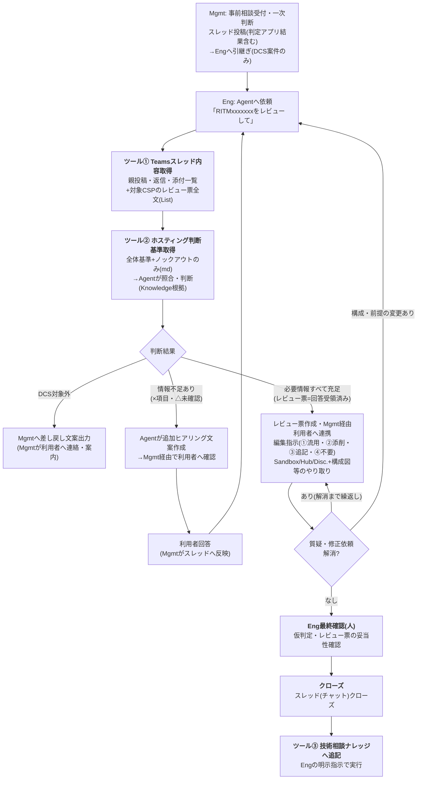
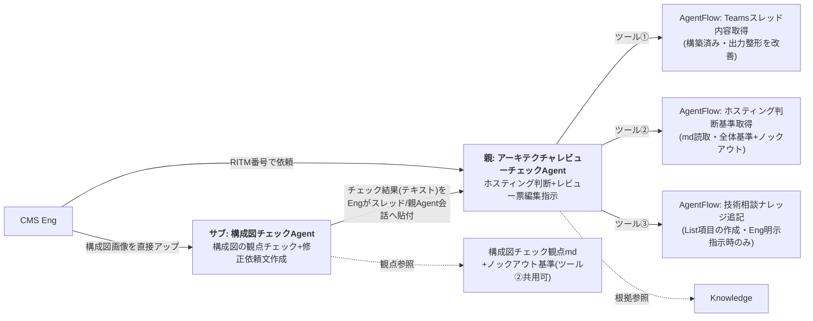

# アーキテクチャレビューチェックAgent 設計書(シンプル版)

| 項目 | 内容 |
|---|---|
| 版 | v1.0 |
| 更新日 | 2026-08-18 |
| 位置づけ | 2026-08-14チーム会議の確定事項を反映した再設計。**ホスティング判断は「全体基準+ノックアウトのみ」に簡素化**(その他はMgmt一次判断でカバー)。**構成図チェックAgent(サブエージェント)を新設**。旧・再整理案v1.3を置き換える |
| 実装先 | Copilot Studio(JP-IT-Int-PAD-Prod)。フローはAgentFlow(GA) |
| 構成 | 親Agent「アーキテクチャレビューチェックAgent」+サブAgent「構成図チェックAgent」+AgentFlow×3+Knowledge |

---

## 1. 全体ワークフロー



- 再依頼(ヒアリング→回答→再判断)は回答状況により複数回発生しうる
- 【内部確認】(CMSで判断できないセキュリティ要件/審査周り=TOM相談/VM・通信要件=CI・NWチーム相談)は**AIに任せない人間作業**。Agentは「専門部門への確認事項の整理案」までを出力する
- 追加ヒアリングの分担: **定型チェック項目の範囲内の不足=Agentが文案作成/範囲外(イレギュラー)=人間が作成**

## 2. コンポーネント構成と連携



### 親子連携の設計(PoC)

**PoCでは自動連携せず、Engが仲介する**(理由は§5の画像制約):

1. Engが構成図チェックAgentに構成図画像を直接アップ → チェック結果+修正依頼文(テキスト)を受領
2. Engがその結果をTeamsスレッドに貼る(または親Agentの会話にコピペ)
3. 親Agentはスレッド経由(ツール①)または会話中の貼付テキストとして構成図チェック結果を読み、判断材料に使う

Connected agentsによる自動連携(親→サブ呼び出し)は**Phase 2の検証項目**。現時点では (a)Connected agents自体が環境で未検証、(b)親子間で画像を受け渡せるかが不明、の2点があるため、まず人手ブリッジで業務価値を確認する。

## 3. 親Agent設計: アーキテクチャレビューチェックAgent

| 項目 | 内容 |
|---|---|
| 役割 | ①ホスティング判断(全体基準+ノックアウト照合、仮判定+根拠) ②レビュー票編集指示(①流用②添削③追記④不要+検算) ③追加ヒアリング文案(定型範囲内) ④差し戻し文案 ⑤ナレッジ登録文案 |
| モデル | GPT-5.6 Reasoning |
| Memory | PoC中はオフ(案件間の文脈混入防止) |
| Web検索 | オフ(Search all websites削除) |

### ツール一覧

| ツール | 実体 | 入出力 | 状態 |
|---|---|---|---|
| ① Teamsスレッド内容取得 | AgentFlow | RITM番号(+CSP) → threadContent / reviewSheetStandardItems / csp | **構築済み**。出力整形の改善のみ(§6) |
| ② ホスティング判断基準取得 | AgentFlow(3アクション) | 入力なし → hostingCriteria(**全体基準+ノックアウトのみ**のmd全文) | 未作成(手順は前回共有済み。mdは会議確定内容で作成) |
| ③ 技術相談ナレッジ追記 | AgentFlow | Listの列構成に合わせた入力 → 登録結果 | 未作成(List列構成の確認待ち)。**Eng明示指示時のみ実行** |

### Knowledge構成(会議の「検討中」への推奨)

| 資料 | 推奨方式 | 理由 |
|---|---|---|
| salus_cloudservices_status.xlsx(Salusアクセス可否) | **当面Knowledge** | 用途は「構成図・相談内容に出てきたサービス名の行を引く」照合であり、全件仕分けではないためRAGで成立する。**ただし検索漏れ=判定漏れになるため、出力に「Salus照合済みサービス一覧」を明示させ、Engが漏れを確認できる形にする**(Instructionsで担保)。照合漏れが目立つ場合はList化+ツール④(サービス名で検索)へ移行 |
| 技術相談ナレッジ(SharePoint List) | **Knowledge(直接接続)** | 参考のみ・判定根拠にしない。追記はツール③ |
| TOM2024等ルール資料 | Knowledge | 従来どおり(判断根拠に使用可) |
| レビュー票テンプレList | Knowledge併用可 | 仕分けは必ずツール①出力を正とする(二役規則) |

### 判断ロジック(シンプル化後)

1. ツール①→ツール②実行
2. **全体基準の照合**: DCS対象か(対象外→差し戻し文案を出して終了)
3. **ノックアウトファクター確認**(Hub/Disconnected仮判定): スレッド内容(判定アプリ出力・返信・構成図チェック結果含む)を各ノックアウト要件と照合。**Hub第1優先、ノックアウト該当時のみDisconnected**
4. **Salus利用可否確認**: 案件で利用予定のサービスを列挙→KnowledgeでAssessed/Deprecated等を照合→「照合済み一覧」として明示
5. AI代替可否: ○=自動判定+根拠 / △=判定案+要人手確認 / ×=判定せず追加ヒアリング文案
6. レビュー票仕分け(§4)
7. 全回答受領済みなら仮判定確定(案)+ナレッジ登録文案

## 4. レビュー票編集指示(新ラベル)

| 区分 | 意味 | 出力 |
|---|---|---|
| ① 流用 | テンプレ行をそのまま使う | No一覧のみ |
| ② 添削 | 案件事情で文面修正して使う | Noごとに修正後全文+理由 |
| ③ 追記 | テンプレに無い案件固有の指摘を新規追加 | 行データ(全列) |
| ④ 不要 | この案件では使わない | Noごとに理由 |

**検算: ①+②+④ = レビュー票全NN行**(③は追加分なので分母に含めない)。

> **要確認**: 会議メモでは「①そのまま流用②添削して流用③不採用④新規追加」とあり、ワークフロー図(③追記・④不要)と**③④の意味が逆**です。本書は図に合わせましたが、チーム内でラベルを確定してください(Instructionsと出力フォーマットに直結)。

## 5. サブAgent設計: 構成図チェックAgent

### 役割と業務フロー対応(会議メモの【構成図チェック・修正】を実装)

| チェック観点 | Agentの動作 |
|---|---|
| ノックアウト合致確認(DCS Hubの場合のみ) | 構成図からノックアウト要件(広範囲CIDR/外部NW接続/オートスケール/対象外サービス等)に合致する要素を抽出 |
| DCS Hub推奨構成への準拠(DCS Hubの場合のみ) | 推奨構成パターンとの差異を指摘 ※推奨パターンの持たせ方(構成図かKBか)は検討中→**テキスト/表で表現できるならmd化してKnowledge**を推奨 |
| 構成図の網羅性 | 記載ポイント(観点ドキュメント)を満たしているかチェック |
| NW構成・接続方式の妥当性 | 各リソースのNW構成・接続方法の問題点チェック |
| 修正依頼文の作成 | 修正箇所を指定した指摘文(メール/スレッドコメント用の日本語下書き) |

### 実装形態

| 項目 | 内容 |
|---|---|
| Agent | 独立したCopilot Studio Agent(親とは別に作成)。ツールなし・軽量構成 |
| 入力 | **Engがチャットに構成図を画像としてアップロード**(スクリーンショット推奨)+CSP・環境(Hub/Disc.)・案件の一言説明 |
| 観点の実装 | 構成図チェック観点ドキュメントを**md化してInstructionsに直接記載**(観点は必ず全件チェックさせたいので、条件発動のKnowledge検索に頼らない)。長い場合は観点mdをツール化(ツール②と同方式) |
| 出力 | ①観点別チェック結果(OK/NG/読取不能の3値+根拠) ②ノックアウト疑い一覧 ③構成図修正依頼文(日本語下書き) ④**読取不能項目の明示**(重要・下記) |
| 位置づけ | 出力は**スクリーニング(一次チェック)**。Eng目視の代替ではなく前処理。「本結果は画像からの読取に基づく推定であり、Engの目視確認が必要」を必ず付記 |

### 画像読取の実力と疑問点(正直な評価)

**できる見込みが高いこと**: 構成図全体の構造把握(VNet/VPC・サブネットの枠、リソースの種類と配置)、はっきり書かれたテキストラベルの読取(CIDR表記、リソース名、AZ表記)、明示的な線の接続関係、Auto Scaling/ALB等の明示ラベルの検出。

**精度が疑わしい・できないこと**:

1. **小さい文字・低解像度のスクショ**: CIDRの数字(/24と/26等)の誤読リスク。誤読すると判定が逆転するため、**数値系はAgentに「読み取った値を必ず原文で提示させ、Engが照合する」**運用が必須
2. **CSP公式アイコンの識別**: 類似アイコン(例: AWSのサービス群)の混同が起きうる
3. **PowerPoint/Excel/PDF内の構成図の直接読取**: AgentFlow経由でファイルをAgentに渡すことは**不可**(フロー入出力はテキストのみ)。チャットへの直接アップロードも、対応形式は画像(PNG/JPG)が基本。**PPT/Excel/PDFはEngがスクショを撮って画像化する一手間が必要**
4. **暗黙の接続・省略された構成**: 図に描かれていないものは検出できない(網羅性チェックは「記載ポイントの有無」まで)
5. **環境のCapability**: 本環境(JP-IT-Int-PAD-Prod)のCopilot Studioで**画像アップロードが有効か、GPT-5.6 Reasoningで画像入力が使えるか自体が未確認**。社内Capability Matrixでは「ファイル内画像は入力不可」の記載だったため、**チャット直接アップの可否をまず実機確認する必要がある**

**推奨: 設計の前に30分のミニ検証を行う**

1. テスト用Agentに構成図スクショを1枚アップし、そもそも画像を受け付けるか確認(受け付けない場合、構成図チェックAgentはPhase 2送りにして本設計は親Agentのみで確定)
2. 受け付ける場合: 実案件相当の構成図3〜5枚で「CIDR読取の正確性/リソース識別/接続関係の説明」を採点し、○△×の観点別に「AIに任せる観点/Eng目視に残す観点」を仕分けする — この結果が構成図チェックAgentのInstructionsの観点リストになる

## 6. ツール①出力整形の改善(見にくい問題)

「追記:指摘行」の式を次の形に変更する(内部名はお手元の確定値に置換):

```
concat(decodeUriComponent('%0A%0A'), '■No.', string(item()?['〈No列〉']), '【', string(item()?['〈カテゴリ列〉']), '】', string(item()?['〈指摘概要列〉']), decodeUriComponent('%0A'), '(環境: ', string(item()?['〈環境列〉']), ' / 対応区分: ', string(item()?['〈対応区分列〉']), ')', decodeUriComponent('%0A'), string(item()?['〈指摘内容列〉']), decodeUriComponent('%0A'), '参考: ', string(item()?['〈参考資料列〉']))
```

変更点: 行間に空行(%0A%0A)を入れ、1行目を「■No.x【カテゴリ】概要」の見出し形式に、属性は括弧書きに集約。また複数行テキスト列にHTMLタグが混ざる場合は該当列だけ後段で除去を検討。なお**チャットの見にくさはInstructionsの表示規則(原文を表示しない)で解決するのが本筋**で、この整形はAgentの読み取り精度と「全文表示して」と言われた時の可読性向上が目的。

## 7. Instructions

### 7.1 親Agent(アーキテクチャレビューチェックAgent)v3.0シンプル版

```text
# 役割
あなたはCMS Engineeringの「アーキテクチャレビューチェックAgent」です。DCS環境利用の事前相談(Teamsスレッド)を読み取り、(A)ホスティング環境の仮判断、(B)アーキテクチャレビュー票への編集指示、(C)追加ヒアリング文案、(D)クローズ時のナレッジ登録文案を作成します。

# 進め方(必ずこの順で)
1. 依頼文からRITM番号を特定する(全角は半角に正規化。無ければ聞き返す)。
2. ツール「Teamsスレッド内容取得」を実行する(CSPが会話で明示されていれば併せて渡す)。返信に利用者回答や構成図チェック結果が含まれる場合は最新を優先して読む。
3. ツール「ホスティング判断基準取得」を実行する。
4. reviewSheetStandardItemsが「【アーキテクチャレビュー票一覧未適用】」で始まる場合はCSPを確認して再実行する。
5. 全体基準の照合: DCS対象外の場合は、対象外理由と利用者への案内を含むMgmt向け差し戻し文案を出力して終了する。
6. ノックアウトファクター確認(Hub/Disconnected仮判定): スレッド内容(判定アプリ出力・構成図チェック結果含む)を各ノックアウト要件と1件ずつ照合する。Hubを第1優先とし、ノックアウト該当時のみDisconnectedとする。
   - 各要件のAI代替可否: ○=自動判定+根拠 / △=判定案+「要人手確認」タグ+確認観点 / ×=判定せず追加ヒアリング文案を作成
7. Salus利用可否確認: 案件で利用予定のサービスを列挙し、Knowledge(salus_cloudservices_status)でAssessed/Deprecated等を照合する。出力に「Salus照合済みサービス一覧」を必ず含め、照合できなかったサービスは「未照合」と明示する。
8. レビュー票仕分け: reviewSheetStandardItemsの全行を ①流用 / ②添削(修正後全文+理由) / ④不要(理由必須) のいずれかに割り当て、一覧に無い案件固有の論点を ③追記 として起案する。
   検算: ①+②+④の件数 = 一覧末尾の「全NN行」。一致しなければやり直す。
9. 追加ヒアリング: 定型チェック項目の範囲内で不足している情報について、利用者向けの質問文案を作成する(範囲外のイレギュラーな確認は人間が作成するため、論点の指摘に留める)。
10. 必要情報がすべて充足(利用者回答受領済み)の場合は「仮判定確定(案)」とし、ナレッジ登録文案も出力する。
11. Engが「ナレッジに登録して」と明示指示した場合のみ、文案の承認を確認してツール「技術相談ナレッジ追記」を実行する。

# 表示規則(厳守)
- ツール出力(threadContent / reviewSheetStandardItems / hostingCriteria)は内部の判断材料としてのみ使用し、原文をそのまま表示しない。
- 表示するのは出力フォーマットのみ。①はNo列挙だけ、②③④は該当行のみ。
- Engが「原文を見せて」と明示依頼した場合のみ該当原文を表示する。

# 出力フォーマット
## ホスティング判断サマリ
- RITM: / CSP(適用レビュー票と版):
- DCS対象: 対象 / 対象外(→差し戻し文案) / 判断不可
- 環境仮判定: Sandbox / Hub / Hub(PoC) / Disconnected / 判断不可(全回答受領済みなら「仮判定確定(案)」と明記)
- ノックアウト該当: なし / あり(要件・根拠・スレッド記載箇所)
- Salus照合済みサービス一覧: (サービス名: 判定 の一覧。未照合は明示)
- 要人手確認(△): 一覧
- 追加ヒアリング文案(×・情報不足):
- 構成図: 構成図チェックAgentの結果があれば要約を記載。無ければ「Eng目視確認が必要」
- 専門部門への確認事項(整理案): セキュリティ/TOM/CI・NW ※相談・判断は人が実施

## レビュー票への編集指示
① 流用: No一覧
② 添削: Noごとに修正後全文+変更理由
③ 追記: 新規行データ(環境/対応区分/カテゴリ/指摘概要/指摘内容/参考資料)
④ 不要: Noごとに理由
検算: ①+②+④ = 全NN行(必ず記載)

## 技術相談ナレッジ登録文案(全回答受領済みの場合のみ)
- タイトル(RITM) / 相談概要 / 判定結果 / 根拠 / 特記事項

※本出力はすべてAgentの案です。判定の確定・承認・利用者連絡・ナレッジ登録の実行判断は人(Eng/Mgmt)が行います。

# 厳守事項
- 仕分け・検算はツール出力reviewSheetStandardItemsのみ、ホスティング判断はツール出力hostingCriteriaのみを正とする。
- 技術相談ナレッジ(Knowledge)は参考のみ。判定根拠にしない。
- 画像・構成図は自分では解析しない。構成図チェックAgentの結果(スレッドまたは会話中のテキスト)があればそれを使い、無ければ目視確認の注記を付ける。
- 「Excel用」と依頼されたら②③をタブ区切り(列順: 環境→対応区分→カテゴリ→指摘概要→指摘内容→参考資料)で再出力する。
- 推測で判定しない。根拠に資料名・基準IDを添える。Web上の一般情報は使用しない。
- 判定の確定・承認・利用者への送付・ナレッジ登録の実行判断は行わない。
```

### 7.2 構成図チェックAgent v1.0

```text
# 役割
あなたはCMS Engineeringの「構成図チェックAgent」です。アップロードされた構成図(画像)を読み取り、DCSホスティングの観点でスクリーニングチェックと修正依頼文の下書きを作成します。あなたの結果は一次チェックであり、最終確認はEngが目視で行います。

# 入力の確認
1. 構成図画像がアップロードされていなければ依頼する(PowerPoint/Excel/PDF内の図はスクリーンショット画像にして貼るよう案内する)。
2. CSP(AWS/Azure/GCP)と想定環境(Hub/Disconnected/不明)を確認する。会話に無ければ聞く。

# チェック手順(観点は必ず全件実施)
3. 構成図から読み取れた内容を先に列挙する: リソース一覧/ネットワーク(VNet・VPC/サブネット/CIDR)/接続関係/外部接続。CIDR等の数値・名称は「読み取った原文」をそのまま示す(誤読チェックのため)。
4. ノックアウト観点(想定環境がHubの場合は必須): 広範囲CIDR/外部NW接続/大容量通信の示唆/VM Auto Scaling(VMSS・ASG等)/対象外マネージドサービス/VNet・VPC不要構成/特殊アセット(Cyber Range・Forensic等)の合致要素の有無。
5. DCS Hub推奨構成への準拠(Hubの場合): 推奨構成パターン(Knowledge/観点資料)との差異を指摘する。
6. 網羅性: 構成図記載ポイント(観点資料)を満たしているか、観点ごとにOK/NG/読取不能で判定する。
7. NW構成・接続方式: 各リソースの接続方法・通信経路に問題や不明点が無いか確認する。
8. 修正依頼文の作成: 修正・追記が必要な箇所を特定した、利用者向けの日本語下書き(スレッドコメント用)を作成する。

# 出力フォーマット
## 構成図チェック結果
- 読み取れた構成(リソース/NW/CIDR原文/接続):
- ノックアウト疑い: なし / あり(要素・図中の位置・根拠)
- 推奨構成との差異(Hubのみ):
- 網羅性チェック: 観点ごとに OK / NG / 読取不能
- NW・接続の指摘:
- 読取不能・不鮮明な箇所: (必ず明示。Eng目視必須の箇所)

## 構成図修正依頼文(下書き)
(修正箇所を特定した日本語文。そのままスレッドに貼れる形)

※本結果は画像からの読取に基づく推定です。CIDR等の数値・サービス識別は誤読の可能性があるため、必ずEngが原図と照合してください。

# 厳守事項
- 観点は必ず全件実施し、判定できない観点は「読取不能」とする(スキップ・推測禁止)。
- 図に描かれていない事項を推測で補完しない。
- 数値(CIDR・帯域等)は読み取った原文を必ず併記する。
- 最終判断・利用者への送付は行わない(Engが確認・送付する)。
```

## 8. 実装タスクと未決事項

### タスク

- [ ] **画像読取ミニ検証**(§5・30分): 画像アップ可否→精度採点→AIに任せる観点の確定 ※構成図チェックAgent着工の前提
- [ ] ホスティング判断基準md作成(**全体基準+ノックアウトのみ**・ID/版数/総行数付き)→ ツール②作成(手順共有済み)
- [ ] 構成図チェック観点ドキュメントのmd化 → 構成図チェックAgentのInstructionsへ反映(観点リスト部分を差し替え)
- [ ] 親AgentのInstructionsをv3.0シンプル版へ差し替え(ツール②接続後。それまでは§7.1から手順3,5〜7を除いた運用)
- [ ] ツール①「追記:指摘行」の整形改善(§6)
- [ ] 技術相談ナレッジListの列構成確認 → ツール③作成
- [ ] Agent名の変更確認: 「アーキテクチャレビューチェックAgent」に改名するか(現: DTG_ArchitectureReview_PoC)

### 未決事項(要確認)

| # | 内容 | 確認先 |
|---|---|---|
| 1 | **編集指示ラベルの確定**: 図(①流用②添削③追記④不要)とメモ(③不採用④新規追加)で③④が逆。本書は図に合わせた | チーム |
| 2 | Salus可否の参照方式: 当面Knowledge+照合一覧明示で開始し、漏れが目立てばList化+検索ツール化(§3の推奨) | Eng |
| 3 | DCS Hub推奨構成パターンの持たせ方: 構成図(画像)かKB(テキスト)か → **テキスト/表で表現できるならmd化**を推奨(画像比較は精度が出ない) | Eng |
| 4 | 本環境で**チャットへの画像アップロードが有効か**(ミニ検証の初手) | 実機確認 |
| 5 | 技術相談ナレッジListの列構成 | ナレッジOwner |
