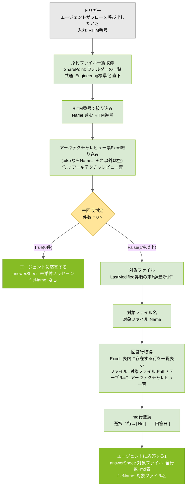

# アーキテクチャレビューAgent ツール設計書

## 0. 共通事項(全ツールに適用)

### 0.1 記載項目(各ツールの枠)

各ツールは次の項目で記載する。⑦を記載例とする。

| 項目 | 内容 |
|---|---|
| 用途 | 何のために、どのAgentが、どのステップで呼ぶか |
| 入力 / 出力 | トリガーの入力パラメーターと、応答の出力(名前・説明・型) |
| 前提 | 参照先(サイト・フォルダ・ファイル・テーブル名)、命名規則、運用ルール |
| 全体フロー | 図+ステップ表。分岐条件は「何を・どう比較して・どちらへ」を明記 |
| 各アクションの設定 | アクションごとの設定値・式(そのまま貼れる形) |
| 例外・エラー時の動作 | 想定外の入力・状態のときに何が起きるか、誰が何をするか |
| テスト観点 | 単体テストのケースと期待結果 |
| 保守 | PoC中の扱い / 本番化時に必要なこと / 変更時の手順 |

### 0.2 全ツール共通の作り方・制約

| # | 項目 | 内容 |
|---|---|---|
| 1 | フロー種別 | **エージェント フロー**(GA)で作る。Workflows(プレビュー)は使わない |
| 2 | トリガー / 応答 | トリガー「エージェントがフローを呼び出したとき」、応答「エージェントに応答する」。設定の「非同期応答」は**オフ** |
| 3 | 応答が複数ある場合 | 同じHTTP 200を返す「エージェントに応答する」が2つ以上あるときは、**出力の名前・説明・型・順番を完全一致**させる。1文字でも違うと公開時に `ActionSchemaInvalid` で失敗する。片方からコピー&ペーストで揃える(手打ちしない)。コードビューで両方を同一の`schema`に上書きするのが確実 |
| 4 | 式の書き方 | **fxエディタ**では `@` を付けない(`concat(...)`)。**コードビュー・詳細モード**では先頭に `@` を付ける(`@concat(...)`) |
| 5 | 型不一致 | 条件・フィルターの比較は**文字列同士**に揃える。`length()`(数値)や `and()`(真偽値)をボックスの `0` / `true`(文字列)と比べると一致せず、エラーにならないまま0件・常にTrueになる。`string(...)` や `if(条件,'hit','no')` で文字列化する |
| 6 | SharePointのパス | サイト・フォルダ・ファイルは**ピッカーで選択**する。手打ちすると `404 NotFound` になりやすい |
| 7 | アクション名 | 後続の式が `body('アクション名')` / `outputs('アクション名')` で参照する。**名前を変えたら参照式も直す**(自動追従しないことがある。参照が外れると条件の値が空になり常にTrueへ流れる等の症状が出る) |
| 8 | Excelコネクタの制約 | 「表に行を追加」はファイルを動的指定すると列がマッピングできない。動的ファイルへの書き込みは**Officeスクリプト**(「スクリプトの実行」)で行う。ファイル指定は「ファイルの作成」出力の **`Path`** を使う(`Id`はエンコード済みパスで不可) |
| 9 | Excelの日付 | 「表内に存在する行を一覧表示」は日付を**シリアル値**(例: 46164)で返す。表示用には `addDays('1899-12-30', int(値), 'yyyy/MM/dd')` で変換する |
| 10 | SharePoint列名 | 「No.」のようにピリオドを含む列は内部名が `No_x002e_` になる。式ではこちらを使う |
| 11 | 公開とAgent接続 | フロー保存 → **公開** → Agent側で「ツールを追加」→ 説明文を設定(ツール説明文集参照)。**ツール名を変更した場合はAgent側で再追加**が必要 |
| 12 | テスト方法 | フローの「テスト」で入力を手入力して単体テスト → 実行履歴で各アクションの入出力を確認 → Agentのテストチャットで結合テスト |

---

## ① Teamsスレッド内容取得

### 用途

共通_Engineering標準化チャネルからRITM番号でスレッドを特定し、親投稿・全返信・添付一覧とCSP判定結果を返す。子C(判定・再判断)と子D(アーキテクチャレビュー票作成)が使う。

### 入力 / 出力

(記入予定)

### 前提

(記入予定)

### 全体フロー

(記入予定)

### 各アクションの設定

(記入予定)

### 例外・エラー時の動作

(記入予定)

### テスト観点

(記入予定)

### 保守

- PoC: (記入予定)
- 本番: (記入予定)
- 変更時: (記入予定)

---

## ② 構成図チェック観点取得

### 用途

AI連携用フォルダの構成図チェック観点.mdを全文取得して返す。子Bが観点の実行仕様と検算R1の分母として使う。

### 入力 / 出力

(記入予定)

### 前提

(記入予定)

### 全体フロー

(記入予定)

### 各アクションの設定

(記入予定)

### 例外・エラー時の動作

(記入予定)

### テスト観点

(記入予定)

### 保守

- PoC: (記入予定)
- 本番: (記入予定)
- 変更時: (記入予定)

---

## ③ ホスティング判定基準取得

### 用途

AI連携用フォルダのホスティング判定基準.md(ノックアウト要件のみ)を全文取得して返す。子Cが要件を1件ずつ照合するために使う。

### 入力 / 出力

(記入予定)

### 前提

(記入予定)

### 全体フロー

(記入予定)

### 各アクションの設定

(記入予定)

### 例外・エラー時の動作

(記入予定)

### テスト観点

(記入予定)

### 保守

- PoC: (記入予定)
- 本番: (記入予定)
- 変更時: (記入予定)

---

## ④ サービス照合資料取得

### 用途

Salus_Status一覧.mdとサービス検証状況.mdを取得し、`salusStatus` / `serviceVerification` の2出力で返す。子Cが利用予定サービスを両面で同時照合するために使う。

### 入力 / 出力

(記入予定)

### 前提

(記入予定)

### 全体フロー

(記入予定)

### 各アクションの設定

(記入予定)

### 例外・エラー時の動作

(記入予定)

### テスト観点

(記入予定)

### 保守

- PoC: (記入予定)
- 本番: (記入予定)
- 変更時: (記入予定)

---

## ⑤ アーキテクチャレビュー票取得

### 用途

入力CSPに応じたアーキテクチャレビュー票マスタmdを全文取得して返す。子Dが編集指示の分母(検算R2)として使う。

### 入力 / 出力

(記入予定)

### 前提

(記入予定)

### 全体フロー

(記入予定)

### 各アクションの設定

(記入予定)

### 例外・エラー時の動作

(記入予定)

### テスト観点

(記入予定)

### 保守

- PoC: (記入予定)
- 本番: (記入予定)
- 変更時: (記入予定)

---

## ⑥ アーキテクチャレビュー票Excel作成

### 用途

RITM番号・CSP・行データJSONから、雛形をコピーして送付用Excelを作成し、Officeスクリプトでテーブルへ行追加、件数とリンクを返す。子Dが確定版の編集指示からExcelを作るために使う。

### 入力 / 出力

(記入予定)

### 前提

(記入予定)

### 全体フロー

(記入予定)

### 各アクションの設定

(記入予定)

### 例外・エラー時の動作

(記入予定)

### テスト観点

(記入予定)

### 保守

- PoC: (記入予定)
- 本番: (記入予定)
- 変更時: (記入予定)

---

## ⑦ 回答済みアーキテクチャレビュー票取得

### 用途

| 項目 | 内容 |
|---|---|
| 目的 | 利用者が記入して**スレッドへ添付返送した**アーキテクチャレビュー票Excelを、RITM番号だけで特定し、記入内容をAgentが読めるmd表形式にして返す |
| 呼び出し元 | 子D: アーキテクチャレビュー票作成Agent |
| 呼ぶタイミング | Phase 7「回答を確認して」。Engの指示→親のトピックT7→子D(mode=回答回収)が本ツールを実行 |
| 後続処理 | 子Dが返却されたmd表の全行を[回答済み]/[未回答]/[要確認]に仕分けし、全行数と突き合わせる(検算R4) |
| Agent側の説明文 | ツール説明文集_Agent別_v1.2「子D › ⑦」を設定 |

### 入力 / 出力

**入力(トリガー)**

| 名前 | 型 | キー | 説明 | 例 |
|---|---|---|---|---|
| RITM番号 | テキスト | `text` | RITMで始まる番号。例: RITM1234567 | `RITM1234567` |

**出力(応答)** ※True/Falseの2つの応答で完全一致させる

| 名前(title) | キー | 型 | 説明(description) | 値 |
|---|---|---|---|---|
| answerSheet | `answersheet` | string | 回答済みのアーキテクチャレビュー票の内容 | 正常時: 「対象ファイル/全行数/md表」の複合テキスト。未添付時: 固定メッセージ |
| fileName | `filename` | string | 読み取ったファイル名 | 正常時: 実ファイル名。未添付時: `なし` |

**正常時の `answerSheet` の形式**

```text
対象ファイル: [Test] (RITM1234567)アーキテクチャレビュー票(AWS).xlsx
全行数: 42件

| No | ステータス | 指摘概要 | 指摘内容 | 回答内容 | 回答者 | 回答日 |
|---|---|---|---|---|---|---|
| 1 | New | リージョンの記載 | グローバルサービス(IAM, CloudWatch等)は…<br>また… | ご指摘通り修正しました。 | User | 2026/06/01 |
| 2 | New | … | … | | | |
```

- 1行目: 対象ファイル名(fileNameと同じ値)
- 2行目: 全行数(子Dの検算R4の分母)
- 4行目以降: md表。セル内改行は `<br>`、縦棒 `|` は全角 `｜` に置換済み

**未添付時の `answerSheet`**

```text
回答済みのアーキテクチャレビュー票がまだスレッドに添付されていません。
```

### 前提

| 項目 | 内容 |
|---|---|
| 読取先 | SharePointサイト **JP CMS**(`https://jpdeloitte.sharepoint.com/sites/Cloud681`)> ドキュメント > **共通_Engineering標準化**。Teamsチャネルへの添付ファイルはこのフォルダに自動保存される |
| 対象ファイルの条件 | ファイル名に **RITM番号** を含む、かつ **「アーキテクチャレビュー票」** を含む、かつ拡張子 **.xlsx**。複数ある場合は**最終更新が最新の1件** |
| Excel側の前提 | テーブル名 **`T_アーキテクチャレビュー票`** が存在すること(雛形から作成されたファイルであれば存在する)。列: No. / ステータス / 環境 / 対応区分 / カテゴリ / 指摘概要 / 指摘内容 / 対応ガイドライン・参考資料 / 記入日 / 記入者 / 回答日 / 回答内容 / 回答者 / 備考 |
| 運用ルール(利用者・Mgmt) | 返送は**スレッドへ添付**する。ファイル名の **RITM部分と「アーキテクチャレビュー票」を変えない**(先頭に「回答済み_」等を付けるのは可)。テーブルの行を挿入・削除しない |
| シート保護 | なし(PoC判断)。上記運用ルールで担保 |

### 全体フロー



**ステップ表**

| Step | アクション(表示名) | 種類 | 何をするか | 次へ渡すもの |
|---|---|---|---|---|
| 1 | エージェントがフローを呼び出したとき | トリガー | 子DからRITM番号を受け取る | `triggerBody()?['text']` |
| 2 | 添付ファイル一覧取得 | SharePoint: フォルダーの一覧 | チャネルフォルダ直下のファイル・フォルダ一覧を取得(サブフォルダは見ない) | 配列(Name / Path / LastModified / IsFolder …) |
| 3 | RITM番号で絞り込み | アレイのフィルター処理 | ファイル名にRITM番号を含むものだけ残す | 配列 |
| 4 | アーキテクチャレビュー票Excel絞り込み | アレイのフィルター処理 | .xlsx かつ「アーキテクチャレビュー票」を含むものだけ残す | 配列 |
| 5 | 未回収判定 | 条件 | Step 4の件数が0か | True→Step 6 / False→Step 7 |
| 6 | エージェントに応答する | 応答 | 未添付の固定メッセージを返して終了 | — |
| 7 | 対象ファイル | 作成 | 最終更新が最新の1件を選ぶ | ファイルオブジェクト |
| 8 | 対象ファイル名 | 作成 | ファイル名を取り出す | 文字列 |
| 9 | 回答行取得 | Excel Online (Business): 表内に存在する行を一覧表示 | テーブルの全行を読む | `value` 配列(1行=1オブジェクト) |
| 10 | md行変換 | 選択 | 1行を `\| No \| … \| 回答日 \|` の文字列に変換 | 文字列の配列 |
| 11 | エージェントに応答する1 | 応答 | 見出し+ヘッダー+md行を結合して返す | — |

**分岐条件の説明**

| 分岐 | 条件 | 判定の考え方 |
|---|---|---|
| Step 3 | `Name` 含む `RITM番号` | 部分一致。利用者が「回答済み_」等を付けても拾える。大文字小文字は区別する(`ritm` は不一致) |
| Step 4 | `if(endsWith(Name,'.xlsx'), Name, '')` 含む `アーキテクチャレビュー票` | 1つの条件行で「拡張子」と「キーワード」の両方をANDするための書き方。xlsx以外は左辺が空文字になり、何も含まないため自動的に除外される。`.msg`(メール)や`.pptx`(構成図)が同じRITMで存在しても混ざらない |
| Step 5 | `string(length(絞り込み結果))` = `0` | `length()` は数値を返すが右辺の `0` は文字列扱いのため、`string()` で文字列に揃えて比較する。揃えないと常に不一致(またはアクション名変更で参照が外れると常にTrue)になる |
| Step 7 | `last(sort(配列, 'LastModified'))` | `sort` は昇順(古い→新しい)なので `last` が最新。**`first` にすると最古**を選ぶので注意。プロパティ名は `TimeLastModified` ではなく **`LastModified`** |

### 各アクションの設定

**Step 1: エージェントがフローを呼び出したとき**

| 項目 | 設定 |
|---|---|
| 入力 | テキスト / 名前 `RITM番号` / 説明 `RITMで始まる番号。例: RITM1234567` |

**Step 2: 添付ファイル一覧取得**(SharePoint「フォルダーの一覧」)

| 項目 | 設定 |
|---|---|
| サイトのアドレス | JP CMS(ピッカーで選択) |
| ファイル識別子 | `/Shared Documents/共通_Engineering標準化`(**フォルダアイコンから選択**。手打ちしない) |

**Step 3: RITM番号で絞り込み**(アレイのフィルター処理)

| 項目 | 設定 |
|---|---|
| From | `body('添付ファイル一覧取得')`(動的コンテンツ「本文」) |
| 左辺 | `item()?['Name']`(動的コンテンツ「Name」を選択) |
| 演算子 | 含む |
| 右辺 | `triggerBody()?['text']`(動的コンテンツ「RITM番号」を選択) |

**Step 4: アーキテクチャレビュー票Excel絞り込み**(アレイのフィルター処理)

| 項目 | 設定 |
|---|---|
| From | fx `body('RITM番号で絞り込み')` |
| 左辺 | fx `if(endsWith(item()?['Name'], '.xlsx'), item()?['Name'], '')` ※**fxボタンから入力**(手打ちテキストだと文字列リテラルになり0件) |
| 演算子 | 含む |
| 右辺 | `アーキテクチャレビュー票`(文字入力) |

**Step 5: 未回収判定**(条件)

| 項目 | 設定 |
|---|---|
| 左辺 | fx `string(length(body('アーキテクチャレビュー票Excel絞り込み')))` |
| 演算子 | 次の値に等しい |
| 右辺 | `0`(文字入力) |

**Step 6: エージェントに応答する**(True側)

| 出力 | 種類 | 説明 | 値 |
|---|---|---|---|
| `answerSheet` | テキスト | 回答済みのアーキテクチャレビュー票の内容 | `回答済みのアーキテクチャレビュー票がまだスレッドに添付されていません。` |
| `fileName` | テキスト | 読み取ったファイル名 | `なし` |

**Step 7: 対象ファイル**(作成)

| 項目 | 設定 |
|---|---|
| 入力 | fx `last(sort(body('アーキテクチャレビュー票Excel絞り込み'), 'LastModified'))` |

**Step 8: 対象ファイル名**(作成)

| 項目 | 設定 |
|---|---|
| 入力 | fx `outputs('対象ファイル')?['Name']` |

**Step 9: 回答行取得**(Excel Online (Business)「表内に存在する行を一覧表示」)

| 項目 | 設定 |
|---|---|
| 場所 | Group - JP CMS |
| ドキュメント ライブラリ | Documents |
| ファイル | カスタム値 → fx `outputs('対象ファイル')?['Path']` |
| テーブル | カスタム値 → `T_アーキテクチャレビュー票` |

出力 `body('回答行取得')?['value']` の各行のキー(参考): `No_x002e_` / `ステータス` / `環境` / `対応区分` / `カテゴリ` / `指摘概要` / `指摘内容` / `対応ガイドライン・参考資料` / `記入日` / `記入者` / `回答日` / `回答内容` / `回答者` / `備考`。日付列はシリアル値(例 `46164`)または文字列(利用者が文字で入力した場合)。

**Step 10: md行変換**(選択)

| 項目 | 設定 |
|---|---|
| 元 | fx `body('回答行取得')?['value']` |
| マップ | **テキストモード**に切り替えて fx で次の式(1行) |

```text
concat('| ', string(coalesce(item()?['No_x002e_'],'')), ' | ', string(coalesce(item()?['ステータス'],'')), ' | ', replace(replace(replace(string(coalesce(item()?['指摘概要'],'')), decodeUriComponent('%0D'), ''), decodeUriComponent('%0A'), '<br>'), '|', '｜'), ' | ', replace(replace(replace(string(coalesce(item()?['指摘内容'],'')), decodeUriComponent('%0D'), ''), decodeUriComponent('%0A'), '<br>'), '|', '｜'), ' | ', replace(replace(replace(string(coalesce(item()?['回答内容'],'')), decodeUriComponent('%0D'), ''), decodeUriComponent('%0A'), '<br>'), '|', '｜'), ' | ', string(coalesce(item()?['回答者'],'')), ' | ', if(empty(string(coalesce(item()?['回答日'],''))), '', if(contains(string(item()?['回答日']), '/'), string(item()?['回答日']), addDays('1899-12-30', int(item()?['回答日']), 'yyyy/MM/dd'))), ' |')
```

式の各部の役割:

| 部分 | 役割 |
|---|---|
| `string(coalesce(item()?['列'],''))` | 空欄(null)を空文字にし、数値も文字列に揃える |
| `replace(..., decodeUriComponent('%0D'), '')` | CR(復帰)を除去 |
| `replace(..., decodeUriComponent('%0A'), '<br>')` | LF(改行)を `<br>` に置換。md表の行が崩れないようにする |
| `replace(..., '\|', '｜')` | 半角の縦棒を全角に置換。列の区切りと誤認されないようにする |
| `if(empty(...), '', if(contains(..., '/'), そのまま, addDays(...)))` | 回答日: 空→空 / 文字列(`/`を含む)→そのまま / 数値(シリアル値)→`yyyy/MM/dd` に変換 |

コードビューでは `"select": "@concat(...)"` のように **文字列**(オブジェクトでない)になっていればテキストモードになっている。

**Step 11: エージェントに応答する1**(False側)

| 出力 | 種類 | 説明 | 値 |
|---|---|---|---|
| `answerSheet` | テキスト | 回答済みのアーキテクチャレビュー票の内容 | fx 下記 |
| `fileName` | テキスト | 読み取ったファイル名 | fx `outputs('対象ファイル名')` |

```text
concat('対象ファイル: ', outputs('対象ファイル名'), decodeUriComponent('%0A'), '全行数: ', string(length(body('回答行取得')?['value'])), '件', decodeUriComponent('%0A'), decodeUriComponent('%0A'), '| No | ステータス | 指摘概要 | 指摘内容 | 回答内容 | 回答者 | 回答日 |', decodeUriComponent('%0A'), '|---|---|---|---|---|---|---|', decodeUriComponent('%0A'), join(body('md行変換'), decodeUriComponent('%0A')))
```

- `join(body('md行変換'), 改行)`: 「選択」の結果は配列なので、改行区切りで1つのテキストに連結する。`outputs(...)` ではなく **`body(...)`** を使う
- 応答の**スキーマ(名前・説明・型)はStep 6と完全一致**させる。値だけが異なる

**参考: 応答アクションのコードビュー(True/False共通の `schema` 部分)**

```json
"schema": {
  "type": "object",
  "properties": {
    "answersheet": {
      "title": "answerSheet",
      "description": "回答済みのアーキテクチャレビュー票の内容",
      "type": "string",
      "x-ms-content-hint": "TEXT",
      "x-ms-dynamically-added": true
    },
    "filename": {
      "title": "fileName",
      "description": "読み取ったファイル名",
      "type": "string",
      "x-ms-content-hint": "TEXT",
      "x-ms-dynamically-added": true
    }
  },
  "additionalProperties": {}
}
```

### 例外・エラー時の動作

| 状況 | フローの動作 | Agent側の見え方 | 対処(人) |
|---|---|---|---|
| 該当ファイルが無い(未返送・RITM違い・別フォルダ) | True分岐。固定メッセージを返す(フローは成功) | 子Dが「回答未着」と報告 | Mgmtに返送状況を確認。RITM番号の誤りも疑う |
| 同じRITMのxlsxが複数ある(修正版の再添付) | 最終更新が最新の1件を読む | 最新版の内容が返る | 意図した版か `fileName` で確認 |
| ファイル名からRITM/「アーキテクチャレビュー票」が消えた | 拾えず未回収扱い | 「回答未着」 | 利用者にファイル名を戻してもらう、またはEngがリネーム |
| サブフォルダに保存された | 拾えず未回収扱い(直下のみ走査) | 「回答未着」 | チャネルフォルダ直下へ移動 |
| テーブル `T_アーキテクチャレビュー票` が無い/壊れている | Step 9でエラー→**フロー失敗** | Agentにエラー(HTTP 502等)が返る | Excelを開いてテーブルの存在・名前を確認。実行履歴でエラー内容を確認 |
| 利用者が行を挿入・削除した | 読める(行数が変わる) | 全行数が票mdと一致しない | 子Dが検算R4で件数を報告。Engが原本と突き合わせ |
| 回答日が文字列で入力された | そのまま表示 | 表示形式が不揃いになるが処理は継続 | 問題なし |
| ファイルが利用者により開かれたまま(ロック) | 読取は可能(読み取り専用アクセス) | 影響なし | — |

### テスト観点

| # | ケース | 準備 | 入力 | 期待結果 |
|---|---|---|---|---|
| 1 | 正常(1件) | チャネルフォルダに `[Test] (RITM1234567)アーキテクチャレビュー票(AWS).xlsx` を置き、数行に回答を記入 | `RITM1234567` | False分岐。`fileName` が当該ファイル名。`answerSheet` の全行数がExcelの行数と一致し、md表に回答が入っている。回答日が `yyyy/MM/dd` |
| 2 | 未添付 | — | `RITM9999999` | True分岐。固定メッセージ、`fileName` = `なし` |
| 3 | 複数版 | 同RITMのxlsxを2つ置き、後から置いた方を更新 | `RITM1234567` | 更新が新しい方の `fileName` |
| 4 | 拡張子違いの混在 | 同RITMを含む `.msg` / `.pptx` を置く | `RITM1234567` | xlsxだけが対象になる |
| 5 | 特殊文字 | 回答内容に改行と `\|` を入れる | `RITM1234567` | `<br>` と `｜` に置換され、md表が崩れない |
| 6 | 結合テスト | 子Dのテストチャット | 「RITM1234567の回答済みアーキテクチャレビュー票を取得して」 | ツールが呼ばれ、子Dが[回答済み]/[未回答]/[要確認]を全件列挙し、検算R4が一致 |

### 保守

**PoC中**

- シート保護は掛けない。運用ルール(ファイル名のRITM部分と「アーキテクチャレビュー票」を変えない、行を挿入・削除しない)で担保する
- 読取先フォルダは `共通_Engineering標準化` 直下に固定。テスト用ファイルは先頭に `[Test]` を付けて区別し、PoC終了時に削除する
- ツールの動作検証は単体Agent `DTG_ReviewSheetGenerator` で行い、確認後に親配下の子Dで結合テストする
- 実行履歴は Copilot Studio「活動」から確認する。失敗時はまず Step 9(回答行取得)のエラー内容を見る

**本番化時**

- 雛形Excelへの**シート保護**(回答列のみ編集可)を再検討する。掛ける場合はStep 9の読取に影響しないことを確認する
- 読取先のチャネル・フォルダが変わる場合は Step 2 をピッカーで再設定する。複数チャネルを対象にする場合はフォルダごとに Step 2〜4 を並列化するか、SharePoint検索(「複数の項目の取得」+フィルタークエリ)への切替を検討する
- フローの**所有者・接続**を個人から共有(共同所有者の追加、サービスアカウントの接続)に変更し、担当者不在時も動くようにする
- 利用者・Mgmt向けに運用ルール(返送方法・ファイル名)を周知文として整備する
- 失敗時の通知(実行失敗をEngへメール等)を追加するか検討する。※Agentによるスレッド投稿は行わない方針は維持

**変更時**

| 変更内容 | 直す場所 | 注意 |
|---|---|---|
| md表の列を増やす・減らす | Step 10 の `concat` 式(列の追加・削除)と Step 11 のヘッダー行・区切り行(`\|---\|` の数) | 2箇所を必ず同時に直す。子DのInstructions(回答回収の列説明)も更新 |
| 読取先フォルダの変更 | Step 2 のファイル識別子(ピッカーで再選択) | 手打ち禁止。変更後にテスト観点1・2を再実行 |
| テーブル名の変更 | Step 9 のテーブル値。雛形のテーブル名も同じ値に | Officeスクリプト(ツール⑥)側のテーブル名も同時に変更 |
| ファイル名規則の変更(「アーキテクチャレビュー票」以外にする) | Step 4 の右辺 | 運用ルールの周知文も更新 |
| 応答の出力を増やす・名前を変える | Step 6 と Step 11 の**両方** | 片方だけ変えると公開失敗(`ActionSchemaInvalid`)。コピー&ペーストまたはコードビューで同一にする。出力名を変えた場合はAgent側のInstructionsで参照している名前も直す |
| アクションの表示名を変える | そのアクションを参照している式(`body('…')` / `outputs('…')`)すべて | 参照が外れると条件が常にTrueになる等、エラーなしで誤動作する。変更後にテスト観点1・2を必ず再実行 |
| 変更後の共通手順 | 保存 → テスト観点1〜3を再実行 → 公開 → Agent側でツールが認識されているか確認(ツール名を変えた場合は再追加) | 設計書§2.4・ツール説明文集の記載も更新 |

---

## ⑧ 技術相談ナレッジ追記

### 用途

技術相談ナレッジListへ16項目を1件登録し、登録リンクを返す。子CがEng承認→親の指示後に実行する。

### 入力 / 出力

(記入予定)

### 前提

(記入予定)

### 全体フロー

(記入予定)

### 各アクションの設定

(記入予定)

### 例外・エラー時の動作

(記入予定)

### テスト観点

(記入予定)

### 保守

- PoC: (記入予定)
- 本番: (記入予定)
- 変更時: (記入予定)

---

## 共通の保守事項(全ツール)

**PoC中**

- ツールの改修は単体Agentまたはフローの「テスト」で動作確認してから公開する
- 参照先ファイル(md・雛形Excel)の差し替えはファイル名を変えずに行う。名前を変える場合は該当ツールのパス設定を直す
- 各ツールの単体テスト結果(実行履歴の日時)を設計書§6のチェックリストに記録する

**本番化時**

- フロー・接続の所有権を個人から共有へ移す(共同所有者、サービスアカウント)
- 参照先フォルダ・ファイルのアクセス権を、フローの接続アカウントが読める状態で固定する
- 各ツールの実行失敗の検知方法(実行履歴の定期確認、失敗通知)を決める
- 本書の「(記入予定)」を全ツール分埋め、変更時の手順を揃える

**変更時**

- 変更前に本書の該当ツールの「各アクションの設定」を最新化する(実機と本書の差分をなくす)
- 変更後は「テスト観点」を再実行し、公開後にAgentのテストチャットで結合確認する
- 設計書§2.4(ツール一覧)、ツール説明文集、Instructions集のうち影響する箇所を同時に更新する
