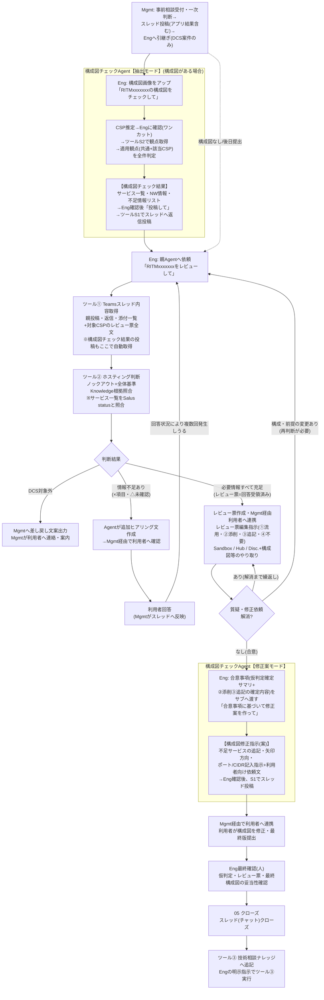

# 全体ワークフロー(サブAgent統合版)

## サブAgent統合のポイント

| # | 内容 |
|---|---|
| 1 | **入口(抽出モード)**: Engが構成図画像をサブAgentへアップ → CSP推定(Eng確認のワンクッション付き)→ 適用観点(共通+該当CSP)の全件判定 → 事実レポートを**ツールS1でスレッドへ自動投稿**。以降、親Agentはツール①経由でレポートを自動取得し、**■サービス一覧をSalus照合(ツール②の判断)に使用** |
| 2 | **出口(修正案モード)**: レビュー合意後、Engが合意事項をサブへ渡す → サブは**画像を再解析せず**、抽出モードの事実+合意事項から**構成図修正指示(文案)**を生成(不足サービス・矢印方向・ポート/CIDR記入など)→ S1で投稿し、Mgmt経由で利用者の構成図修正へ |
| 3 | サブAgentは**事実の抽出と合意事項の反映指示のみ**を行い、設計評価・ノックアウト判断はしない(判断は親AgentとEngの責任) |
| 4 | 構成図が無い案件・後日提出の案件は、サブAgentを飛ばして親Agentから開始(構成図はEng目視確認の注記付き) |
| 5 | 画像はチャット添付のみ(スレッド添付の自動読取は不可)。PPT/Excel/PDF内の図はスクリーンショット化して渡す |

## 登場コンポーネントの整理

| コンポーネント | ツール |
|---|---|
| 親: アーキテクチャレビューチェックAgent | ①Teamsスレッド内容取得 / ②ホスティング判断基準取得 / ③技術相談ナレッジ追記 / ④案件レビュー票作成 / ⑤案件レビュー票取得 |
| サブ: 構成図チェックAgent | S1 構成図チェック結果投稿 / S2 構成図チェック観点取得 |
