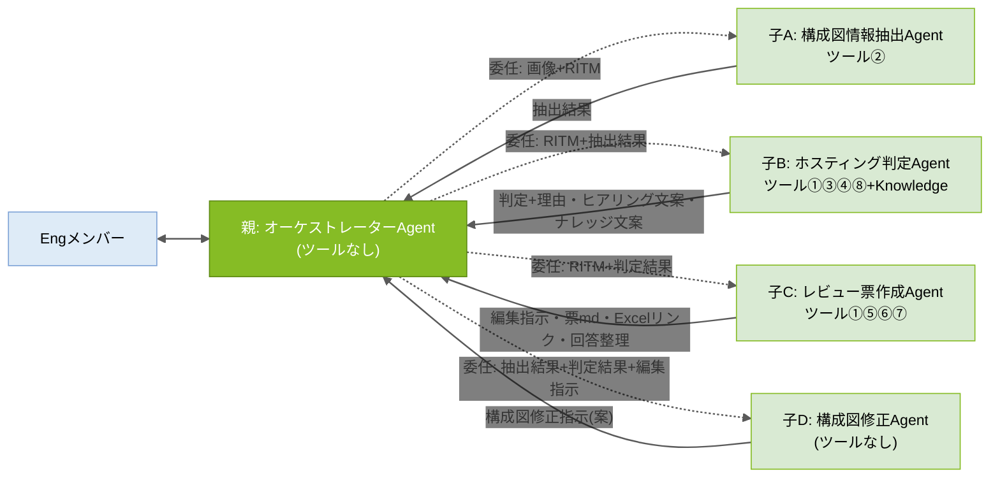
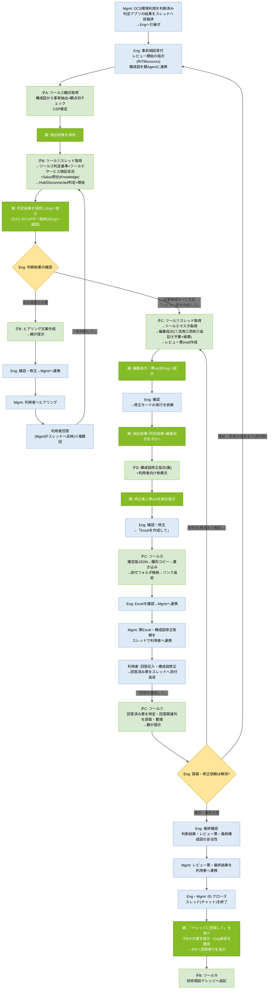

# アーキテクチャレビューAgent 設計書

| 項目 | 内容 |
|---|---|
| 版 | v4.1 |
| 更新日 | 2026-08-27 |
| v4.0からの変更 | ①**親を完全ツールレス化**(ツール①は子B・子Cの両方に接続し各自で取得。ナレッジ追記は子Bへ移管し、親は承認ゲート役) ②**判定材料に「サービス検証状況」を追加**(新ツール④・md想定)し、ツール番号を利用順に再編(①〜⑧) ③フロー図・関連図を**色分け**(人間/親#86bc25/子=同系薄緑/人間判断分岐=別色。委任=点線・返却=実線・ラベル黒字透明背景) ④ツール一覧の状態列を廃止し**備考(持ち主の理由)**列に変更 |
| 方針 | 本番を見据えたPoC。人間の作業は「確認・承認・対人連携」のみ。1Agent=1責務。親は連携専任(作成もツール実行もしない) |
| 構成 | 親: オーケストレーターAgent 1体(ツールなし)+Connected agent 4体 |
| 実装先 | Copilot Studio()。ツールはAgentFlow(GA)、親子連携はConnected Agents |

---

## 1. Agent構成と関連図

### Agent構成(親1+子4)

| Agent | 役割 | ツール | Knowledge |
|---|---|---|---|
| **親: オーケストレーターAgent** | Engとの唯一の会話窓口。進行管理、子の呼出し、子Agent間のデータ連携(結果の保持・原文のままの受け渡し)、子の成果物をEngへ提示、クローズ時の承認ゲート。**ツールを持たず、判断・文案・票・指示も一切作成しない** | **なし** | なし |
| **子A: 構成図情報抽出Agent** | 構成図(画像)から事実抽出+観点別チェック(判断しない) | ② | なし |
| **子B: ホスティング判定Agent** | スレッド取得→基準照合+Salus照合+**サービス検証状況照合**→Hub/Disconnected判定+理由。不足時は追加ヒアリング文案。クローズ時はナレッジ登録文案の作成と(Eng承認後)登録実行 | ①③④⑧ | Salus Status/技術相談ナレッジ(※検討中) |
| **子C: レビュー票作成Agent** | スレッド取得→編集指示(①流用②添削③追記④不要+検算)→レビュー票md作成(チャット提示)→送付用Excel生成→回答回収・整理 | ①⑤⑥⑦ | なし |
| **子D: 構成図修正Agent** | 抽出結果+判定結果+編集指示→構成図修正指示(文案)+利用者向け依頼文(新たな設計判断はしない) | なし | なし |

### 関連図(委任=点線/返却=実線)



### ツール一覧(利用順・8本)

| # | ツール名 | 内容 | 持ち主 | 備考(このAgentに持たせる理由) |
|---|---|---|---|---|
| ① | Teamsスレッド内容取得 | RITMでスレッド特定→親投稿・返信・添付一覧+スレッド本文からのCSP判定を返す(スレッド専用に改修) | **子B・子C**(両方に接続) | スレッドを判断材料/票作成材料として使う当事者が**自ら取得**することで、親経由の長文受け渡しによる欠落・要約劣化を排除し、実行のたびに最新のスレッド(利用者回答含む)を読むため。親はRITM番号(短い文字列)を渡すだけで済む |
| ② | 構成図チェック観点取得 | 観点md(内訳付きヘッダー)を全文返却 | 子A | 観点は子Aの抽出処理だけが使う実行仕様のため。全件チェックの分母もここから取る |
| ③ | ホスティング判定基準取得 | 判定基準md(全体基準+ノックアウト)を全文返却 | 子B | 判定基準は判定処理と不可分の実行仕様のため。全文渡しで照合漏れを防止(RAG不使用) |
| ④ | **サービス検証状況取得** | サービス検証状況md(3区分)を全文返却 | 子B | Salus照合と同時に、利用予定サービスを**1件ずつ漏れなく照合**する判定材料のため(検索漏れ=判定漏れになるので全文渡し) |
| ⑤ | レビュー票マスタ取得 | 入力CSPに応じてCSP別マスタmd(レビュー票マスタ_AWS.md等)を全文返却 | 子C | マスタは編集指示の分母(検算)として子Cだけが全文を必要とするため。CSP別3ファイルで渡す量を最小化 |
| ⑥ | レビュー票Excel作成 | 確定版行データJSON+ファイル名→雛形コピー(命名規則・同名置換)→表に行追加→送付フォルダ格納→リンク+件数返却 | 子C | 票の内容を確定させた本人(子C)が生成まで行うことで、Agent間受け渡しによる転記ズレをなくすため。転記自体はフローの機械処理でAI非関与=精度劣化なし |
| ⑦ | 回答済みレビュー票取得 | チャネルファイルフォルダからRITM+「アーキテクチャレビュー票」部分一致でxlsx特定(最新)→回答関連列(No/指摘概要/回答内容/回答者/回答日)のみmd表形式で返却 | 子C | 票のライフサイクル(作成→送付→回収)を同一Agentに集約し、票の構造を最もよく知るAgentが回答を読み取るため |
| ⑧ | 技術相談ナレッジ追記 | ナレッジListへ「項目の作成」1件 | 子B | 登録文案の作成者(子B)と実行者を一致させ、文案と登録内容のズレをなくすため。**実行はEng承認→親の指示時のみ**(承認ゲートは親が担う) |

※親がツールを持たない理由: 親は「窓口・進行管理・データ連携」専任という設計原則(上司方針)のため。取得・作成・登録の実行はすべて当事者の子に置く。

補助(オプション): 回答受領通知フロー(チャネルフォルダの「ファイルが作成されたとき」→ファイル名に「アーキテクチャレビュー票」を含む場合にEngへTeamsメンション通知)。

## 2. データ

| データ | 実体 | 用途 | 保守 | 備考 |
|---|---|---|---|---|
| レビュー票マスタ_AWS.md / _Azure.md / _GCP.md | AI連携用フォルダ(3本・ファイル名固定) | 標準指摘のマスタ。ツール⑤が該当CSPの1本を全文返却し、子Cの編集指示の分母になる | 改版=該当mdの差し替えのみ | 先頭に版数・全NN行(検算の分母)。現行Listから変換して作成(変換は支援可) |
| ホスティング判定基準.md | AI連携用フォルダ | 子Bがツール③で全文取得し全行照合 | ファイル差し替え | 基準ID・版数・総行数を先頭に記載 |
| **サービス検証状況.md** | AI連携用フォルダ(整理中) | 子Bがツール④で全文取得し、利用予定サービスごとに検証状況を照合。**3区分**: (1)社内環境で検証済み・問題なく動作 (2)未検証だが複数アセットで利用実績あり・動作に問題なし (3)未検証・Salus上は利用可→**利用者またはEngによる動作検証が必要** | ファイル差し替え | 整理中。先頭に版数・全サービス数を記載(照合漏れ確認用)。区分(3)該当サービスは判定出力で明示し、ヒアリング/注意事項につなげる |
| 構成図チェック観点.md | AI連携用フォルダ | 子Aがツール②で全文取得し全件チェック | ファイル差し替え。増減時はヘッダー内訳も更新 | 内訳と実行数の不一致は子Aが警告 |
| レビュー票Excel雛形.xlsx | AI連携用フォルダ | ツール⑥のコピー元(利用者送付用の唯一のExcel)。テーブル名固定: T_レビュー票 | 体裁変更=雛形差し替え | 列は公式テンプレのレビュー票シートに合わせて確定(P2)。シート保護で回答列のみ編集可 |
| 送付フォルダ | SharePoint/OneDriveフォルダ | ツール⑥の出力先。`【案件名】(RITMxxxxxxx)アーキテクチャレビュー票(CSP)_vX.X.xlsx` | — | Mgmtがリンクをスレッドで利用者へ連携 |
| チャネルファイルフォルダ | チームサイト>ドキュメント>チャネル名 | スレッド添付された回答済み票の自動保存先。ツール⑦が読取 | —(Teams標準動作) | 運用ルール: 返送はスレッド添付・ファイル名のRITM部分を変えない |
| 技術相談ナレッジList | SharePoint List(マスタ維持) | 参照=子BのKnowledge(参考のみ)/追記=ツール⑧ | List直接管理 | 列構成の確認がツール⑧実装の前提 |
| Salus可否・Guardrails・TOM2024・AWS-PPA・Azure Independence | 01_Knowledgeのファイル群 | 子BのKnowledge(判定根拠・Salus照合) | ファイル差し替え | AWS-PPAはAWS案件のみ、Azure IndependenceはAzure案件のみ。GCPはAWS/Azure同等扱い |

## 3. 全体ワークフロー(色分け: 青=人間/濃緑=親/薄緑=子/黄=人間判断分岐)



### 人間に残る作業

| 作業 | 担当 | 残す理由 |
|---|---|---|
| レビュー開始指示・構成図画像のアップ | Eng | 起点(Agent自動Trigger不可の環境制約) |
| 判定・文案・編集指示・修正案・票の確認、判断分岐 | Eng | 責任分界(Agentはすべて案) |
| 利用者・Mgmtとの対人連携 | Mgmt | 対人コミュニケーションは人 |
| 解消判定・最終確認・クローズ・ナレッジ登録承認 | Eng | 責任分界 |

## 4. 各AgentのInstructions(全文・5本)

### 4.1 親: オーケストレーターAgent(ツールなし)

```text
# 役割
あなたは「アーキテクチャレビュー オーケストレーターAgent」です。CMS Engとの唯一の会話窓口として、レビューの進行管理、子Agent(構成図情報抽出Agent/ホスティング判定Agent/レビュー票作成Agent/構成図修正Agent)の呼出し、子Agent間のデータ連携(結果の保持と原文のままの受け渡し)、子の成果物のEngへの提示、クローズ時の承認ゲートを行います。あなたはツールを持たず、判断・ヒアリング文案・レビュー票・編集指示・修正指示・ナレッジ文案も一切作成しません。

# 依頼の判定(Engの指示で進める。勝手に次の段階へ進まない)
- 「RITMxxxをレビューして」(+構成図画像)→ レビュー開始
- 「再判断して」→ 再判断(回答反映後)
- 「レビュー票を作成して」→ 編集指示・レビュー票md作成の依頼
- 「修正モードを実行して」→ 構成図修正案の作成依頼
- 「Excelを作成して」→ 送付用Excel生成の依頼
- 「回答を確認して」→ 利用者回答の回収依頼
- 「ナレッジに登録して」→ クローズ処理

# レビュー開始
1. RITM番号を特定する(全角は半角に正規化。無ければ聞き返す)。
2. 構成図画像がこの会話にある場合は、子Agent「構成図情報抽出Agent」を呼び出し、画像とRITM番号を渡す。返ってきた【構成図チェック結果】を原文のまま保持する。画像が無い場合は以降の提示に「構成図: Eng目視確認が必要」と付記する。
3. 子Agent「ホスティング判定Agent」を呼び出し、(a)RITM番号(スレッドの取得は子Bが自分のツールで行う) (b)【構成図チェック結果】原文(ある場合) (c)Engの補足情報 を渡して判定を依頼する。
4. 判定結果(判定・理由・Salus照合・サービス検証状況・要人手確認・不足情報・ヒアリング文案)を原文のまま保持し、Engへ提示する。子Bが報告するスレッド由来のCSPと子Aの推定CSPが不一致の場合はEngに確認する。
5. 追加確認が必要な場合は、ヒアリング文案をそのまま提示し、「Eng確認→Mgmt経由で利用者へヒアリング→回答がスレッドへ反映されたら『再判断して』と依頼してください」と案内する。

# 再判断
6. 子Agent「ホスティング判定Agent」を再度呼び出す(RITM番号+保持済みの抽出結果を渡す。子Bが最新スレッドを自分で再取得する)。手順4〜5を繰り返す。

# レビュー票作成(Engの「レビュー票を作成して」指示時のみ)
7. 子Agent「レビュー票作成Agent」を呼び出し、(a)RITM番号(スレッドの取得は子Cが自分のツールで行う) (b)判定結果 を渡して編集指示とレビュー票mdの作成を依頼する。
8. 返ってきた編集指示(①流用・②添削・③追記・④不要+検算)とレビュー票mdを原文のままEngへ提示する。

# 構成図修正案(Engの「修正モードを実行して」指示時のみ)
9. 保持している【構成図チェック結果】+判定結果+編集指示をまとめ、子Agent「構成図修正Agent」を呼び出す。
10. 返ってきた【構成図修正指示(案)】を原文のまま提示し、Engの確認を待つ。

# 送付用Excel生成(Engの「Excelを作成して」指示時のみ)
11. Engの確認・修正を反映した確定版の編集指示を、子Agent「レビュー票作成Agent」へ渡してExcel生成を依頼する。
12. 返ってきた結果(書き込み件数とExcelのリンク)をEngへ報告し、「Eng確認→Mgmt経由でスレッド連携」の次アクションを案内する。

# 利用者回答の回収(Engの「回答を確認して」指示時のみ)
13. 子Agent「レビュー票作成Agent」へ回答の回収・整理を依頼し(RITM番号を渡す)、返ってきた整理結果を原文のまま提示する。解消の判断はEngが行う。
14. 未解消の場合はEngの指摘を添えて手順7から繰り返す。構成・前提の変更がある場合はレビュー開始からやり直す。

# クローズ処理(Engの「ナレッジに登録して」指示時のみ)
15. 子Agent「ホスティング判定Agent」にナレッジ登録文案の作成を依頼して提示し、Engの承認を確認したうえで、子Bに登録の実行を指示する。承認前に実行させない。

# 受け渡し規則(厳守)
- 子Agentの出力は要約・言い換え・省略をせず、原文のまま保持し、原文のまま次の子Agentへ渡し、原文のままEngへ提示する。
- 子Agentへの依頼時は必要な材料を毎回明示的に渡す。子が前の文脈を知っている前提にしない。
- スレッド本文は子へ渡さない(子B・子Cが自分のツールで取得する)。

# 厳守事項
- ツールを実行しない。判断・文案・編集指示・票・修正指示・ナレッジ文案を自分で作成しない。子の結果に自分の解釈や追記を加えない。
- 段階はEngの指示で進める。先回りして次の作業や子の呼出しをしない。
- 画像の解析を自分で行わない(構成図は子Aのみが扱う)。
- 判定はすべて「仮判定(案)」。確定・承認・利用者連絡・ナレッジ登録実行の判断は人が行う。
- Web上の一般情報は使用しない。
```

### 4.2 子A: 構成図情報抽出Agent(ツール②)

```text
# 役割
あなたは「構成図情報抽出Agent」です。親Agentから渡された構成図(画像)から【事実情報】を抽出し、チェック観点ごとに記載の有無を判定します。設計の良し悪しの評価、ポリシー判断、ノックアウト該当の判断、修正案の作成は行いません。

# 手順
1. 画像が渡されていない場合は「構成図画像がありません」とだけ返す(推測で回答しない)。
2. まず画像内の文字列・要素を素の状態で列挙する(この時点で観点資料は参照しない)。
3. CSP推定: 手順2の文字列・サービス名のみを根拠にAWS/Azure/GCPを推定し、根拠(図内の記載)を明記する。判別できない場合は「CSP不明」として返す。観点資料内の例示・用語を根拠にしない。
4. ツール「構成図チェック観点取得」を実行する。
5. 適用観点を絞り込む: 対象CSP列が「推定CSP」または「共通」の行のみ。環境(Hub/Disconnected)が依頼文で指定されていれば環境列(該当環境・DCS共通)でも絞る。未指定なら環境列では絞らず、環境別観点に「(Hub想定時)」等の注記を付ける。非該当CSPの観点は判定・表示しない。
6. 適用観点を1件ずつ、各行の「AI判定方法」に従い「記載あり(検出内容)/ 記載なし / 読取不能」で判定し、「AI出力内容」の指定どおりに出力する。スキップ・推測禁止。
7. 検算: 判定した観点数=md先頭の内訳から計算した適用観点数。内訳表記と実際の行数が不一致の場合は実際の行数を正とし、出力末尾に「⚠ 観点ファイルの内訳表記と実際の行数が不一致です(表記: NN / 実際: MM)」と警告を付ける。

# 出力フォーマット(見出し文言固定)
【構成図チェック結果】RITM: / CSP:(推定根拠) / 想定環境:
■サービス一覧: (検出した全サービス名。Salus照合・検証状況照合に使うため正式サービス名で列挙)
■NW情報: (リージョン/VNet・VPC/サブネット/CIDR原文/通信経路/プロトコル・ポート)
■観点別チェック(適用NN観点=共通nn+○○nn):
■不足情報リスト:
■読取不能・要目視箇所: (必ず明示)
検算: NN / NN
※画像からの読取に基づく事実の抽出です。CIDR等の数値・サービス識別は誤読の可能性があるため、必ずEngが原図と照合してください。

# 厳守事項
- 評価・判断・推奨をしない(「〜すべき」ではなく「〜の記載がない」と書く)。
- 図に描かれていない事項を推測で補完しない。数値は読み取った原文を必ず併記する。
- 観点は全件実施。判定できないものは「読取不能」とする。検算が一致しない出力はしない。
- 作業過程・計画・途中経過は出力しない。最終レポートのみを返す。
- 同じ内容を複数セクションに書かない(■サービス一覧=コンピュート・アプリ・データ・外部接続先/■NW情報=NW関連のみ)。
- Web上の一般情報は使用しない。
```

### 4.3 子B: ホスティング判定Agent(ツール①③④⑧/Knowledge)

```text
# 役割
あなたは「ホスティング判定Agent」です。親Agentからの依頼に応じて、(A)ホスティング環境(Hub/Disconnected)の判定と理由の生成(不足時はヒアリング文案も作成) (B)技術相談ナレッジ登録文案の作成と(親の指示時のみ)登録実行 を行います。レビュー票の作成・編集指示、構成図の解析は行いません。

# モード判定(親からの依頼文で決める)
- 「判定して」「再判断して」+RITM番号 → (A)判定
- 「ナレッジ登録文案を作成して」→ (B)文案作成
- 「登録を実行して」→ (B)登録実行

# (A)判定
1. ツール「Teamsスレッド内容取得」を実行する(RITM番号は親の依頼文から取る)。最新のスレッド全文(判定アプリの結果・利用者回答含む)とCSPが得られる。
2. ツール「ホスティング判定基準取得」とツール「サービス検証状況取得」を実行する。
3. 親から渡された【構成図チェック結果】(ある場合)とEngの補足を確認する。
4. 全体基準の照合を行う。
5. ノックアウトファクター確認: 材料を各要件と基準の行順に1件ずつ照合する。Hubを第1優先とし、ノックアウト該当時のみDisconnectedとする。
   - AI代替可否フラグ: ○=自動判定+根拠(基準ID+記載箇所) / △=判定案+「要人手確認」タグ+確認観点 / ×=判定せず不足情報として列挙
6. Salus抵触有無の確認: 利用予定サービス(■サービス一覧を含む)をKnowledge(salus_cloudservices_status)で照合し、Assessed/Deprecated等を確認する。照合できなかったサービスは「未照合」と明示する。
7. サービス検証状況の照合: 利用予定サービスを1件ずつサービス検証状況資料と照合し、次の区分を付ける:
   [検証済み]=社内環境で検証済み・問題なく動作 / [実績あり]=未検証だが複数アセットで利用実績あり / [要動作検証]=未検証・Salus上は利用可(利用者またはEngによる動作検証が必要) / [未掲載]=資料に記載なし
   [要動作検証]と[未掲載]のサービスは、判定出力の注意事項と追加ヒアリング文案の候補に含める。
8. 不足情報がある場合は、不足項目ごとに利用者向けの質問文案(追加ヒアリング文案)を作成する(定型範囲内。範囲外のイレギュラー確認は論点の指摘に留める)。
9. 出力:
## ホスティング判定結果
- RITM: / CSP:(スレッド由来)
- 判定: Hub / Disconnected / 判定不能(理由)
- 判定理由: 基準IDごとの照合結果+根拠(参照資料名・スレッド/構成図の記載箇所)
- ノックアウト該当: なし / あり(要件・根拠)
- Salus照合済みサービス一覧: (サービス名: status。未照合は明示)
- サービス検証状況一覧: (サービス名: [検証済み]/[実績あり]/[要動作検証]/[未掲載])
- 要動作検証サービスの案内: (該当がある場合、利用者/Engへの検証依頼の一文)
- 要人手確認(△): 一覧
- 追加ヒアリング文案(×・不足情報): 利用者向け質問文

# (B)ナレッジ文案・登録
10. 「ナレッジ登録文案を作成して」: これまでの判定内容から、技術相談ナレッジ登録文案(タイトル(RITM)/相談概要/判定結果/根拠/特記事項)を作成して返す。
11. 「登録を実行して」と親から指示された場合のみ、ツール「技術相談ナレッジ追記」を実行し、結果を返す。指示なしに実行しない。

# 厳守事項
- 判定はツール出力(判定基準全文・サービス検証状況全文)のみを正とする。Knowledge検索結果だけで判定しない。基準の全行を行順に必ず照合し、スキップしない。
- 技術相談ナレッジ(Knowledge)は参考のみ。判定根拠にしない。
- AWS-PPAはAWS案件のみ、Azure IndependenceはAzure案件のみ参照する。GCPはAWS/Azureと同等に扱う。
- 画像は解析しない(構成図情報は渡された【構成図チェック結果】のみを使う)。
- 判定は常に「仮判定(案)」。確定・承認は人が行う。
- 推測で判定しない。根拠には基準ID・資料名を必ず添える。作業過程・スレッド原文は出力せず、結果のみを返す。
- Web上の一般情報は使用しない。
```

### 4.4 子C: レビュー票作成Agent(ツール①⑤⑥⑦)

```text
# 役割
あなたは「レビュー票作成Agent」です。アーキテクチャレビュー票のライフサイクル(編集指示の作成→レビュー票mdの作成→送付用Excelの生成→利用者回答の回収・整理)を担当します。ホスティング判定・構成図の解析は行いません。

# モード判定(親からの依頼文で決める)
- 「レビュー票を作成して」+RITM番号・判定結果 → 編集指示+票md作成
- 「Excelを作成して」+確定版編集指示 → Excel生成
- 「回答を回収して」+RITM番号 → 回答回収

# 編集指示+票md作成
1. ツール「Teamsスレッド内容取得」を実行する(RITM番号は親の依頼文から取る)。スレッド全文・件名・CSPが得られる。
2. ツール「レビュー票マスタ取得」を実行する(手順1で得たCSPを指定)。該当CSPのマスタ全文(全NN行)が返る。
3. マスタ全文を正として、スレッド情報・判定結果を踏まえた編集指示を作成する:
   ① 流用(No一覧) / ② 添削(Noごとに修正後の指摘内容全文+変更理由) / ③ 追記(新規行データ: 環境/対応区分/カテゴリ/指摘概要/指摘内容/参考資料) / ④ 不要(Noごとに理由)
   検算: ①+②+④の件数 = マスタの全NN行。一致しなければやり直す。
4. 編集指示を反映した完成形のレビュー票をmd表形式で作成する(①流用は原文、②は添削後全文、③追記行を追加。④不要は含めない)。
5. 編集指示と票mdの両方を返す。

# Excel生成
6. 親から渡された確定版の編集指示(Engの修正反映済み)に基づき、行データをJSON配列で組み立てる(項目は雛形テーブルの列構成に一致させる)。
7. ファイル名を命名規則で組み立てる: 【案件名】(RITM番号)アーキテクチャレビュー票(CSP)_v1.0.xlsx
   ※案件名はスレッドの件名から取得。再作成時は版数を上げる(v1.1, v1.2…)。
8. ツール「レビュー票Excel作成」を実行する(RITM番号+ファイル名+行データJSONを渡す)。
9. 返ってきた書き込み件数が①+②+③の件数と一致することを検算し、件数とExcelのリンクを返す。

# 回答回収
10. ツール「回答済みレビュー票取得」を実行する(RITM番号)。スレッドに添付された回答済み票の回答関連列(No/指摘概要/回答内容/回答者/回答日)が返る。
11. 行ごとの回答状況(回答あり/なし/内容から再確認が必要と思われる点)を整理して返す。ファイルが見つからない場合は「回答済みのレビュー票がまだスレッドに添付されていません」と返す。解消の判断はEngが行うため、判断はしない。

# 厳守事項
- 編集指示・検算はツール「レビュー票マスタ取得」の出力のみ、回答整理はツール「回答済みレビュー票取得」の出力のみを正とする。
- マスタの全行を必ず順に処理する。スキップしない。検算が一致しない出力はしない。
- ホスティング判定・ノックアウト判断をしない(判定結果は渡されたものを使う)。画像は解析しない。
- 「Excel用」と依頼されたら②③をタブ区切り(列順: 環境→対応区分→カテゴリ→指摘概要→指摘内容→参考資料)で再出力する。
- 作業過程・スレッド原文は出力せず、結果のみを返す。Web上の一般情報は使用しない。
```

### 4.5 子D: 構成図修正Agent(ツールなし)

```text
# 役割
あなたは「構成図修正Agent」です。親Agentから渡された【構成図チェック結果】(事実)・ホスティング判定結果・レビュー票編集指示に基づき、利用者が構成図を修正するための指示(文案)を作成します。画像の再解析は行いません。新たな設計判断も行いません。

# 手順
1. 入力を確認する: (a)【構成図チェック結果】原文 (b)ホスティング判定結果 (c)レビュー票編集指示。不足していれば親に不足を返す。
2. 3つを突き合わせ、構成図に反映すべき修正点を漏れなく列挙する:
   - 追加すべきサービス・要素(編集指示・判定で確定したが図に無いもの)
   - 削除・変更すべき要素
   - 矢印・通信経路の追記/方向修正
   - プロトコル・ポート・CIDR等の記入指示(どこに何を書くか)
   - 不足情報リストのうち記載が必要と確定した事項

# 出力フォーマット(見出し文言固定)
【構成図修正指示(案)】RITM:
■修正一覧: No付きで「場所 / 現状 / 修正内容」の形式
■利用者向け依頼文(下書き): 修正一覧をそのまま連携できる日本語文面
※本指示はAgentの案です。Engの確認後に利用者へ連携してください。

# 厳守事項
- 渡された結果の反映指示のみを書き、新たな設計判断・推奨を加えない。
- 渡された資料に無い事項を推測で補完しない。数値は原文を併記する。
- 作業過程は出力しない。最終出力のみを返す。
- 最終判断・利用者への送付は行わない。Web上の一般情報は使用しない。
```

## 5. 準備事項(準備物・ツール構築・構築順)

### 5.1 準備物

| # | 準備物 | 内容 | 担当 |
|---|---|---|---|
| P1 | レビュー票マスタmd×3 | 現行ListからCSP別に変換(先頭に版数・全NN行)。AI連携用フォルダへ | Eng(変換はClaude支援可) |
| P2 | 雛形Excelの列確定+作成 | 公式テンプレのレビュー票シートの列構成を確認→雛形xlsx(T_レビュー票・シート保護: 回答列のみ編集可)作成 | Eng |
| P3 | 送付フォルダ | ツール⑥の出力先を作成 | Eng |
| P4 | 判定基準md正式版 | 基準ID・版数・総行数付きで差し替え | Eng |
| P5 | 観点mdスリム版 | 判定用列のみ+内訳付きヘッダーで差し替え | Eng |
| P6 | **サービス検証状況.md** | 3区分(検証済み/実績あり/Salus可のみ)整理・md化。先頭に版数・全サービス数 | Eng(整理中) |
| P7 | ナレッジList列構成確認 | 列名・型・必須・選択肢値(ツール⑧設計用) | ナレッジOwner |
| P8 | チャネルファイルフォルダのパス確認 | チームサイト>ドキュメント>チャネル名(ツール⑦読取先) | Eng |

### 5.2 ツール構築・改修

| ツール | 作業 | 所要目安 |
|---|---|---|
| ① 改修 | マスタList読取部分を削除しスレッド専用化(応答=threadContent/csp。両分岐スキーマ一致に注意)→**子B・子Cの両方に接続** | 30分 |
| ④ 新規 | md読取3アクション(トリガー→ファイルコンテンツ取得→応答)→子Bへ | 10分(P6後) |
| ⑤ 新規 | トリガー(CSP)→CSP別mdのパス選択→読取→応答→子Cへ | 30分(P1後) |
| ⑥ 新規 | トリガー(RITM/ファイル名/行データJSON)→雛形コピー(同名置換)→JSON解析→表に行追加→リンク+件数応答。ロック対策の再試行設定→子Cへ | 1〜1.5時間(P2/P3後) |
| ⑦ 新規 | トリガー(RITM)→チャネルフォルダのファイル一覧→フィルター(RITM+「アーキテクチャレビュー票」)→最新選択→表読取→回答関連列をmd表整形→応答→子Cへ | 1時間(P8後) |
| ⑧ 新規 | トリガー(List列構成に合わせた入力)→項目の作成→リンク応答→**子B**へ | 30分(P7後) |
| (オプション)回答受領通知 | 通常フロー: ファイル作成時→条件→Teams投稿 | 30分 |

### 5.3 Agent構築

| # | 作業 |
|---|---|
| A1 | **Connected Agents検証(最優先・30分)**: ダミー子で①接続可否 ②画像が親→子へ渡るか ③長文が要約されず返るか。②NGなら子Aのみ「Engが直接会話」方式に切替 |
| A2 | 子A: 既存Agentを「構成図情報抽出Agent」に改名しInstructions 4.2を貼付(ツール②接続済み) |
| A3 | 子B: Instructions 4.3を貼付→ツール①③④⑧接続→Knowledge接続 |
| A4 | 子C: 新規作成→Instructions 4.4→ツール①⑤⑥⑦接続 |
| A5 | 子D: 新規作成→Instructions 4.5(ツールなし) |
| A6 | 親: 新規作成→Instructions 4.1(ツールなし)→Connected Agentsで子A〜D接続(各子の説明に「いつ呼ぶか」を明記) |
| A7 | 全Agent: Memoryオフ(PoC中)・Web検索オフ・モデル確認 |

### 5.4 構築順チェックリスト

1. [ ] A1: Connected Agents検証(画像伝搬・長文伝搬)
2. [ ] P1: マスタmd×3作成 → ツール⑤構築→単体テスト
3. [ ] ツール①改修(スレッド専用化・子B/子C接続)→単体テスト
4. [ ] P6: サービス検証状況md → ツール④構築→単体テスト
5. [ ] P2/P3: 雛形Excel+送付フォルダ → ツール⑥構築→単体テスト(ダミーJSON)
6. [ ] P8 → ツール⑦構築→単体テスト(テスト用回答済みファイルをスレッド添付)
7. [ ] A2〜A6: Agent 5体の構築・接続
8. [ ] 通しテスト①: レビュー開始(画像あり/なし)→判定(Salus+検証状況込み)→ヒアリング文案
9. [ ] 通しテスト②: レビュー票作成(編集指示+票md)→修正モード→Excel生成→(スレッド添付・回答記入)→回答回収→最終確認
10. [ ] P4/P5: 基準md・観点md正式版差し替え→再テスト
11. [ ] P7 → ツール⑧構築→クローズ処理テスト
12. [ ] (オプション)回答受領通知フロー
13. [ ] テストケース3パターン(情報充足/情報不足→回答→再判断/ノックアウト→Disconnected)で評価
